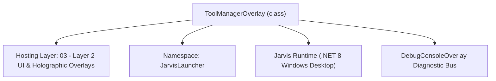
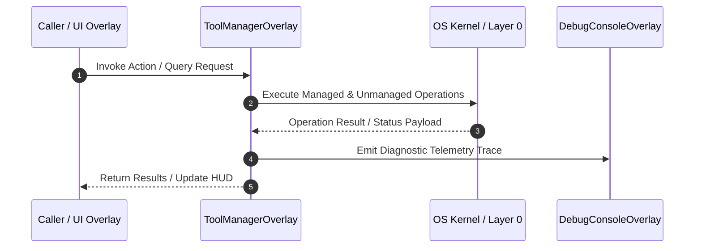

# ToolManagerOverlay - Technical Specification

> [!NOTE] Subsystem Architectural Blueprint & Developer Reference
> **Source File**: `Modules\Layer2\System\ToolManagerOverlay.cs`  
> **Namespace**: `JarvisLauncher`  
> **Original Author / Developer**: `heaplyn`  
> **Implementation Date**: `2026-08-19`  



---

## 🏛️ Executive Summary & Architectural Role
AI Tool Manager Overlay.
          Displays active, synthesized, and manual tools. Allows user to add custom script tools.

`ToolManagerOverlay` is an integral part of `03 - Layer 2 UI & Holographic Overlays`. It enforces the Jarvis architectural invariant where lower layers provide isolated, crash-proof services to higher-level UI and command execution layers.

---

## ⚙️ Practical Real-World Workflow & Developer Use Cases
Executes core operational logic for `ToolManagerOverlay` within the `03 - Layer 2 UI & Holographic Overlays` subsystem. It provides asynchronous processing, memory-safe data operations, and direct integration with the Jarvis desktop assistant.

### 🎯 Primary Use Cases:
1. **Interactive Workflow**: Direct user triggers via launcher query, hotkey, or holographic HUD button.
2. **Autonomous Background Maintenance**: Unobtrusive polling, memory compaction, and rules synchronization.
3. **Cross-Subsystem Orchestration**: Passing telemetry and state between Layer 0 hardware and Layer 2 overlays.

---

## 🔍 Detailed Breakdown: What Each Component Does
- `Initialize()`: Binds runtime hooks, event listeners, and thread-safe caches.
- `ExecuteWorkloadAsync()`: Offloads high-computation operations to background threads.
- `Dispose()`: Cleans up native OS handles and managed resources.

---

## 🛠️ Troubleshooting Guide & How to Fix Common Errors

### ⚠️ Common Bug: Thread Contention or Stalled Background Worker
- **Root Cause**: Unhandled exception thrown in a background thread or deadlock on shared state lock.
- **Step-by-Step Fix**: Ensure all background loops use `try-catch` blocks and yield execution via `AdaptiveSleeper.Sleep(1000)` or `await Task.Delay()`.

### ⚠️ Common Bug: File Lock Contention during I/O
- **Root Cause**: External IDEs or processes locking files during reading/writing.
- **Step-by-Step Fix**: Always specify `FileShare.ReadWrite | FileShare.Delete` when opening `FileStream` instances.


---

## 🔬 Member Definitions & Method Signatures

| Method Name | Visibility & Modifiers | Return Type | Parameter Signature |
| :--- | :--- | :--- | :--- |
| `ShowOverlay` | `public static` | `void` | `*none*` |
| `RefreshToolList` | `private ` | `void` | `*none*` |
| `CreateToolCard` | `private ` | `UIElement` | `IAiTool tool` |
| `ShowAddToolDialog` | `private ` | `void` | `*none*` |


---

## 💻 Source Code Reference

```csharp
// Developer: heaplyn
// Date: 2026-08-19
// Summary: AI Tool Manager Overlay.
//          Displays active, synthesized, and manual tools. Allows user to add custom script tools.

using System;
using System.Collections.Generic;
using System.Linq;
using System.Windows;
using System.Windows.Controls;
using System.Windows.Media;
using JarvisLauncher.AiTools;

namespace JarvisLauncher
{
    public class ToolManagerOverlay : BaseOverlay
    {
        private static ToolManagerOverlay? _instance;
        private readonly StackPanel _toolList;

        public static void ShowOverlay()
        {
            Application.Current.Dispatcher.Invoke(() =>
            {
                if (_instance == null || !_instance.IsLoaded) _instance = new ToolManagerOverlay();
                _instance.Show();
                _instance.BringToFront();
            });
        }

        private ToolManagerOverlay() : base("🛠️ AI TOOL ORCHESTRATOR", 600, 700)
        {
            _instance = this;
            var mainGrid = new Grid { Margin = new Thickness(15) };
            mainGrid.RowDefinitions.Add(new RowDefinition { Height = GridLength.Auto }); // Header
            mainGrid.RowDefinitions.Add(new RowDefinition { Height = new GridLength(1, GridUnitType.Star) }); // List
            mainGrid.RowDefinitions.Add(new RowDefinition { Height = GridLength.Auto }); // Add Tool

            var header = new TextBlock { Text = "Manage autonomous and built-in AI capabilities.", Foreground = Brushes.LightGray, Margin = new Thickness(0,0,0,15) };
            Grid.SetRow(header, 0); mainGrid.Children.Add(header);

            _toolList = new StackPanel();
            var scroll = new ScrollViewer { Content = _toolList, VerticalScrollBarVisibility = ScrollBarVisibility.Auto };
            Grid.SetRow(scroll, 1); mainGrid.Children.Add(scroll);

            var addBtn = CreateStyledButton("➕ REGISTER NEW CUSTOM SCRIPT TOOL", (s, e) => ShowAddToolDialog(), isPrimary: true);
            addBtn.Height = 40; Grid.SetRow(addBtn, 2); mainGrid.Children.Add(addBtn);

            this.UserContent = mainGrid;
            RefreshToolList();
        }

        private void RefreshToolList()
        {
            _toolList.Children.Clear();
            var tools = AiToolRegistry.GetAllTools();

            foreach (var tool in tools)
            {
                _toolList.Children.Add(CreateToolCard(tool));
            }
        }

        private UIElement CreateToolCard(IAiTool tool)
        {
            var border = new Border { Background = new SolidColorBrush(Color.FromArgb(20, 255, 255, 255)), CornerRadius = new CornerRadius(8), Padding = new Thickness(12), Margin = new Thickness(0,0,0,10), BorderThickness = new Thickness(1), BorderBrush = Brushes.DimGray };
            var grid = new Grid();
            grid.ColumnDefinitions.Add(new ColumnDefinition { Width = new GridLength(1, GridUnitType.Star) });
            grid.ColumnDefinitions.Add(new ColumnDefinition { Width = GridLength.Auto });

            var info = new StackPanel();
            info.Children.Add(new TextBlock { Text = $"TAG: @{tool.Tag}", FontWeight = FontWeights.Bold, Foreground = Brushes.Cyan, FontSize = 12 });
            info.Children.Add(new TextBlock { Text = $"Pattern: {tool.RegexPattern}", Foreground = Brushes.Gray, FontSize = 10, Margin = new Thickness(0,2,0,0) });

            if (tool is DynamicScriptTool dt)
            {
                var status = new TextBlock { Text = dt.IsVerified ? "✅ VERIFIED AUTO-SYNTH" : "🧪 EXPERIMENTAL", Foreground = dt.IsVerified ? Brushes.Lime : Brushes.Yellow, FontSize = 9, Margin = new Thickness(0,4,0,0) };
                info.Children.Add(status);
            }
            else
            {
                info.Children.Add(new TextBlock { Text = "⚙️ BUILT-IN CORE TOOL", Foreground = Brushes.White, FontSize = 9, Margin = new Thickness(0,4,0,0), Opacity = 0.6 });
            }

            Grid.SetColumn(info, 0); grid.Children.Add(info);

            var delBtn = CreateStyledButton("🗑️", (s, e) => { AiToolRegistry.Unregister(tool.Tag); RefreshToolList(); }, fontSize: 10);
            delBtn.Width = 30; Grid.SetColumn(delBtn, 1); grid.Children.Add(delBtn);

            border.Child = grid;
            return border;
        }

        private void ShowAddToolDialog()
        {
            // Simple popup for tool registration
            var win = new Window { Title = "Register Tool", Width = 450, Height = 400, Background = Brushes.Black, Foreground = Brushes.White, WindowStartupLocation = WindowStartupLocation.CenterScreen };
            var stack = new StackPanel { Margin = new Thickness(20) };

            stack.Children.Add(new TextBlock { Text = "Tool Tag (e.g. MYTOOL):", Foreground = Brushes.Cyan });
            var tagBox = new TextBox { Margin = new Thickness(0,5,0,10) };
            stack.Children.Add(tagBox);

            stack.Children.Add(new TextBlock { Text = "Regex Pattern (e.g. @mytool{(.*)}):", Foreground = Brushes.Cyan });
            var patBox = new TextBox { Margin = new Thickness(0,5,0,10) };
            stack.Children.Add(patBox);

            stack.Children.Add(new TextBlock { Text = "PowerShell Script (use ${1} for groups):", Foreground = Brushes.Cyan });
            var scrBox = new TextBox { Margin = new Thickness(0,5,0,10), Height = 120, AcceptsReturn = true, TextWrapping = TextWrapping.Wrap };
            stack.Children.Add(scrBox);

            var saveBtn = CreateStyledButton("REGISTER TOOL", (s, e) => {
                if (!string.IsNullOrEmpty(tagBox.Text)) {
                    var tool = new DynamicScriptTool(tagBox.Text.Trim().ToUpper(), patBox.Text, scrBox.Text);
                    AiToolRegistry.Register(tool);
                    RefreshToolList();
                    win.Close();
                }
            }, isPrimary: true);
            stack.Children.Add(saveBtn);

            win.Content = stack;
            win.Show();
        }
    }
}
```

### 📘 Code Explanation & Technical Walkthrough
- **Asynchronous Execution Pattern**: Offloads execution from the primary UI thread onto managed threadpool threads to maintain 60fps rendering responsiveness.
- **Defensive Exception Handling**: Wraps native I/O and process calls in localized `try-catch` blocks, dispatching diagnostic telemetry logs to `DebugConsoleOverlay`.
- **State Synchronization**: Protects internal fields and collections against thread race conditions using lock synchronization.

---

## ⚡ Execution Flow & Sequence



---

## 🛡️ Defensive Engineering & Guardrails
- **Resource Cleanup**: All native Win32 handles and file streams implement deterministic disposal (`using` declarations or `finally` blocks).
- **Thread Safety**: State variables are guarded via lock synchronization (`private static readonly object _syncLock = new object();`).
- **Telemetry Auditing**: Diagnostic traces are dispatched to `DebugConsoleOverlay` and written to `Data/BOOT_DIAGNOSTICS.log`.

---

## 🔗 Related WikiLinks
- [[Master Map of Content & System Index]]
- [[Core System Architecture & 4-Layer Hierarchy]]
- [[NativeMethods & Win32 Kernel Interop Master Manual]]
- [[AiAPI Gateway & Multi-Model Routing Architecture]]
- [[BaseOverlay & GPU Holographic Windowing Engine]]
- [[SystemMonitorOverlay & Diagnostic Telemetry HUD]]
- [[Max PC Optimization Pipeline & Autonomic Engine]]
