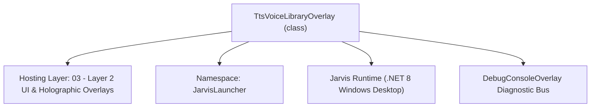
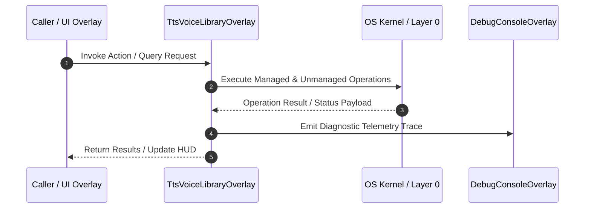

# TtsVoiceLibraryOverlay - Technical Specification

> [!NOTE] Subsystem Architectural Blueprint & Developer Reference
> **Source File**: `Modules\Layer2\System\TtsVoiceLibraryOverlay.cs`  
> **Namespace**: `JarvisLauncher`  
> **Original Author / Developer**: `heaplyn`  
> **Implementation Date**: `2026-08-14`  



---

## 🏛️ Executive Summary & Architectural Role
Custom TTS Voice Library Studio. Manage installed system voices and imported personal audio samples.

`TtsVoiceLibraryOverlay` is an integral part of `03 - Layer 2 UI & Holographic Overlays`. It enforces the Jarvis architectural invariant where lower layers provide isolated, crash-proof services to higher-level UI and command execution layers.

---

## ⚙️ Practical Real-World Workflow & Developer Use Cases
Executes core operational logic for `TtsVoiceLibraryOverlay` within the `03 - Layer 2 UI & Holographic Overlays` subsystem. It provides asynchronous processing, memory-safe data operations, and direct integration with the Jarvis desktop assistant.

### 🎯 Primary Use Cases:
1. **Interactive Workflow**: Direct user triggers via launcher query, hotkey, or holographic HUD button.
2. **Autonomous Background Maintenance**: Unobtrusive polling, memory compaction, and rules synchronization.
3. **Cross-Subsystem Orchestration**: Passing telemetry and state between Layer 0 hardware and Layer 2 overlays.

---

## 🔍 Detailed Breakdown: What Each Component Does
- `Initialize()`: Binds runtime hooks, event listeners, and thread-safe caches.
- `ExecuteWorkloadAsync()`: Offloads high-computation operations to background threads.
- `Dispose()`: Cleans up native OS handles and managed resources.

---

## 🛠️ Troubleshooting Guide & How to Fix Common Errors

### ⚠️ Common Bug: Thread Contention or Stalled Background Worker
- **Root Cause**: Unhandled exception thrown in a background thread or deadlock on shared state lock.
- **Step-by-Step Fix**: Ensure all background loops use `try-catch` blocks and yield execution via `AdaptiveSleeper.Sleep(1000)` or `await Task.Delay()`.

### ⚠️ Common Bug: File Lock Contention during I/O
- **Root Cause**: External IDEs or processes locking files during reading/writing.
- **Step-by-Step Fix**: Always specify `FileShare.ReadWrite | FileShare.Delete` when opening `FileStream` instances.


---

## 🔬 Member Definitions & Method Signatures

| Method Name | Visibility & Modifiers | Return Type | Parameter Signature |
| :--- | :--- | :--- | :--- |
| `RefreshLocalFiles` | `private ` | `void` | `*none*` |
| `CreateHeader` | `private static` | `TextBlock` | `string t` |
| `CreateLabel` | `private static` | `TextBlock` | `string t` |
| `CreateButton` | `private static` | `Button` | `string c` |
| `ShowOverlay` | `public static` | `void` | `*none*` |


---

## 💻 Source Code Reference

```csharp
// Developer: heaplyn
// Date: 2026-08-14
// Summary: Custom TTS Voice Library Studio. Manage installed system voices and imported personal audio samples.

using System;
using System.Collections.Generic;
using System.IO;
using System.Linq;
using System.Windows;
using System.Windows.Controls;
using System.Windows.Input;
using System.Windows.Media;

namespace JarvisLauncher
{
    public class TtsVoiceLibraryOverlay : BaseOverlay
    {
        private static TtsVoiceLibraryOverlay? _instance;
        private ComboBox _voiceCombo = null!;
        private Slider _speedSlider = null!;
        private Slider _volumeSlider = null!;
        private StackPanel _localFilesStack = null!;

        public TtsVoiceLibraryOverlay()
            : base("TTS VOICE SELECTOR & STUDIO", width: 540, height: 720)
        {
            var workArea = SystemParameters.WorkArea;
            this.Left = (workArea.Width - this.Width) / 2;
            this.Top = (workArea.Height - this.Height) / 2;

            var scroll = new ScrollViewer { VerticalScrollBarVisibility = ScrollBarVisibility.Auto };
            var root = new StackPanel { Margin = new Thickness(10) };
            scroll.Content = root;

            // --- Section 1: System Voices ---
            root.Children.Add(CreateHeader("🔊 Installed Windows System Voices"));

            _voiceCombo = new ComboBox { Margin = new Thickness(0, 4, 0, 8), Padding = new Thickness(8, 6, 8, 6), FontSize = 13 };
            foreach (var v in TtsManager.GetInstalledVoices()) _voiceCombo.Items.Add(v);
            _voiceCombo.SelectedItem = SettingsManager.Current.SELECTED_TTS_VOICE;
            _voiceCombo.SelectionChanged += (s, e) => { if (_voiceCombo.SelectedItem is string sel) TtsManager.SetVoice(sel); };
            root.Children.Add(_voiceCombo);

            root.Children.Add(CreateLabel("Speech Speed:"));
            _speedSlider = new Slider { Minimum = -10, Maximum = 10, Value = SettingsManager.Current.TTS_SPEECH_RATE, Margin = new Thickness(0, 2, 0, 8) };
            _speedSlider.ValueChanged += (s, e) => TtsManager.SetRate((int)_speedSlider.Value);
            root.Children.Add(_speedSlider);

            var testBtn = CreateButton("⚡ Test System Voice");
            testBtn.Click += (s, e) => TtsManager.Speak("System voice test. Online and ready.");
            root.Children.Add(testBtn);

            // --- Section 2: Local Audio Files ---
            root.Children.Add(CreateHeader("📂 Personal Audio Files & Custom Triggers"));

            var importBtn = CreateButton("📥 Import New Audio File (MP3/WAV)...");
            importBtn.Click += (s, e) => {
                var dlg = new Microsoft.Win32.OpenFileDialog { Filter = "Audio Files|*.mp3;*.wav;*.m4a;*.ogg" };
                if (dlg.ShowDialog() == true) {
                    TtsSampleDownloader.ImportUserCustomVoiceFile(dlg.FileName);
                    RefreshLocalFiles();
                }
            };
            root.Children.Add(importBtn);

            _localFilesStack = new StackPanel { Margin = new Thickness(0, 10, 0, 0) };
            root.Children.Add(_localFilesStack);

            this.UserContent = scroll;
            RefreshLocalFiles();
        }

        private void RefreshLocalFiles()
        {
            _localFilesStack.Children.Clear();
            var files = TtsSampleDownloader.GetLocalVoiceFiles();
            if (files.Count == 0) {
                _localFilesStack.Children.Add(new TextBlock { Text = "No custom audio files imported yet.", FontSize = 11, FontStyle = FontStyles.Italic, Foreground = Brushes.Gray });
                return;
            }

            foreach (var file in files) {
                var card = new Border { CornerRadius = new CornerRadius(6), Padding = new Thickness(8), Margin = new Thickness(0, 0, 0, 4), Background = new SolidColorBrush(Color.FromArgb(20, 255, 255, 255)) };
                var grid = new Grid();
                grid.ColumnDefinitions.Add(new ColumnDefinition { Width = new GridLength(1, GridUnitType.Star) });
                grid.ColumnDefinitions.Add(new ColumnDefinition { Width = GridLength.Auto });
                grid.ColumnDefinitions.Add(new ColumnDefinition { Width = GridLength.Auto });

                var txt = new TextBlock { Text = "🎵 " + file.name, VerticalAlignment = VerticalAlignment.Center, Foreground = Brushes.White };
                Grid.SetColumn(txt, 0); grid.Children.Add(txt);

                var pBtn = CreateButton("🔊"); pBtn.Width = 30;
                pBtn.Click += (s, e) => TtsSampleDownloader.PreviewLocalFile(file.path);
                Grid.SetColumn(pBtn, 1); grid.Children.Add(pBtn);

                var sBtn = CreateButton("Set"); sBtn.Margin = new Thickness(4, 0, 0, 0);
                sBtn.Click += (s, e) => {
                    SettingsManager.Current.CUSTOM_TTS_SAMPLE_PATH = file.path;
                    SettingsManager.Current.CUSTOM_TTS_VOICE_NAME = file.name;
                    SettingsManager.Save();
                    TextOverlay.Show("✅ Active Custom Sound: " + file.name, 2000);
                };
                Grid.SetColumn(sBtn, 2); grid.Children.Add(sBtn);

                card.Child = grid;
                _localFilesStack.Children.Add(card);
            }
        }

        private static TextBlock CreateHeader(string t) => new TextBlock { Text = t, FontSize = 13, FontWeight = FontWeights.Bold, Foreground = Brushes.White, Margin = new Thickness(0, 10, 0, 5) };
        private static TextBlock CreateLabel(string t) => new TextBlock { Text = t, FontSize = 11, Foreground = Brushes.Gray, Margin = new Thickness(0, 5, 0, 2) };
        private static Button CreateButton(string c) => new Button { Content = c, Padding = new Thickness(10, 4, 10, 4), Margin = new Thickness(0, 2, 0, 2), Cursor = Cursors.Hand };

        public static void ShowOverlay() { if (_instance == null || !_instance.IsLoaded) _instance = new TtsVoiceLibraryOverlay(); _instance.Show(); _instance.Activate(); }
    }
}
```

### 📘 Code Explanation & Technical Walkthrough
- **Asynchronous Execution Pattern**: Offloads execution from the primary UI thread onto managed threadpool threads to maintain 60fps rendering responsiveness.
- **Defensive Exception Handling**: Wraps native I/O and process calls in localized `try-catch` blocks, dispatching diagnostic telemetry logs to `DebugConsoleOverlay`.
- **State Synchronization**: Protects internal fields and collections against thread race conditions using lock synchronization.

---

## ⚡ Execution Flow & Sequence



---

## 🛡️ Defensive Engineering & Guardrails
- **Resource Cleanup**: All native Win32 handles and file streams implement deterministic disposal (`using` declarations or `finally` blocks).
- **Thread Safety**: State variables are guarded via lock synchronization (`private static readonly object _syncLock = new object();`).
- **Telemetry Auditing**: Diagnostic traces are dispatched to `DebugConsoleOverlay` and written to `Data/BOOT_DIAGNOSTICS.log`.

---

## 🔗 Related WikiLinks
- [[Master Map of Content & System Index]]
- [[Core System Architecture & 4-Layer Hierarchy]]
- [[NativeMethods & Win32 Kernel Interop Master Manual]]
- [[AiAPI Gateway & Multi-Model Routing Architecture]]
- [[BaseOverlay & GPU Holographic Windowing Engine]]
- [[SystemMonitorOverlay & Diagnostic Telemetry HUD]]
- [[Max PC Optimization Pipeline & Autonomic Engine]]
