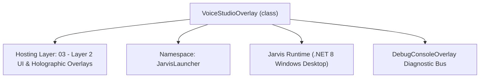
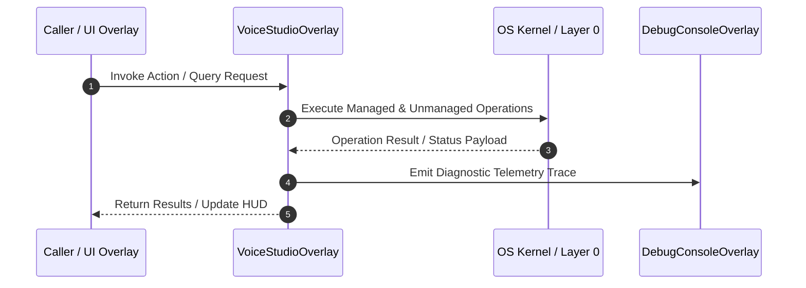

# VoiceStudioOverlay - Technical Specification

> [!NOTE] Subsystem Architectural Blueprint & Developer Reference
> **Source File**: `Modules\Layer2\System\VoiceStudioOverlay.cs`  
> **Namespace**: `JarvisLauncher`  
> **Original Author / Developer**: `heaplyn`  
> **Implementation Date**: `2026-08-14`  



---

## 🏛️ Executive Summary & Architectural Role
Fully Restored Voice AI Training Studio - Dataset, Teleprompter, Calibration, and Shortcuts.

`VoiceStudioOverlay` is an integral part of `03 - Layer 2 UI & Holographic Overlays`. It enforces the Jarvis architectural invariant where lower layers provide isolated, crash-proof services to higher-level UI and command execution layers.

---

## ⚙️ Practical Real-World Workflow & Developer Use Cases
Executes core operational logic for `VoiceStudioOverlay` within the `03 - Layer 2 UI & Holographic Overlays` subsystem. It provides asynchronous processing, memory-safe data operations, and direct integration with the Jarvis desktop assistant.

### 🎯 Primary Use Cases:
1. **Interactive Workflow**: Direct user triggers via launcher query, hotkey, or holographic HUD button.
2. **Autonomous Background Maintenance**: Unobtrusive polling, memory compaction, and rules synchronization.
3. **Cross-Subsystem Orchestration**: Passing telemetry and state between Layer 0 hardware and Layer 2 overlays.

---

## 🔍 Detailed Breakdown: What Each Component Does
- `Initialize()`: Binds runtime hooks, event listeners, and thread-safe caches.
- `ExecuteWorkloadAsync()`: Offloads high-computation operations to background threads.
- `Dispose()`: Cleans up native OS handles and managed resources.

---

## 🛠️ Troubleshooting Guide & How to Fix Common Errors

### ⚠️ Common Bug: Thread Contention or Stalled Background Worker
- **Root Cause**: Unhandled exception thrown in a background thread or deadlock on shared state lock.
- **Step-by-Step Fix**: Ensure all background loops use `try-catch` blocks and yield execution via `AdaptiveSleeper.Sleep(1000)` or `await Task.Delay()`.

### ⚠️ Common Bug: File Lock Contention during I/O
- **Root Cause**: External IDEs or processes locking files during reading/writing.
- **Step-by-Step Fix**: Always specify `FileShare.ReadWrite | FileShare.Delete` when opening `FileStream` instances.


---

## 🔬 Member Definitions & Method Signatures

| Method Name | Visibility & Modifiers | Return Type | Parameter Signature |
| :--- | :--- | :--- | :--- |
| `ShowOverlay` | `public static` | `void` | `*none*` |
| `BuildDatasetTab` | `private ` | `UIElement` | `*none*` |
| `BuildTeleprompterTab` | `private ` | `UIElement` | `*none*` |
| `BuildCalibrationTab` | `private ` | `UIElement` | `*none*` |
| `BuildShortcutsTab` | `private ` | `UIElement` | `*none*` |
| `RefreshDatasetUI` | `private ` | `void` | `*none*` |
| `AdvanceWord` | `private ` | `void` | `*none*` |
| `CreateStyledButton` | `private static` | `Button` | `string content, RoutedEventHandler action, bool isPrimary = false, Thickness margin = default` |


---

## 💻 Source Code Reference

```csharp


// Developer: heaplyn
// Date: 2026-08-14
// Summary: Fully Restored Voice AI Training Studio - Dataset, Teleprompter, Calibration, and Shortcuts.

using System;
using System.Collections.Generic;
using System.IO;
using System.Linq;
using System.Windows;
using System.Windows.Controls;
using System.Windows.Media;
using System.Windows.Threading;
using System.Threading.Tasks;

namespace JarvisLauncher
{
    public class VoiceStudioOverlay : BaseOverlay
    {
        private static VoiceStudioOverlay? _instance;
        public static void ShowOverlay() { if (_instance == null || !_instance.IsLoaded) _instance = new VoiceStudioOverlay(); _instance.Show(); _instance.BringToFront(); _instance.Focus(); }

        private TextBlock _statusText = null!;
        private ProgressBar _audioLevelBar = null!;
        private StackPanel _datasetStack = null!;
        private TextBlock _endlessCurrentWordText = null!;
        private TextBlock _endlessNextWordText = null!;
        private int _endlessWordIndex = 0;
        private readonly string[] _endlessWordBank = { "Jarvis", "quantum", "protocol", "algorithm", "terminal", "powershell", "execute", "firewall", "security", "database", "optimizer", "subsystem", "network", "router", "telemetry", "diagnostics", "frequency", "satellite", "analyzer", "system", "command", "desktop", "downloads", "music", "playlist", "volume", "sticky", "notes", "calendar", "reminders", "focus", "pomodoro", "chunk", "dopamine", "process", "window", "screenshot", "clipboard", "tunnel", "cloudflare", "ngrok", "mobile", "bridge", "pairing", "codebase" };

        public VoiceStudioOverlay() : base("🎙️ JARVIS VOICE STUDIO", 820, 600)
        {
            var mainGrid = new Grid { Margin = new Thickness(10) };
            mainGrid.RowDefinitions.Add(new RowDefinition { Height = new GridLength(1, GridUnitType.Star) });
            mainGrid.RowDefinitions.Add(new RowDefinition { Height = GridLength.Auto });

            var tabControl = new TabControl { Background = Brushes.Transparent, BorderThickness = new Thickness(0) };
            BaseOverlay.StyleTabControl(tabControl);

            tabControl.Items.Add(new TabItem { Header = "🏷️ Dataset", Content = BuildDatasetTab() });
            tabControl.Items.Add(new TabItem { Header = "♾️ Teleprompter", Content = BuildTeleprompterTab() });
            tabControl.Items.Add(new TabItem { Header = "⚙️ Calibration", Content = BuildCalibrationTab() });
            tabControl.Items.Add(new TabItem { Header = "⚡ Shortcuts", Content = BuildShortcutsTab() });

            Grid.SetRow(tabControl, 0);
            mainGrid.Children.Add(tabControl);

            _statusText = new TextBlock { Text = "Jarvis Systems Standby.", FontSize = 11, Foreground = Brushes.Gray, Margin = new Thickness(4, 6, 0, 0) };
            Grid.SetRow(_statusText, 1);
            mainGrid.Children.Add(_statusText);

            this.UserContent = mainGrid;
            this.Closed += (s, e) => { _instance = null; };
        }

        private UIElement BuildDatasetTab()
        {
            var grid = new Grid { Margin = new Thickness(14) };
            grid.RowDefinitions.Add(new RowDefinition { Height = GridLength.Auto });
            grid.RowDefinitions.Add(new RowDefinition { Height = new GridLength(1, GridUnitType.Star) });

            var header = new StackPanel();
            header.Children.Add(new TextBlock { Text = "🏷️ Voice Dataset & Classifier", FontSize = 14, FontWeight = FontWeights.Bold, Foreground = Brushes.Cyan, Margin = new Thickness(0,0,0,10) });

            var trainBtn = CreateStyledButton("🧬 Train Acoustic Model", (s, e) => MessageBox.Show(VoiceDatasetManager.TrainClassifierModel()), isPrimary: true);
            header.Children.Add(trainBtn);
            Grid.SetRow(header, 0);
            grid.Children.Add(header);

            _datasetStack = new StackPanel();
            var scroll = new ScrollViewer { VerticalScrollBarVisibility = ScrollBarVisibility.Auto, Content = _datasetStack, Margin = new Thickness(0, 10, 0, 0) };
            Grid.SetRow(scroll, 1);
            grid.Children.Add(scroll);

            RefreshDatasetUI();
            return grid;
        }

        private UIElement BuildTeleprompterTab()
        {
            var grid = new Grid { Margin = new Thickness(14) };
            grid.RowDefinitions.Add(new RowDefinition { Height = new GridLength(1, GridUnitType.Star) });
            grid.RowDefinitions.Add(new RowDefinition { Height = GridLength.Auto });

            var card = new Border { Background = new SolidColorBrush(Color.FromArgb(40, 15, 23, 42)), CornerRadius = new CornerRadius(16), Padding = new Thickness(24) };
            var stack = new StackPanel { VerticalAlignment = VerticalAlignment.Center, HorizontalAlignment = HorizontalAlignment.Center };

            _endlessCurrentWordText = new TextBlock { Text = _endlessWordBank[0], FontSize = 48, FontWeight = FontWeights.Bold, Foreground = Brushes.Cyan, HorizontalAlignment = HorizontalAlignment.Center };
            _endlessNextWordText = new TextBlock { Text = "Next: " + _endlessWordBank[1], FontSize = 14, Foreground = Brushes.Gray, HorizontalAlignment = HorizontalAlignment.Center, Margin = new Thickness(0,10,0,0) };

            stack.Children.Add(_endlessCurrentWordText);
            stack.Children.Add(_endlessNextWordText);
            card.Child = stack;
            Grid.SetRow(card, 0);
            grid.Children.Add(card);

            var controls = new StackPanel { Orientation = Orientation.Horizontal, HorizontalAlignment = HorizontalAlignment.Center, Margin = new Thickness(0, 20, 0, 0) };
            controls.Children.Add(CreateStyledButton("🔴 Record Word", (s, e) => AdvanceWord(), isPrimary: true));
            controls.Children.Add(CreateStyledButton("Skip ➡️", (s, e) => AdvanceWord(), margin: new Thickness(10, 0, 0, 0)));
            Grid.SetRow(controls, 1);
            grid.Children.Add(controls);

            return grid;
        }

        private UIElement BuildCalibrationTab()
        {
            var stack = new StackPanel { Margin = new Thickness(14) };
            stack.Children.Add(new TextBlock { Text = "🎛️ Audio Calibration & Mode", FontSize = 14, FontWeight = FontWeights.Bold, Foreground = Brushes.Cyan, Margin = new Thickness(0,0,0,15) });

            var voiceToggleCheck = new CheckBox
            {
                Content = "🎙️ Master Voice Mode Active (Listen for Commands)",
                IsChecked = SettingsManager.Current.IS_VOICE_MODE_ACTIVE,
                Foreground = Brushes.White,
                FontSize = 12,
                Margin = new Thickness(0, 0, 0, 15)
            };
            voiceToggleCheck.Click += (s, e) =>
            {
                SettingsManager.Current.IS_VOICE_MODE_ACTIVE = voiceToggleCheck.IsChecked == true;
                SettingsManager.Save();
                if (SettingsManager.Current.IS_VOICE_MODE_ACTIVE)
                {
                    TtsManager.Speak("Voice mode enabled.");
                    TextOverlay.Show("🎙️ Voice Mode: ON", 2500);
                }
                else
                {
                    TtsManager.Speak("Voice mode disabled.");
                    TextOverlay.Show("🔇 Voice Mode: OFF", 2500);
                }
            };
            stack.Children.Add(voiceToggleCheck);

            stack.Children.Add(new TextBlock { Text = "Speech Confidence Gate:", FontSize = 12, Foreground = Brushes.White });
            var slider = new Slider { Minimum = 0.3, Maximum = 0.98, Value = SettingsManager.Current.MIN_VOICE_CONFIDENCE, Margin = new Thickness(0, 5, 0, 15) };
            slider.ValueChanged += (s, e) => { SettingsManager.Current.MIN_VOICE_CONFIDENCE = slider.Value; SettingsManager.Save(); };
            stack.Children.Add(slider);

            stack.Children.Add(new TextBlock { Text = "Mic Energy Floor:", FontSize = 12, Foreground = Brushes.White });
            var energy = new Slider { Minimum = 0.02, Maximum = 1.0, Value = SettingsManager.Current.MIC_AUDIO_ENERGY_FLOOR, Margin = new Thickness(0, 5, 0, 15) };
            energy.ValueChanged += (s, e) => { SettingsManager.Current.MIC_AUDIO_ENERGY_FLOOR = (float)energy.Value; SettingsManager.Save(); };
            stack.Children.Add(energy);

            return stack;
        }

        private UIElement BuildShortcutsTab()
        {
            var stack = new StackPanel { Margin = new Thickness(14) };
            stack.Children.Add(new TextBlock { Text = "⚡ Voice Shortcuts", FontSize = 14, FontWeight = FontWeights.Bold, Foreground = Brushes.Cyan, Margin = new Thickness(0,0,0,10) });
            stack.Children.Add(new TextBlock { Text = "Map spoken phrases to system commands.", FontSize = 11, Foreground = Brushes.Gray, Margin = new Thickness(0,0,0,10) });
            return stack;
        }

        private void RefreshDatasetUI()
        {
            _datasetStack.Children.Clear();
            VoiceDatasetManager.LoadMetadata();
            foreach (var rec in VoiceDatasetManager.DatasetRecords.TakeLast(20))
            {
                var border = new Border { Background = new SolidColorBrush(Color.FromArgb(20, 255, 255, 255)), CornerRadius = new CornerRadius(8), Padding = new Thickness(10), Margin = new Thickness(0, 0, 0, 8) };
                var stack = new StackPanel();
                stack.Children.Add(new TextBlock { Text = rec.FileName, FontWeight = FontWeights.Bold, Foreground = Brushes.White });
                stack.Children.Add(new TextBlock { Text = "Label: " + rec.Classification + " | " + rec.RecordedAt.ToString("HH:mm:ss"), FontSize = 10, Foreground = Brushes.Cyan });

                var btns = new StackPanel { Orientation = Orientation.Horizontal, Margin = new Thickness(0, 5, 0, 0) };
                btns.Children.Add(CreateStyledButton("🔊 Play", (s, e) => VoiceTrainerManager.PlaySample(rec.FilePath)));
                btns.Children.Add(CreateStyledButton("🔬 Bit Data", async (s, e) => MessageBox.Show(await VoiceDatasetManager.AnalyzeBitDataAsync(rec.FilePath))));
                btns.Children.Add(CreateStyledButton("❌", (s, e) => { VoiceDatasetManager.DeleteRecord(rec.FilePath); RefreshDatasetUI(); }));

                stack.Children.Add(btns);
                border.Child = stack;
                _datasetStack.Children.Add(border);
            }
        }

        private void AdvanceWord()
        {
            _endlessWordIndex = (_endlessWordIndex + 1) % _endlessWordBank.Length;
            _endlessCurrentWordText.Text = _endlessWordBank[_endlessWordIndex];
            _endlessNextWordText.Text = "Next: " + _endlessWordBank[(_endlessWordIndex + 1) % _endlessWordBank.Length];
        }

        private static Button CreateStyledButton(string content, RoutedEventHandler action, bool isPrimary = false, Thickness margin = default)
        {
            var b = BaseOverlay.CreateStyledButton(content, action, isPrimary);
            b.Margin = margin;
            return b;
        }
    }
}
```

### 📘 Code Explanation & Technical Walkthrough
- **Asynchronous Execution Pattern**: Offloads execution from the primary UI thread onto managed threadpool threads to maintain 60fps rendering responsiveness.
- **Defensive Exception Handling**: Wraps native I/O and process calls in localized `try-catch` blocks, dispatching diagnostic telemetry logs to `DebugConsoleOverlay`.
- **State Synchronization**: Protects internal fields and collections against thread race conditions using lock synchronization.

---

## ⚡ Execution Flow & Sequence



---

## 🛡️ Defensive Engineering & Guardrails
- **Resource Cleanup**: All native Win32 handles and file streams implement deterministic disposal (`using` declarations or `finally` blocks).
- **Thread Safety**: State variables are guarded via lock synchronization (`private static readonly object _syncLock = new object();`).
- **Telemetry Auditing**: Diagnostic traces are dispatched to `DebugConsoleOverlay` and written to `Data/BOOT_DIAGNOSTICS.log`.

---

## 🔗 Related WikiLinks
- [[Master Map of Content & System Index]]
- [[Core System Architecture & 4-Layer Hierarchy]]
- [[NativeMethods & Win32 Kernel Interop Master Manual]]
- [[AiAPI Gateway & Multi-Model Routing Architecture]]
- [[BaseOverlay & GPU Holographic Windowing Engine]]
- [[SystemMonitorOverlay & Diagnostic Telemetry HUD]]
- [[Max PC Optimization Pipeline & Autonomic Engine]]
