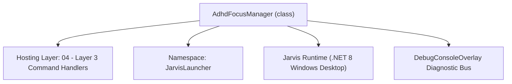
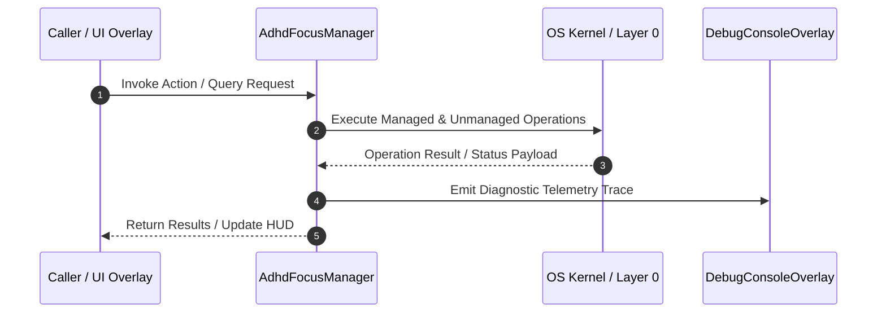

# AdhdFocusSuiteHandler - Technical Specification

> [!NOTE] Subsystem Architectural Blueprint & Developer Reference
> **Source File**: `Modules\Layer3\Handlers\Productivity\AdhdFocusSuiteHandler.cs`  
> **Namespace**: `JarvisLauncher`  
> **Original Author / Developer**: `heaplyn`  
> **Implementation Date**: `2026-08-13`  



---

## 🏛️ Executive Summary & Architectural Role
Dedicated ADHD Focus & Productivity Suite handler providing Pomodoro work sprints, task chunking/breakdowns, dopamine rewards, and TTS voice alerts.

`AdhdFocusManager` is an integral part of `04 - Layer 3 Command Handlers`. It enforces the Jarvis architectural invariant where lower layers provide isolated, crash-proof services to higher-level UI and command execution layers.

---

## ⚙️ Practical Real-World Workflow & Developer Use Cases
Executes core operational logic for `AdhdFocusSuiteHandler` within the `04 - Layer 3 Command Handlers` subsystem. It provides asynchronous processing, memory-safe data operations, and direct integration with the Jarvis desktop assistant.

### 🎯 Primary Use Cases:
1. **Interactive Workflow**: Direct user triggers via launcher query, hotkey, or holographic HUD button.
2. **Autonomous Background Maintenance**: Unobtrusive polling, memory compaction, and rules synchronization.
3. **Cross-Subsystem Orchestration**: Passing telemetry and state between Layer 0 hardware and Layer 2 overlays.

---

## 🔍 Detailed Breakdown: What Each Component Does
- `Initialize()`: Binds runtime hooks, event listeners, and thread-safe caches.
- `ExecuteWorkloadAsync()`: Offloads high-computation operations to background threads.
- `Dispose()`: Cleans up native OS handles and managed resources.

---

## 🛠️ Troubleshooting Guide & How to Fix Common Errors

### ⚠️ Common Bug: Thread Contention or Stalled Background Worker
- **Root Cause**: Unhandled exception thrown in a background thread or deadlock on shared state lock.
- **Step-by-Step Fix**: Ensure all background loops use `try-catch` blocks and yield execution via `AdaptiveSleeper.Sleep(1000)` or `await Task.Delay()`.

### ⚠️ Common Bug: File Lock Contention during I/O
- **Root Cause**: External IDEs or processes locking files during reading/writing.
- **Step-by-Step Fix**: Always specify `FileShare.ReadWrite | FileShare.Delete` when opening `FileStream` instances.


---

## 🔬 Member Definitions & Method Signatures

| Method Name | Visibility & Modifiers | Return Type | Parameter Signature |
| :--- | :--- | :--- | :--- |
| `StartFocusSprint` | `public static` | `void` | `string taskName, int workMinutes = 25, int breakMinutes = 5` |
| `StopFocusSprint` | `public static` | `void` | `*none*` |
| `CanHandle` | `public ` | `bool` | `string query` |
| `GetSuggestions` | `public ` | `List<CommandResult>` | `string query` |
| `ChunkTaskWithAI` | `private static` | `void` | `string task` |
| `GetCommandDescriptions` | `public ` | `List<CommandDesc>` | `*none*` |


---

## 💻 Source Code Reference

```csharp
// Developer: heaplyn
// Date: 2026-08-13
// Summary: Dedicated ADHD Focus & Productivity Suite handler providing Pomodoro work sprints, task chunking/breakdowns, dopamine rewards, and TTS voice alerts.

using System;
using System.Collections.Generic;
using System.Linq;
using System.Threading.Tasks;
using System.Windows.Threading;

namespace JarvisLauncher
{
    public static class AdhdFocusManager
    {
        private static DispatcherTimer? _focusTimer;
        private static int _remainingSeconds = 0;
        private static bool _isWorkSprint = true;
        private static string _currentTask = "Deep Focus Work";

        public static bool IsActive => _focusTimer != null && _focusTimer.IsEnabled;
        public static string CurrentTask => _currentTask;
        public static int RemainingSeconds => _remainingSeconds;

        public static void StartFocusSprint(string taskName, int workMinutes = 25, int breakMinutes = 5)
        {
            _currentTask = string.IsNullOrWhiteSpace(taskName) ? "Deep Focus Work" : taskName;
            _remainingSeconds = workMinutes * 60;
            _isWorkSprint = true;

            if (_focusTimer != null) _focusTimer.Stop();

            _focusTimer = new DispatcherTimer { Interval = TimeSpan.FromSeconds(1) };
            _focusTimer.Tick += (s, e) =>
            {
                _remainingSeconds--;
                if (_remainingSeconds <= 0)
                {
                    _focusTimer.Stop();
                    if (_isWorkSprint)
                    {
                        TtsManager.Speak($"Great work! You completed your focus sprint for {_currentTask}. Time for a {breakMinutes} minute break!");
                        TextOverlay.Show($"🎉 SPRINT COMPLETE!\nTime for a {breakMinutes}m break!", 5000);
                        // Start break
                        _remainingSeconds = breakMinutes * 60;
                        _isWorkSprint = false;
                        _focusTimer.Start();
                    }
                    else
                    {
                        TtsManager.Speak("Break is over! Ready for the next focus sprint?");
                        TextOverlay.Show("🔔 BREAK OVER!\nReady for the next focus session?", 4000);
                    }
                }
            };

            _focusTimer.Start();

            TtsManager.Speak($"Starting {workMinutes} minute focus sprint for {_currentTask}. You got this!");
            TextOverlay.Show($"⏱️ FOCUS SPRINT STARTED ({workMinutes}m)\nTask: {_currentTask}", 3000);
        }

        public static void StopFocusSprint()
        {
            if (_focusTimer != null)
            {
                _focusTimer.Stop();
                _focusTimer = null;
            }
            TtsManager.Speak("Focus timer paused.");
            TextOverlay.Show("⏸️ Focus Timer Stopped", 2000);
        }
    }

    public class AdhdFocusSuiteHandler : ICommandHandler
    {
        public bool CanHandle(string query)
        {
            if (string.IsNullOrWhiteSpace(query)) return false;
            string cmd = query.Trim().ToLower().Split(' ')[0];

            string[] supported = {
                "adhd", "focus", "pomodoro", "chunk", "breakdown", "dopamine", "hyperfocus", "timeleft"
            };

            return supported.Any(s => SearchUtil.IsClose(cmd, s));
        }

        public List<CommandResult> GetSuggestions(string query)
        {
            var suggestions = new List<CommandResult>();
            if (string.IsNullOrWhiteSpace(query)) return suggestions;

            string raw = query.Trim();
            string lower = raw.ToLower();
            string[] parts = raw.Split(' ', StringSplitOptions.RemoveEmptyEntries);
            string cmd = parts[0].ToLower();

            // 1. Pomodoro Focus Sprint
            if (cmd == "pomodoro" || cmd == "focus")
            {
                int workMin = 25;
                string taskName = "Deep Work";

                if (parts.Length > 1 && int.TryParse(parts[1], out int customMin))
                {
                    workMin = customMin;
                    if (parts.Length > 2) taskName = string.Join(" ", parts.Skip(2));
                }
                else if (parts.Length > 1)
                {
                    taskName = string.Join(" ", parts.Skip(1));
                }

                suggestions.Add(new CommandResult
                {
                    TITLE = $"🎯 Start {workMin}m Focus Sprint: \"{taskName}\"",
                    DESCRIPTION = "Launches ADHD timer with voice TTS alerts and break check-ins",
                    SIMILARITY = 6.0,
                    EXECUTE = () => AdhdFocusManager.StartFocusSprint(taskName, workMin)
                });
            }

            // 2. Task Chunking / Micro-step Breakdown
            if (cmd == "chunk" || cmd == "breakdown")
            {
                string taskToChunk = parts.Length > 1 ? raw.Substring(parts[0].Length).Trim() : "Big Overwhelming Project";
                suggestions.Add(new CommandResult
                {
                    TITLE = $"🧩 Chunk Task into Micro-Steps: \"{taskToChunk}\"",
                    DESCRIPTION = "Breaks complex tasks into 4 tiny 5-minute actionable steps",
                    SIMILARITY = 5.5,
                    EXECUTE = () => ChunkTaskWithAI(taskToChunk)
                });
            }

            // 3. Dopamine Motivation Boost
            if (cmd == "dopamine" || lower.Contains("reward"))
            {
                suggestions.Add(new CommandResult
                {
                    TITLE = "⚡ Dopamine Motivation Boost",
                    DESCRIPTION = "Spoken encouraging check-in and progress celebration",
                    SIMILARITY = 5.0,
                    EXECUTE = () =>
                    {
                        string msg = "Awesome job staying on track! Every small step forward is a victory. Keep going!";
                        TtsManager.Speak(msg);
                        TextOverlay.Show($"⚡ Motivation Boost!\n\"{msg}\"", 3500);
                    }
                });
            }

            // 4. Time Left Query
            if (cmd == "timeleft" || lower.Contains("focus progress"))
            {
                suggestions.Add(new CommandResult
                {
                    TITLE = "⏳ Check Focus Sprint Time Left",
                    DESCRIPTION = "Display time remaining on active focus timer",
                    SIMILARITY = 5.0,
                    EXECUTE = () =>
                    {
                        if (AdhdFocusManager.IsActive)
                        {
                            int mins = AdhdFocusManager.RemainingSeconds / 60;
                            int secs = AdhdFocusManager.RemainingSeconds % 60;
                            string status = $"{mins}m {secs}s remaining for {AdhdFocusManager.CurrentTask}";
                            TtsManager.Speak(status);
                            TextOverlay.Show($"⏳ {status}", 3000);
                        }
                        else
                        {
                            TextOverlay.Show("ℹ️ No active focus timer running. Type 'focus 25' to start!", 2500);
                        }
                    }
                });
            }

            return suggestions;
        }

        private static void ChunkTaskWithAI(string task)
        {
            TextOverlay.Show($"🧠 Chunking task: \"{task}\"...", 2000);
            Task.Run(async () =>
            {
                try
                {
                    string prompt = $"Break down this task for someone with ADHD into 4 extremely small, friction-free micro-steps that take 5 minutes each: \"{task}\"";
                    string response = await LlmRouter.AskAsync(prompt);
                    CliOutputOverlay.Show($"🧩 Micro-Steps: {task}", response);
                    TtsManager.Speak($"Here are 4 micro steps for {task}. Step 1 is in your output overlay.");
                }
                catch
                {
                    string fallback = $"1. Open your workspace.\n2. Set a timer for 5 minutes.\n3. Complete the first sentence or file edit.\n4. Take a quick stretch!";
                    CliOutputOverlay.Show($"🧩 Micro-Steps: {task}", fallback);
                }
            });
        }

        public List<CommandDesc> GetCommandDescriptions()
        {
            return new List<CommandDesc>
            {
                new CommandDesc("focus / pomodoro [min] [task]", "Start ADHD focus work sprint with TTS voice alerts", "focus 25 Coding"),
                new CommandDesc("chunk / breakdown [task]", "Break down complex tasks into 5-minute micro-steps", "chunk clean bedroom"),
                new CommandDesc("dopamine", "Trigger encouraging motivational voice check-in", "dopamine"),
                new CommandDesc("timeleft", "Check remaining focus sprint time", "timeleft")
            };
        }
    }
}
```

### 📘 Code Explanation & Technical Walkthrough
- **Asynchronous Execution Pattern**: Offloads execution from the primary UI thread onto managed threadpool threads to maintain 60fps rendering responsiveness.
- **Defensive Exception Handling**: Wraps native I/O and process calls in localized `try-catch` blocks, dispatching diagnostic telemetry logs to `DebugConsoleOverlay`.
- **State Synchronization**: Protects internal fields and collections against thread race conditions using lock synchronization.

---

## ⚡ Execution Flow & Sequence



---

## 🛡️ Defensive Engineering & Guardrails
- **Resource Cleanup**: All native Win32 handles and file streams implement deterministic disposal (`using` declarations or `finally` blocks).
- **Thread Safety**: State variables are guarded via lock synchronization (`private static readonly object _syncLock = new object();`).
- **Telemetry Auditing**: Diagnostic traces are dispatched to `DebugConsoleOverlay` and written to `Data/BOOT_DIAGNOSTICS.log`.

---

## 🔗 Related WikiLinks
- [[Master Map of Content & System Index]]
- [[Core System Architecture & 4-Layer Hierarchy]]
- [[NativeMethods & Win32 Kernel Interop Master Manual]]
- [[AiAPI Gateway & Multi-Model Routing Architecture]]
- [[BaseOverlay & GPU Holographic Windowing Engine]]
- [[SystemMonitorOverlay & Diagnostic Telemetry HUD]]
- [[Max PC Optimization Pipeline & Autonomic Engine]]
