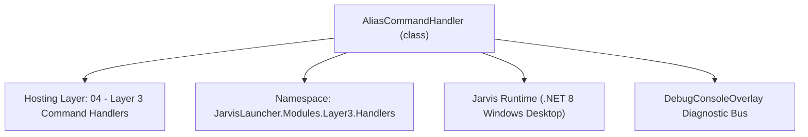
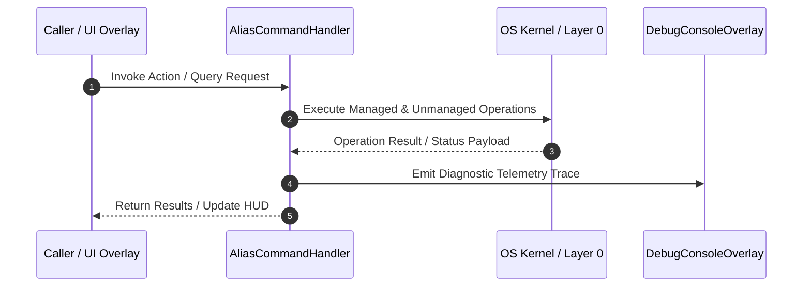

# AliasCommandHandler - Technical Specification

> [!NOTE] Subsystem Architectural Blueprint & Developer Reference
> **Source File**: `Modules\Layer3\Handlers\Utilities\AliasCommandHandler.cs`  
> **Namespace**: `JarvisLauncher.Modules.Layer3.Handlers`  
> **Original Author / Developer**: `heaplyn`  
> **Implementation Date**: `2026-08-09`  



---

## 🏛️ Executive Summary & Architectural Role
Handles CLI commands to manage custom command shortcuts/aliases persistent in settings.

`AliasCommandHandler` is an integral part of `04 - Layer 3 Command Handlers`. It enforces the Jarvis architectural invariant where lower layers provide isolated, crash-proof services to higher-level UI and command execution layers.

---

## ⚙️ Practical Real-World Workflow & Developer Use Cases
Executes core operational logic for `AliasCommandHandler` within the `04 - Layer 3 Command Handlers` subsystem. It provides asynchronous processing, memory-safe data operations, and direct integration with the Jarvis desktop assistant.

### 🎯 Primary Use Cases:
1. **Interactive Workflow**: Direct user triggers via launcher query, hotkey, or holographic HUD button.
2. **Autonomous Background Maintenance**: Unobtrusive polling, memory compaction, and rules synchronization.
3. **Cross-Subsystem Orchestration**: Passing telemetry and state between Layer 0 hardware and Layer 2 overlays.

---

## 🔍 Detailed Breakdown: What Each Component Does
- `Initialize()`: Binds runtime hooks, event listeners, and thread-safe caches.
- `ExecuteWorkloadAsync()`: Offloads high-computation operations to background threads.
- `Dispose()`: Cleans up native OS handles and managed resources.

---

## 🛠️ Troubleshooting Guide & How to Fix Common Errors

### ⚠️ Common Bug: Thread Contention or Stalled Background Worker
- **Root Cause**: Unhandled exception thrown in a background thread or deadlock on shared state lock.
- **Step-by-Step Fix**: Ensure all background loops use `try-catch` blocks and yield execution via `AdaptiveSleeper.Sleep(1000)` or `await Task.Delay()`.

### ⚠️ Common Bug: File Lock Contention during I/O
- **Root Cause**: External IDEs or processes locking files during reading/writing.
- **Step-by-Step Fix**: Always specify `FileShare.ReadWrite | FileShare.Delete` when opening `FileStream` instances.


---

## 🔬 Member Definitions & Method Signatures

| Method Name | Visibility & Modifiers | Return Type | Parameter Signature |
| :--- | :--- | :--- | :--- |
| `CanHandle` | `public ` | `bool` | `string query` |
| `GetSuggestions` | `public ` | `List<CommandResult>` | `string query` |
| `SetAlias` | `private static` | `void` | `string shortcut, string expansion` |
| `RemoveAlias` | `private static` | `void` | `string shortcut` |
| `GetCommandDescriptions` | `public ` | `List<CommandDesc>` | `*none*` |


---

## 💻 Source Code Reference

```csharp
// Developer: heaplyn
// Date: 2026-08-09
// Summary: Handles CLI commands to manage custom command shortcuts/aliases persistent in settings.

using System;
using System.Collections.Generic;

namespace JarvisLauncher.Modules.Layer3.Handlers
{
    public class AliasCommandHandler : ICommandHandler
    {
        public bool CanHandle(string query)
        {
            return SearchUtil.MatchesAny(query, "alias", "unalias");
        }

        public List<CommandResult> GetSuggestions(string query)
        {
            var suggestions = new List<CommandResult>();
            query = query.Trim();

            var parts = query.Split(' ', StringSplitOptions.RemoveEmptyEntries);
            if (parts.Length == 0) return suggestions;

            string cmd = parts[0].ToLower();
            double similarity = SearchUtil.BestSimilarity(query, "alias", "unalias"); // High priority match

            if (cmd == "alias")
            {
                if (parts.Length > 2)
                {
                    string shortcut = parts[1].ToLower();
                    // Extract expansion (everything after the shortcut keyword)
                    string expansion = query[(query.IndexOf(parts[1]) + parts[1].Length)..].Trim();

                    suggestions.Add(new CommandResult
                    {
                        TITLE = $"Create Alias: {shortcut} -> \"{expansion}\"",
                        DESCRIPTION = "Save this custom command shortcut",
                        EXECUTE = () => SetAlias(shortcut, expansion),
                        SIMILARITY = similarity
                    });
                }
                else if (parts.Length > 1)
                {
                    string shortcut = parts[1].ToLower();
                    suggestions.Add(new CommandResult
                    {
                        TITLE = $"Create Alias for '{shortcut}'...",
                        DESCRIPTION = $"Type the target command (e.g. 'alias {shortcut} empty')",
                        EXECUTE = null,
                        SIMILARITY = similarity
                    });
                }
                else
                {
                    // Show all configured aliases
                    var currentAliases = SettingsManager.Current.ALIASES;
                    if (currentAliases.Count > 0)
                    {
                        foreach (var alias in currentAliases)
                        {
                            suggestions.Add(new CommandResult
                            {
                                TITLE = $"Alias: {alias.Key} -> \"{alias.Value}\"",
                                DESCRIPTION = $"Type 'unalias {alias.Key}' to remove this shortcut",
                                EXECUTE = null,
                                SIMILARITY = similarity - 0.1
                            });
                        }
                    }

                    suggestions.Add(new CommandResult
                    {
                        TITLE = "Create Alias...",
                        DESCRIPTION = "Type 'alias <shortcut> <command>' (e.g. 'alias clean empty')",
                        EXECUTE = null,
                        SIMILARITY = similarity
                    });
                }
            }
            else if (cmd == "unalias")
            {
                if (parts.Length > 1)
                {
                    string shortcut = parts[1].ToLower();
                    if (SettingsManager.Current.ALIASES.TryGetValue(shortcut, out string? expansion))
                    {
                        suggestions.Add(new CommandResult
                        {
                            TITLE = $"Remove Alias: '{shortcut}'",
                            DESCRIPTION = $"Delete the shortcut mapping to: \"{expansion}\"",
                            EXECUTE = () => RemoveAlias(shortcut),
                            SIMILARITY = similarity
                        });
                    }
                    else
                    {
                        suggestions.Add(new CommandResult
                        {
                            TITLE = $"Remove Alias: '{shortcut}' (Not Found)",
                            DESCRIPTION = "No such alias is currently configured",
                            EXECUTE = null,
                            SIMILARITY = similarity
                        });
                    }
                }
                else
                {
                    suggestions.Add(new CommandResult
                    {
                        TITLE = "Remove Alias...",
                        DESCRIPTION = "Type the alias shortcut to remove (e.g. 'unalias clean')",
                        EXECUTE = null,
                        SIMILARITY = similarity
                    });
                }
            }

            return suggestions;
        }

        private static void SetAlias(string shortcut, string expansion)
        {
            try
            {
                // Prevent circular aliases
                if (shortcut == expansion || expansion.StartsWith(shortcut + " "))
                {
                    TextOverlay.Show("⚠️ Cannot map an alias to itself or to a command starting with itself!", 3000);
                    return;
                }

                SettingsManager.Current.ALIASES[shortcut] = expansion;
                SettingsManager.Save();
                TextOverlay.Show($"🏷️ Configured alias '{shortcut}' successfully!", 2500);
            }
            catch (Exception ex)
            {
                TextOverlay.Show($"⚠️ Failed to save alias: {ex.Message}", 3000);
            }
        }

        private static void RemoveAlias(string shortcut)
        {
            try
            {
                if (SettingsManager.Current.ALIASES.Remove(shortcut))
                {
                    SettingsManager.Save();
                    TextOverlay.Show($"🏷️ Removed alias '{shortcut}' successfully!", 2500);
                }
            }
            catch (Exception ex)
            {
                TextOverlay.Show($"⚠️ Failed to remove alias: {ex.Message}", 3000);
            }
        }

        public List<CommandDesc> GetCommandDescriptions()
        {
            return new List<CommandDesc>
            {
                new CommandDesc("alias <n> <cmd>", "Create persistent command alias", "alias gp push"),
                new CommandDesc("alias list", "List registered custom aliases", "alias list"),
                new CommandDesc("alias remove <n>", "Delete a custom command alias", "alias remove gp")
            };
        }
    }
}
```

### 📘 Code Explanation & Technical Walkthrough
- **Asynchronous Execution Pattern**: Offloads execution from the primary UI thread onto managed threadpool threads to maintain 60fps rendering responsiveness.
- **Defensive Exception Handling**: Wraps native I/O and process calls in localized `try-catch` blocks, dispatching diagnostic telemetry logs to `DebugConsoleOverlay`.
- **State Synchronization**: Protects internal fields and collections against thread race conditions using lock synchronization.

---

## ⚡ Execution Flow & Sequence



---

## 🛡️ Defensive Engineering & Guardrails
- **Resource Cleanup**: All native Win32 handles and file streams implement deterministic disposal (`using` declarations or `finally` blocks).
- **Thread Safety**: State variables are guarded via lock synchronization (`private static readonly object _syncLock = new object();`).
- **Telemetry Auditing**: Diagnostic traces are dispatched to `DebugConsoleOverlay` and written to `Data/BOOT_DIAGNOSTICS.log`.

---

## 🔗 Related WikiLinks
- [[Master Map of Content & System Index]]
- [[Core System Architecture & 4-Layer Hierarchy]]
- [[NativeMethods & Win32 Kernel Interop Master Manual]]
- [[AiAPI Gateway & Multi-Model Routing Architecture]]
- [[BaseOverlay & GPU Holographic Windowing Engine]]
- [[SystemMonitorOverlay & Diagnostic Telemetry HUD]]
- [[Max PC Optimization Pipeline & Autonomic Engine]]
