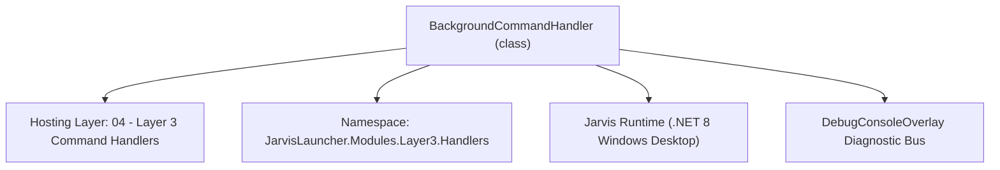
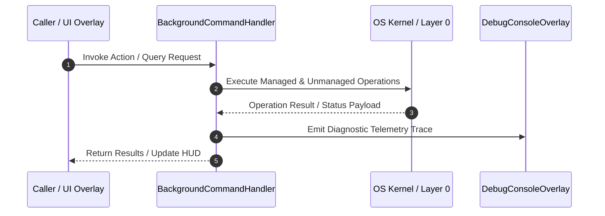

# BackgroundCommandHandler - Technical Specification

> [!NOTE] Subsystem Architectural Blueprint & Developer Reference
> **Source File**: `Modules\Layer3\Handlers\Media\BackgroundCommandHandler.cs`  
> **Namespace**: `JarvisLauncher.Modules.Layer3.Handlers`  
> **Original Author / Developer**: `heaplyn`  
> **Implementation Date**: `2026-08-15`  



---

## 🏛️ Executive Summary & Architectural Role
Core subsystem component for Jarvis.

`BackgroundCommandHandler` is an integral part of `04 - Layer 3 Command Handlers`. It enforces the Jarvis architectural invariant where lower layers provide isolated, crash-proof services to higher-level UI and command execution layers.

---

## ⚙️ Practical Real-World Workflow & Developer Use Cases
Executes core operational logic for `BackgroundCommandHandler` within the `04 - Layer 3 Command Handlers` subsystem. It provides asynchronous processing, memory-safe data operations, and direct integration with the Jarvis desktop assistant.

### 🎯 Primary Use Cases:
1. **Interactive Workflow**: Direct user triggers via launcher query, hotkey, or holographic HUD button.
2. **Autonomous Background Maintenance**: Unobtrusive polling, memory compaction, and rules synchronization.
3. **Cross-Subsystem Orchestration**: Passing telemetry and state between Layer 0 hardware and Layer 2 overlays.

---

## 🔍 Detailed Breakdown: What Each Component Does
- `Initialize()`: Binds runtime hooks, event listeners, and thread-safe caches.
- `ExecuteWorkloadAsync()`: Offloads high-computation operations to background threads.
- `Dispose()`: Cleans up native OS handles and managed resources.

---

## 🛠️ Troubleshooting Guide & How to Fix Common Errors

### ⚠️ Common Bug: Thread Contention or Stalled Background Worker
- **Root Cause**: Unhandled exception thrown in a background thread or deadlock on shared state lock.
- **Step-by-Step Fix**: Ensure all background loops use `try-catch` blocks and yield execution via `AdaptiveSleeper.Sleep(1000)` or `await Task.Delay()`.

### ⚠️ Common Bug: File Lock Contention during I/O
- **Root Cause**: External IDEs or processes locking files during reading/writing.
- **Step-by-Step Fix**: Always specify `FileShare.ReadWrite | FileShare.Delete` when opening `FileStream` instances.


---

## 🔬 Member Definitions & Method Signatures

| Method Name | Visibility & Modifiers | Return Type | Parameter Signature |
| :--- | :--- | :--- | :--- |
| `CanHandle` | `public ` | `bool` | `string query` |
| `GetSuggestions` | `public ` | `List<CommandResult>` | `string query` |
| `SetBackgroundMode` | `private ` | `void` | `string mode` |
| `SetBackgroundMedia` | `private ` | `void` | `string path` |
| `GetCommandDescriptions` | `public ` | `List<CommandDesc>` | `*none*` |
| `OnStart` | `public ` | `void` | `*none*` |


---

## 💻 Source Code Reference

```csharp
using System;
using System.Collections.Generic;
using System.IO;

namespace JarvisLauncher.Modules.Layer3.Handlers
{
    public class BackgroundCommandHandler : ICommandHandler
    {
        public bool CanHandle(string query)
        {
            return SearchUtil.MatchesAny(query, "background", "bg", "gif");
        }

        public List<CommandResult> GetSuggestions(string query)
        {
            var results = new List<CommandResult>();
            string[] parts = query.Split(' ', StringSplitOptions.RemoveEmptyEntries);

            if (parts.Length == 1)
            {
                results.Add(new CommandResult
                {
                    TITLE = "🖼️ Background Mode: Gradient",
                    DESCRIPTION = "Switch to animated liquid gradient background",
                    EXECUTE = () => SetBackgroundMode("Gradient")
                });
                results.Add(new CommandResult
                {
                    TITLE = "🖼️ Background Mode: Solid",
                    DESCRIPTION = "Switch to solid theme color background",
                    EXECUTE = () => SetBackgroundMode("Solid")
                });
                results.Add(new CommandResult
                {
                    TITLE = "🖼️ Background Mode: Media (GIF)",
                    DESCRIPTION = "Switch to GIF/Media background mode",
                    EXECUTE = () => SetBackgroundMode("Media")
                });
            }
            else if (parts.Length >= 2)
            {
                string sub = parts[1].ToLower();
                if (sub == "set" && parts.Length >= 3)
                {
                    string path = query.Substring(query.IndexOf(parts[2])).Trim();
                    results.Add(new CommandResult
                    {
                        TITLE = $"🖼️ Set Background GIF: {Path.GetFileName(path)}",
                        DESCRIPTION = $"Use this file as your media background: {path}",
                        EXECUTE = () => SetBackgroundMedia(path)
                    });
                }
            }

            return results;
        }

        private void SetBackgroundMode(string mode)
        {
            SettingsManager.Current.BACKGROUND_MODE = mode;
            SettingsManager.Save();
            ThemeManager.ApplyTheme(SettingsManager.Current.THEME);
            TextOverlay.Show($"🖼️ Background Mode: {mode}", 2000);
        }

        private void SetBackgroundMedia(string path)
        {
            if (File.Exists(path))
            {
                SettingsManager.Current.BACKGROUND_MODE = "Media";
                SettingsManager.Current.BACKGROUND_MEDIA_SOURCE = path;
                SettingsManager.Save();
                ThemeManager.ApplyTheme(SettingsManager.Current.THEME);
                TextOverlay.Show($"🖼️ Background GIF Set!", 2000);
            }
            else
            {
                TextOverlay.Show("⚠️ File not found!", 2000);
            }
        }

        public List<CommandDesc> GetCommandDescriptions()
        {
            return new List<CommandDesc>
            {
                new CommandDesc("background [mode]", "Switch background between Solid, Gradient, or Media", "bg gradient"),
                new CommandDesc("bg set [path]", "Set a specific GIF file as background", "bg set C:\\path\\to\\my.gif")
            };
        }

        public void OnStart() { }
    }
}
```

### 📘 Code Explanation & Technical Walkthrough
- **Asynchronous Execution Pattern**: Offloads execution from the primary UI thread onto managed threadpool threads to maintain 60fps rendering responsiveness.
- **Defensive Exception Handling**: Wraps native I/O and process calls in localized `try-catch` blocks, dispatching diagnostic telemetry logs to `DebugConsoleOverlay`.
- **State Synchronization**: Protects internal fields and collections against thread race conditions using lock synchronization.

---

## ⚡ Execution Flow & Sequence



---

## 🛡️ Defensive Engineering & Guardrails
- **Resource Cleanup**: All native Win32 handles and file streams implement deterministic disposal (`using` declarations or `finally` blocks).
- **Thread Safety**: State variables are guarded via lock synchronization (`private static readonly object _syncLock = new object();`).
- **Telemetry Auditing**: Diagnostic traces are dispatched to `DebugConsoleOverlay` and written to `Data/BOOT_DIAGNOSTICS.log`.

---

## 🔗 Related WikiLinks
- [[Master Map of Content & System Index]]
- [[Core System Architecture & 4-Layer Hierarchy]]
- [[NativeMethods & Win32 Kernel Interop Master Manual]]
- [[AiAPI Gateway & Multi-Model Routing Architecture]]
- [[BaseOverlay & GPU Holographic Windowing Engine]]
- [[SystemMonitorOverlay & Diagnostic Telemetry HUD]]
- [[Max PC Optimization Pipeline & Autonomic Engine]]
