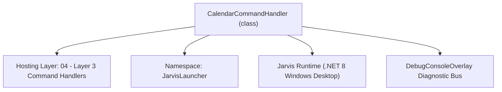
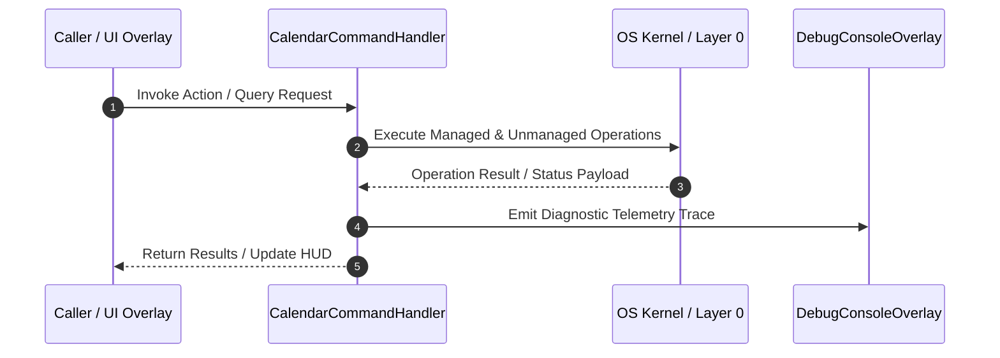

# CalendarCommandHandler - Technical Specification

> [!NOTE] Subsystem Architectural Blueprint & Developer Reference
> **Source File**: `Modules\Layer3\Handlers\Productivity\CalendarCommandHandler.cs`  
> **Namespace**: `JarvisLauncher`  
> **Original Author / Developer**: `copilot`  
> **Implementation Date**: `2026-08-13`  



---

## 🏛️ Executive Summary & Architectural Role
Handles CLI commands to open/view the Calendar GUI or quickly add events directly via the input bar.

`CalendarCommandHandler` is an integral part of `04 - Layer 3 Command Handlers`. It enforces the Jarvis architectural invariant where lower layers provide isolated, crash-proof services to higher-level UI and command execution layers.

---

## ⚙️ Practical Real-World Workflow & Developer Use Cases
Executes core operational logic for `CalendarCommandHandler` within the `04 - Layer 3 Command Handlers` subsystem. It provides asynchronous processing, memory-safe data operations, and direct integration with the Jarvis desktop assistant.

### 🎯 Primary Use Cases:
1. **Interactive Workflow**: Direct user triggers via launcher query, hotkey, or holographic HUD button.
2. **Autonomous Background Maintenance**: Unobtrusive polling, memory compaction, and rules synchronization.
3. **Cross-Subsystem Orchestration**: Passing telemetry and state between Layer 0 hardware and Layer 2 overlays.

---

## 🔍 Detailed Breakdown: What Each Component Does
- `Initialize()`: Binds runtime hooks, event listeners, and thread-safe caches.
- `ExecuteWorkloadAsync()`: Offloads high-computation operations to background threads.
- `Dispose()`: Cleans up native OS handles and managed resources.

---

## 🛠️ Troubleshooting Guide & How to Fix Common Errors

### ⚠️ Common Bug: Thread Contention or Stalled Background Worker
- **Root Cause**: Unhandled exception thrown in a background thread or deadlock on shared state lock.
- **Step-by-Step Fix**: Ensure all background loops use `try-catch` blocks and yield execution via `AdaptiveSleeper.Sleep(1000)` or `await Task.Delay()`.

### ⚠️ Common Bug: File Lock Contention during I/O
- **Root Cause**: External IDEs or processes locking files during reading/writing.
- **Step-by-Step Fix**: Always specify `FileShare.ReadWrite | FileShare.Delete` when opening `FileStream` instances.


---

## 🔬 Member Definitions & Method Signatures

| Method Name | Visibility & Modifiers | Return Type | Parameter Signature |
| :--- | :--- | :--- | :--- |
| `CanHandle` | `public ` | `bool` | `string query` |
| `GetSuggestions` | `public ` | `List<CommandResult>` | `string query` |
| `GetCommandDescriptions` | `public ` | `List<CommandDesc>` | `*none*` |


---

## 💻 Source Code Reference

```csharp
// Developer: copilot
// Date: 2026-08-13
// Summary: Handles CLI commands to open/view the Calendar GUI or quickly add events directly via the input bar.

using System;
using System.Collections.Generic;
using System.Text.RegularExpressions;

namespace JarvisLauncher
{
    public class CalendarCommandHandler : ICommandHandler
    {
        public bool CanHandle(string query)
        {
            return SearchUtil.MatchesAny(query, "cal", "calendar");
        }

        public List<CommandResult> GetSuggestions(string query)
        {
            var suggestions = new List<CommandResult>();
            query = query.Trim();

            var parts = query.Split(new[] { ' ' }, StringSplitOptions.RemoveEmptyEntries);
            if (parts.Length == 0) return suggestions;

            string cmd = parts[0].ToLower();
            double similarity = SearchUtil.BestSimilarity(query, "cal", "calendar");

            // Check if user is typing a direct event logging statement: calendar add yyyy-MM-dd hh:mm event name
            var addMatch = Regex.Match(query, @"^(?:calendar|cal)\s+add\s+(\d{4}-\d{2}-\d{2})\s+(\S+)\s+(.+)$", RegexOptions.IgnoreCase);
            if (addMatch.Success)
            {
                string dateStr = addMatch.Groups[1].Value;
                string timeStr = addMatch.Groups[2].Value;
                string title = addMatch.Groups[3].Value.Trim();

                suggestions.Add(new CommandResult
                {
                    TITLE = $"📅 Create Event: \"{title}\" on {dateStr} at {timeStr}",
                    DESCRIPTION = "Add a calendar event directly into the Jarvis Planner database",
                    SIMILARITY = similarity + 1.0,
                    EXECUTE = () => CalendarOverlay.LogEvent(title, dateStr, timeStr)
                });
                return suggestions;
            }

            // Suggest opening the overlay
            suggestions.Add(new CommandResult
            {
                TITLE = "📅 Open Calendar Overlay",
                DESCRIPTION = "Launch Jarvis visual Month Calendar and daily planners",
                SIMILARITY = similarity,
                EXECUTE = () => CalendarOverlay.Open()
            });

            // Help info hint
            suggestions.Add(new CommandResult
            {
                TITLE = "calendar add [yyyy-mm-dd] [time] [event details]...",
                DESCRIPTION = "Quickly log a calendar event (e.g. cal add 2026-08-15 14:00 Standup meeting)",
                SIMILARITY = similarity - 0.5,
                EXECUTE = null
            });

            return suggestions;
        }

        public List<CommandDesc> GetCommandDescriptions()
        {
            return new List<CommandDesc>
            {
                new CommandDesc("calendar / cal", "Open calendar overlay or log events directly", "cal add 2026-08-15 14:00 Meetup")
            };
        }
    }
}

```

### 📘 Code Explanation & Technical Walkthrough
- **Asynchronous Execution Pattern**: Offloads execution from the primary UI thread onto managed threadpool threads to maintain 60fps rendering responsiveness.
- **Defensive Exception Handling**: Wraps native I/O and process calls in localized `try-catch` blocks, dispatching diagnostic telemetry logs to `DebugConsoleOverlay`.
- **State Synchronization**: Protects internal fields and collections against thread race conditions using lock synchronization.

---

## ⚡ Execution Flow & Sequence



---

## 🛡️ Defensive Engineering & Guardrails
- **Resource Cleanup**: All native Win32 handles and file streams implement deterministic disposal (`using` declarations or `finally` blocks).
- **Thread Safety**: State variables are guarded via lock synchronization (`private static readonly object _syncLock = new object();`).
- **Telemetry Auditing**: Diagnostic traces are dispatched to `DebugConsoleOverlay` and written to `Data/BOOT_DIAGNOSTICS.log`.

---

## 🔗 Related WikiLinks
- [[Master Map of Content & System Index]]
- [[Core System Architecture & 4-Layer Hierarchy]]
- [[NativeMethods & Win32 Kernel Interop Master Manual]]
- [[AiAPI Gateway & Multi-Model Routing Architecture]]
- [[BaseOverlay & GPU Holographic Windowing Engine]]
- [[SystemMonitorOverlay & Diagnostic Telemetry HUD]]
- [[Max PC Optimization Pipeline & Autonomic Engine]]
