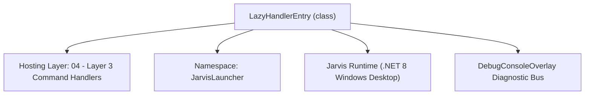
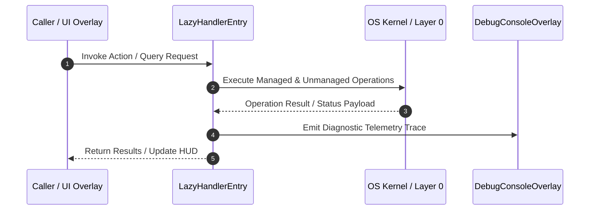

# CommandParser - Technical Specification

> [!NOTE] Subsystem Architectural Blueprint & Developer Reference
> **Source File**: `Modules\Layer3\CommandParser.cs`  
> **Namespace**: `JarvisLauncher`  
> **Original Author / Developer**: `heaplyn`  
> **Implementation Date**: `2026-09-03`  



---

## 🏛️ Executive Summary & Architectural Role
High-performance on-demand router dispatcher.
          Uses lazy-loading: handler instances, services, and modules are loaded ONLY
          when the user searches or executes them, keeping baseline memory ultra-low.

`LazyHandlerEntry` is an integral part of `04 - Layer 3 Command Handlers`. It enforces the Jarvis architectural invariant where lower layers provide isolated, crash-proof services to higher-level UI and command execution layers.

---

## ⚙️ Practical Real-World Workflow & Developer Use Cases
Executes core operational logic for `CommandParser` within the `04 - Layer 3 Command Handlers` subsystem. It provides asynchronous processing, memory-safe data operations, and direct integration with the Jarvis desktop assistant.

### 🎯 Primary Use Cases:
1. **Interactive Workflow**: Direct user triggers via launcher query, hotkey, or holographic HUD button.
2. **Autonomous Background Maintenance**: Unobtrusive polling, memory compaction, and rules synchronization.
3. **Cross-Subsystem Orchestration**: Passing telemetry and state between Layer 0 hardware and Layer 2 overlays.

---

## 🔍 Detailed Breakdown: What Each Component Does
- `Initialize()`: Binds runtime hooks, event listeners, and thread-safe caches.
- `ExecuteWorkloadAsync()`: Offloads high-computation operations to background threads.
- `Dispose()`: Cleans up native OS handles and managed resources.

---

## 🛠️ Troubleshooting Guide & How to Fix Common Errors

### ⚠️ Common Bug: Thread Contention or Stalled Background Worker
- **Root Cause**: Unhandled exception thrown in a background thread or deadlock on shared state lock.
- **Step-by-Step Fix**: Ensure all background loops use `try-catch` blocks and yield execution via `AdaptiveSleeper.Sleep(1000)` or `await Task.Delay()`.

### ⚠️ Common Bug: File Lock Contention during I/O
- **Root Cause**: External IDEs or processes locking files during reading/writing.
- **Step-by-Step Fix**: Always specify `FileShare.ReadWrite | FileShare.Delete` when opening `FileStream` instances.


---

## 🔬 Member Definitions & Method Signatures

| Method Name | Visibility & Modifiers | Return Type | Parameter Signature |
| :--- | :--- | :--- | :--- |
| `GetInstance` | `public ` | `ICommandHandler?` | `*none*` |
| `GetDescriptions` | `public ` | `List<CommandDesc>` | `*none*` |
| `CouldMatch` | `public ` | `bool` | `string lowerQuery, string noSpacesQuery` |
| `MatchesKeywordDomain` | `private static` | `bool` | `string query, string name` |
| `TriggerTextOpacityChange` | `public static` | `void` | `double o` |
| `Initialize` | `public static` | `void` | `*none*` |
| `IsKnownLocalCommand` | `public static` | `bool` | `string Query` |
| `GetSuggestions` | `public static` | `List<CommandResult>` | `string Query` |
| `ExecuteFirstSuggestion` | `public static` | `void` | `string Query, bool allowAiFallback = true` |
| `GetAllCommandDescriptions` | `public static` | `List<CommandDesc>` | `*none*` |
| `GetCategoryForType` | `private static` | `string` | `Type type` |


---

## 💻 Source Code Reference

```csharp
// Developer: heaplyn
// Date: 2026-09-03
// Summary: High-performance on-demand router dispatcher.
//          Uses lazy-loading: handler instances, services, and modules are loaded ONLY
//          when the user searches or executes them, keeping baseline memory ultra-low.

using System;
using System.Collections.Generic;
using System.Linq;
using System.Text;
using System.Threading.Tasks;

namespace JarvisLauncher
{
    public class LazyHandlerEntry
    {
        public Type HandlerType { get; }
        public string TypeName { get; }
        public string CleanName { get; }
        public string CleanNameLower { get; }
        private ICommandHandler? _instance;
        private List<CommandDesc>? _descriptions;
        private readonly object _lock = new();

        public LazyHandlerEntry(Type type)
        {
            HandlerType = type;
            TypeName = type.Name;
            CleanName = type.Name.Replace("CommandHandler", "").Replace("Handler", "");
            CleanNameLower = CleanName.ToLowerInvariant();
        }

        public bool IsLoaded => _instance != null;

        public ICommandHandler? GetInstance()
        {
            if (_instance != null) return _instance;
            lock (_lock)
            {
                if (_instance == null)
                {
                    try
                    {
                        _instance = (ICommandHandler)Activator.CreateInstance(HandlerType)!;
                    }
                    catch (Exception ex)
                    {
                        System.Diagnostics.Debug.WriteLine($"[LazyHandler] Error instantiating {TypeName}: {ex.Message}");
                    }
                }
                return _instance;
            }
        }

        public List<CommandDesc> GetDescriptions()
        {
            if (_descriptions != null) return _descriptions;
            var inst = GetInstance();
            if (inst != null)
            {
                try
                {
                    _descriptions = inst.GetCommandDescriptions() ?? new List<CommandDesc>();
                }
                catch
                {
                    _descriptions = new List<CommandDesc>();
                }
            }
            else
            {
                _descriptions = new List<CommandDesc>();
            }
            return _descriptions;
        }

        public bool CouldMatch(string lowerQuery, string noSpacesQuery)
        {
            // If already loaded, test directly
            if (_instance != null)
            {
                try
                {
                    return _instance.CanHandle(lowerQuery) || _instance.CanHandle(noSpacesQuery);
                }
                catch { return false; }
            }

            // Fast lightweight pre-filter on type name before instantiating
            if (CleanNameLower.Contains(lowerQuery) || lowerQuery.Contains(CleanNameLower))
                return true;

            if (noSpacesQuery.Contains(CleanNameLower) || CleanNameLower.Contains(noSpacesQuery))
                return true;

            if (SearchUtil.IsClose(lowerQuery, CleanNameLower) || SearchUtil.IsAcronymMatch(lowerQuery, CleanNameLower))
                return true;

            // Common keyword mapping to lazily load relevant handlers
            if (MatchesKeywordDomain(lowerQuery, CleanNameLower))
                return true;

            return false;
        }

        private static bool MatchesKeywordDomain(string query, string name)
        {
            if ((query.Contains("ai") || query.Contains("chat") || query.Contains("gpt") || query.Contains("claude") || query.Contains("gemini") || query.Contains("deepseek") || query.Contains("copilot") || query.Contains("prompt")) &&
                (name.Contains("ai") || name.Contains("llm") || name.Contains("teacher") || name.Contains("assistant") || name.Contains("copilot") || name.Contains("screenvision")))
                return true;

            if ((query.Contains("color") || query.Contains("theme") || query.Contains("visual") || query.Contains("stroke") || query.Contains("glow") || query.Contains("anim") || query.Contains("font")) &&
                (name.Contains("theme") || name.Contains("visual") || name.Contains("animation") || name.Contains("background")))
                return true;

            if ((query.Contains("vol") || query.Contains("sound") || query.Contains("mute") || query.Contains("audio") || query.Contains("song") || query.Contains("music") || query.Contains("playlist") || query.Contains("tts") || query.Contains("voice") || query.Contains("speak")) &&
                (name.Contains("volume") || name.Contains("mute") || name.Contains("music") || name.Contains("playlist") || name.Contains("tts") || name.Contains("voice") || name.Contains("ffmpeg") || name.Contains("sound")))
                return true;

            if ((query.Contains("git") || query.Contains("code") || query.Contains("edit") || query.Contains("build") || query.Contains("decompile") || query.Contains("disassembl") || query.Contains("hex") || query.Contains("bin") || query.Contains("cli") || query.Contains("ps") || query.Contains("power")) &&
                (name.Contains("git") || name.Contains("code") || name.Contains("edit") || name.Contains("build") || name.Contains("decompile") || name.Contains("disassembl") || name.Contains("cli") || name.Contains("powershell") || name.Contains("dev")))
                return true;

            if ((query.Contains("note") || query.Contains("todo") || query.Contains("task") || query.Contains("calendar") || query.Contains("timer") || query.Contains("remind") || query.Contains("focus") || query.Contains("adhd") || query.Contains("clean")) &&
                (name.Contains("note") || name.Contains("todo") || name.Contains("task") || name.Contains("calendar") || name.Contains("timer") || name.Contains("reminder") || name.Contains("focus") || name.Contains("adhd") || name.Contains("organizer") || name.Contains("storage")))
                return true;

            if ((query.Contains("file") || query.Contains("open") || query.Contains("view") || query.Contains("dir") || query.Contains("folder") || query.Contains("recycle")) &&
                (name.Contains("file") || name.Contains("open") || name.Contains("view") || name.Contains("organizer") || name.Contains("recycle")))
                return true;

            if ((query.Contains("screen") || query.Contains("shot") || query.Contains("cap") || query.Contains("optic") || query.Contains("camera")) &&
                (name.Contains("screen") || name.Contains("vision") || name.Contains("analysis")))
                return true;

            return false;
        }
    }

    public static class CommandParser
    {
        public static event Action<double>? OnTextOpacityChanged;
        public static void TriggerTextOpacityChange(double o) => OnTextOpacityChanged?.Invoke(o);

        private static readonly List<LazyHandlerEntry> _entries = new();
        public static readonly Dictionary<string, System.Tuple<string, ICommandHandler>> HANDLERS = new();
        private static bool _initialized = false;
        private static readonly object _initLock = new();

        public static void Initialize()
        {
            if (_initialized) return;
            lock (_initLock)
            {
                if (_initialized) return;
                try
                {
                    var handlerTypes = typeof(CommandParser).Assembly.GetTypes()
                        .Where(t => typeof(ICommandHandler).IsAssignableFrom(t) && !t.IsInterface && !t.IsAbstract);

                    foreach (var type in handlerTypes)
                    {
                        var entry = new LazyHandlerEntry(type);
                        _entries.Add(entry);
                    }
                    _initialized = true;
                }
                catch (Exception ex)
                {
                    System.Diagnostics.Debug.WriteLine($"CommandParser lazy loader error: {ex.Message}");
                }
            }
        }

        public static bool IsKnownLocalCommand(string Query)
        {
            Initialize();
            string Q = Query.Trim().ToLowerInvariant();
            string noSpaces = Q.Replace(" ", "").Replace("-", "");

            foreach (var entry in _entries)
            {
                if (entry.CouldMatch(Q, noSpaces))
                {
                    var inst = entry.GetInstance();
                    if (inst != null && (inst.CanHandle(Q) || inst.CanHandle(noSpaces)))
                        return true;
                }
            }
            return false;
        }

        public static List<CommandResult> GetSuggestions(string Query)
        {
            Initialize();
            var Suggestions = new List<CommandResult>();
            if (string.IsNullOrWhiteSpace(Query)) return Suggestions;

            Query = Query.Trim();
            string LowerQuery = Query.ToLowerInvariant();

            // Always provide the Help Center as a persistent card
            var helpCard = new CommandResult
            {
                TITLE = "📖 Open Interactive Help & Documentation Center",
                DESCRIPTION = "Browse all commands, global hotkeys, and tips",
                SIMILARITY = 0.6,
                EXECUTE = () => HelpCenterOverlay.ShowOverlay()
            };

            // 1. Alias Expansion
            string ExpandedQuery = Query;
            var Parts = Query.Split(' ', StringSplitOptions.RemoveEmptyEntries);
            if (Parts.Length > 0)
            {
                var Aliases = CoreRegistry.Data.Settings.Current.ALIASES;
                if (Aliases != null && Aliases.TryGetValue(Parts[0].ToLowerInvariant(), out string? Expansion))
                {
                    string Remainder = Query.Substring(Parts[0].Length).Trim();
                    ExpandedQuery = string.IsNullOrEmpty(Remainder) ? Expansion : $"{Expansion} {Remainder}";
                }
            }

            string LowerExpanded = ExpandedQuery.ToLowerInvariant();
            string NoSpacesQuery = LowerExpanded.Replace(" ", "").Replace("-", "");

            // 2. On-Demand Lazy Handler Suggestions
            foreach (var entry in _entries)
            {
                try
                {
                    bool match = entry.CouldMatch(LowerExpanded, NoSpacesQuery);

                    if (match || entry.IsLoaded)
                    {
                        var inst = entry.GetInstance();
                        if (inst != null)
                        {
                            bool can = inst.CanHandle(LowerExpanded) || inst.CanHandle(NoSpacesQuery);
                            if (!can)
                            {
                                var descs = entry.GetDescriptions();
                                if (descs.Any(d => SearchUtil.IsClose(LowerExpanded, d.COMMAND_NAME.ToLowerInvariant()) ||
                                                   (!string.IsNullOrEmpty(d.COMMAND_DESCRIPTION) && d.COMMAND_DESCRIPTION.ToLowerInvariant().Contains(LowerExpanded))))
                                {
                                    can = true;
                                }
                            }

                            if (can)
                            {
                                var res = inst.GetSuggestions(ExpandedQuery);
                                if (res != null) Suggestions.AddRange(res);
                            }
                        }
                    }
                }
                catch { }
            }

            // 3. App Suggestions (Loaded lazily on demand)
            var apps = CoreRegistry.System.Apps.GetMatchingApps(LowerExpanded);
            foreach (var a in apps)
            {
                Suggestions.Add(new CommandResult
                {
                    TITLE = "📱 App: " + a.Name,
                    DESCRIPTION = "Launch application",
                    SIMILARITY = a.SIMILARITY > 0 ? a.SIMILARITY : 4.5,
                    EXECUTE = () => System.Diagnostics.Process.Start(new System.Diagnostics.ProcessStartInfo { FileName = a.TargetPath, UseShellExecute = true })
                });
            }

            // 4. Global Fuzzy Command Matching (Only for matched/loaded handlers)
            foreach (var entry in _entries)
            {
                if (!entry.CouldMatch(LowerExpanded, NoSpacesQuery) && !entry.IsLoaded)
                    continue;

                var descs = entry.GetDescriptions();
                foreach (var Cd in descs)
                {
                    if (Cd == null || string.IsNullOrWhiteSpace(Cd.COMMAND_NAME)) continue;
                    string CmdName = Cd.COMMAND_NAME.ToLowerInvariant();
                    double finalSim = SearchUtil.GetSimilarity(LowerExpanded, CmdName);

                    if (SearchUtil.IsAcronymMatch(LowerExpanded, CmdName)) finalSim = Math.Max(finalSim, 6.0);

                    if (!string.IsNullOrWhiteSpace(Cd.COMMAND_DESCRIPTION))
                    {
                        string descLower = Cd.COMMAND_DESCRIPTION.ToLowerInvariant();
                        if (descLower.Contains(LowerExpanded))
                        {
                            double descSim = 4.5 + ((double)LowerExpanded.Length / descLower.Length);
                            finalSim = Math.Max(finalSim, descSim);
                        }
                    }

                    if (finalSim > 0.45)
                    {
                        if (!Suggestions.Any(s => s.TITLE.Contains(Cd.COMMAND_NAME, StringComparison.OrdinalIgnoreCase)))
                        {
                            string RunTarget = !string.IsNullOrWhiteSpace(Cd.COMMAND_EXAMPLE) ? Cd.COMMAND_EXAMPLE : Cd.COMMAND_NAME;

                            Suggestions.Add(new CommandResult
                            {
                                TITLE = $"⚡ {Cd.COMMAND_NAME}",
                                DESCRIPTION = Cd.COMMAND_DESCRIPTION,
                                SIMILARITY = finalSim - 0.1,
                                EXECUTE = () =>
                                {
                                    System.Windows.Application.Current.Dispatcher.Invoke(() =>
                                    {
                                        var win = System.Windows.Application.Current.MainWindow;
                                        if (win != null)
                                        {
                                            var input = win.FindName("SearchInput") as System.Windows.Controls.TextBox;
                                            if (input != null)
                                            {
                                                input.Text = RunTarget;
                                                input.CaretIndex = input.Text.Length;
                                                input.Focus();
                                            }
                                        }
                                    });
                                }
                            });
                        }
                    }
                }
            }

            // 5. ML learned boost
            foreach (var S in Suggestions)
            {
                double Boost = QueryLearner.GetBoost(LowerExpanded, S.TITLE);
                if (Boost > 0) S.SIMILARITY += Boost;
            }

            // 6. Deduplicate & Sort
            var results = Suggestions
                .GroupBy(s => s.TITLE, StringComparer.OrdinalIgnoreCase)
                .Select(g => g.OrderByDescending(s => s.SIMILARITY).First())
                .OrderByDescending(s => s.SIMILARITY)
                .Take(15)
                .ToList();

            if (!results.Any(r => r.TITLE.Contains("Help"))) results.Add(helpCard);

            return results;
        }

        public static void ExecuteFirstSuggestion(string Query, bool allowAiFallback = true)
        {
            if (string.IsNullOrWhiteSpace(Query)) return;

            ChronoLogManager.LogEvent("Command", Query);

            string lower = Query.ToLowerInvariant();
            if (lower.Contains("shutdown") || lower.Contains("restart") || lower.Contains("reboot") || lower.Contains("sleep"))
            {
                System.Windows.Application.Current.Dispatcher.Invoke(() =>
                {
                    var win = System.Windows.Application.Current.MainWindow;
                    if (win != null)
                    {
                        var input = win.FindName("SearchInput") as System.Windows.Controls.TextBox;
                        if (input != null) { input.Text = Query; input.Focus(); }
                    }
                });
                return;
            }

            var suggestions = GetSuggestions(Query);
            if (suggestions.Any() && suggestions[0].SIMILARITY >= 0.65)
            {
                suggestions[0].EXECUTE?.Invoke();
            }
            else if (allowAiFallback)
            {
                Task.Run(async () => await ChatOverlay.SubmitVoiceCommand(Query, true));
            }
            else
            {
                DebugConsoleOverlay.Log("CommandRouter", $"Unrecognized automated command '{Query}' suppressed to prevent recursion loop.");
            }
        }

        public static List<CommandDesc> GetAllCommandDescriptions()
        {
            Initialize();
            var list = new List<CommandDesc>();
            foreach (var entry in _entries)
            {
                list.AddRange(entry.GetDescriptions());
            }
            return list;
        }

        public static List<string> CategoryOrder => new List<string> { "AI & Automation", "System & Power", "Files & Editing", "Apps & Launcher", "Audio & Media", "Productivity", "Utilities" };

        public static Dictionary<string, List<CommandDesc>> GetCommandDescriptionsByCategory()
        {
            Initialize();
            var res = new Dictionary<string, List<CommandDesc>>();
            foreach (var cat in CategoryOrder) res[cat] = new List<CommandDesc>();

            foreach (var entry in _entries)
            {
                string cat = GetCategoryForType(entry.HandlerType);
                if (!res.ContainsKey(cat)) res[cat] = new List<CommandDesc>();
                res[cat].AddRange(entry.GetDescriptions());
            }
            return res;
        }

        private static string GetCategoryForType(Type type)
        {
            string ns = type.Namespace ?? "";
            if (ns.EndsWith(".AI") || ns.Contains(".AI")) return "AI & Automation";
            if (ns.EndsWith(".System") || ns.Contains(".System")) return "System & Power";
            if (ns.EndsWith(".Dev") || ns.Contains(".Dev")) return "Files & Editing";
            if (ns.EndsWith(".Apps") || ns.Contains(".Apps")) return "Apps & Launcher";
            if (ns.EndsWith(".Media") || ns.Contains(".Media")) return "Audio & Media";
            if (ns.EndsWith(".Productivity") || ns.Contains(".Productivity")) return "Productivity";

            string name = type.Name;
            if (name.Contains("Ai") || name.Contains("Llm") || name.Contains("Teacher") || name.Contains("Assistant") || name.Contains("Gcloud") || name.Contains("Claw")) return "AI & Automation";
            if (name.Contains("Lock") || name.Contains("Restart") || name.Contains("Power") || name.Contains("Exit") || name.Contains("Stats") || name.Contains("Brightness") || name.Contains("Opacity") || name.Contains("Diagnostics") || name.Contains("Update")) return "System & Power";
            if (name.Contains("Edit") || name.Contains("Open") || name.Contains("View") || name.Contains("Git") || name.Contains("Build") || name.Contains("Template") || name.Contains("Organizer") || name.Contains("Obfuscator") || name.Contains("Obf") || name.Contains("Compiler") || name.Contains("Disassembler") || name.Contains("Bin")) return "Files & Editing";
            if (name.Contains("Launcher") || name.Contains("Grid") || name.Contains("Search") || name.Contains("Powershell") || name.Contains("Cli")) return "Apps & Launcher";
            if (name.Contains("Volume") || name.Contains("Mute") || name.Contains("Tts") || name.Contains("Voice") || name.Contains("Ffmpeg") || name.Contains("Music") || name.Contains("Playlist") || name.Contains("Biometrics") || name.Contains("Theme") || name.Contains("Animation") || name.Contains("Background") || name.Contains("Screenshot") || name.Contains("Vision") || name.Contains("Visuals")) return "Audio & Media";
            if (name.Contains("Todo") || name.Contains("Reminder") || name.Contains("Timer") || name.Contains("Note") || name.Contains("Focus") || name.Contains("Calendar") || name.Contains("Storage") || name.Contains("Clean")) return "Productivity";

            return "Utilities";
        }
    }
}
```

### 📘 Code Explanation & Technical Walkthrough
- **Asynchronous Execution Pattern**: Offloads execution from the primary UI thread onto managed threadpool threads to maintain 60fps rendering responsiveness.
- **Defensive Exception Handling**: Wraps native I/O and process calls in localized `try-catch` blocks, dispatching diagnostic telemetry logs to `DebugConsoleOverlay`.
- **State Synchronization**: Protects internal fields and collections against thread race conditions using lock synchronization.

---

## ⚡ Execution Flow & Sequence



---

## 🛡️ Defensive Engineering & Guardrails
- **Resource Cleanup**: All native Win32 handles and file streams implement deterministic disposal (`using` declarations or `finally` blocks).
- **Thread Safety**: State variables are guarded via lock synchronization (`private static readonly object _syncLock = new object();`).
- **Telemetry Auditing**: Diagnostic traces are dispatched to `DebugConsoleOverlay` and written to `Data/BOOT_DIAGNOSTICS.log`.

---

## 🔗 Related WikiLinks
- [[Master Map of Content & System Index]]
- [[Core System Architecture & 4-Layer Hierarchy]]
- [[NativeMethods & Win32 Kernel Interop Master Manual]]
- [[AiAPI Gateway & Multi-Model Routing Architecture]]
- [[BaseOverlay & GPU Holographic Windowing Engine]]
- [[SystemMonitorOverlay & Diagnostic Telemetry HUD]]
- [[Max PC Optimization Pipeline & Autonomic Engine]]
