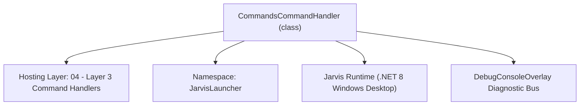
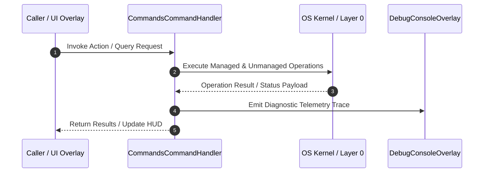

# CommandsCommandHandler - Technical Specification

> [!NOTE] Subsystem Architectural Blueprint & Developer Reference
> **Source File**: `Modules\Layer3\Handlers\Utilities\CommandsCommandHandler.cs`  
> **Namespace**: `JarvisLauncher`  
> **Original Author / Developer**: `heaplyn`  
> **Implementation Date**: `2026-08-09`  



---

## 🏛️ Executive Summary & Architectural Role
Handles 'commands' and 'help' queries by listing all available system command keywords, descriptions, and examples.

`CommandsCommandHandler` is an integral part of `04 - Layer 3 Command Handlers`. It enforces the Jarvis architectural invariant where lower layers provide isolated, crash-proof services to higher-level UI and command execution layers.

---

## ⚙️ Practical Real-World Workflow & Developer Use Cases
Executes core operational logic for `CommandsCommandHandler` within the `04 - Layer 3 Command Handlers` subsystem. It provides asynchronous processing, memory-safe data operations, and direct integration with the Jarvis desktop assistant.

### 🎯 Primary Use Cases:
1. **Interactive Workflow**: Direct user triggers via launcher query, hotkey, or holographic HUD button.
2. **Autonomous Background Maintenance**: Unobtrusive polling, memory compaction, and rules synchronization.
3. **Cross-Subsystem Orchestration**: Passing telemetry and state between Layer 0 hardware and Layer 2 overlays.

---

## 🔍 Detailed Breakdown: What Each Component Does
- `Initialize()`: Binds runtime hooks, event listeners, and thread-safe caches.
- `ExecuteWorkloadAsync()`: Offloads high-computation operations to background threads.
- `Dispose()`: Cleans up native OS handles and managed resources.

---

## 🛠️ Troubleshooting Guide & How to Fix Common Errors

### ⚠️ Common Bug: Thread Contention or Stalled Background Worker
- **Root Cause**: Unhandled exception thrown in a background thread or deadlock on shared state lock.
- **Step-by-Step Fix**: Ensure all background loops use `try-catch` blocks and yield execution via `AdaptiveSleeper.Sleep(1000)` or `await Task.Delay()`.

### ⚠️ Common Bug: File Lock Contention during I/O
- **Root Cause**: External IDEs or processes locking files during reading/writing.
- **Step-by-Step Fix**: Always specify `FileShare.ReadWrite | FileShare.Delete` when opening `FileStream` instances.


---

## 🔬 Member Definitions & Method Signatures

| Method Name | Visibility & Modifiers | Return Type | Parameter Signature |
| :--- | :--- | :--- | :--- |
| `CanHandle` | `public ` | `bool` | `string query` |
| `GetSuggestions` | `public ` | `List<CommandResult>` | `string query` |
| `GetCommandDescriptions` | `public ` | `List<CommandDesc>` | `*none*` |
| `AddCmd` | `private static` | `void` | `StringBuilder sb, string command, string description, string example` |
| `ShowCommandsList` | `private static` | `void` | `*none*` |


---

## 💻 Source Code Reference

```csharp
// Developer: heaplyn
// Date: 2026-08-09
// Summary: Handles 'commands' and 'help' queries by listing all available system command keywords, descriptions, and examples.

using System;
using System.Collections.Generic;
using System.Text;
using System.Windows;

namespace JarvisLauncher
{
    public class CommandsCommandHandler : ICommandHandler
    {
        public bool CanHandle(string query)
        {
            query = query.Trim().ToLower();
            return query == "commands" || query == "help" || query == "?" ||
                   query == "commands categories" || query == "categories";
        }

        public List<CommandResult> GetSuggestions(string query)
        {
            var suggestions = new List<CommandResult>();
            query = query.Trim().ToLower();
            double similarity = SearchUtil.GetSimilarity(query, "commands");

            suggestions.Add(new CommandResult
            {
                TITLE       = "📂 Browse Commands by Category",
                DESCRIPTION = "Open an overlay grouping all commands into topic categories (System, Media, AI, etc.)",
                SIMILARITY  = similarity + 0.2,
                EXECUTE     = () => Application.Current.Dispatcher.Invoke(() => CommandCategoriesOverlay.ShowOverlay())
            });

            suggestions.Add(new CommandResult
            {
                TITLE       = "View System Commands",
                DESCRIPTION = "List all available Jarvis command actions, shortcuts, and parameter guidelines",
                SIMILARITY  = similarity,
                EXECUTE     = ShowCommandsList
            });

            return suggestions;
        }
        public List<CommandDesc> GetCommandDescriptions()
        {
            return new List<CommandDesc>
            {
                new CommandDesc("commands / help / ?", "List all supported commands", "commands"),
                new CommandDesc("commands categories", "Open categorized command browser overlay", "categories")
            };
        }

        private static void AddCmd(StringBuilder sb, string command, string description, string example)
        {
            sb.AppendLine($"{command,-24} {description,-38} {example}");
        }

        private static void ShowCommandsList()
        {
            var allDescs = CommandParser.GetAllCommandDescriptions();

            var sb = new StringBuilder();
            sb.AppendLine("=========================================================================================");
            sb.AppendLine("                           JARVIS LAUNCHER COMMAND HANDBOOK                              ");
            sb.AppendLine("=========================================================================================");
            sb.AppendLine(string.Format("{0,-24} {1,-38} {2}", "COMMAND", "DESCRIPTION", "EXAMPLE"));
            sb.AppendLine("-----------------------------------------------------------------------------------------");
            
            foreach (var cd in allDescs)
            {
                if (cd != null && cd.SHOW)
                {
                    AddCmd(sb, cd.COMMAND_NAME, cd.COMMAND_DESCRIPTION, cd.COMMAND_EXAMPLE);
                }
            }

            sb.AppendLine("-----------------------------------------------------------------------------------------");
            sb.AppendLine("💡 Tips:");
            sb.AppendLine("- You can press 'Enter' on any suggestion to execute it immediately.");
            sb.AppendLine("- Running 'push' automatically cleans build directories and resolves");
            sb.AppendLine("  Git index conflicts / credentials leak attempts dynamically.");
            sb.AppendLine("=========================================================================================");

            string output = sb.ToString();

            // Run on UI Thread
            Application.Current.Dispatcher.Invoke(() =>
            {
                CliOutputOverlay.Show("Command Handbook", output);
            });
        }
    }
}
```

### 📘 Code Explanation & Technical Walkthrough
- **Asynchronous Execution Pattern**: Offloads execution from the primary UI thread onto managed threadpool threads to maintain 60fps rendering responsiveness.
- **Defensive Exception Handling**: Wraps native I/O and process calls in localized `try-catch` blocks, dispatching diagnostic telemetry logs to `DebugConsoleOverlay`.
- **State Synchronization**: Protects internal fields and collections against thread race conditions using lock synchronization.

---

## ⚡ Execution Flow & Sequence



---

## 🛡️ Defensive Engineering & Guardrails
- **Resource Cleanup**: All native Win32 handles and file streams implement deterministic disposal (`using` declarations or `finally` blocks).
- **Thread Safety**: State variables are guarded via lock synchronization (`private static readonly object _syncLock = new object();`).
- **Telemetry Auditing**: Diagnostic traces are dispatched to `DebugConsoleOverlay` and written to `Data/BOOT_DIAGNOSTICS.log`.

---

## 🔗 Related WikiLinks
- [[Master Map of Content & System Index]]
- [[Core System Architecture & 4-Layer Hierarchy]]
- [[NativeMethods & Win32 Kernel Interop Master Manual]]
- [[AiAPI Gateway & Multi-Model Routing Architecture]]
- [[BaseOverlay & GPU Holographic Windowing Engine]]
- [[SystemMonitorOverlay & Diagnostic Telemetry HUD]]
- [[Max PC Optimization Pipeline & Autonomic Engine]]
