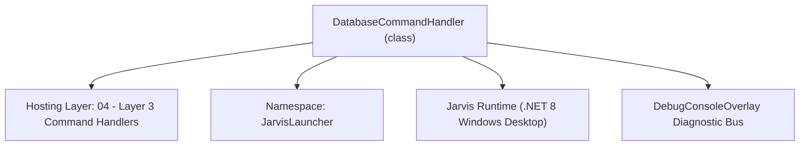
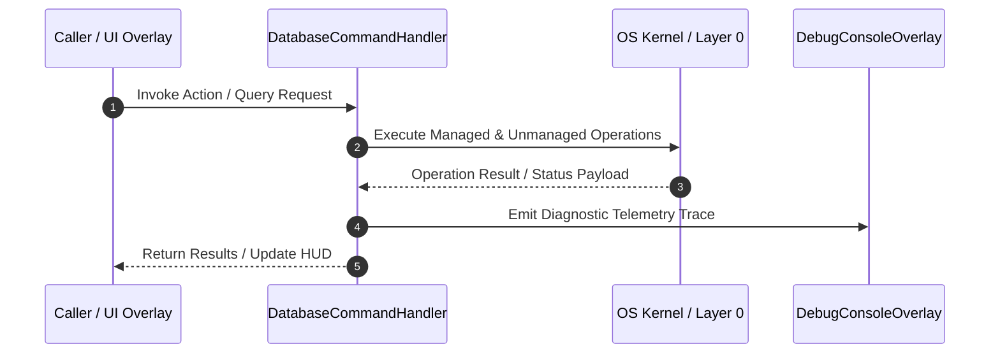

# DatabaseCommandHandler - Technical Specification

> [!NOTE] Subsystem Architectural Blueprint & Developer Reference
> **Source File**: `Modules\Layer3\Handlers\Dev\DatabaseCommandHandler.cs`  
> **Namespace**: `JarvisLauncher`  
> **Original Author / Developer**: `heaplyn`  
> **Implementation Date**: `2026-08-16`  



---

## 🏛️ Executive Summary & Architectural Role
Handles system database operations including resetting memory, filtering by importance, and maintenance.

`DatabaseCommandHandler` is an integral part of `04 - Layer 3 Command Handlers`. It enforces the Jarvis architectural invariant where lower layers provide isolated, crash-proof services to higher-level UI and command execution layers.

---

## ⚙️ Practical Real-World Workflow & Developer Use Cases
Executes core operational logic for `DatabaseCommandHandler` within the `04 - Layer 3 Command Handlers` subsystem. It provides asynchronous processing, memory-safe data operations, and direct integration with the Jarvis desktop assistant.

### 🎯 Primary Use Cases:
1. **Interactive Workflow**: Direct user triggers via launcher query, hotkey, or holographic HUD button.
2. **Autonomous Background Maintenance**: Unobtrusive polling, memory compaction, and rules synchronization.
3. **Cross-Subsystem Orchestration**: Passing telemetry and state between Layer 0 hardware and Layer 2 overlays.

---

## 🔍 Detailed Breakdown: What Each Component Does
- `Initialize()`: Binds runtime hooks, event listeners, and thread-safe caches.
- `ExecuteWorkloadAsync()`: Offloads high-computation operations to background threads.
- `Dispose()`: Cleans up native OS handles and managed resources.

---

## 🛠️ Troubleshooting Guide & How to Fix Common Errors

### ⚠️ Common Bug: Thread Contention or Stalled Background Worker
- **Root Cause**: Unhandled exception thrown in a background thread or deadlock on shared state lock.
- **Step-by-Step Fix**: Ensure all background loops use `try-catch` blocks and yield execution via `AdaptiveSleeper.Sleep(1000)` or `await Task.Delay()`.

### ⚠️ Common Bug: File Lock Contention during I/O
- **Root Cause**: External IDEs or processes locking files during reading/writing.
- **Step-by-Step Fix**: Always specify `FileShare.ReadWrite | FileShare.Delete` when opening `FileStream` instances.


---

## 🔬 Member Definitions & Method Signatures

| Method Name | Visibility & Modifiers | Return Type | Parameter Signature |
| :--- | :--- | :--- | :--- |
| `CanHandle` | `public ` | `bool` | `string query` |
| `GetSuggestions` | `public ` | `List<CommandResult>` | `string query` |
| `ResetMemory` | `private ` | `void` | `*none*` |
| `ResetVoice` | `private ` | `void` | `*none*` |
| `FilterMemory` | `private ` | `void` | `double percentage` |
| `GetCommandDescriptions` | `public ` | `List<CommandDesc>` | `*none*` |
| `OnStart` | `public ` | `void` | `*none*` |


---

## 💻 Source Code Reference

```csharp
// Developer: heaplyn
// Date: 2026-08-16
// Summary: Handles system database operations including resetting memory, filtering by importance, and maintenance.

using System;
using System.Collections.Generic;
using System.Linq;
using System.Threading.Tasks;

namespace JarvisLauncher
{
    public class DatabaseCommandHandler : ICommandHandler
    {
        public bool CanHandle(string query)
        {
            query = query.Trim().ToLower();
            return query.StartsWith("db ") || query.StartsWith("database ") || query == "reset db" || query == "filter db";
        }

        public List<CommandResult> GetSuggestions(string query)
        {
            var suggestions = new List<CommandResult>();
            string lower = query.Trim().ToLower();
            string[] parts = lower.Split(' ', StringSplitOptions.RemoveEmptyEntries);

            double similarity = SearchUtil.GetSimilarity(parts[0], "database");

            // ── RESET ───────────────────────────────────────────────────────────
            if (lower.Contains("reset"))
            {
                suggestions.Add(new CommandResult
                {
                    TITLE = "🧹 Reset Semantic Memory Database",
                    DESCRIPTION = "Wipe all long-term AI facts and activity history",
                    SIMILARITY = 9.0,
                    EXECUTE = () => ResetMemory()
                });

                suggestions.Add(new CommandResult
                {
                    TITLE = "🎙️ Reset Voice Dataset",
                    DESCRIPTION = "Delete all captured voice clips and trigger logs",
                    SIMILARITY = 8.5,
                    EXECUTE = () => ResetVoice()
                });
            }

            // ── FILTER ──────────────────────────────────────────────────────────
            if (lower.Contains("filter") || parts.Length >= 2 && double.TryParse(parts.Last(), out _))
            {
                double pct = 50;
                if (parts.Length >= 3 && double.TryParse(parts[2], out double p)) pct = p;
                else if (parts.Length == 2 && double.TryParse(parts[1], out double p2)) pct = p2;

                suggestions.Add(new CommandResult
                {
                    TITLE = $"🔍 Filter Memory: {pct}% Importance",
                    DESCRIPTION = $"Prune low-value data. Keep only nodes >= {pct}% score.",
                    SIMILARITY = 9.0,
                    EXECUTE = () => FilterMemory(pct)
                });
            }

            // Default suggestions
            if (suggestions.Count == 0)
            {
                suggestions.Add(new CommandResult { TITLE = "📊 Database Maintenance...", DESCRIPTION = "Use 'db reset' or 'db filter <%>'", SIMILARITY = similarity, EXECUTE = null });
            }

            return suggestions;
        }

        private void ResetMemory()
        {
            var res = System.Windows.MessageBox.Show("Are you sure you want to WIPE all Semantic Memory? This cannot be undone.", "Database Reset", System.Windows.MessageBoxButton.YesNo, System.Windows.MessageBoxImage.Warning);
            if (res == System.Windows.MessageBoxResult.Yes)
            {
                SemanticMemoryManager.ResetDatabase();
                TextOverlay.Show("🧠 Semantic Memory Reset Successful", 3000);
            }
        }

        private void ResetVoice()
        {
            var res = System.Windows.MessageBox.Show("Are you sure you want to delete all historical voice data?", "Voice Reset", System.Windows.MessageBoxButton.YesNo, System.Windows.MessageBoxImage.Warning);
            if (res == System.Windows.MessageBoxResult.Yes)
            {
                VoiceDatasetManager.ResetDatabase();
                TextOverlay.Show("🎙️ Voice Dataset Reset Successful", 3000);
            }
        }

        private void FilterMemory(double percentage)
        {
            int removed = SemanticMemoryManager.FilterByImportance(percentage);
            TextOverlay.Show($"🧹 Filtered Database: Removed {removed} low-importance nodes.", 3500);
        }

        public List<CommandDesc> GetCommandDescriptions()
        {
            return new List<CommandDesc>
            {
                new CommandDesc("db reset", "Wipe AI long-term memory", "db reset"),
                new CommandDesc("db filter <%>", "Prune low-importance data", "db filter 70")
            };
        }

        public void OnStart() { }
    }
}
```

### 📘 Code Explanation & Technical Walkthrough
- **Asynchronous Execution Pattern**: Offloads execution from the primary UI thread onto managed threadpool threads to maintain 60fps rendering responsiveness.
- **Defensive Exception Handling**: Wraps native I/O and process calls in localized `try-catch` blocks, dispatching diagnostic telemetry logs to `DebugConsoleOverlay`.
- **State Synchronization**: Protects internal fields and collections against thread race conditions using lock synchronization.

---

## ⚡ Execution Flow & Sequence



---

## 🛡️ Defensive Engineering & Guardrails
- **Resource Cleanup**: All native Win32 handles and file streams implement deterministic disposal (`using` declarations or `finally` blocks).
- **Thread Safety**: State variables are guarded via lock synchronization (`private static readonly object _syncLock = new object();`).
- **Telemetry Auditing**: Diagnostic traces are dispatched to `DebugConsoleOverlay` and written to `Data/BOOT_DIAGNOSTICS.log`.

---

## 🔗 Related WikiLinks
- [[Master Map of Content & System Index]]
- [[Core System Architecture & 4-Layer Hierarchy]]
- [[NativeMethods & Win32 Kernel Interop Master Manual]]
- [[AiAPI Gateway & Multi-Model Routing Architecture]]
- [[BaseOverlay & GPU Holographic Windowing Engine]]
- [[SystemMonitorOverlay & Diagnostic Telemetry HUD]]
- [[Max PC Optimization Pipeline & Autonomic Engine]]
