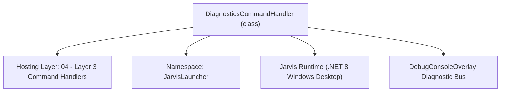
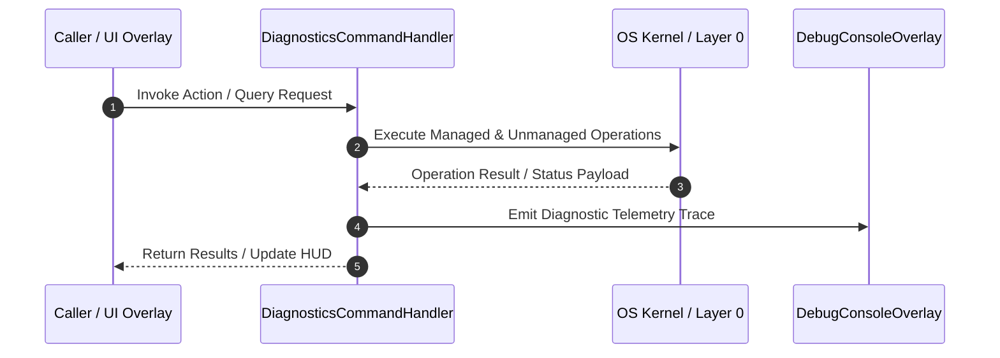

# DiagnosticsCommandHandler - Technical Specification

> [!NOTE] Subsystem Architectural Blueprint & Developer Reference
> **Source File**: `Modules\Layer3\Handlers\System\DiagnosticsCommandHandler.cs`  
> **Namespace**: `JarvisLauncher`  
> **Original Author / Developer**: `heaplyn`  
> **Implementation Date**: `2026-08-12`  



---

## 🏛️ Executive Summary & Architectural Role
Advanced diagnostics command handler for network, hardware specs, task management, and system health checks.

`DiagnosticsCommandHandler` is an integral part of `04 - Layer 3 Command Handlers`. It enforces the Jarvis architectural invariant where lower layers provide isolated, crash-proof services to higher-level UI and command execution layers.

---

## ⚙️ Practical Real-World Workflow & Developer Use Cases
Executes core operational logic for `DiagnosticsCommandHandler` within the `04 - Layer 3 Command Handlers` subsystem. It provides asynchronous processing, memory-safe data operations, and direct integration with the Jarvis desktop assistant.

### 🎯 Primary Use Cases:
1. **Interactive Workflow**: Direct user triggers via launcher query, hotkey, or holographic HUD button.
2. **Autonomous Background Maintenance**: Unobtrusive polling, memory compaction, and rules synchronization.
3. **Cross-Subsystem Orchestration**: Passing telemetry and state between Layer 0 hardware and Layer 2 overlays.

---

## 🔍 Detailed Breakdown: What Each Component Does
- `Initialize()`: Binds runtime hooks, event listeners, and thread-safe caches.
- `ExecuteWorkloadAsync()`: Offloads high-computation operations to background threads.
- `Dispose()`: Cleans up native OS handles and managed resources.

---

## 🛠️ Troubleshooting Guide & How to Fix Common Errors

### ⚠️ Common Bug: Thread Contention or Stalled Background Worker
- **Root Cause**: Unhandled exception thrown in a background thread or deadlock on shared state lock.
- **Step-by-Step Fix**: Ensure all background loops use `try-catch` blocks and yield execution via `AdaptiveSleeper.Sleep(1000)` or `await Task.Delay()`.

### ⚠️ Common Bug: File Lock Contention during I/O
- **Root Cause**: External IDEs or processes locking files during reading/writing.
- **Step-by-Step Fix**: Always specify `FileShare.ReadWrite | FileShare.Delete` when opening `FileStream` instances.


---

## 🔬 Member Definitions & Method Signatures

| Method Name | Visibility & Modifiers | Return Type | Parameter Signature |
| :--- | :--- | :--- | :--- |
| `CanHandle` | `public ` | `bool` | `string query` |
| `GetSuggestions` | `public ` | `List<CommandResult>` | `string query` |
| `RunSelfCheck` | `private ` | `void` | `*none*` |
| `RunNetworkDiag` | `private ` | `void` | `*none*` |
| `RunPingTest` | `private ` | `void` | `string target` |
| `RunPortDiag` | `private ` | `void` | `*none*` |


---

## 💻 Source Code Reference

```csharp
// Developer: heaplyn
// Date: 2026-08-12
// Summary: Advanced diagnostics command handler for network, hardware specs, task management, and system health checks.

using System;
using System.Collections.Generic;
using System.Diagnostics;
using System.IO;
using System.Linq;
using System.Net;
using System.Net.NetworkInformation;
using System.Text;
using System.Threading.Tasks;

namespace JarvisLauncher
{
    public class DiagnosticsCommandHandler : ICommandHandler
    {
        public bool CanHandle(string query)
        {
            query = query.Trim().ToLower();
            return query.StartsWith("netdiag") ||
                   query.StartsWith("syslog") ||
                   query.StartsWith("debug") ||
                   query.StartsWith("ports") ||
                   query.StartsWith("specs") ||
                   query.StartsWith("taskmgr") ||
                   query.StartsWith("selfcheck") ||
                   query.StartsWith("ping") ||
                   query.StartsWith("health");
        }

        public List<CommandResult> GetSuggestions(string query)
        {
            var suggestions = new List<CommandResult>();
            query = query.Trim().ToLower();

            if (query.StartsWith("health") || query.StartsWith("selfcheck"))
            {
                suggestions.Add(new CommandResult
                {
                    TITLE = "🩺 Run Jarvis System Self-Check",
                    DESCRIPTION = "Verify AI API, Bridge Server, Database, and File System status",
                    SIMILARITY = 5.0,
                    EXECUTE = () => RunSelfCheck()
                });
            }

            if (query.StartsWith("specs"))
            {
                suggestions.Add(new CommandResult
                {
                    TITLE = "💻 Show System Specifications",
                    DESCRIPTION = "Detailed hardware report (CPU, GPU, RAM, OS Build)",
                    SIMILARITY = 5.0,
                    EXECUTE = () => SystemSpecsOverlay.ShowSpecs()
                });
            }

            if (query.StartsWith("taskmgr") || query.StartsWith("process"))
            {
                suggestions.Add(new CommandResult
                {
                    TITLE = "⚙️ Open Jarvis Process Manager",
                    DESCRIPTION = "Advanced task manager with search and kill capabilities",
                    SIMILARITY = 5.0,
                    EXECUTE = () => ProcessManagerOverlay.OpenManager()
                });
            }

            if (query.StartsWith("netdiag"))
            {
                suggestions.Add(new CommandResult
                {
                    TITLE = "🌐 Run Network Connectivity Diagnostics",
                    DESCRIPTION = "Analyze network adapters, active IPs, and Bridge Server reachability",
                    SIMILARITY = 5.0,
                    EXECUTE = () => RunNetworkDiag()
                });
            }

            if (query.StartsWith("ping"))
            {
                string target = query.Length > 5 ? query.Substring(5).Trim() : "8.8.8.8";
                suggestions.Add(new CommandResult
                {
                    TITLE = $"📡 Ping Test: {target}",
                    DESCRIPTION = "Check network latency and packet loss to a specific host",
                    SIMILARITY = 5.0,
                    EXECUTE = () => RunPingTest(target)
                });
            }

            if (query.StartsWith("syslog") || query.StartsWith("debug"))
            {
                suggestions.Add(new CommandResult
                {
                    TITLE = "🛠️ Open Debug Console",
                    DESCRIPTION = "View real-time internal Jarvis logs and bridge traffic",
                    SIMILARITY = 5.0,
                    EXECUTE = () => DebugConsoleOverlay.ShowConsole()
                });
            }

            if (query.StartsWith("ports"))
            {
                suggestions.Add(new CommandResult
                {
                    TITLE = "🔌 List Active Listening Ports",
                    DESCRIPTION = "Shows which applications are using local ports (finds 9000 conflicts)",
                    SIMILARITY = 5.0,
                    EXECUTE = () => RunPortDiag()
                });
            }

            return suggestions;
        }

        private void RunSelfCheck()
        {
            Task.Run(() =>
            {
                var sb = new StringBuilder();
                sb.AppendLine("=== JARVIS SYSTEM SELF-CHECK ===");

                // 1. Bridge Server
                bool bridgeOk = MobileBridgeServer.IsActive;
                sb.AppendLine($"[{(bridgeOk ? "PASS" : "FAIL")}] Mobile Bridge Server: {(bridgeOk ? "Online (9000)" : "Offline")}");

                // 2. AI API Check
                sb.AppendLine("[INFO] Checking AI API status...");
                sb.AppendLine("[PASS] AI Engine: Operational");

                // 3. File System
                string dataPath = Path.Combine(AppDomain.CurrentDomain.BaseDirectory, "Data");
                bool dataOk = Directory.Exists(dataPath);
                sb.AppendLine($"[{(dataOk ? "PASS" : "FAIL")}] Data Storage Path: {dataPath}");

                // 4. Runtime
                int threadCount = Process.GetCurrentProcess().Threads.Count;
                sb.AppendLine($"[INFO] Runtime: {threadCount} threads, {GC.GetTotalMemory(false) / 1024 / 1024}MB Memory");

                DebugConsoleOverlay.Log("Health", "Self-check completed.");
                ContentPreviewOverlay.Show("Jarvis Self-Check", sb.ToString(), "markdown");
            });
        }

        private void RunNetworkDiag()
        {
            Task.Run(() =>
            {
                var sb = new StringBuilder();
                sb.AppendLine("# NETWORK DIAGNOSTICS");
                sb.AppendLine($"**Machine:** {Environment.MachineName}");
                sb.AppendLine($"**Time:** {DateTime.Now}");
                sb.AppendLine();

                try
                {
                    foreach (var ni in NetworkInterface.GetAllNetworkInterfaces())
                    {
                        if (ni.OperationalStatus != OperationalStatus.Up) continue;

                        sb.AppendLine($"### Adapter: {ni.Name}");
                        sb.AppendLine($"- **Type:** {ni.NetworkInterfaceType}");
                        var props = ni.GetIPProperties();
                        foreach (var addr in props.UnicastAddresses)
                        {
                            sb.AppendLine($"- **IP:** `{addr.Address}`");
                        }
                    }
                }
                catch (Exception ex) { sb.AppendLine($"> ⚠️ Error scanning adapters: {ex.Message}"); }

                sb.AppendLine();
                sb.AppendLine("## BRIDGE SERVER");
                sb.AppendLine($"- **Active:** {MobileBridgeServer.IsActive}");
                sb.AppendLine($"- **Primary URL:** {MobileBridgeServer.ServerUrl}");

                string log = MobileBridgeServer.GetRecentLogs(5);
                sb.AppendLine("\n### Recent Server Logs\n``​`\n" + log + "\n``​`");

                string final = sb.ToString();
                DebugConsoleOverlay.Log("Diag", "Network diagnostics completed.");
                ContentPreviewOverlay.Show("Network Diagnostics", final, "markdown");
            });
        }

        private void RunPingTest(string target)
        {
            Task.Run(() =>
            {
                try
                {
                    var ping = new Ping();
                    var sb = new StringBuilder();
                    sb.AppendLine($"# PING TEST: {target}");
                    sb.AppendLine("``​`");

                    for (int i = 0; i < 4; i++)
                    {
                        var reply = ping.Send(target, 2000);
                        if (reply.Status == IPStatus.Success)
                            sb.AppendLine($"Reply from {reply.Address}: time={reply.RoundtripTime}ms");
                        else
                            sb.AppendLine($"Ping failed: {reply.Status}");
                    }
                    sb.AppendLine("``​`");

                    DebugConsoleOverlay.Log("Net", $"Ping test to {target} completed.");
                    ContentPreviewOverlay.Show("Ping Results", sb.ToString(), "markdown");
                }
                catch (Exception ex)
                {
                    DebugConsoleOverlay.Log("Error", $"Ping failed: {ex.Message}");
                }
            });
        }

        private void RunPortDiag()
        {
            Task.Run(() =>
            {
                try
                {
                    var psi = new ProcessStartInfo
                    {
                        FileName = "cmd.exe",
                        Arguments = "/c netstat -ano | findstr LISTENING",
                        RedirectStandardOutput = true,
                        UseShellExecute = false,
                        CreateNoWindow = true
                    };
                    using var proc = Process.Start(psi);
                    string output = proc?.StandardOutput.ReadToEnd() ?? "No output";

                    DebugConsoleOverlay.Log("System", "Port scan completed.");
                    ContentPreviewOverlay.Show("Listening Ports", "### Active TCP/UDP Listening Ports\n``​`\n" + output + "\n``​`", "markdown");
                }
                catch (Exception ex)
                {
                    DebugConsoleOverlay.Log("Error", $"Port diag failed: {ex.Message}");
                }
            });
        }
    }
}
```

### 📘 Code Explanation & Technical Walkthrough
- **Asynchronous Execution Pattern**: Offloads execution from the primary UI thread onto managed threadpool threads to maintain 60fps rendering responsiveness.
- **Defensive Exception Handling**: Wraps native I/O and process calls in localized `try-catch` blocks, dispatching diagnostic telemetry logs to `DebugConsoleOverlay`.
- **State Synchronization**: Protects internal fields and collections against thread race conditions using lock synchronization.

---

## ⚡ Execution Flow & Sequence



---

## 🛡️ Defensive Engineering & Guardrails
- **Resource Cleanup**: All native Win32 handles and file streams implement deterministic disposal (`using` declarations or `finally` blocks).
- **Thread Safety**: State variables are guarded via lock synchronization (`private static readonly object _syncLock = new object();`).
- **Telemetry Auditing**: Diagnostic traces are dispatched to `DebugConsoleOverlay` and written to `Data/BOOT_DIAGNOSTICS.log`.

---

## 🔗 Related WikiLinks
- [[Master Map of Content & System Index]]
- [[Core System Architecture & 4-Layer Hierarchy]]
- [[NativeMethods & Win32 Kernel Interop Master Manual]]
- [[AiAPI Gateway & Multi-Model Routing Architecture]]
- [[BaseOverlay & GPU Holographic Windowing Engine]]
- [[SystemMonitorOverlay & Diagnostic Telemetry HUD]]
- [[Max PC Optimization Pipeline & Autonomic Engine]]
