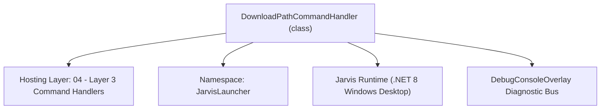
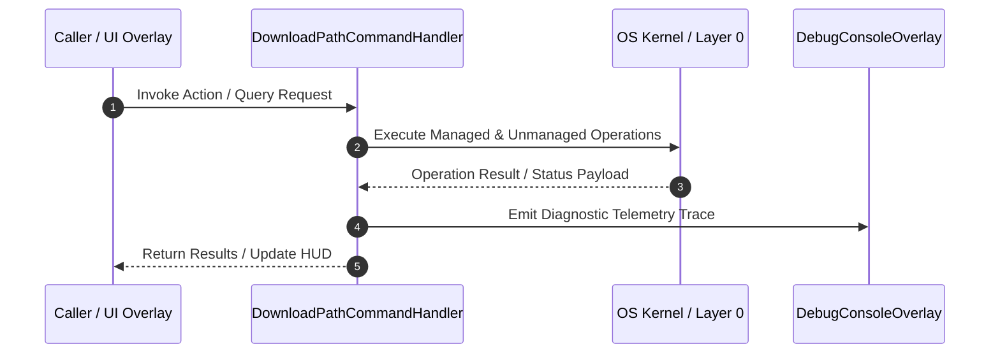

# DownloadPathCommandHandler - Technical Specification

> [!NOTE] Subsystem Architectural Blueprint & Developer Reference
> **Source File**: `Modules\Layer3\Handlers\Utilities\DownloadPathCommandHandler.cs`  
> **Namespace**: `JarvisLauncher`  
> **Original Author / Developer**: `heaplyn`  
> **Implementation Date**: `2026-08-09`  



---

## 🏛️ Executive Summary & Architectural Role
Handles CLI commands to get, set, or reset the custom download directory path for downloaded music media.

`DownloadPathCommandHandler` is an integral part of `04 - Layer 3 Command Handlers`. It enforces the Jarvis architectural invariant where lower layers provide isolated, crash-proof services to higher-level UI and command execution layers.

---

## ⚙️ Practical Real-World Workflow & Developer Use Cases
Executes core operational logic for `DownloadPathCommandHandler` within the `04 - Layer 3 Command Handlers` subsystem. It provides asynchronous processing, memory-safe data operations, and direct integration with the Jarvis desktop assistant.

### 🎯 Primary Use Cases:
1. **Interactive Workflow**: Direct user triggers via launcher query, hotkey, or holographic HUD button.
2. **Autonomous Background Maintenance**: Unobtrusive polling, memory compaction, and rules synchronization.
3. **Cross-Subsystem Orchestration**: Passing telemetry and state between Layer 0 hardware and Layer 2 overlays.

---

## 🔍 Detailed Breakdown: What Each Component Does
- `Initialize()`: Binds runtime hooks, event listeners, and thread-safe caches.
- `ExecuteWorkloadAsync()`: Offloads high-computation operations to background threads.
- `Dispose()`: Cleans up native OS handles and managed resources.

---

## 🛠️ Troubleshooting Guide & How to Fix Common Errors

### ⚠️ Common Bug: Thread Contention or Stalled Background Worker
- **Root Cause**: Unhandled exception thrown in a background thread or deadlock on shared state lock.
- **Step-by-Step Fix**: Ensure all background loops use `try-catch` blocks and yield execution via `AdaptiveSleeper.Sleep(1000)` or `await Task.Delay()`.

### ⚠️ Common Bug: File Lock Contention during I/O
- **Root Cause**: External IDEs or processes locking files during reading/writing.
- **Step-by-Step Fix**: Always specify `FileShare.ReadWrite | FileShare.Delete` when opening `FileStream` instances.


---

## 🔬 Member Definitions & Method Signatures

| Method Name | Visibility & Modifiers | Return Type | Parameter Signature |
| :--- | :--- | :--- | :--- |
| `CanHandle` | `public ` | `bool` | `string query` |
| `GetSuggestions` | `public ` | `List<CommandResult>` | `string query` |
| `GetDefaultDownloadPath` | `private static` | `string` | `*none*` |
| `SetDownloadPath` | `private static` | `void` | `string path` |
| `ResetDownloadPath` | `private static` | `void` | `*none*` |


---

## 💻 Source Code Reference

```csharp
// Developer: heaplyn
// Date: 2026-08-09
// Summary: Handles CLI commands to get, set, or reset the custom download directory path for downloaded music media.

using System;
using System.Collections.Generic;
using System.IO;
using System.Windows;

namespace JarvisLauncher
{
    public class DownloadPathCommandHandler : ICommandHandler
    {
        public bool CanHandle(string query)
        {
            return SearchUtil.MatchesAny(query, "getdlpath", "resetdlpath", "setdlpath");
        }

        public List<CommandResult> GetSuggestions(string query)
        {
            var suggestions = new List<CommandResult>();
            query = query.Trim();
            var parts = query.Split(' ', 2, StringSplitOptions.RemoveEmptyEntries);

            string cmd = parts[0].ToLower();
            double similarity = SearchUtil.BestSimilarity(query, "getdlpath", "resetdlpath", "setdlpath"); // High priority match

            if (cmd == "getdlpath")
            {
                string currentPath = SettingsManager.Current.DOWNLOAD_DIRECTORY;
                string displayPath = string.IsNullOrWhiteSpace(currentPath) 
                    ? GetDefaultDownloadPath() + " [Default]"
                    : currentPath;

                suggestions.Add(new CommandResult
                {
                    TITLE       = $"Downloads Folder: {displayPath}",
                    DESCRIPTION = "Display the target directory path where music files are saved",
                    SIMILARITY  = similarity,
                    EXECUTE     = null
                });
            }
            else if (cmd == "resetdlpath")
            {
                suggestions.Add(new CommandResult
                {
                    TITLE       = "Reset Downloads Folder",
                    DESCRIPTION = $"Restore default target path to project folder: {GetDefaultDownloadPath()}",
                    SIMILARITY  = similarity,
                    EXECUTE     = () => ResetDownloadPath()
                });
            }
            else if (cmd == "setdlpath")
            {
                if (parts.Length > 1)
                {
                    string targetPath = parts[1].Trim().Trim('"', '\'');
                    suggestions.Add(new CommandResult
                    {
                        TITLE       = $"Set Downloads Folder to: {targetPath}",
                        DESCRIPTION = "Update the download destination folder for Lucida/YT-DLP",
                        SIMILARITY  = similarity,
                        EXECUTE     = () => SetDownloadPath(targetPath)
                    });
                }
                else
                {
                    suggestions.Add(new CommandResult
                    {
                        TITLE       = "Set Downloads Folder...",
                        DESCRIPTION = "Type the destination folder path (e.g. setdlpath C:\\Users\\Name\\Music)",
                        SIMILARITY  = similarity,
                        EXECUTE     = null
                    });
                }
            }

            return suggestions;
        }

        private static string GetDefaultDownloadPath()
        {
            string devPath = Path.GetFullPath(Path.Combine(AppDomain.CurrentDomain.BaseDirectory, @"..\..\.."));
            if (Directory.Exists(Path.Combine(devPath, "Modules")))
            {
                return Path.Combine(devPath, "Downloads");
            }
            return Path.Combine(AppDomain.CurrentDomain.BaseDirectory, "Downloads");
        }

        private static void SetDownloadPath(string path)
        {
            try
            {
                // Basic path validation
                if (path.IndexOfAny(Path.GetInvalidPathChars()) != -1)
                {
                    TextOverlay.Show("⚠️ Invalid folder path characters detected!", 3000);
                    return;
                }

                // If path doesn't exist, try to create it to verify write permissions
                if (!Directory.Exists(path))
                {
                    Directory.CreateDirectory(path);
                }

                SettingsManager.Current.DOWNLOAD_DIRECTORY = path;
                SettingsManager.Save();
                TextOverlay.Show($"📁 Downloads directory configured successfully!", 2500);
            }
            catch (Exception ex)
            {
                TextOverlay.Show($"⚠️ Failed to save directory: {ex.Message}", 3000);
            }
        }

        private static void ResetDownloadPath()
        {
            try
            {
                SettingsManager.Current.DOWNLOAD_DIRECTORY = string.Empty;
                SettingsManager.Save();
                TextOverlay.Show("📁 Downloads path reset to project default.", 2500);
            }
            catch (Exception ex)
            {
                TextOverlay.Show($"⚠️ Reset failed: {ex.Message}", 3000);
            }
        }
    }
}
```

### 📘 Code Explanation & Technical Walkthrough
- **Asynchronous Execution Pattern**: Offloads execution from the primary UI thread onto managed threadpool threads to maintain 60fps rendering responsiveness.
- **Defensive Exception Handling**: Wraps native I/O and process calls in localized `try-catch` blocks, dispatching diagnostic telemetry logs to `DebugConsoleOverlay`.
- **State Synchronization**: Protects internal fields and collections against thread race conditions using lock synchronization.

---

## ⚡ Execution Flow & Sequence



---

## 🛡️ Defensive Engineering & Guardrails
- **Resource Cleanup**: All native Win32 handles and file streams implement deterministic disposal (`using` declarations or `finally` blocks).
- **Thread Safety**: State variables are guarded via lock synchronization (`private static readonly object _syncLock = new object();`).
- **Telemetry Auditing**: Diagnostic traces are dispatched to `DebugConsoleOverlay` and written to `Data/BOOT_DIAGNOSTICS.log`.

---

## 🔗 Related WikiLinks
- [[Master Map of Content & System Index]]
- [[Core System Architecture & 4-Layer Hierarchy]]
- [[NativeMethods & Win32 Kernel Interop Master Manual]]
- [[AiAPI Gateway & Multi-Model Routing Architecture]]
- [[BaseOverlay & GPU Holographic Windowing Engine]]
- [[SystemMonitorOverlay & Diagnostic Telemetry HUD]]
- [[Max PC Optimization Pipeline & Autonomic Engine]]
