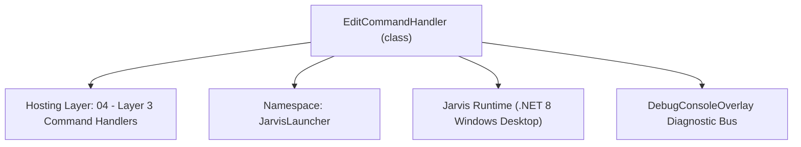
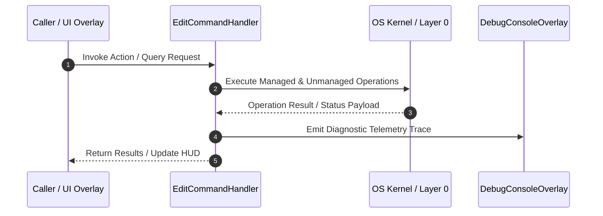

# EditCommandHandler - Technical Specification

> [!NOTE] Subsystem Architectural Blueprint & Developer Reference
> **Source File**: `Modules\Layer3\Handlers\Dev\EditCommandHandler.cs`  
> **Namespace**: `JarvisLauncher`  
> **Original Author / Developer**: `heaplyn`  
> **Implementation Date**: `2026-08-09`  



---

## 🏛️ Executive Summary & Architectural Role
Handles CLI commands to launch the glassmorphic text editor for a specific local file or default scratch note.

`EditCommandHandler` is an integral part of `04 - Layer 3 Command Handlers`. It enforces the Jarvis architectural invariant where lower layers provide isolated, crash-proof services to higher-level UI and command execution layers.

---

## ⚙️ Practical Real-World Workflow & Developer Use Cases
Executes core operational logic for `EditCommandHandler` within the `04 - Layer 3 Command Handlers` subsystem. It provides asynchronous processing, memory-safe data operations, and direct integration with the Jarvis desktop assistant.

### 🎯 Primary Use Cases:
1. **Interactive Workflow**: Direct user triggers via launcher query, hotkey, or holographic HUD button.
2. **Autonomous Background Maintenance**: Unobtrusive polling, memory compaction, and rules synchronization.
3. **Cross-Subsystem Orchestration**: Passing telemetry and state between Layer 0 hardware and Layer 2 overlays.

---

## 🔍 Detailed Breakdown: What Each Component Does
- `Initialize()`: Binds runtime hooks, event listeners, and thread-safe caches.
- `ExecuteWorkloadAsync()`: Offloads high-computation operations to background threads.
- `Dispose()`: Cleans up native OS handles and managed resources.

---

## 🛠️ Troubleshooting Guide & How to Fix Common Errors

### ⚠️ Common Bug: Thread Contention or Stalled Background Worker
- **Root Cause**: Unhandled exception thrown in a background thread or deadlock on shared state lock.
- **Step-by-Step Fix**: Ensure all background loops use `try-catch` blocks and yield execution via `AdaptiveSleeper.Sleep(1000)` or `await Task.Delay()`.

### ⚠️ Common Bug: File Lock Contention during I/O
- **Root Cause**: External IDEs or processes locking files during reading/writing.
- **Step-by-Step Fix**: Always specify `FileShare.ReadWrite | FileShare.Delete` when opening `FileStream` instances.


---

## 🔬 Member Definitions & Method Signatures

| Method Name | Visibility & Modifiers | Return Type | Parameter Signature |
| :--- | :--- | :--- | :--- |
| `CanHandle` | `public ` | `bool` | `string query` |
| `GetSuggestions` | `public ` | `List<CommandResult>` | `string query` |
| `GetCommandDescriptions` | `public ` | `List<CommandDesc>` | `*none*` |
| `OnStart` | `public ` | `void` | `*none*` |


---

## 💻 Source Code Reference

```csharp
// Developer: heaplyn
// Date: 2026-08-09
// Summary: Handles CLI commands to launch the glassmorphic text editor for a specific local file or default scratch note.

using System;
using System.Collections.Generic;
using System.IO;
using System.Windows;

namespace JarvisLauncher
{
    public class EditCommandHandler : ICommandHandler
    {
        public bool CanHandle(string query)
        {
            query = query.Trim().ToLower();
            return query == "edit" || query.StartsWith("edit ");
        }

        public List<CommandResult> GetSuggestions(string query)
        {
            var suggestions = new List<CommandResult>();
            query = query.Trim();
            var parts = query.Split(' ', StringSplitOptions.RemoveEmptyEntries);

            double similarity = SearchUtil.GetSimilarity(parts.Length > 0 ? parts[0].ToLower() : "", "edit");

            if (parts.Length > 1)
            {
                string targetPath = query.Substring(parts[0].Length).Trim().Trim('"', '\'');
                bool isFolder = Directory.Exists(targetPath);

                suggestions.Add(new CommandResult
                {
                    TITLE       = isFolder ? $"📁 Open Workspace: {Path.GetFileName(targetPath)}" : $"Edit: {Path.GetFileName(targetPath)}",
                    DESCRIPTION = isFolder ? $"Open folder \"{targetPath}\" as a project workspace" : $"Open \"{targetPath}\" inside the built-in Jarvis Text Editor",
                    SIMILARITY  = 9.5,
                    EXECUTE     = () => { if (isFolder) TextEditorOverlay.OpenWorkspace(targetPath); else TextEditorOverlay.OpenFile(targetPath); }
                });
            }
            else
            {
                suggestions.Add(new CommandResult
                {
                    TITLE       = "📂 Open Project/Workspace...",
                    DESCRIPTION = "Open a full directory and work on all files in Jarvis Code Studio",
                    SIMILARITY  = similarity + 0.9,
                    EXECUTE     = () => {
                        Application.Current.Dispatcher.Invoke(() => {
                            var dlg = new Microsoft.Win32.OpenFolderDialog { Title = "Select Project Folder" };
                            if (dlg.ShowDialog() == true) TextEditorOverlay.OpenWorkspace(dlg.FolderName);
                        });
                    }
                });

                suggestions.Add(new CommandResult
                {
                    TITLE       = "📝 Edit Single File...",
                    DESCRIPTION = "Browse and open a single source file",
                    SIMILARITY  = similarity + 0.8,
                    EXECUTE     = () => TextEditorOverlay.PromptAndOpenFile()
                });

                suggestions.Add(new CommandResult
                {
                    TITLE       = "Open Scratch Note",
                    DESCRIPTION = "Open a blank scratch.txt notepad inside the Jarvis Text Editor",
                    SIMILARITY  = similarity + 0.3,
                    EXECUTE     = () => TextEditorOverlay.OpenFile("scratch.txt")
                });
            }

            return suggestions;
        }

        public List<CommandDesc> GetCommandDescriptions()
        {
            return new List<CommandDesc>
            {
                new CommandDesc("edit <path>", "Open a file or folder in AI Code Studio", "edit ."),
                new CommandDesc("edit", "Browse and edit a single file", "edit"),
                new CommandDesc("workspace", "Open a project directory", "edit C:\\projects\\jarvis")
            };
        }

        public void OnStart() { }
    }
}
```

### 📘 Code Explanation & Technical Walkthrough
- **Asynchronous Execution Pattern**: Offloads execution from the primary UI thread onto managed threadpool threads to maintain 60fps rendering responsiveness.
- **Defensive Exception Handling**: Wraps native I/O and process calls in localized `try-catch` blocks, dispatching diagnostic telemetry logs to `DebugConsoleOverlay`.
- **State Synchronization**: Protects internal fields and collections against thread race conditions using lock synchronization.

---

## ⚡ Execution Flow & Sequence



---

## 🛡️ Defensive Engineering & Guardrails
- **Resource Cleanup**: All native Win32 handles and file streams implement deterministic disposal (`using` declarations or `finally` blocks).
- **Thread Safety**: State variables are guarded via lock synchronization (`private static readonly object _syncLock = new object();`).
- **Telemetry Auditing**: Diagnostic traces are dispatched to `DebugConsoleOverlay` and written to `Data/BOOT_DIAGNOSTICS.log`.

---

## 🔗 Related WikiLinks
- [[Master Map of Content & System Index]]
- [[Core System Architecture & 4-Layer Hierarchy]]
- [[NativeMethods & Win32 Kernel Interop Master Manual]]
- [[AiAPI Gateway & Multi-Model Routing Architecture]]
- [[BaseOverlay & GPU Holographic Windowing Engine]]
- [[SystemMonitorOverlay & Diagnostic Telemetry HUD]]
- [[Max PC Optimization Pipeline & Autonomic Engine]]
