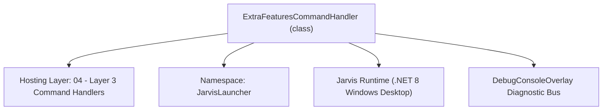
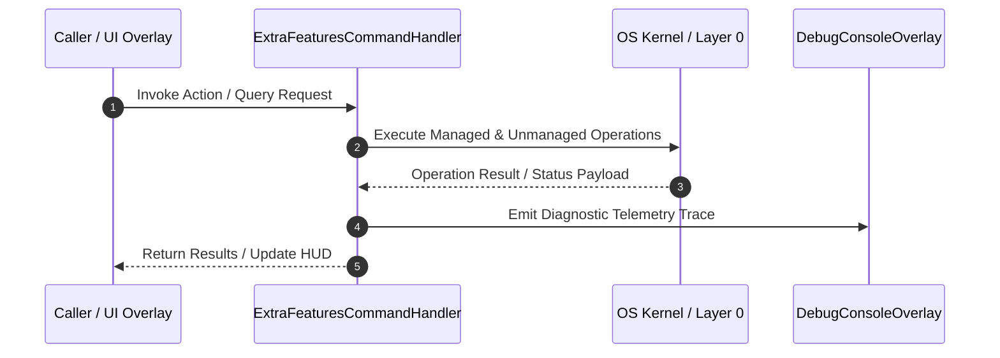

# ExtraFeaturesCommandHandler - Technical Specification

> [!NOTE] Subsystem Architectural Blueprint & Developer Reference
> **Source File**: `Modules\Layer3\Handlers\Utilities\ExtraFeaturesCommandHandler.cs`  
> **Namespace**: `JarvisLauncher`  
> **Original Author / Developer**: `heaplyn`  
> **Implementation Date**: `2026-08-09`  



---

## 🏛️ Executive Summary & Architectural Role
Handles Desktop File Search (search), Snippets (snip / snippet), App Shortcuts (app / apps), Web Summarizer (fetch), and Sound Volume Presets.

`ExtraFeaturesCommandHandler` is an integral part of `04 - Layer 3 Command Handlers`. It enforces the Jarvis architectural invariant where lower layers provide isolated, crash-proof services to higher-level UI and command execution layers.

---

## ⚙️ Practical Real-World Workflow & Developer Use Cases
Executes core operational logic for `ExtraFeaturesCommandHandler` within the `04 - Layer 3 Command Handlers` subsystem. It provides asynchronous processing, memory-safe data operations, and direct integration with the Jarvis desktop assistant.

### 🎯 Primary Use Cases:
1. **Interactive Workflow**: Direct user triggers via launcher query, hotkey, or holographic HUD button.
2. **Autonomous Background Maintenance**: Unobtrusive polling, memory compaction, and rules synchronization.
3. **Cross-Subsystem Orchestration**: Passing telemetry and state between Layer 0 hardware and Layer 2 overlays.

---

## 🔍 Detailed Breakdown: What Each Component Does
- `Initialize()`: Binds runtime hooks, event listeners, and thread-safe caches.
- `ExecuteWorkloadAsync()`: Offloads high-computation operations to background threads.
- `Dispose()`: Cleans up native OS handles and managed resources.

---

## 🛠️ Troubleshooting Guide & How to Fix Common Errors

### ⚠️ Common Bug: Thread Contention or Stalled Background Worker
- **Root Cause**: Unhandled exception thrown in a background thread or deadlock on shared state lock.
- **Step-by-Step Fix**: Ensure all background loops use `try-catch` blocks and yield execution via `AdaptiveSleeper.Sleep(1000)` or `await Task.Delay()`.

### ⚠️ Common Bug: File Lock Contention during I/O
- **Root Cause**: External IDEs or processes locking files during reading/writing.
- **Step-by-Step Fix**: Always specify `FileShare.ReadWrite | FileShare.Delete` when opening `FileStream` instances.


---

## 🔬 Member Definitions & Method Signatures

| Method Name | Visibility & Modifiers | Return Type | Parameter Signature |
| :--- | :--- | :--- | :--- |
| `IsMatch` | `private static` | `bool` | `string input, string target` |
| `CanHandle` | `public ` | `bool` | `string query` |
| `GetSuggestions` | `public ` | `List<CommandResult>` | `string query` |
| `InspectBrowserTabs` | `private static` | `void` | `*none*` |
| `SearchDesktopFiles` | `private static` | `List<string>` | `string keyword` |
| `ExecuteSearch` | `private static` | `void` | `string query` |
| `CopySnippet` | `private static` | `void` | `string content` |
| `ParseAndAddSnippet` | `private static` | `void` | `string input` |
| `LaunchApp` | `private static` | `void` | `string targetPath` |
| `FetchAndSummarize` | `private static` | `void` | `string url` |
| `OpenFileNatively` | `private static` | `void` | `string filePath` |
| `OpenWebBrowser` | `private static` | `void` | `string url` |
| `InteractiveOpenFile` | `private static` | `void` | `*none*` |
| `OpenFileInEditor` | `private static` | `void` | `string filePath` |
| `ShowWifiInfo` | `private static` | `void` | `bool showPassword` |


---

## 💻 Source Code Reference

```csharp
// Developer: heaplyn
// Date: 2026-08-09
// Summary: Handles Desktop File Search (search), Snippets (snip / snippet), App Shortcuts (app / apps), Web Summarizer (fetch), and Sound Volume Presets.

using System;
using System.Collections.Generic;
using System.Diagnostics;
using System.IO;
using System.Net.Http;
using System.Threading.Tasks;
using System.Windows;

namespace JarvisLauncher
{
    public class ExtraFeaturesCommandHandler : ICommandHandler
    {
        private static readonly HttpClient _httpClient = new HttpClient();

        private static bool IsMatch(string input, string target)
        {
            if (string.IsNullOrEmpty(input)) return false;
            if (target.StartsWith(input) || input.StartsWith(target)) return true;
            // Typo tolerance for 3+ char tokens ("moitor" -> "monitor") via the shared fuzzy gate.
            return input.Length >= 3 && SearchUtil.IsClose(input, target);
        }

        public bool CanHandle(string query)
        {
            query = query.Trim().ToLower();
            string firstWord = query.Split(' ')[0];

            return IsMatch(firstWord, "search") ||
                   IsMatch(firstWord, "snippet") || IsMatch(firstWord, "snip") ||
                   IsMatch(firstWord, "app") || IsMatch(firstWord, "apps") ||
                   IsMatch(firstWord, "fetch") ||
                   IsMatch(firstWord, "monitor") || IsMatch(firstWord, "stats") ||
                   IsMatch(firstWord, "tabs") || IsMatch(firstWord, "tab") || IsMatch(firstWord, "browser") ||
                   IsMatch(firstWord, "vol") || IsMatch(firstWord, "volume") ||
                   IsMatch(firstWord, "open") ||
                   IsMatch(firstWord, "edit") ||
                   IsMatch(firstWord, "view") ||
                   IsMatch(firstWord, "mobile") || IsMatch(firstWord, "phone") ||
                   IsMatch(firstWord, "tunnel") || IsMatch(firstWord, "cloudflare") || IsMatch(firstWord, "cloudflared") ||
                   IsMatch(firstWord, "ngrok") ||
                   IsMatch(firstWord, "wifi") || IsMatch(firstWord, "net") ||
                   IsMatch(firstWord, "ping") ||
                   IsMatch(firstWord, "uptime") ||
                   IsMatch(firstWord, "flushdns") || IsMatch(firstWord, "dns") ||
                   IsMatch(firstWord, "speak") || IsMatch(firstWord, "tts") ||
                   IsMatch(firstWord, "copy");
        }

        public List<CommandResult> GetSuggestions(string query)
        {
            var suggestions = new List<CommandResult>();
            query = query.Trim();
            var parts = query.Split(' ', 2, StringSplitOptions.RemoveEmptyEntries);
            string cmd = parts[0].ToLower();

            if (IsMatch(cmd, "wifi") || IsMatch(cmd, "net"))
            {
                bool wantPass = query.ToLower().Contains("pass");
                suggestions.Add(new CommandResult
                {
                    TITLE = wantPass ? "🔑 View Wi-Fi Password" : "📶 View Wi-Fi Network Info",
                    DESCRIPTION = wantPass ? "Display saved Wi-Fi password for current network" : "Display connected Wi-Fi SSID, signal, & local IP",
                    SIMILARITY = 4.0,
                    EXECUTE = () => ShowWifiInfo(wantPass)
                });
                return suggestions;
            }

            if (IsMatch(cmd, "tunnel") && (parts.Length == 1 || parts[1].Trim().ToLower() == "ui"))
            {
                suggestions.Add(new CommandResult
                {
                    TITLE = "🔧 Open Tunnel Manager UI",
                    DESCRIPTION = "Open the compact Tunnel Manager overlay to start/stop tunnels",
                    SIMILARITY = 4.0,
                    EXECUTE = () => Application.Current.Dispatcher.Invoke(() => TunnelOverlay.ShowOverlay())
                });
                return suggestions;
            }

            if (IsMatch(cmd, "uptime"))
            {
                suggestions.Add(new CommandResult
                {
                    TITLE = "⏱️ System Uptime",
                    DESCRIPTION = "Display host PC uptime in days, hours, and minutes",
                    SIMILARITY = 4.0,
                    EXECUTE = ShowUptime
                });
                return suggestions;
            }

            if (IsMatch(cmd, "flushdns") || IsMatch(cmd, "dns"))
            {
                suggestions.Add(new CommandResult
                {
                    TITLE = "⚡ Flush DNS Resolver Cache",
                    DESCRIPTION = "Purge Windows DNS cache to fix network issues",
                    SIMILARITY = 4.0,
                    EXECUTE = FlushDns
                });
                return suggestions;
            }

            if (IsMatch(cmd, "ping"))
            {
                string host = parts.Length > 1 ? parts[1].Trim() : "google.com";
                suggestions.Add(new CommandResult
                {
                    TITLE = $"📡 Ping {host}",
                    DESCRIPTION = $"Measure network roundtrip latency to {host}",
                    SIMILARITY = 4.0,
                    EXECUTE = () => PingHost(host)
                });
                return suggestions;
            }

            if (IsMatch(cmd, "speak") || IsMatch(cmd, "tts"))
            {
                string textToSpeak = parts.Length > 1 ? parts[1].Trim() : "Hello Kyle!";
                suggestions.Add(new CommandResult
                {
                    TITLE = $"🗣️ Speak: \"{textToSpeak}\"",
                    DESCRIPTION = "Synthesize and read text out loud via Windows Speech engine",
                    SIMILARITY = 4.0,
                    EXECUTE = () => SpeakText(textToSpeak)
                });
                return suggestions;
            }

            if (IsMatch(cmd, "copy"))
            {
                string copyText = parts.Length > 1 ? parts[1].Trim() : "";
                suggestions.Add(new CommandResult
                {
                    TITLE = $"📋 Copy to Clipboard: \"{copyText}\"",
                    DESCRIPTION = "Set text directly to system clipboard",
                    SIMILARITY = 4.0,
                    EXECUTE = () => { try { Clipboard.SetText(copyText); TextOverlay.Show("📋 Copied to Clipboard!", 2000); } catch {} }
                });
                return suggestions;
            }

            if (IsMatch(cmd, "tunnel") || IsMatch(cmd, "cloudflare") || IsMatch(cmd, "cloudflared"))
            {
                if (parts.Length > 1 && parts[1].Trim().Length > 5)
                {
                    string tokenStr = parts[1].Replace("token", "").Trim();
                    suggestions.Add(new CommandResult
                    {
                        TITLE = $"🔑 Save Permanent Cloudflare Token",
                        DESCRIPTION = $"Save token & bind static custom domain on every restart",
                        SIMILARITY = 4.5,
                        EXECUTE = () =>
                        {
                            CloudflareTunnelManager.SaveTunnelToken(tokenStr);
                            TextOverlay.Show("🔑 Permanent Cloudflare Token Saved!\nRestart tunnel to bind.", 4000);
                        }
                    });
                }

                bool isRunning = CloudflareTunnelManager.IsRunning;
                string activeUrl = CloudflareTunnelManager.PublicUrl ?? "";

                suggestions.Add(new CommandResult
                {
                    TITLE = isRunning ? $"🌐 Cloudflare Tunnel Active: {activeUrl}" : "🌐 Start Cloudflare Public Web Tunnel",
                    DESCRIPTION = isRunning ? "Click to open public HTTPS URL in browser" : "Auto-downloads cloudflared.exe & hosts Jarvis Mobile App to the public web",
                    SIMILARITY = 3.5,
                    EXECUTE = () =>
                    {
                        System.Threading.Tasks.Task.Run(async () =>
                        {
                            try
                            {
                                string url = await CloudflareTunnelManager.StartTunnelAsync(MobileBridgeServer.Port);
                                MobileOverlay.ShowQrPairingWindow(url);
                                OpenWebBrowser(url);
                            }
                            catch (Exception ex)
                            {
                                TextOverlay.Show($"⚠️ Cloudflare Error: {ex.Message}", 3000);
                            }
                        });
                    }
                });

                // ngrok alternatives
                if (parts.Length > 1 && parts[1].Trim().Length > 5)
                {
                    string tokenStr = parts[1].Replace("token", "").Trim();
                    suggestions.Add(new CommandResult
                    {
                        TITLE = $"🔑 Save Permanent ngrok Token",
                        DESCRIPTION = $"Save ngrok authtoken for higher-rate/public tunnels",
                        SIMILARITY = 4.5,
                        EXECUTE = () =>
                        {
                            NgrokTunnelManager.SaveAuthToken(tokenStr);
                            TextOverlay.Show("🔑 ngrok Token Saved!\nRestart tunnel to apply.", 4000);
                        }
                    });
                }

                bool ngrokRunning = NgrokTunnelManager.IsRunning;
                string ngrokUrl = NgrokTunnelManager.PublicUrl ?? "";
                suggestions.Add(new CommandResult
                {
                    TITLE = ngrokRunning ? $"🌐 ngrok Tunnel Active: {ngrokUrl}" : "🌐 Start ngrok Public Web Tunnel",
                    DESCRIPTION = ngrokRunning ? "Open public ngrok URL in browser" : "Auto-downloads ngrok.exe & hosts Jarvis Mobile App to the public web",
                    SIMILARITY = 3.2,
                    EXECUTE = () =>
                    {
                        System.Threading.Tasks.Task.Run(async () =>
                        {
                            try
                            {
                                string url = await NgrokTunnelManager.StartTunnelAsync(MobileBridgeServer.Port);
                                MobileOverlay.ShowQrPairingWindow(url);
                                OpenWebBrowser(url);
                            }
                            catch (Exception ex)
                            {
                                TextOverlay.Show($"⚠️ ngrok Error: {ex.Message}", 3000);
                            }
                        });
                    }
                });
                return suggestions;
            }

            if (IsMatch(cmd, "vercel") || IsMatch(cmd, "deploy vercel"))
            {
                suggestions.Add(new CommandResult
                {
                    TITLE = "🚀 Deploy Mobile Companion to Vercel (1-Click Free Hosting)",
                    DESCRIPTION = "Get a permanent HTTPS URL (https://jarvis.vercel.app) that never expires or gets 502 errors",
                    SIMILARITY = 4.5,
                    EXECUTE = () => OpenWebBrowser("https://vercel.com/new")
                });
                return suggestions;
            }

            if (IsMatch(cmd, "mobile") || IsMatch(cmd, "phone"))
            {
                string dnsUrl = MobileBridgeServer.JarvisDomain;
                string ipUrl = MobileBridgeServer.ServerUrl;
                string arg = parts.Length > 1 ? parts[1].Trim().ToLower() : "";

                if (arg == "lockdown" || arg == "lock")
                {
                    suggestions.Add(new CommandResult
                    {
                        TITLE = "🔒 Mobile Privacy Lockdown",
                        DESCRIPTION = "Instantly disable remote terminal, files, screen mirror & clipboard sync",
                        SIMILARITY = 5.0,
                        EXECUTE = () =>
                        {
                            SettingsManager.Current.MOBILE_ALLOW_TERMINAL = false;
                            SettingsManager.Current.MOBILE_ALLOW_FILES = false;
                            SettingsManager.Current.MOBILE_ALLOW_SCREEN_MIRROR = false;
                            SettingsManager.Current.MOBILE_ALLOW_CLIPBOARD = false;
                            SettingsManager.Save();
                            TextOverlay.Show("🔒 All remote phone capabilities disabled.", 2500);
                        }
                    });
                    return suggestions;
                }

                if (arg == "cloudflare" || arg == "ngrok" || arg == "none")
                {
                    string provider = char.ToUpper(arg[0]) + arg.Substring(1);
                    suggestions.Add(new CommandResult
                    {
                        TITLE = $"🌍 Set Preferred Tunnel: {provider}",
                        DESCRIPTION = "Auto-start this provider next time the Mobile Hub opens (if auto-start is enabled)",
                        SIMILARITY = 5.0,
                        EXECUTE = () =>
                        {
                            SettingsManager.Current.MOBILE_PREFERRED_TUNNEL = provider;
                            SettingsManager.Save();
                            TextOverlay.Show($"🌍 Preferred tunnel set to {provider}", 2000);
                        }
                    });
                    return suggestions;
                }

                suggestions.Add(new CommandResult
                {
                    TITLE = "📷 Scan QR Code to Pair Phone Instantly",
                    DESCRIPTION = "Display QR Code on PC monitor — scan with phone camera to connect in 1 second",
                    SIMILARITY = 4.2,
                    EXECUTE = () => MobileOverlay.ShowQrPairingWindow()
                });

                suggestions.Add(new CommandResult
                {
                    TITLE = "📱 Open Mobile & Tunnel Hub Overlay",
                    DESCRIPTION = "Manage connection links, Cloudflare/ngrok tunnels, and phone capability customization",
                    SIMILARITY = 4.0,
                    EXECUTE = () => MobileOverlay.ShowOverlay()
                });

                suggestions.Add(new CommandResult
                {
                    TITLE = "🛠️ Run Mobile Connectivity Diagnostics",
                    DESCRIPTION = "Analyze network interfaces, port status, and firewall configuration",
                    SIMILARITY = 3.8,
                    EXECUTE = () => {
                        var log = MobileBridgeServer.GetRecentLogs(50);
                        ChatOverlay.LogConsoleAction("Connectivity Diagnostics", log);
                        MobileOverlay.ShowOverlay();
                    }
                });

                suggestions.Add(new CommandResult
                {
                    TITLE = $"🌐 Connect Mobile via DNS: {dnsUrl}",
                    DESCRIPTION = $"Open {dnsUrl} or {ipUrl} on phone browser to connect AI Chat & PC Deck",
                    SIMILARITY = 3.5,
                    EXECUTE = () => OpenWebBrowser(dnsUrl)
                });
                suggestions.Add(new CommandResult
                {
                    TITLE = $"📱 Connect Mobile via IP: {ipUrl}",
                    DESCRIPTION = "Direct local network IP connection",
                    SIMILARITY = 3.0,
                    EXECUTE = () => OpenWebBrowser(ipUrl)
                });
                return suggestions;
            }

            if (IsMatch(cmd, "open") || IsMatch(cmd, "edit") || IsMatch(cmd, "view"))
            {
                if (parts.Length > 1)
                {
                    string path = parts[1].Trim().Trim('"', '\'');
                    if (File.Exists(path) || Directory.Exists(path))
                    {
                        suggestions.Add(new CommandResult
                        {
                            TITLE = $"📂 Open: {Path.GetFileName(path)}",
                            DESCRIPTION = $"Open '{path}' in default Windows application",
                            SIMILARITY = 3.0,
                            EXECUTE = () => OpenFileNatively(path)
                        });

                        suggestions.Add(new CommandResult
                        {
                            TITLE = $"📝 Edit: {Path.GetFileName(path)}",
                            DESCRIPTION = $"Open '{path}' in default text editor",
                            SIMILARITY = 2.8,
                            EXECUTE = () => OpenFileInEditor(path)
                        });
                    }
                    else
                    {
                        suggestions.Add(new CommandResult
                        {
                            TITLE = $"📂 Open Path: {path}",
                            DESCRIPTION = "Attempt to open specified file or directory path",
                            SIMILARITY = 2.5,
                            EXECUTE = () => OpenFileNatively(path)
                        });
                    }
                }
                else
                {
                    suggestions.Add(new CommandResult
                    {
                        TITLE = "📂 Open File...",
                        DESCRIPTION = "Pick a file from dialog to open in default application",
                        SIMILARITY = 2.0,
                        EXECUTE = InteractiveOpenFile
                    });
                }
                return suggestions;
            }

            // --- 1. GLOBAL DESKTOP & WEB SEARCH ---
            if (cmd == "search")
            {
                if (parts.Length > 1)
                {
                    string target = parts[1].Trim();

                    // Option A: Search Google Web Browser
                    suggestions.Add(new CommandResult
                    {
                        TITLE       = $"🌐 Search Google for \"{target}\"",
                        DESCRIPTION = $"Open browser to search Google for '{target}'",
                        SIMILARITY  = 2.5,
                        EXECUTE     = () => OpenWebBrowser($"https://www.google.com/search?q={Uri.EscapeDataString(target)}")
                    });

                    // Option B: Search DuckDuckGo Web Browser
                    suggestions.Add(new CommandResult
                    {
                        TITLE       = $"🦆 Search DuckDuckGo for \"{target}\"",
                        DESCRIPTION = $"Open browser to search DuckDuckGo for '{target}'",
                        SIMILARITY  = 2.4,
                        EXECUTE     = () => OpenWebBrowser($"https://duckduckgo.com/?q={Uri.EscapeDataString(target)}")
                    });

                    // Option C: Local Files Search
                    var foundFiles = SearchDesktopFiles(target);
                    foreach (var file in foundFiles)
                    {
                        string fn = Path.GetFileName(file);
                        suggestions.Add(new CommandResult
                        {
                            TITLE       = $"📄 {fn}",
                            DESCRIPTION = file,
                            SIMILARITY  = 2.0,
                            EXECUTE     = () => OpenFileNatively(file)
                        });
                    }
                }
                else
                {
                    suggestions.Add(new CommandResult
                    {
                        TITLE       = "Search Web in Browser...",
                        DESCRIPTION = "Type query (e.g. 'search how to build a PC')",
                        SIMILARITY  = 1.5,
                        EXECUTE     = () => InputPromptOverlay.Show("Enter web query to search:", (q) => OpenWebBrowser($"https://www.google.com/search?q={Uri.EscapeDataString(q)}"))
                    });
                }
            }
            // --- 2. QUICK SNIPPETS ---
            else if (cmd == "snip" || cmd == "snippet")
            {
                var snippets = ExtraFeaturesManager.LoadSnippets();

                if (parts.Length > 1)
                {
                    string args = parts[1];
                    if (args.StartsWith("add "))
                    {
                        var snipParts = args.Substring(4).Split(' ', 2, StringSplitOptions.RemoveEmptyEntries);
                        if (snipParts.Length == 2)
                        {
                            string sName = snipParts[0];
                            string sContent = snipParts[1];
                            suggestions.Add(new CommandResult
                            {
                                TITLE       = $"Save Snippet: '{sName}'",
                                DESCRIPTION = $"Content: {sContent}",
                                SIMILARITY  = 2.0,
                                EXECUTE     = () => ExtraFeaturesManager.AddSnippet(sName, sContent)
                            });
                        }
                    }
                }

                foreach (var snip in snippets)
                {
                    suggestions.Add(new CommandResult
                    {
                        TITLE       = $"✂️ Snippet: {snip.Name}",
                        DESCRIPTION = $"Copy: \"{snip.Content}\"",
                        SIMILARITY  = 1.0,
                        EXECUTE     = () => CopySnippet(snip.Content)
                    });
                }

                suggestions.Add(new CommandResult
                {
                    TITLE       = "Add New Snippet...",
                    DESCRIPTION = "Type format: snippet add <name> <text>",
                    SIMILARITY  = 0.5,
                    EXECUTE     = () => InputPromptOverlay.Show("Enter format: <name> <text>", (str) => ParseAndAddSnippet(str))
                });
            }
            // --- 3. APPLICATION LAUNCHER SHORTCUTS ---
            else if (cmd == "app" || cmd == "apps")
            {
                var apps = ExtraFeaturesManager.LoadAppShortcuts();
                if (parts.Length > 1)
                {
                    string target = parts[1].ToLower();
                    foreach (var a in apps)
                    {
                        if (a.Name.ToLower().Contains(target))
                        {
                            suggestions.Add(new CommandResult
                            {
                                TITLE       = $"{a.IconEmoji} Launch {a.Name.ToUpper()}",
                                DESCRIPTION = a.TargetPath,
                                SIMILARITY  = 2.0,
                                EXECUTE     = () => LaunchApp(a.TargetPath)
                            });
                        }
                    }
                }
                else
                {
                    foreach (var a in apps)
                    {
                        suggestions.Add(new CommandResult
                        {
                            TITLE       = $"{a.IconEmoji} Launch {a.Name.ToUpper()}",
                            DESCRIPTION = a.TargetPath,
                            SIMILARITY  = 1.0,
                            EXECUTE     = () => LaunchApp(a.TargetPath)
                        });
                    }
                }
            }
            // --- 4. WEB SCRAPER & SUMMARIZER ---
            else if (cmd == "fetch")
            {
                if (parts.Length > 1)
                {
                    string url = parts[1].Trim();
                    suggestions.Add(new CommandResult
                    {
                        TITLE       = $"🌐 Fetch & Summarize URL: {url}",
                        DESCRIPTION = "Scrape webpage text and summarize with Gemini AI",
                        SIMILARITY  = 2.0,
                        EXECUTE     = () => FetchAndSummarize(url)
                    });
                }
                else
                {
                    suggestions.Add(new CommandResult
                    {
                        TITLE       = "Fetch & Summarize Webpage...",
                        DESCRIPTION = "Prompt for a URL to scrape and summarize",
                        SIMILARITY  = 1.5,
                        EXECUTE     = () => InputPromptOverlay.Show("Enter URL to fetch:", (url) => FetchAndSummarize(url))
                    });
                }
            }
            // --- 5. LIVE SYSTEM MONITOR ---
            else if (cmd == "monitor" || cmd == "stats")
            {
                suggestions.Add(new CommandResult
                {
                    TITLE       = "⚡ Toggle Live Floating System Monitor",
                    DESCRIPTION = "Display real-time CPU %, RAM, and active processes overlay",
                    SIMILARITY  = 2.0,
                    EXECUTE     = () => SystemMonitorOverlay.ToggleMonitor()
                });
            }
            // --- 6. VOLUME PRESETS ---
            else if (cmd == "vol")
            {
                if (parts.Length > 1)
                {
                    string preset = parts[1].ToLower();
                    if (preset == "night" || preset == "quiet")
                    {
                        suggestions.Add(new CommandResult
                        {
                            TITLE       = "🌙 Preset: Night Mode (10% Volume)",
                            DESCRIPTION = "Set master volume to 10%",
                            SIMILARITY  = 2.0,
                            EXECUTE     = () => CommandParser.GetSuggestions("volume 10")[0].EXECUTE?.Invoke()
                        });
                    }
                    else if (preset == "gaming" || preset == "music" || preset == "loud")
                    {
                        suggestions.Add(new CommandResult
                        {
                            TITLE       = "🎵 Preset: Gaming/Music (75% Volume)",
                            DESCRIPTION = "Set master volume to 75%",
                            SIMILARITY  = 2.0,
                            EXECUTE     = () => CommandParser.GetSuggestions("volume 75")[0].EXECUTE?.Invoke()
                        });
                    }
                }
            }

            // --- 7. BROWSER TABS INSPECTION ---
            if (cmd == "tabs" || cmd == "tab" || cmd == "browsers" || cmd == "browser")
            {
                suggestions.Add(new CommandResult
                {
                    TITLE = "🌐 Inspect Open Browser Tabs & Windows",
                    DESCRIPTION = "Scans Chrome, Edge, Firefox, Brave, and Opera active window/tab titles",
                    SIMILARITY = 3.0,
                    EXECUTE = () => InspectBrowserTabs()
                });
            }

            return suggestions;
        }

        private static void InspectBrowserTabs()
        {
            var browserNames = new[] { "chrome", "msedge", "firefox", "brave", "opera", "vivaldi" };
            var sb = new System.Text.StringBuilder();
            sb.AppendLine("🌐 ACTIVE BROWSER TABS & WINDOWS INSPECTION REPORT");
            sb.AppendLine("-----------------------------------------------------------------------");

            int totalCount = 0;
            foreach (var proc in Process.GetProcesses())
            {
                try
                {
                    string pName = proc.ProcessName.ToLower();
                    if (Array.Exists(browserNames, b => b == pName))
                    {
                        string title = proc.MainWindowTitle;
                        if (!string.IsNullOrWhiteSpace(title))
                        {
                            totalCount++;
                            sb.AppendLine($"• [{proc.ProcessName.ToUpper()}] {title}");
                        }
                    }
                }
                catch { }
            }

            if (totalCount == 0)
            {
                sb.AppendLine("No active browser windows with visible tab titles were found.");
            }
            else
            {
                sb.AppendLine("-----------------------------------------------------------------------");
                sb.AppendLine($"Total Visible Browser Windows/Tabs Detected: {totalCount}");
            }

            CliOutputOverlay.Show("🌐 Browser Tabs Inspector", sb.ToString());
        }

        private static List<string> SearchDesktopFiles(string keyword)
        {
            var results = new List<string>();
            try
            {
                string userDir = Environment.GetFolderPath(Environment.SpecialFolder.UserProfile);
                string[] searchFolders = new string[]
                {
                    Path.Combine(userDir, "Desktop"),
                    Path.Combine(userDir, "Documents"),
                    Path.Combine(userDir, "Downloads"),
                    Path.Combine(userDir, "Pictures")
                };

                foreach (var folder in searchFolders)
                {
                    if (Directory.Exists(folder))
                    {
                        var files = Directory.GetFiles(folder, $"*{keyword}*", SearchOption.TopDirectoryOnly);
                        foreach (var f in files)
                        {
                            results.Add(f);
                            if (results.Count >= 10) break;
                        }
                    }
                    if (results.Count >= 10) break;
                }
            }
            catch { }
            return results;
        }

        private static void ExecuteSearch(string query)
        {
            var files = SearchDesktopFiles(query);
            if (files.Count > 0)
            {
                OpenFileNatively(files[0]);
            }
            else
            {
                TextOverlay.Show($"⚠️ No files found matching '{query}'", 3000);
            }
        }

        private static void CopySnippet(string content)
        {
            try
            {
                Clipboard.SetText(content);
                TextOverlay.Show("✂️ Snippet copied to clipboard!", 2500);
            }
            catch { }
        }

        private static void ParseAndAddSnippet(string input)
        {
            var parts = input.Split(' ', 2, StringSplitOptions.RemoveEmptyEntries);
            if (parts.Length == 2)
            {
                ExtraFeaturesManager.AddSnippet(parts[0], parts[1]);
            }
            else
            {
                TextOverlay.Show("⚠️ Use format: <name> <text>", 3000);
            }
        }

        private static void LaunchApp(string targetPath)
        {
            try
            {
                Process.Start(new ProcessStartInfo { FileName = targetPath, UseShellExecute = true });
                TextOverlay.Show($"🚀 Launching: {targetPath}", 2500);
            }
            catch (Exception ex)
            {
                TextOverlay.Show($"⚠️ App launch failed: {ex.Message}", 3000);
            }
        }

        private static void FetchAndSummarize(string url)
        {
            if (!url.StartsWith("http://") && !url.StartsWith("https://"))
            {
                url = "https://" + url;
            }

            TextOverlay.Show("🌐 Fetching webpage...", 2500);

            Task.Run(async () =>
            {
                try
                {
                    string html = await _httpClient.GetStringAsync(url);
                    // Basic text extraction stripping tags
                    string textOnly = System.Text.RegularExpressions.Regex.Replace(html, "<.*?>", " ");
                    textOnly = System.Text.RegularExpressions.Regex.Replace(textOnly, @"\s+", " ").Trim();
                    if (textOnly.Length > 3000) textOnly = textOnly.Substring(0, 3000);

                    string prompt = $"Please provide a concise summary of the following webpage content extracted from {url}:\n\n{textOnly}";
                    string summary = await LlmRouter.AskAsync(prompt);

                    Application.Current.Dispatcher.Invoke(() =>
                    {
                        CliOutputOverlay.Show($"Web Summary: {url}", summary);
                    });
                }
                catch (Exception ex)
                {
                    Application.Current.Dispatcher.Invoke(() =>
                    {
                        TextOverlay.Show($"⚠️ Fetch failed: {ex.Message}", 3500);
                    });
                }
            });
        }

        private static void OpenFileNatively(string filePath)
        {
            try
            {
                Process.Start(new ProcessStartInfo { FileName = filePath, UseShellExecute = true });
                TextOverlay.Show($"🚀 Opening: {Path.GetFileName(filePath)}", 2500);
            }
            catch { }
        }

        private static void OpenWebBrowser(string url)
        {
            try
            {
                Process.Start(new ProcessStartInfo { FileName = url, UseShellExecute = true });
                TextOverlay.Show("🌐 Opening default browser...", 2500);
            }
            catch (Exception ex)
            {
                TextOverlay.Show($"⚠️ Browser launch failed: {ex.Message}", 3000);
            }
        }

        private static void InteractiveOpenFile()
        {
            var dlg = new Microsoft.Win32.OpenFileDialog
            {
                Title = "Select File to Open",
                Filter = "All Files (*.*)|*.*"
            };

            if (dlg.ShowDialog() == true)
            {
                OpenFileNatively(dlg.FileName);
            }
        }

        private static void OpenFileInEditor(string filePath)
        {
            try
            {
                Process.Start(new ProcessStartInfo
                {
                    FileName = "notepad.exe",
                    Arguments = $"\"{filePath}\"",
                    UseShellExecute = true
                });
                TextOverlay.Show($"📝 Editing: {Path.GetFileName(filePath)}", 1500);
            }
            catch (Exception ex)
            {
                TextOverlay.Show($"⚠️ Failed to edit: {ex.Message}", 2500);
            }
        }

        private static void ShowWifiInfo(bool showPassword)
        {
            Task.Run(() =>
            {
                try
                {
                    var psi = new ProcessStartInfo
                    {
                        FileName = "netsh",
                        Arguments = "wlan show interfaces",
                        RedirectStandardOutput = true,
                        UseShellExecute = false,
                        CreateNoWindow = true
                    };
                    using var proc = Process.Start(psi);
                    string output = proc?.StandardOutput.ReadToEnd() ?? "";
                    proc?.WaitForExit(2000);

                    string ssid = "Connected Network";
                    var match = System.Text.RegularExpressions.Regex.Match(output, @"\bSSID\s*:\s*(.+)");
                    if (match.Success) ssid = match.Groups[1].Value.Trim();

                    if (showPassword)
                    {
                        var passPsi = new ProcessStartInfo
                        {
                            FileName = "netsh",
                            Arguments = $"wlan show profile name=\"{ssid}\" key=clear",
                            RedirectStandardOutput = true,
                            UseShellExecute = false,
                            CreateNoWindow = true
                        };
                        using var passProc = Process.Start(passPsi);
                        string passOutput = passProc?.StandardOutput.ReadToEnd() ?? "";
                        passProc?.WaitForExit(2000);

                        string keyContent = "Not found";
                        var keyMatch = System.Text.RegularExpressions.Regex.Match(passOutput, @"Key Content\s*:\s*(.+)");
                        if (keyMatch.Success) keyContent = keyMatch.Groups[1].Value.Trim();

                        TextOverlay.Show($"📶 Wi-Fi: {ssid}\n🔑 Password: {keyContent}", 6000);
                    }
                    else
                    {
                        string ip = MobileBridgeServer.GetLocalIPAddress();
                        TextOverlay.Show($"📶 Wi-Fi: {ssid}\n🌐 Local IP: {ip}", 5000);
                    }
                }
                catch (Exception ex)
                {
                    TextOverlay.Show($"📶 Wi-Fi Info: {ex.Message}", 4000);
                }
            });
        }

        private static void ShowUptime()
        {
            TimeSpan uptime = TimeSpan.FromMilliseconds(Environment.TickCount64);
            TextOverlay.Show($"⏱️ PC Uptime: {uptime.Days}d {uptime.Hours}h {uptime.Minutes}m {uptime.Seconds}s", 4500);
        }

        private static void FlushDns()
        {
            Task.Run(() =>
            {
                try
                {
                    var psi = new ProcessStartInfo
                    {
                        FileName = "ipconfig",
                        Arguments = "/flushdns",
                        RedirectStandardOutput = true,
                        UseShellExecute = false,
                        CreateNoWindow = true
                    };
                    using var proc = Process.Start(psi);
                    proc?.WaitForExit(3000);
                    TextOverlay.Show("⚡ Windows DNS Resolver Cache Flushed Successfully!", 3500);
                }
                catch (Exception ex)
                {
                    TextOverlay.Show($"⚠️ Flush DNS Failed: {ex.Message}", 3500);
                }
            });
        }

        private static void PingHost(string host)
        {
            Task.Run(async () =>
            {
                try
                {
                    using var p = new System.Net.NetworkInformation.Ping();
                    var reply = await p.SendPingAsync(host, 3000);
                    if (reply.Status == System.Net.NetworkInformation.IPStatus.Success)
                    {
                        TextOverlay.Show($"📡 Ping to {host}: {reply.RoundtripTime} ms ({reply.Address})", 4000);
                    }
                    else
                    {
                        TextOverlay.Show($"⚠️ Ping to {host} failed: {reply.Status}", 4000);
                    }
                }
                catch (Exception ex)
                {
                    TextOverlay.Show($"⚠️ Ping error: {ex.Message}", 4000);
                }
            });
        }

        private static void SpeakText(string text)
        {
            Task.Run(() =>
            {
                try
                {
                    var psi = new ProcessStartInfo
                    {
                        FileName = "powershell.exe",
                        Arguments = $"-NoProfile -ExecutionPolicy Bypass -Command \"Add-Type -AssemblyName System.Speech; $synth = New-Object System.Speech.Synthesis.SpeechSynthesizer; $synth.Speak('{text.Replace("'", "''")}')\"",
                        UseShellExecute = false,
                        CreateNoWindow = true
                    };
                    Process.Start(psi);
                }
                catch { }
            });
        }

        public List<CommandDesc> GetCommandDescriptions()
        {
            return new List<CommandDesc>
            {
                new CommandDesc("wifi / net", "Show connected Wi-Fi network SSID & local IP", "wifi"),
                new CommandDesc("wifi pass", "Show saved Wi-Fi password for current network", "wifi pass"),
                new CommandDesc("ping <host>", "Measure network latency / roundtrip response time", "ping google.com"),
                new CommandDesc("uptime", "Display host PC running time in days, hours, & mins", "uptime"),
                new CommandDesc("flushdns / dns", "Flush Windows DNS resolver cache", "flushdns"),
                new CommandDesc("speak / tts <text>", "Synthesize and read text out loud via TTS", "speak Jarvis online"),
                new CommandDesc("copy <text>", "Copy text directly to system clipboard", "copy hello world"),
                new CommandDesc("tunnel / cloudflare", "Host Jarvis Mobile Web App to public HTTPS web via Cloudflare Tunnel", "tunnel"),
                new CommandDesc("mobile / phone", "Open the unified Mobile & Tunnel Hub for phone pairing & tunnel control", "mobile"),
                new CommandDesc("mobile lockdown", "Instantly disable all remote phone capabilities (privacy panic button)", "mobile lockdown"),
                new CommandDesc("mobile cloudflare/ngrok/none", "Set the preferred auto-start tunnel provider", "mobile ngrok"),
                new CommandDesc("open [file]", "Open file or folder in default Windows application", "open C:\\doc.pdf"),
                new CommandDesc("edit <file>", "Open file in default text editor", "edit main.cs"),
                new CommandDesc("google <query>", "Search Google in default browser", "google WPF layouts"),
                new CommandDesc("search <query>", "Search files across Desktop & Documents", "search report"),
                new CommandDesc("snippet / snip", "Manage and copy saved text snippets", "snip"),
                new CommandDesc("app <name>", "Launch software application shortcut", "app chrome"),
                new CommandDesc("fetch <url>", "Scrape & summarize webpage with AI", "fetch https://..."),
                new CommandDesc("vol night/gaming", "Quick volume preset profiles", "vol night"),
                new CommandDesc("tabs / browser", "Inspect active browser tab titles", "tabs")
            };
        }
    }
}
```

### 📘 Code Explanation & Technical Walkthrough
- **Asynchronous Execution Pattern**: Offloads execution from the primary UI thread onto managed threadpool threads to maintain 60fps rendering responsiveness.
- **Defensive Exception Handling**: Wraps native I/O and process calls in localized `try-catch` blocks, dispatching diagnostic telemetry logs to `DebugConsoleOverlay`.
- **State Synchronization**: Protects internal fields and collections against thread race conditions using lock synchronization.

---

## ⚡ Execution Flow & Sequence



---

## 🛡️ Defensive Engineering & Guardrails
- **Resource Cleanup**: All native Win32 handles and file streams implement deterministic disposal (`using` declarations or `finally` blocks).
- **Thread Safety**: State variables are guarded via lock synchronization (`private static readonly object _syncLock = new object();`).
- **Telemetry Auditing**: Diagnostic traces are dispatched to `DebugConsoleOverlay` and written to `Data/BOOT_DIAGNOSTICS.log`.

---

## 🔗 Related WikiLinks
- [[Master Map of Content & System Index]]
- [[Core System Architecture & 4-Layer Hierarchy]]
- [[NativeMethods & Win32 Kernel Interop Master Manual]]
- [[AiAPI Gateway & Multi-Model Routing Architecture]]
- [[BaseOverlay & GPU Holographic Windowing Engine]]
- [[SystemMonitorOverlay & Diagnostic Telemetry HUD]]
- [[Max PC Optimization Pipeline & Autonomic Engine]]
