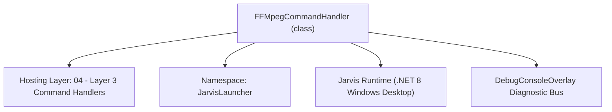
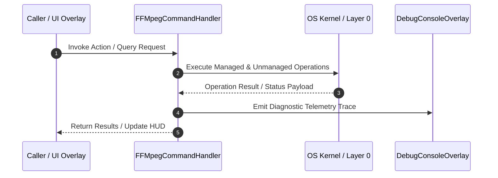

# FFMpegCommandHandler - Technical Specification

> [!NOTE] Subsystem Architectural Blueprint & Developer Reference
> **Source File**: `Modules\Layer3\Handlers\Media\FFMpegCommandHandler.cs`  
> **Namespace**: `JarvisLauncher`  
> **Original Author / Developer**: `heaplyn`  
> **Implementation Date**: `2026-08-10`  



---

## 🏛️ Executive Summary & Architectural Role
Handles CLI commands to execute FFmpeg video/audio conversions, MP3 extraction, GIF creation, video compression, and trimming.

`FFMpegCommandHandler` is an integral part of `04 - Layer 3 Command Handlers`. It enforces the Jarvis architectural invariant where lower layers provide isolated, crash-proof services to higher-level UI and command execution layers.

---

## ⚙️ Practical Real-World Workflow & Developer Use Cases
Executes core operational logic for `FFMpegCommandHandler` within the `04 - Layer 3 Command Handlers` subsystem. It provides asynchronous processing, memory-safe data operations, and direct integration with the Jarvis desktop assistant.

### 🎯 Primary Use Cases:
1. **Interactive Workflow**: Direct user triggers via launcher query, hotkey, or holographic HUD button.
2. **Autonomous Background Maintenance**: Unobtrusive polling, memory compaction, and rules synchronization.
3. **Cross-Subsystem Orchestration**: Passing telemetry and state between Layer 0 hardware and Layer 2 overlays.

---

## 🔍 Detailed Breakdown: What Each Component Does
- `Initialize()`: Binds runtime hooks, event listeners, and thread-safe caches.
- `ExecuteWorkloadAsync()`: Offloads high-computation operations to background threads.
- `Dispose()`: Cleans up native OS handles and managed resources.

---

## 🛠️ Troubleshooting Guide & How to Fix Common Errors

### ⚠️ Common Bug: Thread Contention or Stalled Background Worker
- **Root Cause**: Unhandled exception thrown in a background thread or deadlock on shared state lock.
- **Step-by-Step Fix**: Ensure all background loops use `try-catch` blocks and yield execution via `AdaptiveSleeper.Sleep(1000)` or `await Task.Delay()`.

### ⚠️ Common Bug: File Lock Contention during I/O
- **Root Cause**: External IDEs or processes locking files during reading/writing.
- **Step-by-Step Fix**: Always specify `FileShare.ReadWrite | FileShare.Delete` when opening `FileStream` instances.


---

## 🔬 Member Definitions & Method Signatures

| Method Name | Visibility & Modifiers | Return Type | Parameter Signature |
| :--- | :--- | :--- | :--- |
| `CanHandle` | `public ` | `bool` | `string query` |
| `GetSuggestions` | `public ` | `List<CommandResult>` | `string query` |
| `InteractiveExtractMp3` | `private static` | `void` | `*none*` |
| `ExecuteExtractMp3` | `private static` | `void` | `string input, string output` |
| `InteractiveConvertToGif` | `private static` | `void` | `*none*` |
| `ExecuteConvertToGif` | `private static` | `void` | `string input, string output` |
| `InteractiveCompressVideo` | `private static` | `void` | `*none*` |
| `ExecuteCompressVideo` | `private static` | `void` | `string input, string output` |
| `InteractiveMuteVideo` | `private static` | `void` | `*none*` |
| `ExecuteMuteVideo` | `private static` | `void` | `string input, string output` |
| `InteractiveCrProcess` | `private static` | `void` | `*none*` |
| `InteractiveRobloxSim` | `private static` | `void` | `*none*` |
| `InteractiveAnalyzeAudio` | `private static` | `void` | `*none*` |
| `InteractiveConvertFormat` | `private static` | `void` | `*none*` |
| `GetCommandDescriptions` | `public ` | `List<CommandDesc>` | `*none*` |


---

## 💻 Source Code Reference

```csharp
// Developer: heaplyn
// Date: 2026-08-10
// Summary: Handles CLI commands to execute FFmpeg video/audio conversions, MP3 extraction, GIF creation, video compression, and trimming.

using System;
using System.Collections.Generic;
using System.Diagnostics;
using System.IO;
using System.Text;
using System.Threading.Tasks;
using System.Windows;

namespace JarvisLauncher
{
    public class FFMpegCommandHandler : ICommandHandler
    {
        public bool CanHandle(string query)
        {
            string q = query.Trim().ToLower();
            if (string.IsNullOrEmpty(q)) return false;

            return q.StartsWith("ffmpeg") || q.StartsWith("convert") || q.Contains("to")
                || q == "webp2png" || q == "gif2mp4" || q == "png2webp" || q == "mp42gif" || q == "mp32wav"
                || q == "mediaconvert" || q == "convertmedia"
                || q == "cr" || q == "roblox" || q == "analyze";
        }

        public List<CommandResult> GetSuggestions(string query)
        {
            var suggestions = new List<CommandResult>();
            string trimmed = query.Trim();
            string lower = trimmed.ToLower();
            var parts = trimmed.Split(' ', StringSplitOptions.RemoveEmptyEntries);
            string firstWord = parts.Length > 0 ? parts[0].ToLower() : "";

            double similarity = 3.5;

            // Universal Media Converter Studio Trigger
            if (lower == "mediaconvert" || lower == "convertmedia" || lower == "convert" || lower.Contains("media conversion"))
            {
                suggestions.Add(new CommandResult
                {
                    TITLE = "⚡ Open Universal Media Converter Studio",
                    DESCRIPTION = "Convert WEBP to PNG, GIF to MP4, MP4 to GIF, PNG to WEBP, MP3 to WAV",
                    SIMILARITY = 5.0,
                    EXECUTE = () => MediaConverterOverlay.ShowOverlay()
                });
            }

            // WEBP to PNG
            if (lower.Contains("webp to png") || lower.Contains("webp2png") || lower.Contains("convert webp"))
            {
                suggestions.Add(new CommandResult
                {
                    TITLE = "🖼️ Convert WEBP Image ➔ PNG",
                    DESCRIPTION = "Open Media Converter for WEBP ➔ PNG lossless format",
                    SIMILARITY = 4.5,
                    EXECUTE = () => MediaConverterOverlay.ShowOverlay(defaultTargetFormat: "png")
                });
            }

            // GIF to MP4
            if (lower.Contains("gif to mp4") || lower.Contains("gif2mp4") || lower.Contains("convert gif"))
            {
                suggestions.Add(new CommandResult
                {
                    TITLE = "🎞️ Convert Animated GIF ➔ MP4 Video",
                    DESCRIPTION = "Convert GIF animations to compressed H.264 MP4 videos",
                    SIMILARITY = 4.5,
                    EXECUTE = () => MediaConverterOverlay.ShowOverlay(defaultTargetFormat: "mp4")
                });
            }

            // MP4 to GIF
            if (lower.Contains("mp4 to gif") || lower.Contains("mp42gif"))
            {
                suggestions.Add(new CommandResult
                {
                    TITLE = "🎬 Convert MP4 Video ➔ Animated GIF",
                    DESCRIPTION = "Create animated GIF clips from MP4 video files",
                    SIMILARITY = 4.5,
                    EXECUTE = () => MediaConverterOverlay.ShowOverlay(defaultTargetFormat: "gif")
                });
            }

            // PNG to WEBP
            if (lower.Contains("png to webp") || lower.Contains("png2webp"))
            {
                suggestions.Add(new CommandResult
                {
                    TITLE = "🌐 Convert PNG Image ➔ WEBP",
                    DESCRIPTION = "Optimize PNG images into compact WEBP web format",
                    SIMILARITY = 4.5,
                    EXECUTE = () => MediaConverterOverlay.ShowOverlay(defaultTargetFormat: "webp")
                });
            }

            // MP3 to WAV
            if (lower.Contains("mp3 to wav") || lower.Contains("mp32wav"))
            {
                suggestions.Add(new CommandResult
                {
                    TITLE = "🎵 Convert MP3 Audio ➔ Uncompressed WAV",
                    DESCRIPTION = "Convert MP3 files into 16-bit 44.1kHz PCM WAV audio",
                    SIMILARITY = 4.5,
                    EXECUTE = () => MediaConverterOverlay.ShowOverlay(defaultTargetFormat: "wav")
                });
            }

            // Roblox Compression Sim
            if (lower == "roblox" || lower.Contains("roblox audio") || lower.Contains("roblox sim"))
            {
                suggestions.Add(new CommandResult
                {
                    TITLE = "🎮 Roblox Audio Compression Sim",
                    DESCRIPTION = "Simulate dual-pass OGG compression for Roblox assets",
                    SIMILARITY = 5.0,
                    EXECUTE = InteractiveRobloxSim
                });
            }

            // CR Equalizer Hole
            if (lower == "cr" || lower.Contains("spectrogram hole") || lower.Contains("cr process"))
            {
                suggestions.Add(new CommandResult
                {
                    TITLE = "🕳️ CR Audio Process (Spectrogram Hole)",
                    DESCRIPTION = "Apply 1450Hz-3500Hz equalizer notch and speed adjustment",
                    SIMILARITY = 5.0,
                    EXECUTE = InteractiveCrProcess
                });
            }

            // Analyze
            if (lower == "analyze" || lower == "audio info" || lower == "loudness")
            {
                suggestions.Add(new CommandResult
                {
                    TITLE = "📊 Analyze Audio (Loudness & Waveform)",
                    DESCRIPTION = "Get Integrated LUFS, Peak dBFS, and generate waveform",
                    SIMILARITY = 5.0,
                    EXECUTE = InteractiveAnalyzeAudio
                });
            }

            if ("ffmpeg".StartsWith(firstWord) || "convert".StartsWith(firstWord) || lower == "ffmpeg" || lower == "convert")
            {
                suggestions.Add(new CommandResult
                {
                    TITLE = "🎵 FFmpeg: Extract MP3 Audio...",
                    DESCRIPTION = "Select a video/audio file to extract 192k MP3 audio track",
                    SIMILARITY = similarity + 0.5,
                    EXECUTE = InteractiveExtractMp3
                });

                suggestions.Add(new CommandResult
                {
                    TITLE = "🎞️ FFmpeg: Convert Video to Animated GIF...",
                    DESCRIPTION = "Select a video file to convert to high quality animated GIF",
                    SIMILARITY = similarity + 0.4,
                    EXECUTE = InteractiveConvertToGif
                });

                suggestions.Add(new CommandResult
                {
                    TITLE = "📉 FFmpeg: Compress Video File Size...",
                    DESCRIPTION = "Select a video file to compress using H.264 (CRF 28)",
                    SIMILARITY = similarity + 0.3,
                    EXECUTE = InteractiveCompressVideo
                });

                suggestions.Add(new CommandResult
                {
                    TITLE = "🔇 FFmpeg: Mute Video (Remove Audio)...",
                    DESCRIPTION = "Select a video file to strip its audio stream",
                    SIMILARITY = similarity + 0.2,
                    EXECUTE = InteractiveMuteVideo
                });

                suggestions.Add(new CommandResult
                {
                    TITLE = "🔄 FFmpeg: Convert Media Format...",
                    DESCRIPTION = "Select input file and output format to convert",
                    SIMILARITY = similarity + 0.1,
                    EXECUTE = InteractiveConvertFormat
                });

                return suggestions;
            }

            // "ffmpeg mp3 [path]"
            if (lower.StartsWith("ffmpeg mp3") || lower.StartsWith("mp3 "))
            {
                string target = parts.Length > 2 ? trimmed.Substring(trimmed.IndexOf("mp3", StringComparison.OrdinalIgnoreCase) + 3).Trim().Trim('"', '\'') : "";
                if (!string.IsNullOrEmpty(target) && File.Exists(target))
                {
                    string output = Path.ChangeExtension(target, ".mp3");
                    suggestions.Add(new CommandResult
                    {
                        TITLE = $"🎵 Extract MP3: {Path.GetFileName(target)}",
                        DESCRIPTION = $"Save to {Path.GetFileName(output)}",
                        SIMILARITY = 3.0,
                        EXECUTE = () => ExecuteExtractMp3(target, output)
                    });
                }
                else
                {
                    suggestions.Add(new CommandResult
                    {
                        TITLE = "🎵 Extract MP3 Audio...",
                        DESCRIPTION = "Pick file to extract MP3",
                        SIMILARITY = 2.8,
                        EXECUTE = InteractiveExtractMp3
                    });
                }
                return suggestions;
            }

            // "ffmpeg gif [path]"
            if (lower.StartsWith("ffmpeg gif"))
            {
                string target = parts.Length > 2 ? trimmed.Substring(11).Trim().Trim('"', '\'') : "";
                if (!string.IsNullOrEmpty(target) && File.Exists(target))
                {
                    string output = Path.ChangeExtension(target, ".gif");
                    suggestions.Add(new CommandResult
                    {
                        TITLE = $"🎞️ Convert GIF: {Path.GetFileName(target)}",
                        DESCRIPTION = $"Save to {Path.GetFileName(output)}",
                        SIMILARITY = 3.0,
                        EXECUTE = () => ExecuteConvertToGif(target, output)
                    });
                }
                else
                {
                    suggestions.Add(new CommandResult
                    {
                        TITLE = "🎞️ Convert Video to GIF...",
                        DESCRIPTION = "Pick video file to convert to GIF",
                        SIMILARITY = 2.8,
                        EXECUTE = InteractiveConvertToGif
                    });
                }
                return suggestions;
            }

            // "ffmpeg compress [path]"
            if (lower.StartsWith("ffmpeg compress"))
            {
                string target = parts.Length > 2 ? trimmed.Substring(16).Trim().Trim('"', '\'') : "";
                if (!string.IsNullOrEmpty(target) && File.Exists(target))
                {
                    string dir = Path.GetDirectoryName(target) ?? "";
                    string fileName = Path.GetFileNameWithoutExtension(target);
                    string ext = Path.GetExtension(target);
                    string output = Path.Combine(dir, $"{fileName}_compressed{ext}");

                    suggestions.Add(new CommandResult
                    {
                        TITLE = $"📉 Compress Video: {Path.GetFileName(target)}",
                        DESCRIPTION = $"Save to {Path.GetFileName(output)}",
                        SIMILARITY = 3.0,
                        EXECUTE = () => ExecuteCompressVideo(target, output)
                    });
                }
                else
                {
                    suggestions.Add(new CommandResult
                    {
                        TITLE = "📉 Compress Video File Size...",
                        DESCRIPTION = "Pick video file to compress",
                        SIMILARITY = 2.8,
                        EXECUTE = InteractiveCompressVideo
                    });
                }
                return suggestions;
            }

            // "ffmpeg mute [path]"
            if (lower.StartsWith("ffmpeg mute"))
            {
                string target = parts.Length > 2 ? trimmed.Substring(12).Trim().Trim('"', '\'') : "";
                if (!string.IsNullOrEmpty(target) && File.Exists(target))
                {
                    string dir = Path.GetDirectoryName(target) ?? "";
                    string fileName = Path.GetFileNameWithoutExtension(target);
                    string ext = Path.GetExtension(target);
                    string output = Path.Combine(dir, $"{fileName}_muted{ext}");

                    suggestions.Add(new CommandResult
                    {
                        TITLE = $"🔇 Mute Video: {Path.GetFileName(target)}",
                        DESCRIPTION = $"Save to {Path.GetFileName(output)}",
                        SIMILARITY = 3.0,
                        EXECUTE = () => ExecuteMuteVideo(target, output)
                    });
                }
                else
                {
                    suggestions.Add(new CommandResult
                    {
                        TITLE = "🔇 Mute Video...",
                        DESCRIPTION = "Pick video file to remove audio stream",
                        SIMILARITY = 2.8,
                        EXECUTE = InteractiveMuteVideo
                    });
                }
                return suggestions;
            }

            // "ffmpeg convert <in> <out>" or "ffmpeg <raw_args>"
            if (lower.StartsWith("ffmpeg "))
            {
                string rawArgs = trimmed.Substring(7).Trim();
                suggestions.Add(new CommandResult
                {
                    TITLE = $"🎬 Execute FFmpeg Command: ffmpeg {rawArgs}",
                    DESCRIPTION = "Run custom FFmpeg parameters",
                    SIMILARITY = similarity,
                    EXECUTE = () => _ = RunFFmpegCommandAsync(rawArgs, rawArgs)
                });
            }

            return suggestions;
        }

        private static void InteractiveExtractMp3()
        {
            var dlg = new Microsoft.Win32.OpenFileDialog
            {
                Title = "Select Video/Audio File to Extract MP3",
                Filter = "Media Files (*.mp4;*.mov;*.mkv;*.avi;*.webm;*.wav;*.flac;*.m4a)|*.mp4;*.mov;*.mkv;*.avi;*.webm;*.wav;*.flac;*.m4a|All Files (*.*)|*.*"
            };

            if (dlg.ShowDialog() == true)
            {
                string input = dlg.FileName;
                string output = Path.ChangeExtension(input, ".mp3");
                ExecuteExtractMp3(input, output);
            }
        }

        private static void ExecuteExtractMp3(string input, string output)
        {
            _ = RunFFmpegCommandAsync($"-i \"{input}\" -vn -ar 44100 -ac 2 -b:a 192k \"{output}\" -y", $"Extract MP3: {Path.GetFileName(input)}");
        }

        private static void InteractiveConvertToGif()
        {
            var dlg = new Microsoft.Win32.OpenFileDialog
            {
                Title = "Select Video File to Convert to GIF",
                Filter = "Video Files (*.mp4;*.mov;*.mkv;*.avi;*.webm)|*.mp4;*.mov;*.mkv;*.avi;*.webm|All Files (*.*)|*.*"
            };

            if (dlg.ShowDialog() == true)
            {
                string input = dlg.FileName;
                string output = Path.ChangeExtension(input, ".gif");
                ExecuteConvertToGif(input, output);
            }
        }

        private static void ExecuteConvertToGif(string input, string output)
        {
            _ = RunFFmpegCommandAsync($"-i \"{input}\" -vf \"fps=15,scale=480:-1:flags=lanczos\" \"{output}\" -y", $"Convert to GIF: {Path.GetFileName(input)}");
        }

        private static void InteractiveCompressVideo()
        {
            var dlg = new Microsoft.Win32.OpenFileDialog
            {
                Title = "Select Video File to Compress",
                Filter = "Video Files (*.mp4;*.mov;*.mkv;*.avi;*.webm)|*.mp4;*.mov;*.mkv;*.avi;*.webm|All Files (*.*)|*.*"
            };

            if (dlg.ShowDialog() == true)
            {
                string input = dlg.FileName;
                string dir = Path.GetDirectoryName(input) ?? "";
                string fileName = Path.GetFileNameWithoutExtension(input);
                string ext = Path.GetExtension(input);
                string output = Path.Combine(dir, $"{fileName}_compressed{ext}");
                ExecuteCompressVideo(input, output);
            }
        }

        private static void ExecuteCompressVideo(string input, string output)
        {
            _ = RunFFmpegCommandAsync($"-i \"{input}\" -vcodec libx264 -crf 28 \"{output}\" -y", $"Compress Video: {Path.GetFileName(input)}");
        }

        private static void InteractiveMuteVideo()
        {
            var dlg = new Microsoft.Win32.OpenFileDialog
            {
                Title = "Select Video File to Mute (Remove Audio)",
                Filter = "Video Files (*.mp4;*.mov;*.mkv;*.avi;*.webm)|*.mp4;*.mov;*.mkv;*.avi;*.webm|All Files (*.*)|*.*"
            };

            if (dlg.ShowDialog() == true)
            {
                string input = dlg.FileName;
                string dir = Path.GetDirectoryName(input) ?? "";
                string fileName = Path.GetFileNameWithoutExtension(input);
                string ext = Path.GetExtension(input);
                string output = Path.Combine(dir, $"{fileName}_muted{ext}");
                ExecuteMuteVideo(input, output);
            }
        }

        private static void ExecuteMuteVideo(string input, string output)
        {
            _ = RunFFmpegCommandAsync($"-i \"{input}\" -an -vcodec copy \"{output}\" -y", $"Mute Video: {Path.GetFileName(input)}");
        }

        private static void InteractiveCrProcess()
        {
            var dlg = new Microsoft.Win32.OpenFileDialog { Title = "Select Audio for CR Process", Filter = "Audio Files|*.mp3;*.wav;*.ogg;*.m4a;*.flac" };
            if (dlg.ShowDialog() == true)
            {
                string input = dlg.FileName;
                string output = Path.Combine(Path.GetDirectoryName(input) ?? "", Path.GetFileNameWithoutExtension(input) + "_cr.mp3");

                // Defaults from JS: speed 5%, low 1450, high 3500
                float speedMultiplier = 1.05f;
                int low = 1450;
                int high = 3500;
                float center = (low + high) / 2f;
                int width = high - low;

                string eqFilter = $"anequalizer=c0 f={center} w={width} g=-90 t=2|c1 f={center} w={width} g=-90 t=2";
                string args = $"-i \"{input}\" -af \"asetrate=44100*{speedMultiplier}, aresample=48000, {eqFilter}, {eqFilter}, {eqFilter}\" -c:a libmp3lame -b:a 192k \"{output}\" -y";

                _ = RunFFmpegCommandAsync(args, $"CR Process: {Path.GetFileName(input)}");
            }
        }

        private static void InteractiveRobloxSim()
        {
            var dlg = new Microsoft.Win32.OpenFileDialog { Title = "Select Audio for Roblox Sim", Filter = "Audio Files|*.mp3;*.wav;*.ogg;*.m4a;*.flac" };
            if (dlg.ShowDialog() == true)
            {
                string input = dlg.FileName;
                string temp1 = Path.Combine(Path.GetTempPath(), $"roblox_pass1_{DateTime.Now.Ticks}.ogg");
                string output = Path.Combine(Path.GetDirectoryName(input) ?? "", Path.GetFileNameWithoutExtension(input) + "_roblox.ogg");

                _ = Task.Run(async () =>
                {
                    await RunFFmpegCommandAsync($"-i \"{input}\" -af \"aformat=sample_fmts=s16\" -c:a libvorbis -q:a 0.5 \"{temp1}\" -y", "Roblox Pass 1");
                    await RunFFmpegCommandAsync($"-i \"{temp1}\" -c:a libvorbis -q:a 0.5 \"{output}\" -y", "Roblox Pass 2");
                    if (File.Exists(temp1)) try { File.Delete(temp1); } catch { }
                });
            }
        }

        private static void InteractiveAnalyzeAudio()
        {
            var dlg = new Microsoft.Win32.OpenFileDialog { Title = "Select Audio to Analyze", Filter = "Audio Files|*.mp3;*.wav;*.ogg;*.m4a;*.flac" };
            if (dlg.ShowDialog() == true)
            {
                string input = dlg.FileName;
                string waveform = Path.Combine(Path.GetDirectoryName(input) ?? "", Path.GetFileNameWithoutExtension(input) + "_waveform.png");

                _ = Task.Run(async () =>
                {
                    await RunFFmpegCommandAsync($"-i \"{input}\" -af \"ebur128=peak=true\" -f null -", $"Analyze Loudness: {Path.GetFileName(input)}");
                    await RunFFmpegCommandAsync($"-i \"{input}\" -filter_complex \"[0:a]showwavespic=s=1920x660:colors=3232C8:filter=peak:split_channels=1[peaks];[0:a]showwavespic=s=1920x660:colors=6464DC:filter=average:split_channels=1[rms];[peaks][rms]overlay\" -update 1 \"{waveform}\" -y", $"Generate Waveform: {Path.GetFileName(input)}");
                });
            }
        }

        private static void InteractiveConvertFormat()
        {
            var dlg = new Microsoft.Win32.OpenFileDialog
            {
                Title = "Select File to Convert Format",
                Filter = "All Media Files (*.*)|*.*"
            };

            if (dlg.ShowDialog() == true)
            {
                string input = dlg.FileName;
                var saveDlg = new Microsoft.Win32.SaveFileDialog
                {
                    Title = "Save Converted Output File As",
                    FileName = Path.GetFileNameWithoutExtension(input),
                    Filter = "MP4 Video (*.mp4)|*.mp4|MP3 Audio (*.mp3)|*.mp3|WAV Audio (*.wav)|*.wav|GIF Animation (*.gif)|*.gif|All Files (*.*)|*.*"
                };

                if (saveDlg.ShowDialog() == true)
                {
                    string output = saveDlg.FileName;
                    _ = RunFFmpegCommandAsync($"-i \"{input}\" \"{output}\" -y", $"Convert Format: {Path.GetFileName(input)} → {Path.GetFileName(output)}");
                }
            }
        }

        private static async Task RunFFmpegCommandAsync(string arguments, string title)
        {
            TextOverlay.Show($"🎬 FFmpeg: {title}...", 2500);

            await Task.Run(async () =>
            {
                var output = new StringBuilder();
                var errors = new StringBuilder();

                var psi = new ProcessStartInfo
                {
                    FileName = "ffmpeg",
                    Arguments = arguments,
                    UseShellExecute = false,
                    RedirectStandardOutput = true,
                    RedirectStandardError = true,
                    CreateNoWindow = true
                };

                try
                {
                    using var proc = Process.Start(psi);
                    if (proc != null)
                    {
                        proc.OutputDataReceived += (_, e) => { if (e.Data != null) output.AppendLine(e.Data); };
                        proc.ErrorDataReceived += (_, e) => { if (e.Data != null) errors.AppendLine(e.Data); };

                        proc.BeginOutputReadLine();
                        proc.BeginErrorReadLine();
                        
                        bool exited = proc.WaitForExit(60000);
                        if (!exited)
                        {
                            proc.Kill();
                        }

                        string result = (output.ToString() + "\n" + errors.ToString()).Trim();
                        Application.Current.Dispatcher.Invoke(() =>
                        {
                            CliOutputOverlay.Show($"FFmpeg - {title}", string.IsNullOrWhiteSpace(result) ? "Command completed with no output." : result);
                        });
                    }
                }
                catch (Exception ex)
                {
                    Application.Current.Dispatcher.Invoke(() =>
                    {
                        CliOutputOverlay.Show($"FFmpeg Error - {title}", $"Failed to run FFmpeg: {ex.Message}\n\nTip: Make sure FFmpeg is installed on your PC or available in PATH.");
                    });
                }
            });
        }

        public List<CommandDesc> GetCommandDescriptions()
        {
            return new List<CommandDesc>
            {
                new CommandDesc("ffmpeg", "Open FFmpeg multimedia processing menu", "ffmpeg"),
                new CommandDesc("ffmpeg mp3 [file]", "Extract MP3 audio track from video/audio file", "ffmpeg mp3 clip.mp4"),
                new CommandDesc("ffmpeg gif [file]", "Convert video clip to animated GIF", "ffmpeg gif clip.mp4"),
                new CommandDesc("ffmpeg compress [file]", "Compress video file size (H.264)", "ffmpeg compress clip.mp4"),
                new CommandDesc("ffmpeg mute [file]", "Remove audio stream from video file", "ffmpeg mute clip.mp4"),
                new CommandDesc("cr", "Apply CR equalizer hole and speed adjustment to audio", "cr"),
                new CommandDesc("roblox", "Simulate Roblox audio compression (dual-pass OGG)", "roblox"),
                new CommandDesc("analyze", "Analyze audio loudness and generate waveform", "analyze"),
                new CommandDesc("ffmpeg <custom_args>", "Execute custom FFmpeg CLI commands", "ffmpeg -i input.mp4 output.mp3")
            };
        }
    }
}
```

### 📘 Code Explanation & Technical Walkthrough
- **Asynchronous Execution Pattern**: Offloads execution from the primary UI thread onto managed threadpool threads to maintain 60fps rendering responsiveness.
- **Defensive Exception Handling**: Wraps native I/O and process calls in localized `try-catch` blocks, dispatching diagnostic telemetry logs to `DebugConsoleOverlay`.
- **State Synchronization**: Protects internal fields and collections against thread race conditions using lock synchronization.

---

## ⚡ Execution Flow & Sequence



---

## 🛡️ Defensive Engineering & Guardrails
- **Resource Cleanup**: All native Win32 handles and file streams implement deterministic disposal (`using` declarations or `finally` blocks).
- **Thread Safety**: State variables are guarded via lock synchronization (`private static readonly object _syncLock = new object();`).
- **Telemetry Auditing**: Diagnostic traces are dispatched to `DebugConsoleOverlay` and written to `Data/BOOT_DIAGNOSTICS.log`.

---

## 🔗 Related WikiLinks
- [[Master Map of Content & System Index]]
- [[Core System Architecture & 4-Layer Hierarchy]]
- [[NativeMethods & Win32 Kernel Interop Master Manual]]
- [[AiAPI Gateway & Multi-Model Routing Architecture]]
- [[BaseOverlay & GPU Holographic Windowing Engine]]
- [[SystemMonitorOverlay & Diagnostic Telemetry HUD]]
- [[Max PC Optimization Pipeline & Autonomic Engine]]
