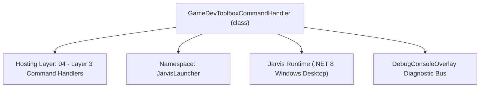
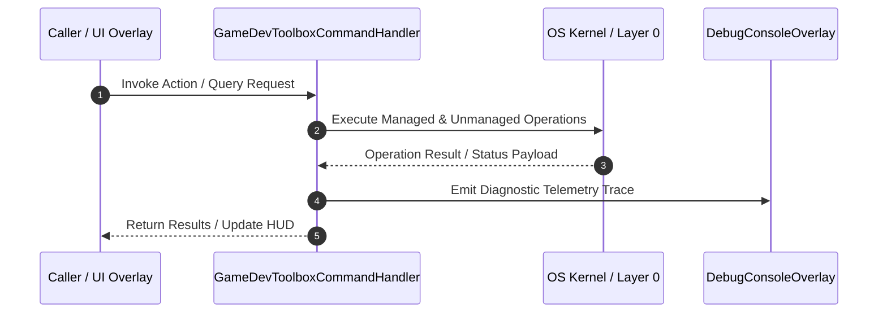

# GameDevToolboxCommandHandler - Technical Specification

> [!NOTE] Subsystem Architectural Blueprint & Developer Reference
> **Source File**: `Modules\Layer3\Handlers\Utilities\GameDevToolboxCommandHandler.cs`  
> **Namespace**: `JarvisLauncher`  
> **Original Author / Developer**: `heaplyn`  
> **Implementation Date**: `2026-08-10`  



---

## 🏛️ Executive Summary & Architectural Role
Handles CLI commands to launch the Game Dev Creator Toolbox (Roblox/Blender utilities).

`GameDevToolboxCommandHandler` is an integral part of `04 - Layer 3 Command Handlers`. It enforces the Jarvis architectural invariant where lower layers provide isolated, crash-proof services to higher-level UI and command execution layers.

---

## ⚙️ Practical Real-World Workflow & Developer Use Cases
Executes core operational logic for `GameDevToolboxCommandHandler` within the `04 - Layer 3 Command Handlers` subsystem. It provides asynchronous processing, memory-safe data operations, and direct integration with the Jarvis desktop assistant.

### 🎯 Primary Use Cases:
1. **Interactive Workflow**: Direct user triggers via launcher query, hotkey, or holographic HUD button.
2. **Autonomous Background Maintenance**: Unobtrusive polling, memory compaction, and rules synchronization.
3. **Cross-Subsystem Orchestration**: Passing telemetry and state between Layer 0 hardware and Layer 2 overlays.

---

## 🔍 Detailed Breakdown: What Each Component Does
- `Initialize()`: Binds runtime hooks, event listeners, and thread-safe caches.
- `ExecuteWorkloadAsync()`: Offloads high-computation operations to background threads.
- `Dispose()`: Cleans up native OS handles and managed resources.

---

## 🛠️ Troubleshooting Guide & How to Fix Common Errors

### ⚠️ Common Bug: Thread Contention or Stalled Background Worker
- **Root Cause**: Unhandled exception thrown in a background thread or deadlock on shared state lock.
- **Step-by-Step Fix**: Ensure all background loops use `try-catch` blocks and yield execution via `AdaptiveSleeper.Sleep(1000)` or `await Task.Delay()`.

### ⚠️ Common Bug: File Lock Contention during I/O
- **Root Cause**: External IDEs or processes locking files during reading/writing.
- **Step-by-Step Fix**: Always specify `FileShare.ReadWrite | FileShare.Delete` when opening `FileStream` instances.


---

## 🔬 Member Definitions & Method Signatures

| Method Name | Visibility & Modifiers | Return Type | Parameter Signature |
| :--- | :--- | :--- | :--- |
| `CanHandle` | `public ` | `bool` | `string query` |
| `GetSuggestions` | `public ` | `List<CommandResult>` | `string query` |
| `StartAssetMonitorAsync` | `private async` | `Task` | `string assetId` |
| `StartArtistMonitorAsync` | `private async` | `Task` | `string artist` |
| `GetCommandDescriptions` | `public ` | `List<CommandDesc>` | `*none*` |


---

## 💻 Source Code Reference

```csharp
// Developer: heaplyn
// Date: 2026-08-10
// Summary: Handles CLI commands to launch the Game Dev Creator Toolbox (Roblox/Blender utilities).

using System;
using System.Collections.Generic;
using System.Net.Http;
using System.Text.Json;
using System.Threading;
using System.Threading.Tasks;
using System.Linq;
using System.Windows;

namespace JarvisLauncher
{
    public class GameDevToolboxCommandHandler : ICommandHandler
    {
        private static readonly HttpClient _httpClient = new HttpClient();
        private static readonly Dictionary<string, CancellationTokenSource> _activeMonitors = new Dictionary<string, CancellationTokenSource>();
        private static readonly Dictionary<string, CancellationTokenSource> _activeArtistMonitors = new Dictionary<string, CancellationTokenSource>();

        public bool CanHandle(string query)
        {
            return SearchUtil.MatchesAny(query, "toolbox", "game", "roblox", "blender", "rings", "validator");
        }

        public List<CommandResult> GetSuggestions(string query)
        {
            var suggestions = new List<CommandResult>();
            string trimmed = query.Trim();
            string lower = trimmed.ToLower();
            var parts = trimmed.Split(' ', StringSplitOptions.RemoveEmptyEntries);
            double similarity = 2.0;

            if (lower == "dev" || lower == "toolbox" || lower == "game" || lower == "blender" || lower == "rings" || lower == "validator")
            {
                suggestions.Add(new CommandResult
                {
                    TITLE = "🎮 Open Game Creator Toolbox",
                    DESCRIPTION = "Roblox Rings validator, Luau anim generators, and Blender texture bakers",
                    EXECUTE = () => GameDevToolboxOverlay.OpenToolbox(),
                    SIMILARITY = similarity + 1.0
                });
            }

            // Roblox Asset Monitor
            if (lower.StartsWith("monitor"))
            {
                string assetId = parts.Length > 1 ? parts[1] : "";
                if (!string.IsNullOrEmpty(assetId))
                {
                    suggestions.Add(new CommandResult
                    {
                        TITLE = $"🔍 Monitor Roblox Asset: {assetId}",
                        DESCRIPTION = "Track moderation status in background",
                        SIMILARITY = (SearchUtil.BestSimilarity(query, "toolbox", "game", "roblox", "blender", "rings", "validator") + 5.0 * 0.01),
                        EXECUTE = () => _ = StartAssetMonitorAsync(assetId)
                    });
                }
                else
                {
                    suggestions.Add(new CommandResult
                    {
                        TITLE = "🔍 Monitor Roblox Asset...",
                        DESCRIPTION = "Type asset ID to start tracking moderation",
                        SIMILARITY = (SearchUtil.BestSimilarity(query, "toolbox", "game", "roblox", "blender", "rings", "validator") + 3.0 * 0.01),
                        EXECUTE = () => TextOverlay.Show("Usage: monitor [assetId]", 2500)
                    });
                }
            }

            // Roblox Artist Notify
            if (lower.StartsWith("notify"))
            {
                string artist = parts.Length > 1 ? string.Join(" ", parts.Skip(1)) : "";
                if (!string.IsNullOrEmpty(artist))
                {
                    suggestions.Add(new CommandResult
                    {
                        TITLE = $"🔔 Notify on Release: {artist}",
                        DESCRIPTION = $"Monitor artist {artist} for new audio uploads",
                        SIMILARITY = (SearchUtil.BestSimilarity(query, "toolbox", "game", "roblox", "blender", "rings", "validator") + 5.0 * 0.01),
                        EXECUTE = () => _ = StartArtistMonitorAsync(artist)
                    });
                }
                else
                {
                    suggestions.Add(new CommandResult
                    {
                        TITLE = "🔔 Roblox Artist Notification...",
                        DESCRIPTION = "Type artist name to monitor releases",
                        SIMILARITY = (SearchUtil.BestSimilarity(query, "toolbox", "game", "roblox", "blender", "rings", "validator") + 3.0 * 0.01),
                        EXECUTE = () => TextOverlay.Show("Usage: notify [artistName]", 2500)
                    });
                }
            }

            // General Roblox suggestion
            if (lower == "roblox")
            {
                suggestions.Add(new CommandResult
                {
                    TITLE = "🎮 Roblox Development Hub",
                    DESCRIPTION = "Access asset monitors, release notifiers, and game dev tools",
                    SIMILARITY = (SearchUtil.BestSimilarity(query, "toolbox", "game", "roblox", "blender", "rings", "validator") + 4.0 * 0.01),
                    EXECUTE = () => GameDevToolboxOverlay.OpenToolbox()
                });
            }

            return suggestions;
        }

        private async Task StartAssetMonitorAsync(string assetId)
        {
            string cookie = SettingsManager.Current.ROBLOX_COOKIE;
            if (string.IsNullOrEmpty(cookie))
            {
                TextOverlay.Show("⚠️ Roblox Cookie not set in SystemSettings.json!", 4000);
                return;
            }

            if (_activeMonitors.ContainsKey(assetId))
            {
                _activeMonitors[assetId].Cancel();
                _activeMonitors.Remove(assetId);
                TextOverlay.Show($"🛑 Stopped monitoring asset {assetId}", 2500);
                return;
            }

            var cts = new CancellationTokenSource();
            _activeMonitors[assetId] = cts;

            TextOverlay.Show($"🔍 Started monitoring Roblox asset {assetId}...", 3000);

            _ = Task.Run(async () =>
            {
                try
                {
                    var request = new HttpRequestMessage(HttpMethod.Get, $"https://apis.roblox.com/assets/user-auth/v1/assets/{assetId}");
                    request.Headers.Add("Cookie", $".ROBLOSECURITY={cookie}");

                    var response = await _httpClient.SendAsync(request);
                    if (!response.IsSuccessStatusCode)
                    {
                        Application.Current.Dispatcher.Invoke(() => TextOverlay.Show($"❌ Monitor Failed for {assetId}: {response.StatusCode}", 4000));
                        _activeMonitors.Remove(assetId);
                        return;
                    }

                    var json = await response.Content.ReadAsStringAsync();
                    using var doc = JsonDocument.Parse(json);
                    string initialState = doc.RootElement.GetProperty("moderationResult").GetProperty("moderationState").GetString() ?? "";
                    string assetName = doc.RootElement.GetProperty("displayName").GetString() ?? assetId;

                    if (initialState != "Reviewing")
                    {
                        Application.Current.Dispatcher.Invoke(() => TextOverlay.Show($"✅ Asset {assetName} is already {initialState}", 4000));
                        _activeMonitors.Remove(assetId);
                        return;
                    }

                    while (!cts.Token.IsCancellationRequested)
                    {
                        await AdaptiveSleeper.DelayAsync(10000, cts.Token); // Check every 10 seconds (adaptive)

                        var pollReq = new HttpRequestMessage(HttpMethod.Get, $"https://apis.roblox.com/assets/user-auth/v1/assets/{assetId}");
                        pollReq.Headers.Add("Cookie", $".ROBLOSECURITY={cookie}");
                        var pollRes = await _httpClient.SendAsync(pollReq);

                        if (pollRes.IsSuccessStatusCode)
                        {
                            var pollJson = await pollRes.Content.ReadAsStringAsync();
                            using var pollDoc = JsonDocument.Parse(pollJson);
                            string currentState = pollDoc.RootElement.GetProperty("moderationResult").GetProperty("moderationState").GetString() ?? "";

                            if (currentState != "Reviewing")
                            {
                                string emoji = currentState == "Approved" ? "✅" : "❌";
                                string msg = $"{emoji} Asset {assetName} ({assetId}) status updated: {currentState}";
                                Application.Current.Dispatcher.Invoke(() => {
                                    TextOverlay.Show(msg, 6000);
                                    ChatOverlay.LogConsoleAction("Roblox Monitor", msg);
                                });
                                break;
                            }
                        }
                    }
                }
                catch (Exception ex)
                {
                    Application.Current.Dispatcher.Invoke(() => TextOverlay.Show($"⚠️ Monitor error for {assetId}: {ex.Message}", 4000));
                }
                finally
                {
                    _activeMonitors.Remove(assetId);
                }
            }, cts.Token);
        }

        private async Task StartArtistMonitorAsync(string artist)
        {
            string cookie = SettingsManager.Current.ROBLOX_COOKIE;
            if (string.IsNullOrEmpty(cookie))
            {
                TextOverlay.Show("⚠️ Roblox Cookie not set in SystemSettings.json!", 4000);
                return;
            }

            if (_activeArtistMonitors.ContainsKey(artist))
            {
                _activeArtistMonitors[artist].Cancel();
                _activeArtistMonitors.Remove(artist);
                TextOverlay.Show($"🛑 Stopped monitoring artist {artist}", 2500);
                return;
            }

            var cts = new CancellationTokenSource();
            _activeArtistMonitors[artist] = cts;

            TextOverlay.Show($"🔔 Monitoring artist {artist} for new releases...", 3000);

            _ = Task.Run(async () =>
            {
                try
                {
                    string apiLink = $"https://apis.roblox.com/toolbox-service/v1/marketplace/3?artist={Uri.EscapeDataString(artist)}&limit=1&uiSortIntent=10";

                    var request = new HttpRequestMessage(HttpMethod.Get, apiLink);
                    request.Headers.Add("Cookie", $".ROBLOSECURITY={cookie}");

                    var response = await _httpClient.SendAsync(request);
                    if (!response.IsSuccessStatusCode)
                    {
                        Application.Current.Dispatcher.Invoke(() => TextOverlay.Show($"❌ Artist Monitor Failed: {response.StatusCode}", 4000));
                        _activeArtistMonitors.Remove(artist);
                        return;
                    }

                    var json = await response.Content.ReadAsStringAsync();
                    using var doc = JsonDocument.Parse(json);
                    int initialCount = doc.RootElement.GetProperty("totalResults").GetInt32();

                    while (!cts.Token.IsCancellationRequested)
                    {
                        await AdaptiveSleeper.DelayAsync(60000, cts.Token); // Check every minute (adaptive)

                        var pollReq = new HttpRequestMessage(HttpMethod.Get, apiLink);
                        pollReq.Headers.Add("Cookie", $".ROBLOSECURITY={cookie}");
                        var pollRes = await _httpClient.SendAsync(pollReq);

                        if (pollRes.IsSuccessStatusCode)
                        {
                            var pollJson = await pollRes.Content.ReadAsStringAsync();
                            using var pollDoc = JsonDocument.Parse(pollJson);
                            int currentCount = pollDoc.RootElement.GetProperty("totalResults").GetInt32();

                            if (currentCount > initialCount)
                            {
                                var latestAsset = pollDoc.RootElement.GetProperty("data")[0];
                                string assetId = latestAsset.GetProperty("id").GetInt64().ToString();
                                string msg = $"🔥 NEW RELEASE detected for {artist}! ID: {assetId}";
                                Application.Current.Dispatcher.Invoke(() => {
                                    TextOverlay.Show(msg, 10000);
                                    ChatOverlay.LogConsoleAction("Roblox Release", msg);
                                });
                                initialCount = currentCount;
                            }
                            else if (currentCount < initialCount)
                            {
                                initialCount = currentCount;
                            }
                        }
                    }
                }
                catch (Exception ex)
                {
                    Application.Current.Dispatcher.Invoke(() => TextOverlay.Show($"⚠️ Artist Monitor Error: {ex.Message}", 4000));
                }
                finally
                {
                    _activeArtistMonitors.Remove(artist);
                }
            }, cts.Token);
        }

        public List<CommandDesc> GetCommandDescriptions()
        {
            return new List<CommandDesc>
            {
                new CommandDesc("dev / roblox / blender", "Roblox & Blender game creator toolbox GUI", "dev"),
                new CommandDesc("monitor [assetId]", "Monitor a Roblox asset's moderation status in the background", "monitor 123456789"),
                new CommandDesc("notify [artistName]", "Notify when a Roblox artist uploads a new audio asset", "notify Monstercat")
            };
        }
    }
}
```

### 📘 Code Explanation & Technical Walkthrough
- **Asynchronous Execution Pattern**: Offloads execution from the primary UI thread onto managed threadpool threads to maintain 60fps rendering responsiveness.
- **Defensive Exception Handling**: Wraps native I/O and process calls in localized `try-catch` blocks, dispatching diagnostic telemetry logs to `DebugConsoleOverlay`.
- **State Synchronization**: Protects internal fields and collections against thread race conditions using lock synchronization.

---

## ⚡ Execution Flow & Sequence



---

## 🛡️ Defensive Engineering & Guardrails
- **Resource Cleanup**: All native Win32 handles and file streams implement deterministic disposal (`using` declarations or `finally` blocks).
- **Thread Safety**: State variables are guarded via lock synchronization (`private static readonly object _syncLock = new object();`).
- **Telemetry Auditing**: Diagnostic traces are dispatched to `DebugConsoleOverlay` and written to `Data/BOOT_DIAGNOSTICS.log`.

---

## 🔗 Related WikiLinks
- [[Master Map of Content & System Index]]
- [[Core System Architecture & 4-Layer Hierarchy]]
- [[NativeMethods & Win32 Kernel Interop Master Manual]]
- [[AiAPI Gateway & Multi-Model Routing Architecture]]
- [[BaseOverlay & GPU Holographic Windowing Engine]]
- [[SystemMonitorOverlay & Diagnostic Telemetry HUD]]
- [[Max PC Optimization Pipeline & Autonomic Engine]]
