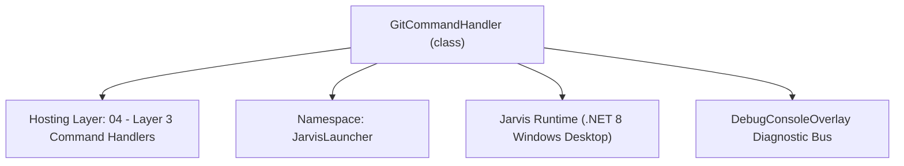
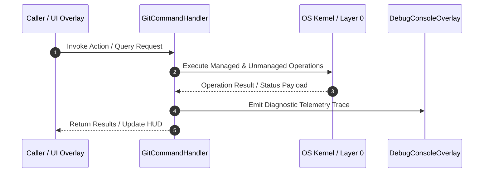

# GitCommandHandler - Technical Specification

> [!NOTE] Subsystem Architectural Blueprint & Developer Reference
> **Source File**: `Modules\Layer3\Handlers\Dev\GitCommandHandler.cs`  
> **Namespace**: `JarvisLauncher`  
> **Original Author / Developer**: `heaplyn`  
> **Implementation Date**: `2026-08-18`  



---

## 🏛️ Executive Summary & Architectural Role
Handles CLI commands to stage, commit, push, and manage GitHub repositories.
          Integrated AI commit generation and .gitignore self-healing.

`GitCommandHandler` is an integral part of `04 - Layer 3 Command Handlers`. It enforces the Jarvis architectural invariant where lower layers provide isolated, crash-proof services to higher-level UI and command execution layers.

---

## ⚙️ Practical Real-World Workflow & Developer Use Cases
Executes core operational logic for `GitCommandHandler` within the `04 - Layer 3 Command Handlers` subsystem. It provides asynchronous processing, memory-safe data operations, and direct integration with the Jarvis desktop assistant.

### 🎯 Primary Use Cases:
1. **Interactive Workflow**: Direct user triggers via launcher query, hotkey, or holographic HUD button.
2. **Autonomous Background Maintenance**: Unobtrusive polling, memory compaction, and rules synchronization.
3. **Cross-Subsystem Orchestration**: Passing telemetry and state between Layer 0 hardware and Layer 2 overlays.

---

## 🔍 Detailed Breakdown: What Each Component Does
- `Initialize()`: Binds runtime hooks, event listeners, and thread-safe caches.
- `ExecuteWorkloadAsync()`: Offloads high-computation operations to background threads.
- `Dispose()`: Cleans up native OS handles and managed resources.

---

## 🛠️ Troubleshooting Guide & How to Fix Common Errors

### ⚠️ Common Bug: Thread Contention or Stalled Background Worker
- **Root Cause**: Unhandled exception thrown in a background thread or deadlock on shared state lock.
- **Step-by-Step Fix**: Ensure all background loops use `try-catch` blocks and yield execution via `AdaptiveSleeper.Sleep(1000)` or `await Task.Delay()`.

### ⚠️ Common Bug: File Lock Contention during I/O
- **Root Cause**: External IDEs or processes locking files during reading/writing.
- **Step-by-Step Fix**: Always specify `FileShare.ReadWrite | FileShare.Delete` when opening `FileStream` instances.


---

## 🔬 Member Definitions & Method Signatures

| Method Name | Visibility & Modifiers | Return Type | Parameter Signature |
| :--- | :--- | :--- | :--- |
| `CanHandle` | `public ` | `bool` | `string Query` |
| `GetSuggestions` | `public ` | `List<CommandResult>` | `string Query` |
| `RunGitQuick` | `private static` | `void` | `string gitArgs` |
| `ExecuteAiGitPush` | `private static` | `void` | `*none*` |
| `ExecuteGitPush` | `private static` | `void` | `string msg` |
| `GetProjectRoot` | `private static` | `string` | `*none*` |
| `GetCommandDescriptions` | `public ` | `List<CommandDesc>` | `*none*` |


---

## 💻 Source Code Reference

```csharp
// Developer: heaplyn
// Date: 2026-08-18
// Summary: Handles CLI commands to stage, commit, push, and manage GitHub repositories.
//          Integrated AI commit generation and .gitignore self-healing.

using System;
using System.Collections.Generic;
using System.Diagnostics;
using System.IO;
using System.Text;
using System.Threading.Tasks;
using System.Windows;
using System.Linq;

namespace JarvisLauncher
{
    public class GitCommandHandler : ICommandHandler
    {
        public bool CanHandle(string Query)
        {
            return SearchUtil.MatchesAny(Query, "push", "git", "github", "repo");
        }

        public List<CommandResult> GetSuggestions(string Query)
        {
            var suggestions = new List<CommandResult>();
            string trimmed = Query.Trim();
            string lower = trimmed.ToLower();
            var parts = trimmed.Split(' ', 2, StringSplitOptions.RemoveEmptyEntries);

            if (lower == "github" || lower == "repo")
            {
                suggestions.Add(new CommandResult {
                    TITLE = "🚀 Open GitHub Studio",
                    DESCRIPTION = "Manage commits, branches, and AI-generated pushes visually",
                    SIMILARITY = (SearchUtil.BestSimilarity(Query, "push", "git", "github", "repo") + 10.0 * 0.01),
                    EXECUTE = () => GithubOverlay.ShowOverlay()
                });
                return suggestions;
            }

            if (lower == "git status" || lower == "git st")
                suggestions.Add(new CommandResult { TITLE = "📋 Git Status", DESCRIPTION = "Show working tree status", SIMILARITY = (SearchUtil.BestSimilarity(Query, "push", "git", "github", "repo") + 3.0 * 0.01), EXECUTE = () => RunGitQuick("status") });

            string? commitMessage = null;
            if (lower.StartsWith("push ")) commitMessage = trimmed.Substring(5).Trim().Trim('"', '\'');
            else if (lower.StartsWith("git push ")) commitMessage = trimmed.Substring(9).Trim().Trim('"', '\'');

            double similarity = SearchUtil.GetSimilarity(parts[0].ToLower(), "push");

            if (!string.IsNullOrWhiteSpace(commitMessage))
            {
                suggestions.Add(new CommandResult {
                    TITLE = $"🚀 Push: \"{commitMessage}\" → GitHub",
                    DESCRIPTION = "Stage all, commit, and push to remote",
                    SIMILARITY = similarity + 5.0,
                    EXECUTE = () => ExecuteGitPush(commitMessage)
                });
            }
            else if (lower == "push" || lower == "git push")
            {
                suggestions.Add(new CommandResult {
                    TITLE = "🚀 AI-Generated Push",
                    DESCRIPTION = "AI analyzes diff and writes a professional commit message",
                    SIMILARITY = similarity + 5.5,
                    EXECUTE = () => ExecuteAiGitPush()
                });
            }

            return suggestions;
        }

        private static void RunGitQuick(string gitArgs)
        {
            Task.Run(async () => {
                string res = await RunCommandAsync("git", gitArgs, GetProjectRoot());
                Application.Current.Dispatcher.Invoke(() => CliOutputOverlay.Show($"git {gitArgs}", res));
            });
        }

        private static void ExecuteAiGitPush()
        {
            TextOverlay.Show("🧠 AI is analyzing changes...", 3000);
            Task.Run(async () => {
                string root = GetProjectRoot();
                string diff = await RunCommandAsync("git", "diff HEAD --stat", root);
                if (string.IsNullOrWhiteSpace(diff) || diff.Contains("Error")) {
                    Application.Current.Dispatcher.Invoke(() => TextOverlay.Show("✅ No changes to push.", 3000));
                    return;
                }

                string prompt = $"Write a concise, professional 1-line git commit message for these stats:\n{diff}";
                string msg = await CoreRegistry.Intelligence.Llm.AskAsync(prompt);
                msg = AiAPI.SanitizeText(msg).Trim().Replace("\"", "");

                await RunGitPushAsync(msg);
            });
        }

        private static void ExecuteGitPush(string msg) => Task.Run(async () => await RunGitPushAsync(msg));

        private static async Task RunGitPushAsync(string message)
        {
            string root = GetProjectRoot();
            TextOverlay.Show("🚀 Pushing to GitHub...", 3000);

            // Self-healing: analyze .gitignore
            await AnalyzeAndFixGitIgnoreAsync(root);

            await RunCommandAsync("git", "add .", root);
            await RunCommandAsync("git", $"commit -m \"{message}\"", root);
            string res = await RunCommandAsync("git", "push origin HEAD", root);
            Application.Current.Dispatcher.Invoke(() => CliOutputOverlay.Show("GitHub Push", res));
        }

        private static async Task AnalyzeAndFixGitIgnoreAsync(string root)
        {
            try {
                string path = Path.Combine(root, ".gitignore");
                string content = File.Exists(path) ? File.ReadAllText(path) : "";
                string files = string.Join("\n", Directory.GetFiles(root).Select(Path.GetFileName));

                string prompt = $"### TASK\nAnalyze if this .gitignore effectively blocks build artifacts (bin, obj, exe) and sensitive files.\n\n### CURRENT:\n{content}\n\n### FILES:\n{files}\n\nOutput only the corrected .gitignore content or 'PERFECT'.";
                string res = await CoreRegistry.Intelligence.Llm.AskAsync(prompt);
                if (res != "PERFECT" && res.Length > 20) File.WriteAllText(path, res);
            } catch { }
        }

        private static string GetProjectRoot()
        {
            string devPath = Path.GetFullPath(Path.Combine(AppDomain.CurrentDomain.BaseDirectory, @"..\..\.."));
            return Directory.Exists(Path.Combine(devPath, ".git")) ? devPath : AppDomain.CurrentDomain.BaseDirectory;
        }

        private static async Task<string> RunCommandAsync(string fileName, string arguments, string workingDirectory)
        {
            var output = new StringBuilder();
            var tcs = new TaskCompletionSource<string>();
            var process = new Process {
                StartInfo = new ProcessStartInfo { FileName = fileName, Arguments = arguments, WorkingDirectory = workingDirectory, UseShellExecute = false, RedirectStandardOutput = true, RedirectStandardError = true, CreateNoWindow = true },
                EnableRaisingEvents = true
            };
            process.OutputDataReceived += (s, e) => { if (e.Data != null) output.AppendLine(e.Data); };
            process.ErrorDataReceived += (s, e) => { if (e.Data != null) output.AppendLine(e.Data); };
            process.Exited += (s, e) => { tcs.SetResult(output.ToString()); process.Dispose(); };
            try { process.Start(); process.BeginOutputReadLine(); process.BeginErrorReadLine(); } catch (Exception ex) { return ex.Message; }
            return await tcs.Task;
        }

        public List<CommandDesc> GetCommandDescriptions() => new List<CommandDesc> {
            new CommandDesc("github", "Open visual GitHub Studio", "github"),
            new CommandDesc("push <msg>", "AI or manual GitHub push", "push update")
        };
    }
}
```

### 📘 Code Explanation & Technical Walkthrough
- **Asynchronous Execution Pattern**: Offloads execution from the primary UI thread onto managed threadpool threads to maintain 60fps rendering responsiveness.
- **Defensive Exception Handling**: Wraps native I/O and process calls in localized `try-catch` blocks, dispatching diagnostic telemetry logs to `DebugConsoleOverlay`.
- **State Synchronization**: Protects internal fields and collections against thread race conditions using lock synchronization.

---

## ⚡ Execution Flow & Sequence



---

## 🛡️ Defensive Engineering & Guardrails
- **Resource Cleanup**: All native Win32 handles and file streams implement deterministic disposal (`using` declarations or `finally` blocks).
- **Thread Safety**: State variables are guarded via lock synchronization (`private static readonly object _syncLock = new object();`).
- **Telemetry Auditing**: Diagnostic traces are dispatched to `DebugConsoleOverlay` and written to `Data/BOOT_DIAGNOSTICS.log`.

---

## 🔗 Related WikiLinks
- [[Master Map of Content & System Index]]
- [[Core System Architecture & 4-Layer Hierarchy]]
- [[NativeMethods & Win32 Kernel Interop Master Manual]]
- [[AiAPI Gateway & Multi-Model Routing Architecture]]
- [[BaseOverlay & GPU Holographic Windowing Engine]]
- [[SystemMonitorOverlay & Diagnostic Telemetry HUD]]
- [[Max PC Optimization Pipeline & Autonomic Engine]]
