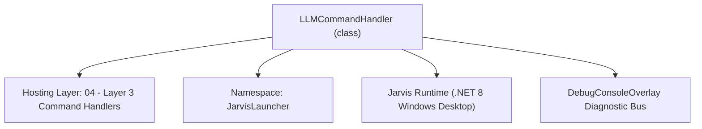
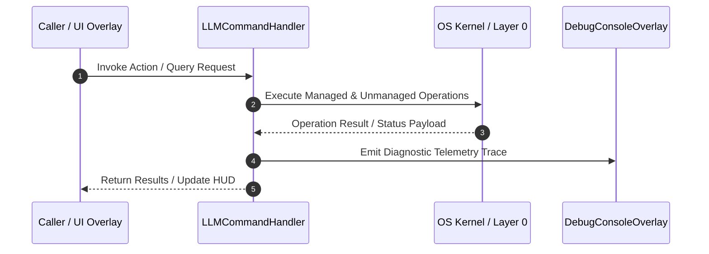

# LLMCommandHandler - Technical Specification

> [!NOTE] Subsystem Architectural Blueprint & Developer Reference
> **Source File**: `Modules\Layer3\Handlers\AI\LLMCommandHandler.cs`  
> **Namespace**: `JarvisLauncher`  
> **Original Author / Developer**: `heaplyn`  
> **Implementation Date**: `2026-08-16`  



---

## 🏛️ Executive Summary & Architectural Role
Command handler for LLM settings, Hugging Face Hub Model Grabber, local LLM installers, & model pulls.

`LLMCommandHandler` is an integral part of `04 - Layer 3 Command Handlers`. It enforces the Jarvis architectural invariant where lower layers provide isolated, crash-proof services to higher-level UI and command execution layers.

---

## ⚙️ Practical Real-World Workflow & Developer Use Cases
Executes core operational logic for `LLMCommandHandler` within the `04 - Layer 3 Command Handlers` subsystem. It provides asynchronous processing, memory-safe data operations, and direct integration with the Jarvis desktop assistant.

### 🎯 Primary Use Cases:
1. **Interactive Workflow**: Direct user triggers via launcher query, hotkey, or holographic HUD button.
2. **Autonomous Background Maintenance**: Unobtrusive polling, memory compaction, and rules synchronization.
3. **Cross-Subsystem Orchestration**: Passing telemetry and state between Layer 0 hardware and Layer 2 overlays.

---

## 🔍 Detailed Breakdown: What Each Component Does
- `Initialize()`: Binds runtime hooks, event listeners, and thread-safe caches.
- `ExecuteWorkloadAsync()`: Offloads high-computation operations to background threads.
- `Dispose()`: Cleans up native OS handles and managed resources.

---

## 🛠️ Troubleshooting Guide & How to Fix Common Errors

### ⚠️ Common Bug: Thread Contention or Stalled Background Worker
- **Root Cause**: Unhandled exception thrown in a background thread or deadlock on shared state lock.
- **Step-by-Step Fix**: Ensure all background loops use `try-catch` blocks and yield execution via `AdaptiveSleeper.Sleep(1000)` or `await Task.Delay()`.

### ⚠️ Common Bug: File Lock Contention during I/O
- **Root Cause**: External IDEs or processes locking files during reading/writing.
- **Step-by-Step Fix**: Always specify `FileShare.ReadWrite | FileShare.Delete` when opening `FileStream` instances.


---

## 🔬 Member Definitions & Method Signatures

| Method Name | Visibility & Modifiers | Return Type | Parameter Signature |
| :--- | :--- | :--- | :--- |
| `CanHandle` | `public ` | `bool` | `string query` |
| `GetSuggestions` | `public ` | `List<CommandResult>` | `string query` |
| `SetModelForBackend` | `private ` | `void` | `string backend, string model` |
| `SetKeyForBackend` | `private ` | `void` | `string backend, string key` |
| `RunServerDiscovery` | `private ` | `void` | `*none*` |
| `TestApiKeysPool` | `private ` | `void` | `*none*` |
| `GetCommandDescriptions` | `public ` | `List<CommandDesc>` | `*none*` |
| `OnStart` | `public ` | `void` | `*none*` |


---

## 💻 Source Code Reference

```csharp
// Developer: heaplyn
// Date: 2026-08-16
// Summary: Command handler for LLM settings, Hugging Face Hub Model Grabber, local LLM installers, & model pulls.

using System;
using System.Collections.Generic;
using System.Diagnostics;
using System.Linq;
using System.Text;
using System.Threading.Tasks;

namespace JarvisLauncher
{
    public class LLMCommandHandler : ICommandHandler
    {
        public bool CanHandle(string query)
        {
            query = query.Trim().ToLower();
            return query == "llm" || query == "ai" || query == "openai" || query == "gemini" ||
                   query == "ollama" || query == "lmstudio" || query == "deepseek" || query == "llama" ||
                   query == "huggingface" || query == "hf" || query == "grabmodel" || query == "downloadhf" ||
                   query == "installllm" || query == "installollama" || query == "installlmstudio" ||
                   query.StartsWith("install ") || query.StartsWith("pull ") ||
                   query.StartsWith("llm ") || query == "test keys" || query == "check keys" ||
                   query.Contains("discover ai") || query.Contains("ai discover");
        }

        public List<CommandResult> GetSuggestions(string query)
        {
            var suggestions = new List<CommandResult>();
            string trimmed = query.Trim();
            string lower = trimmed.ToLower();
            var parts = trimmed.Split(' ', StringSplitOptions.RemoveEmptyEntries);

            if (lower.Contains("discover ai") || lower.Contains("ai discover") || lower == "llm discover")
            {
                suggestions.Add(new CommandResult
                {
                    TITLE = "🔍 Discover Local AI Servers",
                    DESCRIPTION = "Scan ports for Ollama, LM Studio, & more + check trending models",
                    SIMILARITY = 9.5,
                    EXECUTE = () => RunServerDiscovery()
                });
            }

            if (lower == "test keys" || lower == "check keys")
            {
                suggestions.Add(new CommandResult
                {
                    TITLE = "🔑 Test Gemini API Keys Pool",
                    DESCRIPTION = "Verify status (Active/Blocked/Quota) for all configured keys",
                    SIMILARITY = 9.0,
                    EXECUTE = () => TestApiKeysPool()
                });
                return suggestions;
            }

            if (lower == "huggingface" || lower == "hf" || lower == "grabmodel" || lower == "downloadhf")
            {
                suggestions.Add(new CommandResult
                {
                    TITLE = "🤗 Open Hugging Face Model Hub & Internet Grabber",
                    DESCRIPTION = "Live search models on Hugging Face, 1-click grab GGUF models, & auto-install CLI",
                    SIMILARITY = 6.0,
                    EXECUTE = () => HuggingFaceOverlay.ShowOverlay()
                });
                return suggestions;
            }

            // --- CLI Configuration Options ---
            if (parts.Length >= 3 && parts[0].Equals("llm", StringComparison.OrdinalIgnoreCase))
            {
                string sub = parts[1].ToLower();
                string val = string.Join(" ", parts.Skip(2));

                if (sub == "backend" || sub == "engine")
                {
                    suggestions.Add(new CommandResult
                    {
                        TITLE = $"LLM: Switch Backend to '{val}'",
                        DESCRIPTION = $"Update active engine to: {val}",
                        SIMILARITY = 7.0,
                        EXECUTE = () => { CoreRegistry.Data.Settings.Current.LLM_BACKEND = val; CoreRegistry.Data.Settings.Save(); TextOverlay.Show($"✅ Backend set to: {val}", 2500); }
                    });
                }
                else if (sub == "model")
                {
                    if (parts.Length >= 4)
                    {
                        string targetBackend = parts[2].ToLower();
                        string modelName = string.Join(" ", parts.Skip(3));
                        suggestions.Add(new CommandResult
                        {
                            TITLE = $"LLM: Set {targetBackend} Model",
                            DESCRIPTION = $"Update {targetBackend} model to: {modelName}",
                            SIMILARITY = 7.0,
                            EXECUTE = () => { SetModelForBackend(targetBackend, modelName); }
                        });
                    }
                }
                else if (sub == "key")
                {
                    if (parts.Length >= 4)
                    {
                        string targetBackend = parts[2].ToLower();
                        string keyVal = string.Join(" ", parts.Skip(3));
                        suggestions.Add(new CommandResult
                        {
                            TITLE = $"LLM: Set {targetBackend} Key",
                            DESCRIPTION = $"Update {targetBackend} API key",
                            SIMILARITY = 7.0,
                            EXECUTE = () => { SetKeyForBackend(targetBackend, keyVal); }
                        });
                    }
                }
            }

            if (lower == "installollama" || lower == "ollama")
            {
                suggestions.Add(new CommandResult
                {
                    TITLE = "📥 Install Ollama Local LLM Engine",
                    DESCRIPTION = "Downloads and installs Ollama via Winget / web installer",
                    SIMILARITY = 6.0,
                    EXECUTE = () => Process.Start("cmd.exe", "/c start cmd /k \"winget install Ollama.Ollama || start https://ollama.com/download\"")
                });
            }

            if (lower == "deepseek" || lower == "pulldeepseek" || lower == "pull deepseek")
            {
                suggestions.Add(new CommandResult
                {
                    TITLE = "🧠 Pull DeepSeek R1 Local Model (Ollama)",
                    DESCRIPTION = "Downloads DeepSeek R1 reasoning model locally (ollama pull deepseek-r1:7b)",
                    SIMILARITY = 6.0,
                    EXECUTE = () => Process.Start("cmd.exe", "/c start cmd /k \"ollama pull deepseek-r1:7b\"")
                });
            }

            if (lower == "llama" || lower == "pullllama" || lower == "pull llama")
            {
                suggestions.Add(new CommandResult
                {
                    TITLE = "🦙 Pull Llama 3.2 Local Model (Ollama)",
                    DESCRIPTION = "Downloads Meta Llama 3.2 locally (ollama pull llama3.2)",
                    SIMILARITY = 6.0,
                    EXECUTE = () => Process.Start("cmd.exe", "/c start cmd /k \"ollama pull llama3.2\"")
                });
            }

            if (lower.Contains("hermes") || lower == "pull hermes")
            {
                suggestions.Add(new CommandResult
                {
                    TITLE = "🌿 Pull Hermes 3 Local Model (Ollama)",
                    DESCRIPTION = "Downloads Nous Hermes 3 (OpenHermes) locally",
                    SIMILARITY = 8.5,
                    EXECUTE = () => Process.Start("cmd.exe", "/c start cmd /k \"ollama pull hermes3\"")
                });
            }

            if (lower.Contains("deepseek") || lower == "pull r1")
            {
                suggestions.Add(new CommandResult
                {
                    TITLE = "🧠 Pull DeepSeek R1 (Ollama)",
                    DESCRIPTION = "Downloads DeepSeek R1 reasoning model (ollama pull deepseek-r1)",
                    SIMILARITY = 8.5,
                    EXECUTE = () => Process.Start("cmd.exe", "/c start cmd /k \"ollama pull deepseek-r1\"")
                });
            }

            if (lower.Contains("look deep") || lower.Contains("reason deep") || lower == "deep research")
            {
                suggestions.Add(new CommandResult
                {
                    TITLE = "🧠 Deep Reasoning Mode",
                    DESCRIPTION = "Force Jarvis to use extensive step-by-step logic for this session",
                    SIMILARITY = 9.0,
                    EXECUTE = () => { ChatOverlay.SubmitTextMessage("look deep " + (parts.Length > 2 ? string.Join(" ", parts.Skip(2)) : "")); }
                });
            }

            suggestions.Add(new CommandResult
            {
                TITLE = "🤖 Open LLM Engine & Installer Studio",
                DESCRIPTION = "Configure Gemini, OpenAI, Ollama, Anthropic, OpenRouter, & local nodes",
                SIMILARITY = 5.5,
                EXECUTE = () => LlmSettingsOverlay.ShowOverlay()
            });

            return suggestions;
        }

        private void SetModelForBackend(string backend, string model)
        {
            try
            {
                var s = CoreRegistry.Data.Settings.Current;
                switch (backend.ToLower())
                {
                    case "gemini": s.GEMINI_MODEL = LlmRouter.NormalizeGeminiModel(model); break;
                    case "openai": s.OPENAI_MODEL = model; break;
                    case "anthropic": s.ANTHROPIC_MODEL = model; break;
                    case "groq": s.GROQ_MODEL = model; break;
                    case "perplexity": s.PERPLEXITY_MODEL = model; break;
                    case "mistral": s.MISTRAL_MODEL = model; break;
                    case "openrouter": s.OPENROUTER_MODEL = model; break;
                    case "deepseek": s.DEEPSEEK_MODEL = model; s.CUSTOM_LLM_MODEL = model; break;
                    case "xai" or "x-ai" or "grok": s.XAI_MODEL = model; break;
                    case "ollama": s.OLLAMA_MODEL = model; break;
                    case "custom": s.CUSTOM_LLM_MODEL = model; break;
                }
                CoreRegistry.Data.Settings.Save();
                TextOverlay.Show($"✅ Updated {backend} model to: {model}", 2500);
            }
            catch (Exception ex) { TextOverlay.Show($"❌ Error: {ex.Message}", 3000); }
        }

        private void SetKeyForBackend(string backend, string key)
        {
            try
            {
                var s = CoreRegistry.Data.Settings.Current;
                switch (backend.ToLower())
                {
                    case "gemini": s.GOOGLE_AI_KEY = key; break;
                    case "openai": s.OPENAI_KEY = key; break;
                    case "anthropic": s.ANTHROPIC_KEY = key; break;
                    case "groq": s.GROQ_KEY = key; break;
                    case "perplexity": s.PERPLEXITY_KEY = key; break;
                    case "mistral": s.MISTRAL_KEY = key; break;
                    case "openrouter": s.OPENROUTER_KEY = key; break;
                    case "deepseek": s.DEEPSEEK_KEY = key; s.CUSTOM_LLM_KEY = key; break;
                    case "xai" or "x-ai" or "grok": s.XAI_KEY = key; s.CUSTOM_LLM_KEY = key; break;
                    case "custom": s.CUSTOM_LLM_KEY = key; break;
                }
                CoreRegistry.Data.Settings.Save();
                TextOverlay.Show($"✅ Updated {backend} API key.", 2500);
            }
            catch (Exception ex) { TextOverlay.Show($"❌ Error: {ex.Message}", 3000); }
        }

        private void RunServerDiscovery()
        {
            Task.Run(async () => {
                TextOverlay.Show("🔍 Scanning for AI servers...", 3000);
                string res = await CoreRegistry.Intelligence.Llm.DiscoverAiServersAsync();
                System.Windows.Application.Current.Dispatcher.Invoke(() => {
                    ContentPreviewOverlay.Show("AI Server Discovery", res, "markdown");
                });
            });
        }

        private void TestApiKeysPool()
        {
            Task.Run(async () =>
            {
                string rawKeys = CoreRegistry.Data.Settings.Current.GOOGLE_AI_KEY;
                if (string.IsNullOrWhiteSpace(rawKeys))
                {
                    System.Windows.Application.Current.Dispatcher.Invoke(() => TextOverlay.Show("⚠️ No Gemini keys configured.", 3000));
                    return;
                }

                var keys = rawKeys.Split(';', StringSplitOptions.RemoveEmptyEntries).Select(k => k.Trim()).ToList();
                var sb = new StringBuilder();
                sb.AppendLine("# Gemini API Key Pool Status");
                sb.AppendLine($"Found {keys.Count} configured keys.\n");

                foreach (var k in keys)
                {
                    string masked = k.Length > 8 ? k.Substring(0, 4) + "..." + k.Substring(k.Length - 4) : "****";
                    sb.AppendLine($"### Key: `{masked}`");

                    string res = await AiAPI.AskGemini("Reply with: ACTIVE", null);

                    if (res.Contains("ACTIVE")) sb.AppendLine("- **Status**: ✅ ACTIVE");
                    else if (res.Contains("DISABLED") || res.Contains("BLOCKED")) sb.AppendLine("- **Status**: ❌ DISABLED");
                    else if (res.Contains("429") || res.Contains("Quota")) sb.AppendLine("- **Status**: ⚠️ QUOTA EXCEEDED");
                    else sb.AppendLine($"- **Status**: ❓ UNKNOWN\n- **Error**: {res}");
                    sb.AppendLine();
                }

                System.Windows.Application.Current.Dispatcher.Invoke(() => {
                    ContentPreviewOverlay.Show("API Key Audit", sb.ToString(), "markdown");
                });
            });
        }

        public List<CommandDesc> GetCommandDescriptions()
        {
            return new List<CommandDesc>
            {
                new CommandDesc("llm", "Open LLM Engine Studio", "llm"),
                new CommandDesc("test keys", "Test all Gemini API keys in pool", "test keys"),
                new CommandDesc("llm backend <name>", "Switch active LLM engine", "llm backend Groq"),
                new CommandDesc("llm model <backend> <model>", "Set model for a specific backend", "llm model openai gpt-4o"),
                new CommandDesc("llm key <backend> <key>", "Set API key for a backend", "llm key groq gsk_..."),
                new CommandDesc("huggingface", "Search and download HF models", "hf"),
                new CommandDesc("llm discover", "Scan for local AI servers", "llm discover"),
                new CommandDesc("pull hermes", "Download Hermes 3 model", "pull hermes")
            };
        }

        public void OnStart() { }
    }
}
```

### 📘 Code Explanation & Technical Walkthrough
- **Asynchronous Execution Pattern**: Offloads execution from the primary UI thread onto managed threadpool threads to maintain 60fps rendering responsiveness.
- **Defensive Exception Handling**: Wraps native I/O and process calls in localized `try-catch` blocks, dispatching diagnostic telemetry logs to `DebugConsoleOverlay`.
- **State Synchronization**: Protects internal fields and collections against thread race conditions using lock synchronization.

---

## ⚡ Execution Flow & Sequence



---

## 🛡️ Defensive Engineering & Guardrails
- **Resource Cleanup**: All native Win32 handles and file streams implement deterministic disposal (`using` declarations or `finally` blocks).
- **Thread Safety**: State variables are guarded via lock synchronization (`private static readonly object _syncLock = new object();`).
- **Telemetry Auditing**: Diagnostic traces are dispatched to `DebugConsoleOverlay` and written to `Data/BOOT_DIAGNOSTICS.log`.

---

## 🔗 Related WikiLinks
- [[Master Map of Content & System Index]]
- [[Core System Architecture & 4-Layer Hierarchy]]
- [[NativeMethods & Win32 Kernel Interop Master Manual]]
- [[AiAPI Gateway & Multi-Model Routing Architecture]]
- [[BaseOverlay & GPU Holographic Windowing Engine]]
- [[SystemMonitorOverlay & Diagnostic Telemetry HUD]]
- [[Max PC Optimization Pipeline & Autonomic Engine]]
