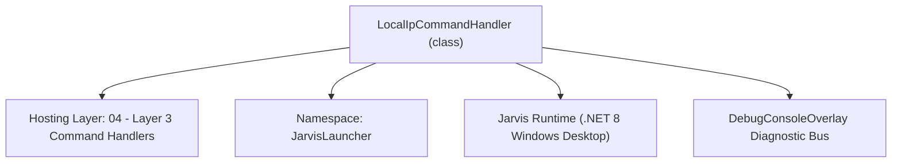
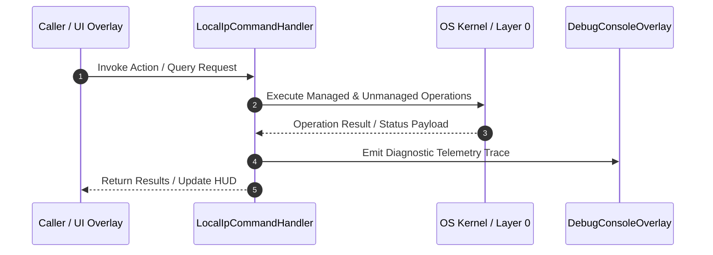

# LocalIpCommandHandler - Technical Specification

> [!NOTE] Subsystem Architectural Blueprint & Developer Reference
> **Source File**: `Modules\Layer3\Handlers\Utilities\LocalIpCommandHandler.cs`  
> **Namespace**: `JarvisLauncher`  
> **Original Author / Developer**: `heaplyn`  
> **Implementation Date**: `2026-08-09`  



---

## 🏛️ Executive Summary & Architectural Role
Detects active network interfaces and displays local IPv4 addresses. Copy-pastes to clipboard on click.

`LocalIpCommandHandler` is an integral part of `04 - Layer 3 Command Handlers`. It enforces the Jarvis architectural invariant where lower layers provide isolated, crash-proof services to higher-level UI and command execution layers.

---

## ⚙️ Practical Real-World Workflow & Developer Use Cases
Executes core operational logic for `LocalIpCommandHandler` within the `04 - Layer 3 Command Handlers` subsystem. It provides asynchronous processing, memory-safe data operations, and direct integration with the Jarvis desktop assistant.

### 🎯 Primary Use Cases:
1. **Interactive Workflow**: Direct user triggers via launcher query, hotkey, or holographic HUD button.
2. **Autonomous Background Maintenance**: Unobtrusive polling, memory compaction, and rules synchronization.
3. **Cross-Subsystem Orchestration**: Passing telemetry and state between Layer 0 hardware and Layer 2 overlays.

---

## 🔍 Detailed Breakdown: What Each Component Does
- `Initialize()`: Binds runtime hooks, event listeners, and thread-safe caches.
- `ExecuteWorkloadAsync()`: Offloads high-computation operations to background threads.
- `Dispose()`: Cleans up native OS handles and managed resources.

---

## 🛠️ Troubleshooting Guide & How to Fix Common Errors

### ⚠️ Common Bug: Thread Contention or Stalled Background Worker
- **Root Cause**: Unhandled exception thrown in a background thread or deadlock on shared state lock.
- **Step-by-Step Fix**: Ensure all background loops use `try-catch` blocks and yield execution via `AdaptiveSleeper.Sleep(1000)` or `await Task.Delay()`.

### ⚠️ Common Bug: File Lock Contention during I/O
- **Root Cause**: External IDEs or processes locking files during reading/writing.
- **Step-by-Step Fix**: Always specify `FileShare.ReadWrite | FileShare.Delete` when opening `FileStream` instances.


---

## 🔬 Member Definitions & Method Signatures

| Method Name | Visibility & Modifiers | Return Type | Parameter Signature |
| :--- | :--- | :--- | :--- |
| `CanHandle` | `public ` | `bool` | `string query` |
| `GetSuggestions` | `public ` | `List<CommandResult>` | `string query` |
| `CopyToClipboard` | `private static` | `void` | `string text` |


---

## 💻 Source Code Reference

```csharp
// Developer: heaplyn
// Date: 2026-08-09
// Summary: Detects active network interfaces and displays local IPv4 addresses. Copy-pastes to clipboard on click.

using System;
using System.Collections.Generic;
using System.Net.NetworkInformation;
using System.Net.Sockets;

namespace JarvisLauncher
{
    public class LocalIpCommandHandler : ICommandHandler
    {
        public bool CanHandle(string query)
        {
            query = query.Trim().ToLower();
            return SearchUtil.IsClose(query, "ip") || query == "net" || query == "network" || query == "wifi";
        }

        public List<CommandResult> GetSuggestions(string query)
        {
            var suggestions = new List<CommandResult>();
            query = query.Trim().ToLower();
            double similarity = SearchUtil.GetSimilarity(query, "ip");

            var ipList = GetActiveIpv4Addresses();

            if (ipList.Count > 0)
            {
                foreach (var item in ipList)
                {
                    string ipAddress = item.Item2;
                    suggestions.Add(new CommandResult
                    {
                        TITLE = $"{item.Item1}: {ipAddress}",
                        DESCRIPTION = "Click to copy IP address to clipboard",
                        EXECUTE = () => CopyToClipboard(ipAddress),
                        SIMILARITY = similarity
                    });
                }
            }
            else
            {
                suggestions.Add(new CommandResult
                {
                    TITLE = "IP: Disconnected",
                    DESCRIPTION = "No active IPv4 interfaces found",
                    EXECUTE = null,
                    SIMILARITY = similarity
                });
            }

            return suggestions;
        }

        private static List<Tuple<string, string>> GetActiveIpv4Addresses()
        {
            var list = new List<Tuple<string, string>>();
            try
            {
                foreach (NetworkInterface ni in NetworkInterface.GetAllNetworkInterfaces())
                {
                    if (ni.OperationalStatus == OperationalStatus.Up && 
                        ni.NetworkInterfaceType != NetworkInterfaceType.Loopback)
                    {
                        foreach (UnicastIPAddressInformation ip in ni.GetIPProperties().UnicastAddresses)
                        {
                            if (ip.Address.AddressFamily == AddressFamily.InterNetwork)
                            {
                                list.Add(new Tuple<string, string>(ni.Name, ip.Address.ToString()));
                            }
                        }
                    }
                }
            }
            catch
            {
                // Fail-safe
            }
            return list;
        }

        private static void CopyToClipboard(string text)
        {
            try
            {
                System.Windows.Clipboard.SetText(text);
                TextOverlay.Show($"📋 Copied IP Address to clipboard:\n{text}", 2000);
            }
            catch
            {
                // Fail-safe
            }
        }
    }
}
```

### 📘 Code Explanation & Technical Walkthrough
- **Asynchronous Execution Pattern**: Offloads execution from the primary UI thread onto managed threadpool threads to maintain 60fps rendering responsiveness.
- **Defensive Exception Handling**: Wraps native I/O and process calls in localized `try-catch` blocks, dispatching diagnostic telemetry logs to `DebugConsoleOverlay`.
- **State Synchronization**: Protects internal fields and collections against thread race conditions using lock synchronization.

---

## ⚡ Execution Flow & Sequence



---

## 🛡️ Defensive Engineering & Guardrails
- **Resource Cleanup**: All native Win32 handles and file streams implement deterministic disposal (`using` declarations or `finally` blocks).
- **Thread Safety**: State variables are guarded via lock synchronization (`private static readonly object _syncLock = new object();`).
- **Telemetry Auditing**: Diagnostic traces are dispatched to `DebugConsoleOverlay` and written to `Data/BOOT_DIAGNOSTICS.log`.

---

## 🔗 Related WikiLinks
- [[Master Map of Content & System Index]]
- [[Core System Architecture & 4-Layer Hierarchy]]
- [[NativeMethods & Win32 Kernel Interop Master Manual]]
- [[AiAPI Gateway & Multi-Model Routing Architecture]]
- [[BaseOverlay & GPU Holographic Windowing Engine]]
- [[SystemMonitorOverlay & Diagnostic Telemetry HUD]]
- [[Max PC Optimization Pipeline & Autonomic Engine]]
