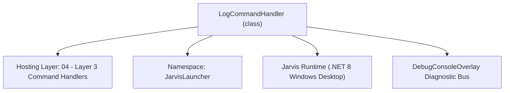
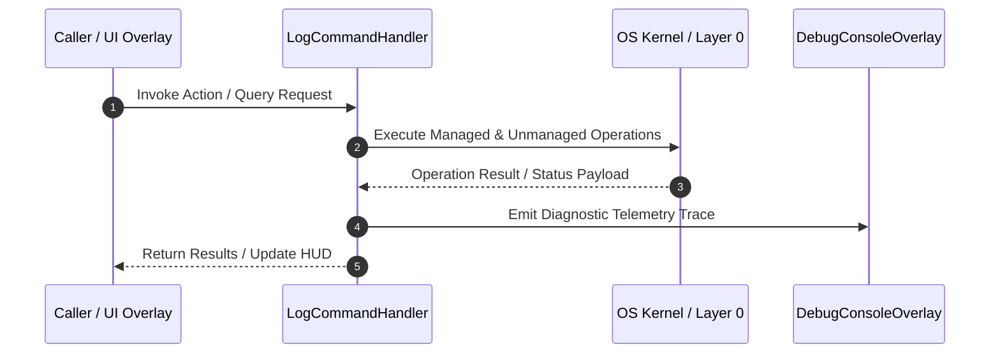

# LogCommandHandler - Technical Specification

> [!NOTE] Subsystem Architectural Blueprint & Developer Reference
> **Source File**: `Modules\Layer3\Handlers\Utilities\LogCommandHandler.cs`  
> **Namespace**: `JarvisLauncher`  
> **Original Author / Developer**: `heaplyn`  
> **Implementation Date**: `2026-08-09`  



---

## 🏛️ Executive Summary & Architectural Role
Handles 'log' and 'logs' queries by allowing viewing, opening in notepad, or clearing the persistent execution logs.

`LogCommandHandler` is an integral part of `04 - Layer 3 Command Handlers`. It enforces the Jarvis architectural invariant where lower layers provide isolated, crash-proof services to higher-level UI and command execution layers.

---

## ⚙️ Practical Real-World Workflow & Developer Use Cases
Executes core operational logic for `LogCommandHandler` within the `04 - Layer 3 Command Handlers` subsystem. It provides asynchronous processing, memory-safe data operations, and direct integration with the Jarvis desktop assistant.

### 🎯 Primary Use Cases:
1. **Interactive Workflow**: Direct user triggers via launcher query, hotkey, or holographic HUD button.
2. **Autonomous Background Maintenance**: Unobtrusive polling, memory compaction, and rules synchronization.
3. **Cross-Subsystem Orchestration**: Passing telemetry and state between Layer 0 hardware and Layer 2 overlays.

---

## 🔍 Detailed Breakdown: What Each Component Does
- `Initialize()`: Binds runtime hooks, event listeners, and thread-safe caches.
- `ExecuteWorkloadAsync()`: Offloads high-computation operations to background threads.
- `Dispose()`: Cleans up native OS handles and managed resources.

---

## 🛠️ Troubleshooting Guide & How to Fix Common Errors

### ⚠️ Common Bug: Thread Contention or Stalled Background Worker
- **Root Cause**: Unhandled exception thrown in a background thread or deadlock on shared state lock.
- **Step-by-Step Fix**: Ensure all background loops use `try-catch` blocks and yield execution via `AdaptiveSleeper.Sleep(1000)` or `await Task.Delay()`.

### ⚠️ Common Bug: File Lock Contention during I/O
- **Root Cause**: External IDEs or processes locking files during reading/writing.
- **Step-by-Step Fix**: Always specify `FileShare.ReadWrite | FileShare.Delete` when opening `FileStream` instances.


---

## 🔬 Member Definitions & Method Signatures

| Method Name | Visibility & Modifiers | Return Type | Parameter Signature |
| :--- | :--- | :--- | :--- |
| `CanHandle` | `public ` | `bool` | `string query` |
| `GetSuggestions` | `public ` | `List<CommandResult>` | `string query` |
| `GetLogPath` | `private static` | `string` | `*none*` |
| `ShowLogsInTerminal` | `private static` | `void` | `string logPath` |
| `OpenLogInNotepad` | `private static` | `void` | `string logPath` |
| `ClearLogs` | `private static` | `void` | `string logPath` |


---

## 💻 Source Code Reference

```csharp
// Developer: heaplyn
// Date: 2026-08-09
// Summary: Handles 'log' and 'logs' queries by allowing viewing, opening in notepad, or clearing the persistent execution logs.

using System;
using System.Collections.Generic;
using System.Diagnostics;
using System.IO;
using System.Windows;

namespace JarvisLauncher
{
    public class LogCommandHandler : ICommandHandler
    {
        public bool CanHandle(string query)
        {
            query = query.Trim().ToLower();
            return query == "log" || query == "logs" || query.StartsWith("log ") || query.StartsWith("logs ");
        }

        public List<CommandResult> GetSuggestions(string query)
        {
            var suggestions = new List<CommandResult>();
            query = query.Trim().ToLower();

            double similarity = SearchUtil.GetSimilarity(query, "logs");
            string logPath = GetLogPath();

            // Suggestion 1: View logs in Jarvis Terminal
            suggestions.Add(new CommandResult
            {
                TITLE       = "View System Logs",
                DESCRIPTION = "Read Jarvis execution history inside the System Terminal",
                SIMILARITY  = similarity + 0.1,
                EXECUTE     = () => ShowLogsInTerminal(logPath)
            });

            // Suggestion 2: Open log file in Notepad
            suggestions.Add(new CommandResult
            {
                TITLE       = "Open Logs in Notepad",
                DESCRIPTION = "Open the raw Jarvis.log file in your system text editor",
                SIMILARITY  = similarity,
                EXECUTE     = () => OpenLogInNotepad(logPath)
            });

            // Suggestion 3: Clear logs
            suggestions.Add(new CommandResult
            {
                TITLE       = "Clear System Logs",
                DESCRIPTION = "Permanently empty the Jarvis.log file on disk",
                SIMILARITY  = similarity - 0.2,
                EXECUTE     = () => ClearLogs(logPath)
            });

            return suggestions;
        }

        private static string GetLogPath()
        {
            string dataDir = Path.Combine(AppDomain.CurrentDomain.BaseDirectory, "Data");
            if (!Directory.Exists(dataDir))
            {
                string devPath = Path.GetFullPath(Path.Combine(AppDomain.CurrentDomain.BaseDirectory, @"..\..\..\Data"));
                if (Directory.Exists(devPath))
                {
                    dataDir = devPath;
                }
            }
            return Path.Combine(dataDir, "Jarvis.log");
        }

        private static void ShowLogsInTerminal(string logPath)
        {
            try
            {
                string logs = File.Exists(logPath) ? File.ReadAllText(logPath) : "[No Logs Found]";
                CliOutputOverlay.Show("System History Logs", logs);
            }
            catch (Exception ex)
            {
                MessageBox.Show($"Failed to read logs:\n{ex.Message}", "Jarvis Log Error", MessageBoxButton.OK, MessageBoxImage.Error);
            }
        }

        private static void OpenLogInNotepad(string logPath)
        {
            try
            {
                if (!File.Exists(logPath))
                {
                    // Create empty log file if missing
                    File.WriteAllText(logPath, "=== JARVIS INITIALIZED LOGS ===\n");
                }

                Process.Start(new ProcessStartInfo
                {
                    FileName        = "notepad.exe",
                    Arguments       = $"\"{logPath}\"",
                    UseShellExecute = true
                });
            }
            catch (Exception ex)
            {
                MessageBox.Show($"Failed to open log file:\n{ex.Message}", "Jarvis Log Error", MessageBoxButton.OK, MessageBoxImage.Error);
            }
        }

        private static void ClearLogs(string logPath)
        {
            try
            {
                if (File.Exists(logPath))
                {
                    File.Delete(logPath);
                }
                TextOverlay.Show("🧹 System logs cleared successfully!", 2500);
            }
            catch (Exception ex)
            {
                MessageBox.Show($"Failed to clear logs:\n{ex.Message}", "Jarvis Log Error", MessageBoxButton.OK, MessageBoxImage.Error);
            }
        }
    }
}
```

### 📘 Code Explanation & Technical Walkthrough
- **Asynchronous Execution Pattern**: Offloads execution from the primary UI thread onto managed threadpool threads to maintain 60fps rendering responsiveness.
- **Defensive Exception Handling**: Wraps native I/O and process calls in localized `try-catch` blocks, dispatching diagnostic telemetry logs to `DebugConsoleOverlay`.
- **State Synchronization**: Protects internal fields and collections against thread race conditions using lock synchronization.

---

## ⚡ Execution Flow & Sequence



---

## 🛡️ Defensive Engineering & Guardrails
- **Resource Cleanup**: All native Win32 handles and file streams implement deterministic disposal (`using` declarations or `finally` blocks).
- **Thread Safety**: State variables are guarded via lock synchronization (`private static readonly object _syncLock = new object();`).
- **Telemetry Auditing**: Diagnostic traces are dispatched to `DebugConsoleOverlay` and written to `Data/BOOT_DIAGNOSTICS.log`.

---

## 🔗 Related WikiLinks
- [[Master Map of Content & System Index]]
- [[Core System Architecture & 4-Layer Hierarchy]]
- [[NativeMethods & Win32 Kernel Interop Master Manual]]
- [[AiAPI Gateway & Multi-Model Routing Architecture]]
- [[BaseOverlay & GPU Holographic Windowing Engine]]
- [[SystemMonitorOverlay & Diagnostic Telemetry HUD]]
- [[Max PC Optimization Pipeline & Autonomic Engine]]
