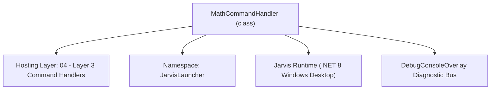
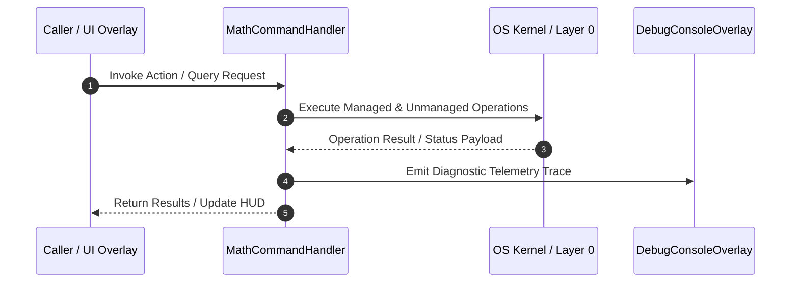

# MathCommandHandler - Technical Specification

> [!NOTE] Subsystem Architectural Blueprint & Developer Reference
> **Source File**: `Modules\Layer3\Handlers\Utilities\MathCommandHandler.cs`  
> **Namespace**: `JarvisLauncher`  
> **Original Author / Developer**: `heaplyn`  
> **Implementation Date**: `2026-08-08`  



---

## 🏛️ Executive Summary & Architectural Role
Parses and calculates mathematical string queries using the modular MathEngine.

`MathCommandHandler` is an integral part of `04 - Layer 3 Command Handlers`. It enforces the Jarvis architectural invariant where lower layers provide isolated, crash-proof services to higher-level UI and command execution layers.

---

## ⚙️ Practical Real-World Workflow & Developer Use Cases
Executes core operational logic for `MathCommandHandler` within the `04 - Layer 3 Command Handlers` subsystem. It provides asynchronous processing, memory-safe data operations, and direct integration with the Jarvis desktop assistant.

### 🎯 Primary Use Cases:
1. **Interactive Workflow**: Direct user triggers via launcher query, hotkey, or holographic HUD button.
2. **Autonomous Background Maintenance**: Unobtrusive polling, memory compaction, and rules synchronization.
3. **Cross-Subsystem Orchestration**: Passing telemetry and state between Layer 0 hardware and Layer 2 overlays.

---

## 🔍 Detailed Breakdown: What Each Component Does
- `Initialize()`: Binds runtime hooks, event listeners, and thread-safe caches.
- `ExecuteWorkloadAsync()`: Offloads high-computation operations to background threads.
- `Dispose()`: Cleans up native OS handles and managed resources.

---

## 🛠️ Troubleshooting Guide & How to Fix Common Errors

### ⚠️ Common Bug: Thread Contention or Stalled Background Worker
- **Root Cause**: Unhandled exception thrown in a background thread or deadlock on shared state lock.
- **Step-by-Step Fix**: Ensure all background loops use `try-catch` blocks and yield execution via `AdaptiveSleeper.Sleep(1000)` or `await Task.Delay()`.

### ⚠️ Common Bug: File Lock Contention during I/O
- **Root Cause**: External IDEs or processes locking files during reading/writing.
- **Step-by-Step Fix**: Always specify `FileShare.ReadWrite | FileShare.Delete` when opening `FileStream` instances.


---

## 🔬 Member Definitions & Method Signatures

| Method Name | Visibility & Modifiers | Return Type | Parameter Signature |
| :--- | :--- | :--- | :--- |
| `LooksLikeMath` | `internal static` | `bool` | `string q` |
| `CanHandle` | `public ` | `bool` | `string query` |
| `StripPrefix` | `private static` | `string` | `string q` |
| `GetSuggestions` | `public ` | `List<CommandResult>` | `string query` |
| `IsNumericResult` | `private static` | `bool` | `string s` |
| `GetCommandDescriptions` | `public ` | `List<CommandDesc>` | `*none*` |
| `OnStart` | `public ` | `void` | `*none*` |


---

## 💻 Source Code Reference

```csharp
// Developer: heaplyn
// Date: 2026-08-08
// Summary: Parses and calculates mathematical string queries using the modular MathEngine.

using System;
using System.Collections.Generic;
using System.Data;
using System.Linq;
using System.Text.RegularExpressions;

namespace JarvisLauncher
{
    public class MathCommandHandler : ICommandHandler
    {
        private static readonly string[] MathFuncs =
            { "sin", "cos", "tan", "asin", "acos", "atan", "sqrt", "abs", "ln", "log", "exp", "floor", "ceil" };

        /// <summary>An expression "looks like math" if it calls a known function, or has a digit plus
        /// an arithmetic operator / parentheses. Bare numbers and prose are ignored so we don't spam
        /// the results list.</summary>
        internal static bool LooksLikeMath(string q)
        {
            if (string.IsNullOrWhiteSpace(q)) return false;
            q = q.ToLower();
            bool hasFunc  = MathFuncs.Any(f => q.Contains(f + "("));
            bool hasDigit = q.Any(char.IsDigit);
            bool hasOp    = q.IndexOfAny(new[] { '+', '*', '/', '^' }) >= 0
                            || Regex.IsMatch(q, @"\d\s*-\s*[\d\.\(]");   // subtraction between numbers (not a stray dash)
            bool hasParen = q.Contains('(') && q.Contains(')');
            return hasFunc || (hasDigit && (hasOp || hasParen));
        }

        public bool CanHandle(string query)
        {
            string q = query.Trim().ToLower();
            if (q == "calc" || q == "calculus" || q.StartsWith("calc ")
                || q.Contains("integrate") || q.Contains("derivative") || q.StartsWith("diff ")) return true;
            return LooksLikeMath(StripPrefix(q));
        }

        // Allow natural lead-ins: "calc 2+2", "= 2+2", "solve 2+2", "what is 2+2".
        private static string StripPrefix(string q)
        {
            q = q.Trim();
            foreach (var p in new[] { "calc ", "calculate ", "= ", "solve ", "what is ", "whats ", "eval " })
                if (q.StartsWith(p, StringComparison.OrdinalIgnoreCase)) { q = q.Substring(p.Length).Trim(); break; }
            return q.TrimEnd('=', '?').Trim();
        }

        public List<CommandResult> GetSuggestions(string query)
        {
            var suggestions = new List<CommandResult>();
            string clean = query.Trim().ToLower();

            // 1. Explicit Calculus Studio launcher
            if (clean == "calc" || clean == "calculus")
            {
                suggestions.Add(new CommandResult {
                    TITLE = "📐 Open Calculus Studio",
                    DESCRIPTION = "Launch the advanced symbolic math and calculus solver",
                    EXECUTE = () => CalculusStudioOverlay.ShowStudio(),
                    SIMILARITY = 10.0
                });
                return suggestions;
            }

            // 2. Calculus / symbolic queries -> Studio
            if (clean.Contains("integrate") || clean.Contains("derivative") || clean.Contains("limit of"))
            {
                suggestions.Add(new CommandResult {
                    TITLE = "🧠 Solve in Calculus Studio",
                    DESCRIPTION = $"Solve '{query}' with the symbolic engine",
                    EXECUTE = () => CalculusStudioOverlay.ShowStudio(),
                    SIMILARITY = 9.5
                });
            }

            // 3. Arithmetic / functions / constants -> inline answer
            try
            {
                string expr = StripPrefix(clean);
                string result = CoreRegistry.Intelligence.Math.Evaluate(expr);

                // Only surface a genuine numeric answer; engine "error"/symbolic strings are skipped.
                if (IsNumericResult(result))
                {
                    suggestions.Add(new CommandResult
                    {
                        TITLE = $"🟰 {expr} = {result}",
                        DESCRIPTION = "Click to copy the result",
                        EXECUTE = () => { try { System.Windows.Clipboard.SetText(result); TextOverlay.Show($"📋 Copied {result}", 1500); } catch { } },
                        SIMILARITY = 9.0
                    });
                }
                else if (clean.StartsWith("diff "))
                {
                    // Symbolic derivative result (e.g. "diff 3x^2" -> "6x")
                    suggestions.Add(new CommandResult
                    {
                        TITLE = $"d/dx = {result}",
                        DESCRIPTION = "Offline power-rule derivative (click to copy)",
                        EXECUTE = () => { try { System.Windows.Clipboard.SetText(result); } catch { } },
                        SIMILARITY = 8.5
                    });
                }
            }
            catch { }

            return suggestions;
        }

        private static bool IsNumericResult(string s)
            => !string.IsNullOrWhiteSpace(s)
               && double.TryParse(s, System.Globalization.NumberStyles.Any, System.Globalization.CultureInfo.InvariantCulture, out _);

        public List<CommandDesc> GetCommandDescriptions()
        {
            return new List<CommandDesc>
            {
                new CommandDesc("calc", "Launch Calculus Studio", "calc"),
                new CommandDesc("5 + 5 * 2", "Quick math result", "10 + 10"),
                new CommandDesc("diff 3x^2", "Offline derivative", "diff x^3")
            };
        }

        public void OnStart() { }
    }
}
```

### 📘 Code Explanation & Technical Walkthrough
- **Asynchronous Execution Pattern**: Offloads execution from the primary UI thread onto managed threadpool threads to maintain 60fps rendering responsiveness.
- **Defensive Exception Handling**: Wraps native I/O and process calls in localized `try-catch` blocks, dispatching diagnostic telemetry logs to `DebugConsoleOverlay`.
- **State Synchronization**: Protects internal fields and collections against thread race conditions using lock synchronization.

---

## ⚡ Execution Flow & Sequence



---

## 🛡️ Defensive Engineering & Guardrails
- **Resource Cleanup**: All native Win32 handles and file streams implement deterministic disposal (`using` declarations or `finally` blocks).
- **Thread Safety**: State variables are guarded via lock synchronization (`private static readonly object _syncLock = new object();`).
- **Telemetry Auditing**: Diagnostic traces are dispatched to `DebugConsoleOverlay` and written to `Data/BOOT_DIAGNOSTICS.log`.

---

## 🔗 Related WikiLinks
- [[Master Map of Content & System Index]]
- [[Core System Architecture & 4-Layer Hierarchy]]
- [[NativeMethods & Win32 Kernel Interop Master Manual]]
- [[AiAPI Gateway & Multi-Model Routing Architecture]]
- [[BaseOverlay & GPU Holographic Windowing Engine]]
- [[SystemMonitorOverlay & Diagnostic Telemetry HUD]]
- [[Max PC Optimization Pipeline & Autonomic Engine]]
