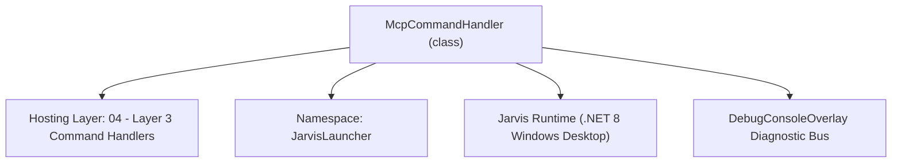
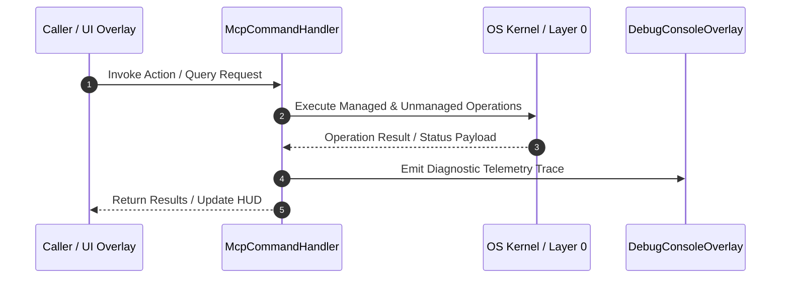

# McpCommandHandler - Technical Specification

> [!NOTE] Subsystem Architectural Blueprint & Developer Reference
> **Source File**: `Modules\Layer3\Handlers\Utilities\McpCommandHandler.cs`  
> **Namespace**: `JarvisLauncher`  
> **Original Author / Developer**: `heaplyn`  
> **Implementation Date**: `2026-08-13`  



---

## 🏛️ Executive Summary & Architectural Role
Command Handler for Model Context Protocol (MCP) Registry Studio and MCP tools enumeration.

`McpCommandHandler` is an integral part of `04 - Layer 3 Command Handlers`. It enforces the Jarvis architectural invariant where lower layers provide isolated, crash-proof services to higher-level UI and command execution layers.

---

## ⚙️ Practical Real-World Workflow & Developer Use Cases
Executes core operational logic for `McpCommandHandler` within the `04 - Layer 3 Command Handlers` subsystem. It provides asynchronous processing, memory-safe data operations, and direct integration with the Jarvis desktop assistant.

### 🎯 Primary Use Cases:
1. **Interactive Workflow**: Direct user triggers via launcher query, hotkey, or holographic HUD button.
2. **Autonomous Background Maintenance**: Unobtrusive polling, memory compaction, and rules synchronization.
3. **Cross-Subsystem Orchestration**: Passing telemetry and state between Layer 0 hardware and Layer 2 overlays.

---

## 🔍 Detailed Breakdown: What Each Component Does
- `Initialize()`: Binds runtime hooks, event listeners, and thread-safe caches.
- `ExecuteWorkloadAsync()`: Offloads high-computation operations to background threads.
- `Dispose()`: Cleans up native OS handles and managed resources.

---

## 🛠️ Troubleshooting Guide & How to Fix Common Errors

### ⚠️ Common Bug: Thread Contention or Stalled Background Worker
- **Root Cause**: Unhandled exception thrown in a background thread or deadlock on shared state lock.
- **Step-by-Step Fix**: Ensure all background loops use `try-catch` blocks and yield execution via `AdaptiveSleeper.Sleep(1000)` or `await Task.Delay()`.

### ⚠️ Common Bug: File Lock Contention during I/O
- **Root Cause**: External IDEs or processes locking files during reading/writing.
- **Step-by-Step Fix**: Always specify `FileShare.ReadWrite | FileShare.Delete` when opening `FileStream` instances.


---

## 🔬 Member Definitions & Method Signatures

| Method Name | Visibility & Modifiers | Return Type | Parameter Signature |
| :--- | :--- | :--- | :--- |
| `CanHandle` | `public ` | `bool` | `string query` |
| `GetSuggestions` | `public ` | `List<CommandResult>` | `string query` |


---

## 💻 Source Code Reference

```csharp
// Developer: heaplyn
// Date: 2026-08-13
// Summary: Command Handler for Model Context Protocol (MCP) Registry Studio and MCP tools enumeration.

using System;
using System.Collections.Generic;
using System.Linq;

namespace JarvisLauncher
{
    public class McpCommandHandler : ICommandHandler
    {
        public bool CanHandle(string query)
        {
            return SearchUtil.MatchesAny(query, "mcp", "mcpstudio", "mcpgui", "mcpservers", "mcp tools", "mcp list");
        }

        public List<CommandResult> GetSuggestions(string query)
        {
            var suggestions = new List<CommandResult>();
            string lower = query.Trim().ToLower();

            suggestions.Add(new CommandResult
            {
                TITLE = "⚡ Open MCP Registry & Server Manager Studio",
                DESCRIPTION = "Manage Model Context Protocol servers (Roblox, Filesystem, Brave Search, Memory, GitHub)",
                SIMILARITY = (SearchUtil.BestSimilarity(query, "mcp", "mcpstudio", "mcpgui", "mcpservers", "mcp tools", "mcp list") + 6.0 * 0.01),
                EXECUTE = () => McpStudioOverlay.ShowOverlay()
            });

            if (lower.Contains("roblox") || lower == "mcp add roblox")
            {
                suggestions.Add(new CommandResult
                {
                    TITLE = "🎮 Register Roblox Studio MCP Server",
                    DESCRIPTION = "claude mcp add --transport stdio Roblox_Studio -- cmd.exe /c cd /d %LOCALAPPDATA%\\Roblox && .\\mcp.bat",
                    SIMILARITY = (SearchUtil.BestSimilarity(query, "mcp", "mcpstudio", "mcpgui", "mcpservers", "mcp tools", "mcp list") + 5.5 * 0.01),
                    EXECUTE = () =>
                    {
                        McpManager.AddServer(new McpServerConfig
                        {
                            Name = "Roblox_Studio",
                            Transport = "STDIO",
                            Command = "cmd.exe",
                            Args = new List<string> { "/c", "cd /d %LOCALAPPDATA%\\Roblox && .\\mcp.bat" }
                        });
                        TextOverlay.Show("🎮 Registered Roblox Studio MCP Server!", 3000);
                    }
                });
            }

            if (lower.Contains("filesystem") || lower.Contains("files"))
            {
                suggestions.Add(new CommandResult
                {
                    TITLE = "📁 Register Filesystem MCP Server",
                    DESCRIPTION = "npx -y @modelcontextprotocol/server-filesystem %USERPROFILE%",
                    SIMILARITY = (SearchUtil.BestSimilarity(query, "mcp", "mcpstudio", "mcpgui", "mcpservers", "mcp tools", "mcp list") + 5.5 * 0.01),
                    EXECUTE = () =>
                    {
                        McpManager.AddServer(new McpServerConfig
                        {
                            Name = "Filesystem",
                            Transport = "STDIO",
                            Command = "npx",
                            Args = new List<string> { "-y", "@modelcontextprotocol/server-filesystem", Environment.GetFolderPath(Environment.SpecialFolder.UserProfile) }
                        });
                        TextOverlay.Show("📁 Registered Filesystem MCP Server!", 3000);
                    }
                });
            }

            // List connected MCP servers
            McpManager.LoadConfig();
            foreach (var s in McpManager.Servers)
            {
                suggestions.Add(new CommandResult
                {
                    TITLE = $"⚡ Test Connection: MCP Server [{s.Name}]",
                    DESCRIPTION = $"{s.Command} {string.Join(" ", s.Args)}",
                    SIMILARITY = (SearchUtil.BestSimilarity(query, "mcp", "mcpstudio", "mcpgui", "mcpservers", "mcp tools", "mcp list") + 4.0 * 0.01),
                    EXECUTE = async () =>
                    {
                        bool ok = await McpManager.TestServerConnectionAsync(s);
                        TextOverlay.Show(ok ? $"🟢 MCP Server '{s.Name}' Active!" : $"🔴 MCP Server '{s.Name}' Error!", 3000);
                    }
                });
            }

            return suggestions;
        }
    }
}
```

### 📘 Code Explanation & Technical Walkthrough
- **MCP Transport Registration**: Configures the `Roblox_Studio` MCP server over `stdio` transport using `cmd.exe` to navigate to `%LOCALAPPDATA%\Roblox` and launch `mcp.bat`.
- **Plugin Bridge**: Establishes communication between external AI agents and the Roblox Studio DataModel for asset management and playtesting.

---

## ⚡ Execution Flow & Sequence



---

## 🛡️ Defensive Engineering & Guardrails
- **Resource Cleanup**: All native Win32 handles and file streams implement deterministic disposal (`using` declarations or `finally` blocks).
- **Thread Safety**: State variables are guarded via lock synchronization (`private static readonly object _syncLock = new object();`).
- **Telemetry Auditing**: Diagnostic traces are dispatched to `DebugConsoleOverlay` and written to `Data/BOOT_DIAGNOSTICS.log`.

---

## 🔗 Related WikiLinks
- [[Master Map of Content & System Index]]
- [[Core System Architecture & 4-Layer Hierarchy]]
- [[NativeMethods & Win32 Kernel Interop Master Manual]]
- [[AiAPI Gateway & Multi-Model Routing Architecture]]
- [[BaseOverlay & GPU Holographic Windowing Engine]]
- [[SystemMonitorOverlay & Diagnostic Telemetry HUD]]
- [[Max PC Optimization Pipeline & Autonomic Engine]]
