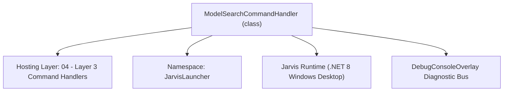
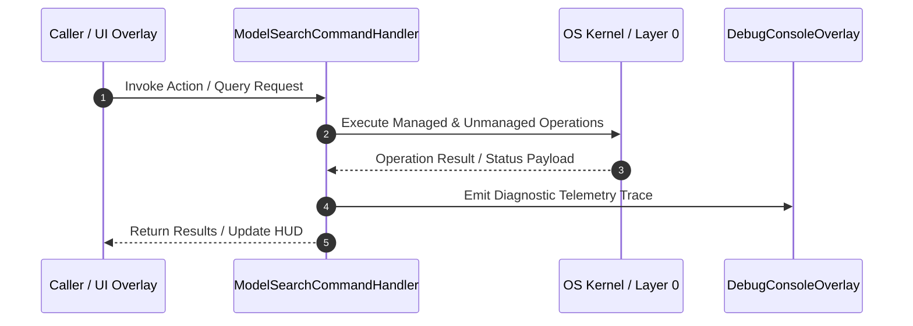

# ModelSearchCommandHandler - Technical Specification

> [!NOTE] Subsystem Architectural Blueprint & Developer Reference
> **Source File**: `Modules\Layer3\Handlers\AI\ModelSearchCommandHandler.cs`  
> **Namespace**: `JarvisLauncher`  
> **Original Author / Developer**: `heaplyn`  
> **Implementation Date**: `2026-09-01`  



---

## 🏛️ Executive Summary & Architectural Role
HUD command to search AI models (OpenRouter gateway + local Ollama/LM Studio) and
          one-click auto-configure the router to use one. Search runs async in the background
          and results stream into the palette as selectable rows (the palette itself is sync).

`ModelSearchCommandHandler` is an integral part of `04 - Layer 3 Command Handlers`. It enforces the Jarvis architectural invariant where lower layers provide isolated, crash-proof services to higher-level UI and command execution layers.

---

## ⚙️ Practical Real-World Workflow & Developer Use Cases
Executes core operational logic for `ModelSearchCommandHandler` within the `04 - Layer 3 Command Handlers` subsystem. It provides asynchronous processing, memory-safe data operations, and direct integration with the Jarvis desktop assistant.

### 🎯 Primary Use Cases:
1. **Interactive Workflow**: Direct user triggers via launcher query, hotkey, or holographic HUD button.
2. **Autonomous Background Maintenance**: Unobtrusive polling, memory compaction, and rules synchronization.
3. **Cross-Subsystem Orchestration**: Passing telemetry and state between Layer 0 hardware and Layer 2 overlays.

---

## 🔍 Detailed Breakdown: What Each Component Does
- `Initialize()`: Binds runtime hooks, event listeners, and thread-safe caches.
- `ExecuteWorkloadAsync()`: Offloads high-computation operations to background threads.
- `Dispose()`: Cleans up native OS handles and managed resources.

---

## 🛠️ Troubleshooting Guide & How to Fix Common Errors

### ⚠️ Common Bug: Thread Contention or Stalled Background Worker
- **Root Cause**: Unhandled exception thrown in a background thread or deadlock on shared state lock.
- **Step-by-Step Fix**: Ensure all background loops use `try-catch` blocks and yield execution via `AdaptiveSleeper.Sleep(1000)` or `await Task.Delay()`.

### ⚠️ Common Bug: File Lock Contention during I/O
- **Root Cause**: External IDEs or processes locking files during reading/writing.
- **Step-by-Step Fix**: Always specify `FileShare.ReadWrite | FileShare.Delete` when opening `FileStream` instances.


---

## 🔬 Member Definitions & Method Signatures

| Method Name | Visibility & Modifiers | Return Type | Parameter Signature |
| :--- | :--- | :--- | :--- |
| `CanHandle` | `public ` | `bool` | `string query` |
| `GetCommandDescriptions` | `public ` | `List<CommandDesc>` | `*none*` |
| `GetSuggestions` | `public ` | `List<CommandResult>` | `string query` |


---

## 💻 Source Code Reference

```csharp
// Developer: heaplyn
// Date: 2026-09-01
// Summary: HUD command to search AI models (OpenRouter gateway + local Ollama/LM Studio) and
//          one-click auto-configure the router to use one. Search runs async in the background
//          and results stream into the palette as selectable rows (the palette itself is sync).

using System;
using System.Collections.Generic;
using System.Linq;
using System.Threading.Tasks;

namespace JarvisLauncher
{
    public class ModelSearchCommandHandler : ICommandHandler
    {
        private static volatile List<ModelInfo> _cache = new();
        private static string _lastQuery = "\0";
        private static bool _searching;

        public bool CanHandle(string query)
        {
            return SearchUtil.MatchesAny(query, "model", "findmodel", "detect ai", "detect local");
        }

        public List<CommandDesc> GetCommandDescriptions() => new()
        {
            new CommandDesc { COMMAND_NAME = "model <name>", COMMAND_DESCRIPTION = "Search AI models (cloud + local) and switch to one", COMMAND_EXAMPLE = "model claude" },
            new CommandDesc { COMMAND_NAME = "detect local ai", COMMAND_DESCRIPTION = "Auto-detect running Ollama / LM Studio engines", COMMAND_EXAMPLE = "detect local ai" },
        };

        public List<CommandResult> GetSuggestions(string query)
        {
            var suggestions = new List<CommandResult>();
            string raw = query.Trim();
            string q = raw.ToLower();

            if (q.StartsWith("detect ai") || q.StartsWith("detect local"))
            {
                suggestions.Add(new CommandResult
                {
                    TITLE = "🔎 Detect local AI engines",
                    DESCRIPTION = "Probe for Ollama / LM Studio and report what's available",
                    SIMILARITY = (SearchUtil.BestSimilarity(query, "model", "findmodel", "detect ai", "detect local") + 9.5 * 0.01),
                    EXECUTE = () => _ = DetectAsync()
                });
                return suggestions;
            }

            // "model <query>"
            string term = raw.Length > 5 ? raw.Substring(5).Trim() : "";

            // Kick off (or refresh) the async search when the term changes.
            if (term != _lastQuery && !_searching)
            {
                _lastQuery = term;
                _ = RefreshAsync(term);
            }

            if (_searching && _cache.Count == 0)
            {
                suggestions.Add(new CommandResult
                {
                    TITLE = "⏳ Searching models…",
                    DESCRIPTION = $"Looking for '{term}' across OpenRouter + local engines",
                    SIMILARITY = (SearchUtil.BestSimilarity(query, "model", "findmodel", "detect ai", "detect local") + 10.0 * 0.01),
                    EXECUTE = () => { }
                });
                return suggestions;
            }

            if (_cache.Count == 0)
            {
                suggestions.Add(new CommandResult
                {
                    TITLE = "Type a model name to search",
                    DESCRIPTION = "e.g. 'model claude', 'model llama', 'model gpt-4', 'model qwen'",
                    SIMILARITY = (SearchUtil.BestSimilarity(query, "model", "findmodel", "detect ai", "detect local") + 8.0 * 0.01),
                    EXECUTE = () => { }
                });
                return suggestions;
            }

            double sim = 9.8;
            foreach (var m in _cache.Take(12))
            {
                var model = m; // capture
                string icon = model.IsLocal ? "🖥️" : "☁️";
                suggestions.Add(new CommandResult
                {
                    TITLE = $"{icon} {model.Id}",
                    DESCRIPTION = $"[{model.Provider}] {model.Detail} — click to switch Jarvis to this model",
                    SIMILARITY = sim,
                    EXECUTE = () =>
                    {
                        string status = ModelDiscoveryService.ApplyModel(model);
                        try { TextOverlay.Show(status, 4000); } catch { }
                        try { DebugConsoleOverlay.Log("Model", status); } catch { }
                    }
                });
                sim -= 0.1;
            }
            return suggestions;
        }

        private static async Task RefreshAsync(string term)
        {
            _searching = true;
            try { _cache = await ModelDiscoveryService.SearchAsync(term); }
            catch { _cache = new List<ModelInfo>(); }
            finally { _searching = false; }
        }

        private static async Task DetectAsync()
        {
            try
            {
                string status = await ModelDiscoveryService.AutoDetectLocalProvidersAsync();
                TextOverlay.Show(status, 5000);
                DebugConsoleOverlay.Log("Model", status);
            }
            catch { }
        }
    }
}
```

### 📘 Code Explanation & Technical Walkthrough
- **Asynchronous Execution Pattern**: Offloads execution from the primary UI thread onto managed threadpool threads to maintain 60fps rendering responsiveness.
- **Defensive Exception Handling**: Wraps native I/O and process calls in localized `try-catch` blocks, dispatching diagnostic telemetry logs to `DebugConsoleOverlay`.
- **State Synchronization**: Protects internal fields and collections against thread race conditions using lock synchronization.

---

## ⚡ Execution Flow & Sequence



---

## 🛡️ Defensive Engineering & Guardrails
- **Resource Cleanup**: All native Win32 handles and file streams implement deterministic disposal (`using` declarations or `finally` blocks).
- **Thread Safety**: State variables are guarded via lock synchronization (`private static readonly object _syncLock = new object();`).
- **Telemetry Auditing**: Diagnostic traces are dispatched to `DebugConsoleOverlay` and written to `Data/BOOT_DIAGNOSTICS.log`.

---

## 🔗 Related WikiLinks
- [[Master Map of Content & System Index]]
- [[Core System Architecture & 4-Layer Hierarchy]]
- [[NativeMethods & Win32 Kernel Interop Master Manual]]
- [[AiAPI Gateway & Multi-Model Routing Architecture]]
- [[BaseOverlay & GPU Holographic Windowing Engine]]
- [[SystemMonitorOverlay & Diagnostic Telemetry HUD]]
- [[Max PC Optimization Pipeline & Autonomic Engine]]
