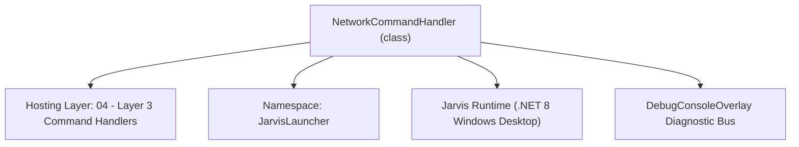
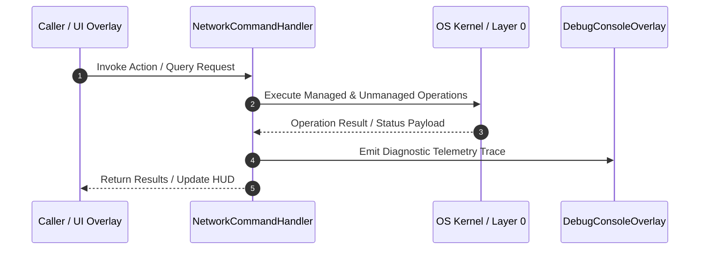

# NetworkCommandHandler - Technical Specification

> [!NOTE] Subsystem Architectural Blueprint & Developer Reference
> **Source File**: `Modules\Layer3\Handlers\Utilities\NetworkCommandHandler.cs`  
> **Namespace**: `JarvisLauncher`  
> **Original Author / Developer**: `heaplyn`  
> **Implementation Date**: `2026-08-17`  



---

## 🏛️ Executive Summary & Architectural Role
Handles CLI commands for network diagnostics, IP discovery, and connection monitoring.

`NetworkCommandHandler` is an integral part of `04 - Layer 3 Command Handlers`. It enforces the Jarvis architectural invariant where lower layers provide isolated, crash-proof services to higher-level UI and command execution layers.

---

## ⚙️ Practical Real-World Workflow & Developer Use Cases
Executes core operational logic for `NetworkCommandHandler` within the `04 - Layer 3 Command Handlers` subsystem. It provides asynchronous processing, memory-safe data operations, and direct integration with the Jarvis desktop assistant.

### 🎯 Primary Use Cases:
1. **Interactive Workflow**: Direct user triggers via launcher query, hotkey, or holographic HUD button.
2. **Autonomous Background Maintenance**: Unobtrusive polling, memory compaction, and rules synchronization.
3. **Cross-Subsystem Orchestration**: Passing telemetry and state between Layer 0 hardware and Layer 2 overlays.

---

## 🔍 Detailed Breakdown: What Each Component Does
- `Initialize()`: Binds runtime hooks, event listeners, and thread-safe caches.
- `ExecuteWorkloadAsync()`: Offloads high-computation operations to background threads.
- `Dispose()`: Cleans up native OS handles and managed resources.

---

## 🛠️ Troubleshooting Guide & How to Fix Common Errors

### ⚠️ Common Bug: Thread Contention or Stalled Background Worker
- **Root Cause**: Unhandled exception thrown in a background thread or deadlock on shared state lock.
- **Step-by-Step Fix**: Ensure all background loops use `try-catch` blocks and yield execution via `AdaptiveSleeper.Sleep(1000)` or `await Task.Delay()`.

### ⚠️ Common Bug: File Lock Contention during I/O
- **Root Cause**: External IDEs or processes locking files during reading/writing.
- **Step-by-Step Fix**: Always specify `FileShare.ReadWrite | FileShare.Delete` when opening `FileStream` instances.


---

## 🔬 Member Definitions & Method Signatures

| Method Name | Visibility & Modifiers | Return Type | Parameter Signature |
| :--- | :--- | :--- | :--- |
| `CanHandle` | `public ` | `bool` | `string query` |
| `GetSuggestions` | `public ` | `List<CommandResult>` | `string query` |
| `RunNetworkAudit` | `private ` | `void` | `*none*` |
| `RunPing` | `private ` | `void` | `string host` |
| `RunIpDiscovery` | `private ` | `void` | `*none*` |
| `RunFlushDns` | `private ` | `void` | `*none*` |
| `GetCommandDescriptions` | `public ` | `List<CommandDesc>` | `*none*` |


---

## 💻 Source Code Reference

```csharp
// Developer: heaplyn
// Date: 2026-08-17
// Summary: Handles CLI commands for network diagnostics, IP discovery, and connection monitoring.

using System;
using System.Collections.Generic;
using System.Diagnostics;
using System.Linq;
using System.Net.NetworkInformation;
using System.Text;
using System.Threading.Tasks;

namespace JarvisLauncher
{
    public class NetworkCommandHandler : ICommandHandler
    {
        public bool CanHandle(string query)
        {
            return SearchUtil.MatchesAny(query, "net", "network", "ping", "ip", "port", "wifi", "netstat", "speedtest", "flushdns");
        }

        public List<CommandResult> GetSuggestions(string query)
        {
            var suggestions = new List<CommandResult>();
            string q = query.Trim().ToLower();
            var parts = q.Split(' ', StringSplitOptions.RemoveEmptyEntries);

            suggestions.Add(new CommandResult
            {
                TITLE = "📶 Network Diagnostics",
                DESCRIPTION = "Analyze local interfaces, gateways, and connection status",
                SIMILARITY = (SearchUtil.BestSimilarity(query, "net", "network", "ping", "ip", "port", "wifi", "netstat", "speedtest", "flushdns") + 9.0 * 0.01),
                EXECUTE = () => RunNetworkAudit()
            });

            if (q.StartsWith("ping"))
            {
                string host = parts.Length > 1 ? parts[1] : "google.com";
                suggestions.Add(new CommandResult {
                    TITLE = $"📡 Ping {host}",
                    DESCRIPTION = "Measure round-trip latency to remote host",
                    SIMILARITY = (SearchUtil.BestSimilarity(query, "net", "network", "ping", "ip", "port", "wifi", "netstat", "speedtest", "flushdns") + 9.5 * 0.01),
                    EXECUTE = () => RunPing(host)
                });
            }

            suggestions.Add(new CommandResult
            {
                TITLE = "🌐 Show IP Addresses",
                DESCRIPTION = "Display both Local (LAN) and Public (WAN) IP information",
                SIMILARITY = (SearchUtil.BestSimilarity(query, "net", "network", "ping", "ip", "port", "wifi", "netstat", "speedtest", "flushdns") + 8.5 * 0.01),
                EXECUTE = () => RunIpDiscovery()
            });

            suggestions.Add(new CommandResult
            {
                TITLE = "⚡ Flush DNS Cache",
                DESCRIPTION = "Purge Windows resolver cache to fix DNS resolution issues",
                SIMILARITY = (SearchUtil.BestSimilarity(query, "net", "network", "ping", "ip", "port", "wifi", "netstat", "speedtest", "flushdns") + 8.0 * 0.01),
                EXECUTE = () => RunFlushDns()
            });

            suggestions.Add(new CommandResult
            {
                TITLE = "🚀 Run Speedtest",
                DESCRIPTION = "Open Ookla speedtest in browser",
                SIMILARITY = (SearchUtil.BestSimilarity(query, "net", "network", "ping", "ip", "port", "wifi", "netstat", "speedtest", "flushdns") + 7.5 * 0.01),
                EXECUTE = () => Process.Start(new ProcessStartInfo { FileName = "https://www.speedtest.net", UseShellExecute = true })
            });

            return suggestions;
        }

        private void RunNetworkAudit()
        {
            var sb = new StringBuilder("# Network Interface Audit\n\n");
            foreach (var ni in NetworkInterface.GetAllNetworkInterfaces()) {
                if (ni.OperationalStatus != OperationalStatus.Up) continue;
                sb.AppendLine($"### {ni.Name}");
                sb.AppendLine($"- **Type**: {ni.NetworkInterfaceType}");
                sb.AppendLine($"- **Status**: ✅ {ni.OperationalStatus}");
                sb.AppendLine($"- **Speed**: {ni.Speed / 1000000} Mbps");
                var props = ni.GetIPProperties();
                foreach (var addr in props.UnicastAddresses) {
                    if (addr.Address.AddressFamily == System.Net.Sockets.AddressFamily.InterNetwork)
                        sb.AppendLine($"- **IPv4**: `{addr.Address}`");
                }
                sb.AppendLine();
            }
            ContentPreviewOverlay.Show("Network Diagnostics", sb.ToString(), "markdown");
        }

        private void RunPing(string host)
        {
            Task.Run(async () => {
                TextOverlay.Show($"📡 Pinging {host}...", 2000);
                var p = new Ping();
                try {
                    var res = await p.SendPingAsync(host, 4000);
                    TextOverlay.Show($"📡 {host}: {res.RoundtripTime}ms", 4000);
                } catch { TextOverlay.Show($"❌ Ping to {host} failed.", 3000); }
            });
        }

        private void RunIpDiscovery()
        {
            Task.Run(async () => {
                TextOverlay.Show("🌐 Fetching IP addresses...", 2000);
                string local = MobileBridgeServer.GetLocalIPAddress();
                string? publicIp = "Unknown";
                try { publicIp = await new System.Net.Http.HttpClient().GetStringAsync("https://api.ipify.org"); } catch { }
                TextOverlay.Show($"📍 LAN: {local}\n🌎 WAN: {publicIp}", 5000);
            });
        }

        private void RunFlushDns()
        {
            Process.Start(new ProcessStartInfo { FileName = "ipconfig", Arguments = "/flushdns", CreateNoWindow = true, UseShellExecute = false });
            TextOverlay.Show("⚡ DNS Cache Flushed", 3000);
        }

        public List<CommandDesc> GetCommandDescriptions()
        {
            return new List<CommandDesc>
            {
                new CommandDesc("ping <host>", "Test connection latency", "ping 1.1.1.1"),
                new CommandDesc("ip", "Show local and public IPs", "ip"),
                new CommandDesc("flushdns", "Clear system DNS cache", "flushdns"),
                new CommandDesc("network", "View network interfaces", "network")
            };
        }
    }
}
```

### 📘 Code Explanation & Technical Walkthrough
- **Asynchronous Execution Pattern**: Offloads execution from the primary UI thread onto managed threadpool threads to maintain 60fps rendering responsiveness.
- **Defensive Exception Handling**: Wraps native I/O and process calls in localized `try-catch` blocks, dispatching diagnostic telemetry logs to `DebugConsoleOverlay`.
- **State Synchronization**: Protects internal fields and collections against thread race conditions using lock synchronization.

---

## ⚡ Execution Flow & Sequence



---

## 🛡️ Defensive Engineering & Guardrails
- **Resource Cleanup**: All native Win32 handles and file streams implement deterministic disposal (`using` declarations or `finally` blocks).
- **Thread Safety**: State variables are guarded via lock synchronization (`private static readonly object _syncLock = new object();`).
- **Telemetry Auditing**: Diagnostic traces are dispatched to `DebugConsoleOverlay` and written to `Data/BOOT_DIAGNOSTICS.log`.

---

## 🔗 Related WikiLinks
- [[Master Map of Content & System Index]]
- [[Core System Architecture & 4-Layer Hierarchy]]
- [[NativeMethods & Win32 Kernel Interop Master Manual]]
- [[AiAPI Gateway & Multi-Model Routing Architecture]]
- [[BaseOverlay & GPU Holographic Windowing Engine]]
- [[SystemMonitorOverlay & Diagnostic Telemetry HUD]]
- [[Max PC Optimization Pipeline & Autonomic Engine]]
