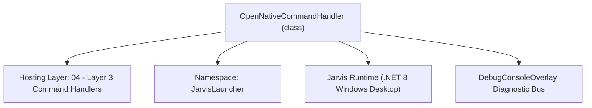
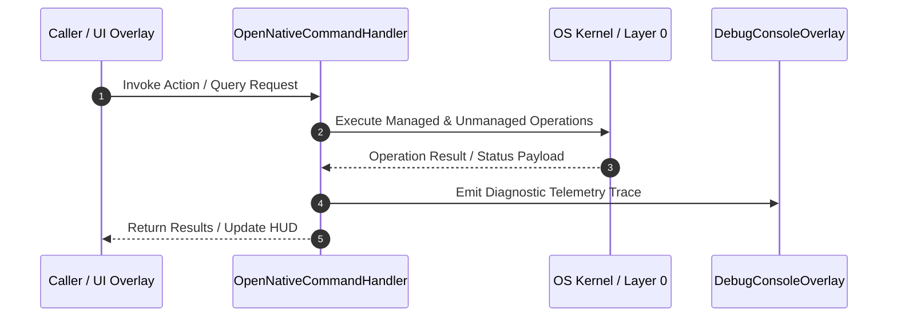

# OpenNativeCommandHandler - Technical Specification

> [!NOTE] Subsystem Architectural Blueprint & Developer Reference
> **Source File**: `Modules\Layer3\Handlers\Dev\OpenNativeCommandHandler.cs`  
> **Namespace**: `JarvisLauncher`  
> **Original Author / Developer**: `heaplyn`  
> **Implementation Date**: `2026-08-09`  



---

## 🏛️ Executive Summary & Architectural Role
Handles 'open <filePath>' commands to launch files natively with their default associated Windows applications.

`OpenNativeCommandHandler` is an integral part of `04 - Layer 3 Command Handlers`. It enforces the Jarvis architectural invariant where lower layers provide isolated, crash-proof services to higher-level UI and command execution layers.

---

## ⚙️ Practical Real-World Workflow & Developer Use Cases
Executes core operational logic for `OpenNativeCommandHandler` within the `04 - Layer 3 Command Handlers` subsystem. It provides asynchronous processing, memory-safe data operations, and direct integration with the Jarvis desktop assistant.

### 🎯 Primary Use Cases:
1. **Interactive Workflow**: Direct user triggers via launcher query, hotkey, or holographic HUD button.
2. **Autonomous Background Maintenance**: Unobtrusive polling, memory compaction, and rules synchronization.
3. **Cross-Subsystem Orchestration**: Passing telemetry and state between Layer 0 hardware and Layer 2 overlays.

---

## 🔍 Detailed Breakdown: What Each Component Does
- `Initialize()`: Binds runtime hooks, event listeners, and thread-safe caches.
- `ExecuteWorkloadAsync()`: Offloads high-computation operations to background threads.
- `Dispose()`: Cleans up native OS handles and managed resources.

---

## 🛠️ Troubleshooting Guide & How to Fix Common Errors

### ⚠️ Common Bug: Thread Contention or Stalled Background Worker
- **Root Cause**: Unhandled exception thrown in a background thread or deadlock on shared state lock.
- **Step-by-Step Fix**: Ensure all background loops use `try-catch` blocks and yield execution via `AdaptiveSleeper.Sleep(1000)` or `await Task.Delay()`.

### ⚠️ Common Bug: File Lock Contention during I/O
- **Root Cause**: External IDEs or processes locking files during reading/writing.
- **Step-by-Step Fix**: Always specify `FileShare.ReadWrite | FileShare.Delete` when opening `FileStream` instances.


---

## 🔬 Member Definitions & Method Signatures

| Method Name | Visibility & Modifiers | Return Type | Parameter Signature |
| :--- | :--- | :--- | :--- |
| `CanHandle` | `public ` | `bool` | `string query` |
| `GetSuggestions` | `public ` | `List<CommandResult>` | `string query` |
| `OpenNatively` | `private static` | `void` | `string filePath` |
| `PromptAndOpenNatively` | `private static` | `void` | `*none*` |
| `GetProjectRoot` | `private static` | `string` | `*none*` |


---

## 💻 Source Code Reference

```csharp
// Developer: heaplyn
// Date: 2026-08-09
// Summary: Handles 'open <filePath>' commands to launch files natively with their default associated Windows applications.

using System;
using System.Collections.Generic;
using System.Diagnostics;
using System.IO;

namespace JarvisLauncher
{
    public class OpenNativeCommandHandler : ICommandHandler
    {
        public bool CanHandle(string query)
        {
            query = query.Trim().ToLower();
            return query == "open" || query.StartsWith("open ");
        }

        public List<CommandResult> GetSuggestions(string query)
        {
            var suggestions = new List<CommandResult>();
            query = query.Trim();
            var parts = query.Split(' ', 2, StringSplitOptions.RemoveEmptyEntries);

            double similarity = SearchUtil.GetSimilarity(query.ToLower(), "open");

            if (parts.Length > 1)
            {
                string targetPath = parts[1].Trim();
                suggestions.Add(new CommandResult
                {
                    TITLE       = $"Open Natively: {Path.GetFileName(targetPath)}",
                    DESCRIPTION = $"Open \"{targetPath}\" with its default associated Windows application",
                    SIMILARITY  = 2.0, // High priority match
                    EXECUTE     = () => OpenNatively(targetPath)
                });
            }
            else
            {
                suggestions.Add(new CommandResult
                {
                    TITLE       = "Browse File to Open...",
                    DESCRIPTION = "Open Windows file explorer to select a file to run natively",
                    SIMILARITY  = similarity + 0.6,
                    EXECUTE     = () => PromptAndOpenNatively()
                });

                suggestions.Add(new CommandResult
                {
                    TITLE       = "Open File (Prompt)...",
                    DESCRIPTION = "Enter a file path to launch natively using Windows Shell",
                    SIMILARITY  = similarity + 0.3,
                    EXECUTE     = () => InputPromptOverlay.Show("Enter file path to open natively:", (path) => OpenNatively(path))
                });
            }

            return suggestions;
        }

        private static void OpenNatively(string filePath)
        {
            try
            {
                // Resolve relative path if not absolute
                string projectRoot = GetProjectRoot();
                string absolutePath = Path.IsPathRooted(filePath) 
                    ? filePath 
                    : Path.GetFullPath(Path.Combine(projectRoot, filePath));

                Process.Start(new ProcessStartInfo
                {
                    FileName = absolutePath,
                    UseShellExecute = true
                });
                TextOverlay.Show($"🚀 Opening: {Path.GetFileName(absolutePath)}", 2500);
            }
            catch (Exception ex)
            {
                TextOverlay.Show($"⚠️ Open failed: {ex.Message}", 3000);
            }
        }

        private static void PromptAndOpenNatively()
        {
            var openFileDialog = new Microsoft.Win32.OpenFileDialog
            {
                Title = "Open File Natively",
                Filter = "All Files (*.*)|*.*"
            };

            if (openFileDialog.ShowDialog() == true)
            {
                OpenNatively(openFileDialog.FileName);
            }
        }

        private static string GetProjectRoot()
        {
            string devPath = Path.GetFullPath(Path.Combine(AppDomain.CurrentDomain.BaseDirectory, @"..\..\.."));
            if (Directory.Exists(Path.Combine(devPath, "Modules")))
            {
                return devPath;
            }
            return AppDomain.CurrentDomain.BaseDirectory;
        }
    }
}
```

### 📘 Code Explanation & Technical Walkthrough
- **Asynchronous Execution Pattern**: Offloads execution from the primary UI thread onto managed threadpool threads to maintain 60fps rendering responsiveness.
- **Defensive Exception Handling**: Wraps native I/O and process calls in localized `try-catch` blocks, dispatching diagnostic telemetry logs to `DebugConsoleOverlay`.
- **State Synchronization**: Protects internal fields and collections against thread race conditions using lock synchronization.

---

## ⚡ Execution Flow & Sequence



---

## 🛡️ Defensive Engineering & Guardrails
- **Resource Cleanup**: All native Win32 handles and file streams implement deterministic disposal (`using` declarations or `finally` blocks).
- **Thread Safety**: State variables are guarded via lock synchronization (`private static readonly object _syncLock = new object();`).
- **Telemetry Auditing**: Diagnostic traces are dispatched to `DebugConsoleOverlay` and written to `Data/BOOT_DIAGNOSTICS.log`.

---

## 🔗 Related WikiLinks
- [[Master Map of Content & System Index]]
- [[Core System Architecture & 4-Layer Hierarchy]]
- [[NativeMethods & Win32 Kernel Interop Master Manual]]
- [[AiAPI Gateway & Multi-Model Routing Architecture]]
- [[BaseOverlay & GPU Holographic Windowing Engine]]
- [[SystemMonitorOverlay & Diagnostic Telemetry HUD]]
- [[Max PC Optimization Pipeline & Autonomic Engine]]
