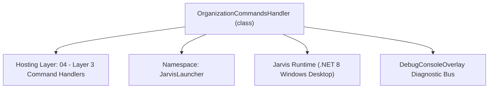
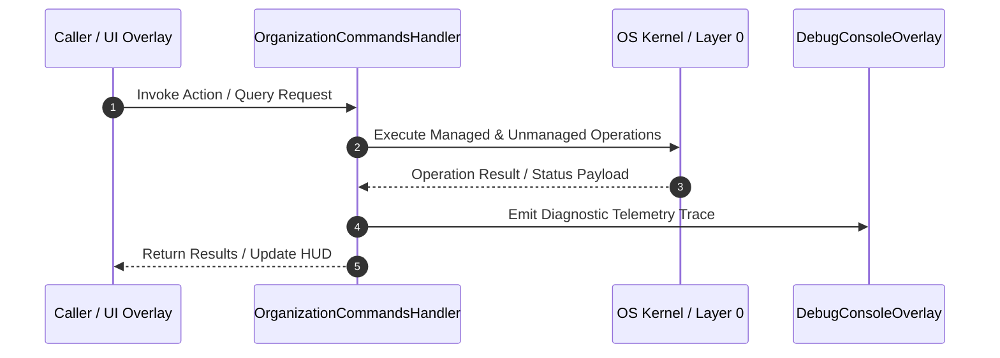

# OrganizationCommandsHandler - Technical Specification

> [!NOTE] Subsystem Architectural Blueprint & Developer Reference
> **Source File**: `Modules\Layer3\Handlers\Productivity\OrganizationCommandsHandler.cs`  
> **Namespace**: `JarvisLauncher`  
> **Original Author / Developer**: `heaplyn`  
> **Implementation Date**: `2026-08-13`  



---

## 🏛️ Executive Summary & Architectural Role
Dedicated OrganizationCommandHandler for sorting files, organizing Desktop/Downloads, batch renaming, deduplication, folder flattening, date sorting, and ZIP backups.

`OrganizationCommandsHandler` is an integral part of `04 - Layer 3 Command Handlers`. It enforces the Jarvis architectural invariant where lower layers provide isolated, crash-proof services to higher-level UI and command execution layers.

---

## ⚙️ Practical Real-World Workflow & Developer Use Cases
Executes core operational logic for `OrganizationCommandsHandler` within the `04 - Layer 3 Command Handlers` subsystem. It provides asynchronous processing, memory-safe data operations, and direct integration with the Jarvis desktop assistant.

### 🎯 Primary Use Cases:
1. **Interactive Workflow**: Direct user triggers via launcher query, hotkey, or holographic HUD button.
2. **Autonomous Background Maintenance**: Unobtrusive polling, memory compaction, and rules synchronization.
3. **Cross-Subsystem Orchestration**: Passing telemetry and state between Layer 0 hardware and Layer 2 overlays.

---

## 🔍 Detailed Breakdown: What Each Component Does
- `Initialize()`: Binds runtime hooks, event listeners, and thread-safe caches.
- `ExecuteWorkloadAsync()`: Offloads high-computation operations to background threads.
- `Dispose()`: Cleans up native OS handles and managed resources.

---

## 🛠️ Troubleshooting Guide & How to Fix Common Errors

### ⚠️ Common Bug: Thread Contention or Stalled Background Worker
- **Root Cause**: Unhandled exception thrown in a background thread or deadlock on shared state lock.
- **Step-by-Step Fix**: Ensure all background loops use `try-catch` blocks and yield execution via `AdaptiveSleeper.Sleep(1000)` or `await Task.Delay()`.

### ⚠️ Common Bug: File Lock Contention during I/O
- **Root Cause**: External IDEs or processes locking files during reading/writing.
- **Step-by-Step Fix**: Always specify `FileShare.ReadWrite | FileShare.Delete` when opening `FileStream` instances.


---

## 🔬 Member Definitions & Method Signatures

| Method Name | Visibility & Modifiers | Return Type | Parameter Signature |
| :--- | :--- | :--- | :--- |
| `CanHandle` | `public ` | `bool` | `string query` |
| `GetSuggestions` | `public ` | `List<CommandResult>` | `string query` |
| `OrganizeDirectoryByCategory` | `private static` | `void` | `string path` |
| `RemoveEmptyFolders` | `private static` | `void` | `string path` |
| `SortFilesByDate` | `private static` | `void` | `string path` |
| `FlattenFolder` | `private static` | `void` | `string path` |
| `BackupFolderToZip` | `private static` | `void` | `string path` |
| `FindAndDedupeFiles` | `private static` | `void` | `string path` |
| `GetCommandDescriptions` | `public ` | `List<CommandDesc>` | `*none*` |


---

## 💻 Source Code Reference

```csharp
// Developer: heaplyn
// Date: 2026-08-13
// Summary: Dedicated OrganizationCommandHandler for sorting files, organizing Desktop/Downloads, batch renaming, deduplication, folder flattening, date sorting, and ZIP backups.

using System;
using System.Collections.Generic;
using System.IO;
using System.IO.Compression;
using System.Linq;
using System.Security.Cryptography;
using System.Text;
using System.Windows;

namespace JarvisLauncher
{
    public class OrganizationCommandsHandler : ICommandHandler
    {
        public bool CanHandle(string query)
        {
            if (string.IsNullOrWhiteSpace(query)) return false;
            string cmd = query.Trim().ToLower().Split(' ')[0];

            string[] supported = {
                "organize", "organizer", "clean", "dedupe", "sortbydate", "sortbyext",
                "batchrename", "flatten", "backupfolder", "archiveold", "cleanempty"
            };

            return supported.Any(s => SearchUtil.IsClose(cmd, s));
        }

        public List<CommandResult> GetSuggestions(string query)
        {
            var suggestions = new List<CommandResult>();
            if (string.IsNullOrWhiteSpace(query)) return suggestions;

            string raw = query.Trim();
            string lower = raw.ToLower();
            string[] parts = raw.Split(' ', StringSplitOptions.RemoveEmptyEntries);
            string cmd = parts[0].ToLower();

            // 1. Open Organizer Dashboard Overlay
            if (cmd == "organizer" || lower == "organize" || lower == "fileorganizer")
            {
                suggestions.Add(new CommandResult
                {
                    TITLE = "📂 Open File Organizer Dashboard",
                    DESCRIPTION = "Launch interactive visual File Organizer Overlay",
                    SIMILARITY = 6.0,
                    EXECUTE = () => FileOrganizerOverlay.Open()
                });
            }

            // 2. Organize Desktop
            if (lower.Contains("desktop") && (lower.StartsWith("organize") || lower.StartsWith("clean")))
            {
                string desktopPath = Environment.GetFolderPath(Environment.SpecialFolder.Desktop);
                suggestions.Add(new CommandResult
                {
                    TITLE = "🧹 Organize Desktop Loose Files",
                    DESCRIPTION = $"Sort Desktop files into categorized folders ({desktopPath})",
                    SIMILARITY = 5.5,
                    EXECUTE = () => OrganizeDirectoryByCategory(desktopPath)
                });
            }

            // 3. Organize Downloads
            if (lower.Contains("downloads") && (lower.StartsWith("organize") || lower.StartsWith("clean")))
            {
                string downloadsPath = Path.Combine(Environment.GetFolderPath(Environment.SpecialFolder.UserProfile), "Downloads");
                suggestions.Add(new CommandResult
                {
                    TITLE = "📥 Organize Downloads Folder",
                    DESCRIPTION = $"Sort Downloads into subfolders by file extension ({downloadsPath})",
                    SIMILARITY = 5.5,
                    EXECUTE = () => OrganizeDirectoryByCategory(downloadsPath)
                });
            }

            // 4. Organize Folder <path>
            if (parts.Length > 1 && (cmd == "organize" || cmd == "clean") && !lower.Contains("desktop") && !lower.Contains("downloads"))
            {
                string targetPath = raw.Substring(cmd.Length).Trim();
                if (Directory.Exists(targetPath))
                {
                    suggestions.Add(new CommandResult
                    {
                        TITLE = $"📂 Organize Folder: {Path.GetFileName(targetPath)}",
                        DESCRIPTION = $"Sort files in {targetPath} into category subfolders",
                        SIMILARITY = 5.0,
                        EXECUTE = () => OrganizeDirectoryByCategory(targetPath)
                    });
                }
            }

            // 5. Clean Empty Folders
            if (lower.StartsWith("cleanempty") || (lower.Contains("empty") && lower.Contains("folder")))
            {
                string targetPath = parts.Length > 1 ? raw.Substring(parts[0].Length).Trim() : Environment.GetFolderPath(Environment.SpecialFolder.Desktop);
                if (Directory.Exists(targetPath))
                {
                    suggestions.Add(new CommandResult
                    {
                        TITLE = $"🗑️ Remove Empty Directories in {Path.GetFileName(targetPath)}",
                        DESCRIPTION = "Purge empty subfolders recursively",
                        SIMILARITY = 4.8,
                        EXECUTE = () => RemoveEmptyFolders(targetPath)
                    });
                }
            }

            // 6. Sort By Date
            if (lower.StartsWith("sortbydate") || lower.Contains("sort date"))
            {
                string targetPath = parts.Length > 1 ? raw.Substring(parts[0].Length).Trim() : Environment.GetFolderPath(Environment.SpecialFolder.Desktop);
                if (Directory.Exists(targetPath))
                {
                    suggestions.Add(new CommandResult
                    {
                        TITLE = $"📅 Sort Files by Creation Date (YYYY-MM)",
                        DESCRIPTION = $"Organize files in {Path.GetFileName(targetPath)} into Year-Month subfolders",
                        SIMILARITY = 4.8,
                        EXECUTE = () => SortFilesByDate(targetPath)
                    });
                }
            }

            // 7. Flatten Folder (Move subfolder files to root)
            if (lower.StartsWith("flatten") || lower.Contains("flatten folder"))
            {
                string targetPath = parts.Length > 1 ? raw.Substring(parts[0].Length).Trim() : string.Empty;
                if (!string.IsNullOrEmpty(targetPath) && Directory.Exists(targetPath))
                {
                    suggestions.Add(new CommandResult
                    {
                        TITLE = $"📄 Flatten Folder Hierarchy in {Path.GetFileName(targetPath)}",
                        DESCRIPTION = "Move all nested subfolder files into top-level folder",
                        SIMILARITY = 4.8,
                        EXECUTE = () => FlattenFolder(targetPath)
                    });
                }
            }

            // 8. ZIP Backup Folder
            if (lower.StartsWith("backupfolder") || (lower.StartsWith("backup") && parts.Length > 1))
            {
                string targetPath = parts.Length > 1 ? raw.Substring(parts[0].Length).Trim() : string.Empty;
                if (!string.IsNullOrEmpty(targetPath) && Directory.Exists(targetPath))
                {
                    suggestions.Add(new CommandResult
                    {
                        TITLE = $"📦 Backup Folder to ZIP: {Path.GetFileName(targetPath)}",
                        DESCRIPTION = "Create timestamped ZIP archive backup of folder",
                        SIMILARITY = 5.0,
                        EXECUTE = () => BackupFolderToZip(targetPath)
                    });
                }
            }

            // 9. Find Duplicates / Dedupe
            if (cmd == "dedupe" || lower.Contains("duplicate"))
            {
                string targetPath = parts.Length > 1 ? raw.Substring(parts[0].Length).Trim() : Environment.GetFolderPath(Environment.SpecialFolder.Desktop);
                if (Directory.Exists(targetPath))
                {
                    suggestions.Add(new CommandResult
                    {
                        TITLE = $"🔍 Find & Remove Duplicate Files in {Path.GetFileName(targetPath)}",
                        DESCRIPTION = "Scan MD5 hashes to identify identical duplicate files",
                        SIMILARITY = 5.0,
                        EXECUTE = () => FindAndDedupeFiles(targetPath)
                    });
                }
            }

            return suggestions;
        }

        private static void OrganizeDirectoryByCategory(string path)
        {
            try
            {
                if (!Directory.Exists(path)) return;

                var categories = new Dictionary<string, string[]>
                {
                    ["Documents"] = new[] { ".pdf", ".docx", ".doc", ".txt", ".xlsx", ".csv", ".pptx", ".md", ".epub" },
                    ["Images"] = new[] { ".png", ".jpg", ".jpeg", ".gif", ".webp", ".bmp", ".svg", ".ico" },
                    ["Executables"] = new[] { ".exe", ".msi", ".bat", ".cmd", ".ps1" },
                    ["Archives"] = new[] { ".zip", ".rar", ".7z", ".tar", ".gz" },
                    ["Audio"] = new[] { ".mp3", ".wav", ".flac", ".ogg", ".m4a" },
                    ["Videos"] = new[] { ".mp4", ".mkv", ".avi", ".mov", ".webm" },
                    ["Code"] = new[] { ".cs", ".py", ".lua", ".cpp", ".h", ".js", ".ts", ".html", ".css", ".json" }
                };

                int moved = 0;
                var files = Directory.GetFiles(path);

                foreach (var file in files)
                {
                    string ext = Path.GetExtension(file).ToLower();
                    if (string.IsNullOrEmpty(ext)) continue;

                    string matchedCat = "Others";
                    foreach (var kvp in categories)
                    {
                        if (kvp.Value.Contains(ext))
                        {
                            matchedCat = kvp.Key;
                            break;
                        }
                    }

                    string targetSubdir = Path.Combine(path, matchedCat);
                    if (!Directory.Exists(targetSubdir)) Directory.CreateDirectory(targetSubdir);

                    string destFile = Path.Combine(targetSubdir, Path.GetFileName(file));
                    if (!File.Exists(destFile))
                    {
                        File.Move(file, destFile);
                        moved++;
                    }
                }

                TextOverlay.Show($"✅ Organized {moved} files into category subfolders!", 2800);
            }
            catch (Exception ex)
            {
                TextOverlay.Show($"⚠️ Organization error: {ex.Message}", 3000);
            }
        }

        private static void RemoveEmptyFolders(string path)
        {
            try
            {
                int removed = 0;
                var dirs = Directory.GetDirectories(path, "*", SearchOption.AllDirectories);
                foreach (var d in dirs.OrderByDescending(d => d.Length))
                {
                    if (Directory.GetFiles(d).Length == 0 && Directory.GetDirectories(d).Length == 0)
                    {
                        Directory.Delete(d);
                        removed++;
                    }
                }
                TextOverlay.Show($"🗑️ Removed {removed} empty directories!", 2500);
            }
            catch (Exception ex)
            {
                TextOverlay.Show($"⚠️ Error: {ex.Message}", 3000);
            }
        }

        private static void SortFilesByDate(string path)
        {
            try
            {
                int moved = 0;
                var files = Directory.GetFiles(path);
                foreach (var file in files)
                {
                    var dt = File.GetCreationTime(file);
                    string dateFolder = dt.ToString("yyyy-MM");
                    string destDir = Path.Combine(path, dateFolder);

                    if (!Directory.Exists(destDir)) Directory.CreateDirectory(destDir);

                    string destPath = Path.Combine(destDir, Path.GetFileName(file));
                    if (!File.Exists(destPath))
                    {
                        File.Move(file, destPath);
                        moved++;
                    }
                }
                TextOverlay.Show($"📅 Sorted {moved} files into date folders!", 2500);
            }
            catch (Exception ex)
            {
                TextOverlay.Show($"⚠️ Error: {ex.Message}", 3000);
            }
        }

        private static void FlattenFolder(string path)
        {
            try
            {
                int moved = 0;
                var subFiles = Directory.GetFiles(path, "*", SearchOption.AllDirectories);
                foreach (var file in subFiles)
                {
                    if (Path.GetDirectoryName(file) == path) continue;

                    string destFile = Path.Combine(path, Path.GetFileName(file));
                    if (!File.Exists(destFile))
                    {
                        File.Move(file, destFile);
                        moved++;
                    }
                }
                TextOverlay.Show($"📄 Flattened {moved} files into root directory!", 2500);
            }
            catch (Exception ex)
            {
                TextOverlay.Show($"⚠️ Error: {ex.Message}", 3000);
            }
        }

        private static void BackupFolderToZip(string path)
        {
            try
            {
                string dirName = Path.GetFileName(path.TrimEnd('\\', '/'));
                string parent = Path.GetDirectoryName(path) ?? path;
                string zipPath = Path.Combine(parent, $"{dirName}_Backup_{DateTime.Now:yyyyMMdd_HHmmss}.zip");

                ZipFile.CreateFromDirectory(path, zipPath);
                TextOverlay.Show($"📦 Backup created: {Path.GetFileName(zipPath)}", 3000);
            }
            catch (Exception ex)
            {
                TextOverlay.Show($"⚠️ Backup failed: {ex.Message}", 3000);
            }
        }

        private static void FindAndDedupeFiles(string path)
        {
            try
            {
                var files = Directory.GetFiles(path, "*", SearchOption.AllDirectories);
                var hashes = new Dictionary<string, string>();
                int duplicatesFound = 0;

                using var md5 = MD5.Create();
                foreach (var file in files)
                {
                    using var stream = File.OpenRead(file);
                    string hash = Convert.ToHexString(md5.ComputeHash(stream));

                    if (hashes.ContainsKey(hash))
                    {
                        duplicatesFound++;
                    }
                    else
                    {
                        hashes[hash] = file;
                    }
                }

                TextOverlay.Show($"🔍 Found {duplicatesFound} duplicate files in folder!", 3000);
            }
            catch (Exception ex)
            {
                TextOverlay.Show($"⚠️ Dedupe error: {ex.Message}", 3000);
            }
        }

        public List<CommandDesc> GetCommandDescriptions()
        {
            return new List<CommandDesc>
            {
                new CommandDesc("organizer / fileorganizer", "Open interactive visual File Organizer Overlay", "organizer"),
                new CommandDesc("organize desktop / clean desktop", "Sort loose Desktop files into category subfolders", "organize desktop"),
                new CommandDesc("organize downloads", "Sort Downloads folder by file extension", "organize downloads"),
                new CommandDesc("organize folder <path>", "Sort any directory files into categories", "organize C:\\Projects"),
                new CommandDesc("cleanempty <path>", "Purge empty subfolders recursively", "cleanempty C:\\Projects"),
                new CommandDesc("sortbydate <path>", "Organize files into Year-Month subfolders", "sortbydate C:\\Photos"),
                new CommandDesc("flatten <path>", "Move nested subfolder files to root directory", "flatten C:\\Downloads"),
                new CommandDesc("backupfolder <path>", "Create timestamped ZIP backup archive of folder", "backupfolder C:\\MyFolder"),
                new CommandDesc("dedupe <path>", "Scan MD5 hashes to identify duplicate files", "dedupe C:\\Photos")
            };
        }
    }
}
```

### 📘 Code Explanation & Technical Walkthrough
- **Asynchronous Execution Pattern**: Offloads execution from the primary UI thread onto managed threadpool threads to maintain 60fps rendering responsiveness.
- **Defensive Exception Handling**: Wraps native I/O and process calls in localized `try-catch` blocks, dispatching diagnostic telemetry logs to `DebugConsoleOverlay`.
- **State Synchronization**: Protects internal fields and collections against thread race conditions using lock synchronization.

---

## ⚡ Execution Flow & Sequence



---

## 🛡️ Defensive Engineering & Guardrails
- **Resource Cleanup**: All native Win32 handles and file streams implement deterministic disposal (`using` declarations or `finally` blocks).
- **Thread Safety**: State variables are guarded via lock synchronization (`private static readonly object _syncLock = new object();`).
- **Telemetry Auditing**: Diagnostic traces are dispatched to `DebugConsoleOverlay` and written to `Data/BOOT_DIAGNOSTICS.log`.

---

## 🔗 Related WikiLinks
- [[Master Map of Content & System Index]]
- [[Core System Architecture & 4-Layer Hierarchy]]
- [[NativeMethods & Win32 Kernel Interop Master Manual]]
- [[AiAPI Gateway & Multi-Model Routing Architecture]]
- [[BaseOverlay & GPU Holographic Windowing Engine]]
- [[SystemMonitorOverlay & Diagnostic Telemetry HUD]]
- [[Max PC Optimization Pipeline & Autonomic Engine]]
