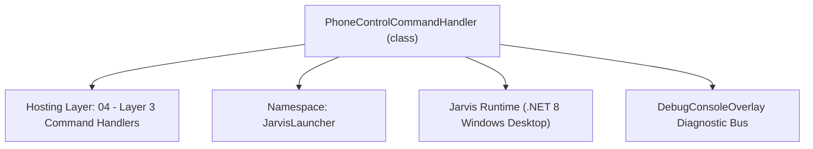
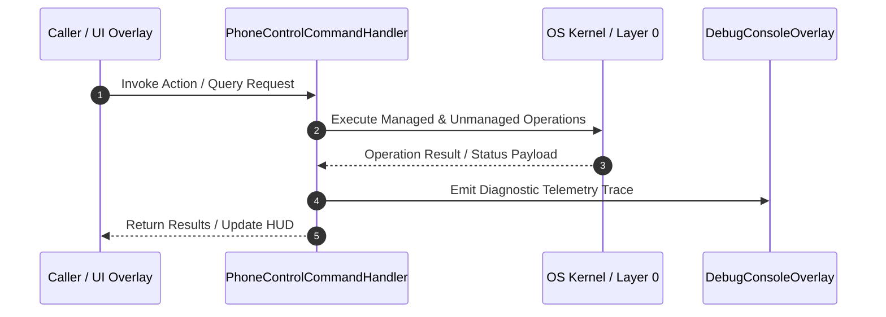

# PhoneControlCommandHandler - Technical Specification

> [!NOTE] Subsystem Architectural Blueprint & Developer Reference
> **Source File**: `Modules\Layer3\Handlers\Utilities\PhoneControlCommandHandler.cs`  
> **Namespace**: `JarvisLauncher`  
> **Original Author / Developer**: `heaplyn`  
> **Implementation Date**: `2026-08-09`  



---

## 🏛️ Executive Summary & Architectural Role
Command handler to open the Mobile Companion Hub overlay.

`PhoneControlCommandHandler` is an integral part of `04 - Layer 3 Command Handlers`. It enforces the Jarvis architectural invariant where lower layers provide isolated, crash-proof services to higher-level UI and command execution layers.

---

## ⚙️ Practical Real-World Workflow & Developer Use Cases
Executes core operational logic for `PhoneControlCommandHandler` within the `04 - Layer 3 Command Handlers` subsystem. It provides asynchronous processing, memory-safe data operations, and direct integration with the Jarvis desktop assistant.

### 🎯 Primary Use Cases:
1. **Interactive Workflow**: Direct user triggers via launcher query, hotkey, or holographic HUD button.
2. **Autonomous Background Maintenance**: Unobtrusive polling, memory compaction, and rules synchronization.
3. **Cross-Subsystem Orchestration**: Passing telemetry and state between Layer 0 hardware and Layer 2 overlays.

---

## 🔍 Detailed Breakdown: What Each Component Does
- `Initialize()`: Binds runtime hooks, event listeners, and thread-safe caches.
- `ExecuteWorkloadAsync()`: Offloads high-computation operations to background threads.
- `Dispose()`: Cleans up native OS handles and managed resources.

---

## 🛠️ Troubleshooting Guide & How to Fix Common Errors

### ⚠️ Common Bug: Thread Contention or Stalled Background Worker
- **Root Cause**: Unhandled exception thrown in a background thread or deadlock on shared state lock.
- **Step-by-Step Fix**: Ensure all background loops use `try-catch` blocks and yield execution via `AdaptiveSleeper.Sleep(1000)` or `await Task.Delay()`.

### ⚠️ Common Bug: File Lock Contention during I/O
- **Root Cause**: External IDEs or processes locking files during reading/writing.
- **Step-by-Step Fix**: Always specify `FileShare.ReadWrite | FileShare.Delete` when opening `FileStream` instances.


---

## 🔬 Member Definitions & Method Signatures

| Method Name | Visibility & Modifiers | Return Type | Parameter Signature |
| :--- | :--- | :--- | :--- |
| `CanHandle` | `public ` | `bool` | `string query` |
| `GetSuggestions` | `public ` | `List<CommandResult>` | `string query` |
| `GetCommandDescriptions` | `public ` | `List<CommandDesc>` | `*none*` |


---

## 💻 Source Code Reference

```csharp
// Developer: heaplyn
// Date: 2026-08-09
// Summary: Command handler to open the Mobile Companion Hub overlay.

using System;
using System.Collections.Generic;
using System.Linq;

namespace JarvisLauncher
{   
    public class PhoneControlCommandHandler : ICommandHandler
    {
        private static List<string> Aliases = new List<string>
        {
            "phone",
            "mobile",
            "remote",
            "bridge",
            "sync",
            "control"
        };

        public bool CanHandle(string query)
        {
            query = query.Trim().ToLower();
            return Aliases.Any(a => SearchUtil.IsClose(query, a));
        }

        public List<CommandResult> GetSuggestions(string query)
        {
            var suggestions = new List<CommandResult>();
            query = query.Trim().ToLower();

            if (query == "sync" || query == "mobile sync" || query == "phone sync")
            {
                bool clip = SettingsManager.Current.MOBILE_ALLOW_CLIPBOARD;
                suggestions.Add(new CommandResult {
                    TITLE = $"📱 {(clip ? "Disable" : "Enable")} Clipboard Sync",
                    DESCRIPTION = $"Toggle remote clipboard sharing (Currently {(clip ? "Enabled" : "Disabled")})",
                    SIMILARITY = 8.5,
                    EXECUTE = () => {
                        SettingsManager.Current.MOBILE_ALLOW_CLIPBOARD = !clip;
                        TextOverlay.Show($"Clipboard Sync {(SettingsManager.Current.MOBILE_ALLOW_CLIPBOARD ? "Enabled" : "Disabled")}", 2500);
                    }
                });

                bool files = SettingsManager.Current.MOBILE_ALLOW_FILES;
                suggestions.Add(new CommandResult {
                    TITLE = $"📁 {(files ? "Disable" : "Enable")} Mobile File Access",
                    DESCRIPTION = $"Toggle file browser access (Currently {(files ? "Enabled" : "Disabled")})",
                    SIMILARITY = 8.4,
                    EXECUTE = () => {
                        SettingsManager.Current.MOBILE_ALLOW_FILES = !files;
                        TextOverlay.Show($"Mobile File Access {(SettingsManager.Current.MOBILE_ALLOW_FILES ? "Enabled" : "Disabled")}", 2500);
                    }
                });

                bool term = SettingsManager.Current.MOBILE_ALLOW_TERMINAL;
                suggestions.Add(new CommandResult {
                    TITLE = $"💻 {(term ? "Disable" : "Enable")} Mobile Terminal Access",
                    DESCRIPTION = $"Toggle remote terminal executing (Currently {(term ? "Enabled" : "Disabled")})",
                    SIMILARITY = 8.3,
                    EXECUTE = () => {
                        SettingsManager.Current.MOBILE_ALLOW_TERMINAL = !term;
                        TextOverlay.Show($"Mobile Terminal Access {(SettingsManager.Current.MOBILE_ALLOW_TERMINAL ? "Enabled" : "Disabled")}", 2500);
                    }
                });

                bool scr = SettingsManager.Current.MOBILE_ALLOW_SCREEN_MIRROR;
                suggestions.Add(new CommandResult {
                    TITLE = $"📸 {(scr ? "Disable" : "Enable")} Mobile Screen Mirror",
                    DESCRIPTION = $"Toggle remote screen view (Currently {(scr ? "Enabled" : "Disabled")})",
                    SIMILARITY = 8.2,
                    EXECUTE = () => {
                        SettingsManager.Current.MOBILE_ALLOW_SCREEN_MIRROR = !scr;
                        TextOverlay.Show($"Mobile Screen Mirror {(SettingsManager.Current.MOBILE_ALLOW_SCREEN_MIRROR ? "Enabled" : "Disabled")}", 2500);
                    }
                });
            }

            if (query.StartsWith("sync clipboard") || query.StartsWith("phone sync clipboard"))
            {
                bool current = SettingsManager.Current.MOBILE_ALLOW_CLIPBOARD;
                suggestions.Add(new CommandResult {
                    TITLE = $"📱 {(current ? "Disable" : "Enable")} Clipboard Sync",
                    DESCRIPTION = $"Currently {(current ? "Enabled" : "Disabled")} - Toggle clipboard sharing with phone",
                    SIMILARITY = 9.5,
                    EXECUTE = () => {
                        SettingsManager.Current.MOBILE_ALLOW_CLIPBOARD = !current;
                        TextOverlay.Show($"Clipboard Sync {(SettingsManager.Current.MOBILE_ALLOW_CLIPBOARD ? "Enabled" : "Disabled")}", 2500);
                    }
                });
            }

            if (query.StartsWith("sync files") || query.StartsWith("phone sync files"))
            {
                bool current = SettingsManager.Current.MOBILE_ALLOW_FILES;
                suggestions.Add(new CommandResult {
                    TITLE = $"📁 {(current ? "Disable" : "Enable")} Mobile File Access",
                    DESCRIPTION = $"Currently {(current ? "Enabled" : "Disabled")} - Toggle file transfer permissions",
                    SIMILARITY = 9.5,
                    EXECUTE = () => {
                        SettingsManager.Current.MOBILE_ALLOW_FILES = !current;
                        TextOverlay.Show($"Mobile File Access {(SettingsManager.Current.MOBILE_ALLOW_FILES ? "Enabled" : "Disabled")}", 2500);
                    }
                });
            }

            if (query.StartsWith("sync terminal") || query.StartsWith("phone sync terminal"))
            {
                bool current = SettingsManager.Current.MOBILE_ALLOW_TERMINAL;
                suggestions.Add(new CommandResult {
                    TITLE = $"💻 {(current ? "Disable" : "Enable")} Mobile Terminal Access",
                    DESCRIPTION = $"Currently {(current ? "Enabled" : "Disabled")} - Toggle remote terminal commands",
                    SIMILARITY = 9.5,
                    EXECUTE = () => {
                        SettingsManager.Current.MOBILE_ALLOW_TERMINAL = !current;
                        TextOverlay.Show($"Mobile Terminal Access {(SettingsManager.Current.MOBILE_ALLOW_TERMINAL ? "Enabled" : "Disabled")}", 2500);
                    }
                });
            }

            if (query.StartsWith("sync screen") || query.StartsWith("phone sync screen"))
            {
                bool current = SettingsManager.Current.MOBILE_ALLOW_SCREEN_MIRROR;
                suggestions.Add(new CommandResult {
                    TITLE = $"📸 {(current ? "Disable" : "Enable")} Mobile Screen Mirror",
                    DESCRIPTION = $"Currently {(current ? "Enabled" : "Disabled")} - Toggle remote screen capture",
                    SIMILARITY = 9.5,
                    EXECUTE = () => {
                        SettingsManager.Current.MOBILE_ALLOW_SCREEN_MIRROR = !current;
                        TextOverlay.Show($"Mobile Screen Mirror {(SettingsManager.Current.MOBILE_ALLOW_SCREEN_MIRROR ? "Enabled" : "Disabled")}", 2500);
                    }
                });
            }

            if (query.StartsWith("phone vibrate"))
            {
                suggestions.Add(new CommandResult {
                    TITLE = "📳 Vibrate Phone",
                    DESCRIPTION = "Trigger haptic feedback on the connected mobile device",
                    SIMILARITY = 9.0,
                    EXECUTE = () => _ = PhoneRemoteService.VibrateAsync(MobileBridgeServer.LastConnectedPhoneIp ?? "127.0.0.1")
                });
            }
            else if (query.StartsWith("phone torch") || query.StartsWith("phone light"))
            {
                suggestions.Add(new CommandResult {
                    TITLE = "🔦 Toggle Phone Flashlight",
                    DESCRIPTION = "Remotely turn phone torch on/off",
                    SIMILARITY = 9.0,
                    EXECUTE = () => _ = PhoneRemoteService.ToggleFlashlightAsync(MobileBridgeServer.LastConnectedPhoneIp ?? "127.0.0.1")
                });
            }
            else if (query.StartsWith("phone alert ") || query.StartsWith("phone msg "))
            {
                string msg = query.Split(' ', 3).Last();
                suggestions.Add(new CommandResult {
                    TITLE = $"🔔 Alert Phone: {msg}",
                    DESCRIPTION = "Send a remote push toast notification",
                    SIMILARITY = 9.0,
                    EXECUTE = () => _ = PhoneRemoteService.ShowToastAsync(MobileBridgeServer.LastConnectedPhoneIp ?? "127.0.0.1", msg)
                });
            }

            double similarity = 0;
            foreach (var alias in Aliases)
            {
                similarity = Math.Max(similarity, SearchUtil.GetSimilarity(query, alias));
            }
            
            suggestions.Add(new CommandResult
            {
                TITLE = "📱 Mobile Companion Hub",
                DESCRIPTION = "Open connection links and remote control settings",
                EXECUTE = () =>
                {
                    MobileOverlay.ShowOverlay();
                },
                SIMILARITY = similarity + 0.5 // Boost it slightly
            });

            return suggestions;
        }

        public List<CommandDesc> GetCommandDescriptions()
        {
            return new List<CommandDesc>
            {
                new CommandDesc("phone", "Open Mobile Companion Hub", "phone"),
                new CommandDesc("phone vibrate", "Make phone vibrate", "phone vibrate"),
                new CommandDesc("phone torch", "Toggle phone flashlight", "phone torch"),
                new CommandDesc("phone alert <msg>", "Send toast to phone", "phone alert hello"),
                new CommandDesc("phone sync clipboard", "Toggle remote clipboard sync permission", "phone sync clipboard"),
                new CommandDesc("phone sync files", "Toggle remote files access permission", "phone sync files"),
                new CommandDesc("phone sync terminal", "Toggle remote terminal command permission", "phone sync terminal"),
                new CommandDesc("phone sync screen", "Toggle remote screen capture permission", "phone sync screen"),
                new CommandDesc("remote", "Manage phone connectivity", "remote")
            };
        }
    }
}
```

### 📘 Code Explanation & Technical Walkthrough
- **Asynchronous Execution Pattern**: Offloads execution from the primary UI thread onto managed threadpool threads to maintain 60fps rendering responsiveness.
- **Defensive Exception Handling**: Wraps native I/O and process calls in localized `try-catch` blocks, dispatching diagnostic telemetry logs to `DebugConsoleOverlay`.
- **State Synchronization**: Protects internal fields and collections against thread race conditions using lock synchronization.

---

## ⚡ Execution Flow & Sequence



---

## 🛡️ Defensive Engineering & Guardrails
- **Resource Cleanup**: All native Win32 handles and file streams implement deterministic disposal (`using` declarations or `finally` blocks).
- **Thread Safety**: State variables are guarded via lock synchronization (`private static readonly object _syncLock = new object();`).
- **Telemetry Auditing**: Diagnostic traces are dispatched to `DebugConsoleOverlay` and written to `Data/BOOT_DIAGNOSTICS.log`.

---

## 🔗 Related WikiLinks
- [[Master Map of Content & System Index]]
- [[Core System Architecture & 4-Layer Hierarchy]]
- [[NativeMethods & Win32 Kernel Interop Master Manual]]
- [[AiAPI Gateway & Multi-Model Routing Architecture]]
- [[BaseOverlay & GPU Holographic Windowing Engine]]
- [[SystemMonitorOverlay & Diagnostic Telemetry HUD]]
- [[Max PC Optimization Pipeline & Autonomic Engine]]
