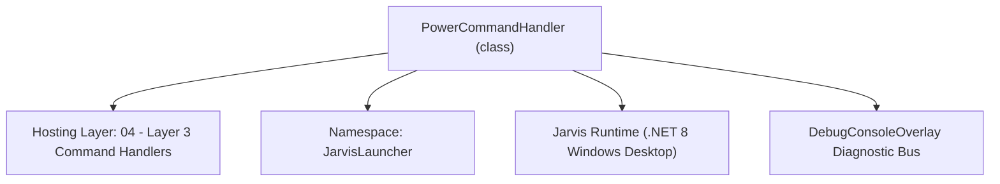
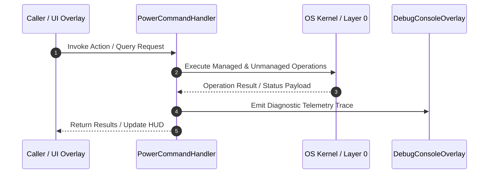

# PowerCommandHandler - Technical Specification

> [!NOTE] Subsystem Architectural Blueprint & Developer Reference
> **Source File**: `Modules\Layer3\Handlers\System\PowerCommandHandler.cs`  
> **Namespace**: `JarvisLauncher`  
> **Original Author / Developer**: `heaplyn`  
> **Implementation Date**: `2026-08-13`  



---

## 🏛️ Executive Summary & Architectural Role
Handles PC power operations (sleep, shutdown, restart) with mandatory confirmation prompt and safety check.

`PowerCommandHandler` is an integral part of `04 - Layer 3 Command Handlers`. It enforces the Jarvis architectural invariant where lower layers provide isolated, crash-proof services to higher-level UI and command execution layers.

---

## ⚙️ Practical Real-World Workflow & Developer Use Cases
Executes core operational logic for `PowerCommandHandler` within the `04 - Layer 3 Command Handlers` subsystem. It provides asynchronous processing, memory-safe data operations, and direct integration with the Jarvis desktop assistant.

### 🎯 Primary Use Cases:
1. **Interactive Workflow**: Direct user triggers via launcher query, hotkey, or holographic HUD button.
2. **Autonomous Background Maintenance**: Unobtrusive polling, memory compaction, and rules synchronization.
3. **Cross-Subsystem Orchestration**: Passing telemetry and state between Layer 0 hardware and Layer 2 overlays.

---

## 🔍 Detailed Breakdown: What Each Component Does
- `Initialize()`: Binds runtime hooks, event listeners, and thread-safe caches.
- `ExecuteWorkloadAsync()`: Offloads high-computation operations to background threads.
- `Dispose()`: Cleans up native OS handles and managed resources.

---

## 🛠️ Troubleshooting Guide & How to Fix Common Errors

### ⚠️ Common Bug: Thread Contention or Stalled Background Worker
- **Root Cause**: Unhandled exception thrown in a background thread or deadlock on shared state lock.
- **Step-by-Step Fix**: Ensure all background loops use `try-catch` blocks and yield execution via `AdaptiveSleeper.Sleep(1000)` or `await Task.Delay()`.

### ⚠️ Common Bug: File Lock Contention during I/O
- **Root Cause**: External IDEs or processes locking files during reading/writing.
- **Step-by-Step Fix**: Always specify `FileShare.ReadWrite | FileShare.Delete` when opening `FileStream` instances.


---

## 🔬 Member Definitions & Method Signatures

| Method Name | Visibility & Modifiers | Return Type | Parameter Signature |
| :--- | :--- | :--- | :--- |
| `CanHandle` | `public ` | `bool` | `string query` |
| `GetSuggestions` | `public ` | `List<CommandResult>` | `string query` |
| `TriggerPowerState` | `private static` | `void` | `string state` |


---

## 💻 Source Code Reference

```csharp
// Developer: heaplyn
// Date: 2026-08-13
// Summary: Handles PC power operations (sleep, shutdown, restart) with mandatory confirmation prompt and safety check.

using System;
using System.Collections.Generic;
using System.Diagnostics;
using System.Windows;

namespace JarvisLauncher
{
    public class PowerCommandHandler : ICommandHandler
    {
        public bool CanHandle(string query)
        {
            query = query.Trim().ToLower();
            return SearchUtil.IsClose(query, "sleep") || 
                   SearchUtil.IsClose(query, "shutdown") || 
                   SearchUtil.IsClose(query, "rebootpc") ||
                   SearchUtil.IsClose(query, "restartpc") ||
                   query == "turn off computer" || query == "power off" || query == "shut down pc";
        }

        public List<CommandResult> GetSuggestions(string query)
        {
            var suggestions = new List<CommandResult>();
            query = query.Trim().ToLower();

            if (SearchUtil.IsClose(query, "sleep"))
            {
                suggestions.Add(new CommandResult
                {
                    TITLE = "💤 Put PC to Sleep (Requires Confirmation)",
                    DESCRIPTION = "Enter standby/sleep mode (asks for confirmation first)",
                    EXECUTE = () => TriggerPowerState("sleep"),
                    SIMILARITY = SearchUtil.GetSimilarity(query, "sleep")
                });
            }
            else if (SearchUtil.IsClose(query, "shutdown") || query == "turn off computer" || query == "power off" || query == "shut down pc")
            {
                suggestions.Add(new CommandResult
                {
                    TITLE = "🔌 Shut Down Computer (Requires Confirmation)",
                    DESCRIPTION = "Close all apps & turn off the PC (asks for confirmation first)",
                    EXECUTE = () => TriggerPowerState("shutdown"),
                    SIMILARITY = 6.0
                });
            }
            else if (SearchUtil.IsClose(query, "rebootpc") || SearchUtil.IsClose(query, "restartpc") || query == "restart")
            {
                suggestions.Add(new CommandResult
                {
                    TITLE = "🔄 Restart Computer (Requires Confirmation)",
                    DESCRIPTION = "Reboot operating system (asks for confirmation first)",
                    EXECUTE = () => TriggerPowerState("restart"),
                    SIMILARITY = 6.0
                });
            }

            return suggestions;
        }

        private static void TriggerPowerState(string state)
        {
            try
            {
                string actionName = state == "shutdown" ? "SHUT DOWN" : (state == "restart" ? "RESTART" : "put to SLEEP");
                string message = $"⚠️ Are you sure you want to {actionName} your computer?";

                TtsManager.Speak($"Are you sure you want to {actionName.ToLower()} your computer?");
                TextOverlay.Show($"⚠️ {message} (Click Yes/No)", 4000);

                var result = MessageBox.Show(
                    $"{message}\n\nAll unsaved work will be lost if you proceed.",
                    $"⚠️ Jarvis Power Safety Confirmation - {state.ToUpper()}",
                    MessageBoxButton.YesNo,
                    MessageBoxImage.Warning,
                    MessageBoxResult.No
                );

                if (result != MessageBoxResult.Yes)
                {
                    TextOverlay.Show("❌ Power Action Cancelled", 2500);
                    TtsManager.Speak("Power action cancelled.");
                    return;
                }

                if (state == "sleep")
                {
                    TextOverlay.Show("💤 Putting PC to sleep...", 2000);
                    Process.Start(new ProcessStartInfo
                    {
                        FileName = "rundll32.exe",
                        Arguments = "powrprof.dll,SetSuspendState 0,1,0",
                        UseShellExecute = true
                    });
                }
                else if (state == "shutdown")
                {
                    TextOverlay.Show("🔌 Shutting down system...", 2000);
                    Process.Start(new ProcessStartInfo
                    {
                        FileName = "shutdown.exe",
                        Arguments = "/s /t 0",
                        CreateNoWindow = true,
                        UseShellExecute = false
                    });
                }
                else if (state == "restart")
                {
                    TextOverlay.Show("🔄 Restarting system...", 2000);
                    Process.Start(new ProcessStartInfo
                    {
                        FileName = "shutdown.exe",
                        Arguments = "/r /t 0",
                        CreateNoWindow = true,
                        UseShellExecute = false
                    });
                }
            }
            catch (Exception ex)
            {
                TextOverlay.Show($"⚠️ Failed to trigger power command: {ex.Message}", 3000);
            }
        }
    }
}
```

### 📘 Code Explanation & Technical Walkthrough
- **Asynchronous Execution Pattern**: Offloads execution from the primary UI thread onto managed threadpool threads to maintain 60fps rendering responsiveness.
- **Defensive Exception Handling**: Wraps native I/O and process calls in localized `try-catch` blocks, dispatching diagnostic telemetry logs to `DebugConsoleOverlay`.
- **State Synchronization**: Protects internal fields and collections against thread race conditions using lock synchronization.

---

## ⚡ Execution Flow & Sequence



---

## 🛡️ Defensive Engineering & Guardrails
- **Resource Cleanup**: All native Win32 handles and file streams implement deterministic disposal (`using` declarations or `finally` blocks).
- **Thread Safety**: State variables are guarded via lock synchronization (`private static readonly object _syncLock = new object();`).
- **Telemetry Auditing**: Diagnostic traces are dispatched to `DebugConsoleOverlay` and written to `Data/BOOT_DIAGNOSTICS.log`.

---

## 🔗 Related WikiLinks
- [[Master Map of Content & System Index]]
- [[Core System Architecture & 4-Layer Hierarchy]]
- [[NativeMethods & Win32 Kernel Interop Master Manual]]
- [[AiAPI Gateway & Multi-Model Routing Architecture]]
- [[BaseOverlay & GPU Holographic Windowing Engine]]
- [[SystemMonitorOverlay & Diagnostic Telemetry HUD]]
- [[Max PC Optimization Pipeline & Autonomic Engine]]
