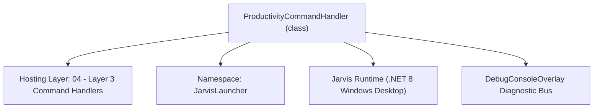
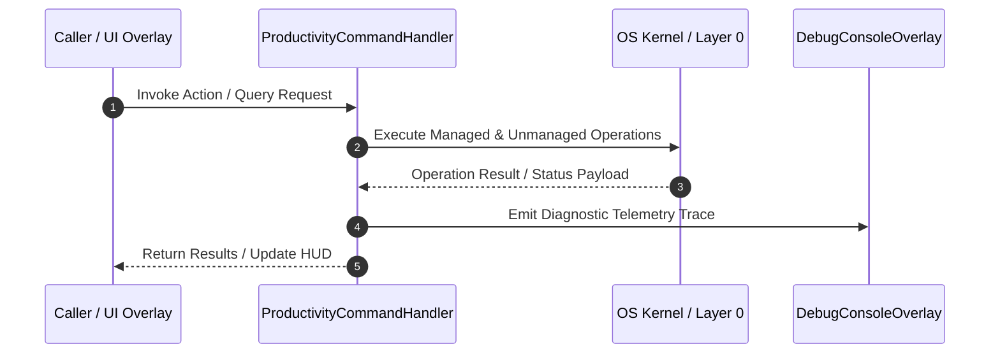

# ProductivityCommandHandler - Technical Specification

> [!NOTE] Subsystem Architectural Blueprint & Developer Reference
> **Source File**: `Modules\Layer3\Handlers\Productivity\ProductivityCommandHandler.cs`  
> **Namespace**: `JarvisLauncher`  
> **Original Author / Developer**: `heaplyn`  
> **Implementation Date**: `2026-08-09`  



---

## 🏛️ Executive Summary & Architectural Role
Handles quick note appending (`note <text>`) and reminder popups (`remind <time> <msg>`).

`ProductivityCommandHandler` is an integral part of `04 - Layer 3 Command Handlers`. It enforces the Jarvis architectural invariant where lower layers provide isolated, crash-proof services to higher-level UI and command execution layers.

---

## ⚙️ Practical Real-World Workflow & Developer Use Cases
Executes core operational logic for `ProductivityCommandHandler` within the `04 - Layer 3 Command Handlers` subsystem. It provides asynchronous processing, memory-safe data operations, and direct integration with the Jarvis desktop assistant.

### 🎯 Primary Use Cases:
1. **Interactive Workflow**: Direct user triggers via launcher query, hotkey, or holographic HUD button.
2. **Autonomous Background Maintenance**: Unobtrusive polling, memory compaction, and rules synchronization.
3. **Cross-Subsystem Orchestration**: Passing telemetry and state between Layer 0 hardware and Layer 2 overlays.

---

## 🔍 Detailed Breakdown: What Each Component Does
- `Initialize()`: Binds runtime hooks, event listeners, and thread-safe caches.
- `ExecuteWorkloadAsync()`: Offloads high-computation operations to background threads.
- `Dispose()`: Cleans up native OS handles and managed resources.

---

## 🛠️ Troubleshooting Guide & How to Fix Common Errors

### ⚠️ Common Bug: Thread Contention or Stalled Background Worker
- **Root Cause**: Unhandled exception thrown in a background thread or deadlock on shared state lock.
- **Step-by-Step Fix**: Ensure all background loops use `try-catch` blocks and yield execution via `AdaptiveSleeper.Sleep(1000)` or `await Task.Delay()`.

### ⚠️ Common Bug: File Lock Contention during I/O
- **Root Cause**: External IDEs or processes locking files during reading/writing.
- **Step-by-Step Fix**: Always specify `FileShare.ReadWrite | FileShare.Delete` when opening `FileStream` instances.


---

## 🔬 Member Definitions & Method Signatures

| Method Name | Visibility & Modifiers | Return Type | Parameter Signature |
| :--- | :--- | :--- | :--- |
| `CanHandle` | `public ` | `bool` | `string query` |
| `GetSuggestions` | `public ` | `List<CommandResult>` | `string query` |
| `AppendNote` | `private static` | `void` | `string noteText` |
| `ParseAndSetReminder` | `private static` | `void` | `string args` |
| `GetProjectRoot` | `private static` | `string` | `*none*` |
| `GetCommandDescriptions` | `public ` | `List<CommandDesc>` | `*none*` |


---

## 💻 Source Code Reference

```csharp
// Developer: heaplyn
// Date: 2026-08-09
// Summary: Handles quick note appending (`note <text>`) and reminder popups (`remind <time> <msg>`).

using System;
using System.Collections.Generic;
using System.IO;
using System.Threading.Tasks;

namespace JarvisLauncher
{
    public class ProductivityCommandHandler : ICommandHandler
    {
        public bool CanHandle(string query)
        {
            query = query.Trim().ToLower();
            return query == "note" || query.StartsWith("note ") || 
                   query == "remind" || query.StartsWith("remind ");
        }

        public List<CommandResult> GetSuggestions(string query)
        {
            var suggestions = new List<CommandResult>();
            query = query.Trim();
            var parts = query.Split(' ', 2, StringSplitOptions.RemoveEmptyEntries);
            string cmd = parts[0].ToLower();

            if (cmd == "note")
            {
                if (parts.Length > 1)
                {
                    string text = parts[1];
                    suggestions.Add(new CommandResult
                    {
                        TITLE       = $"Append Note: \"{text}\"",
                        DESCRIPTION = "Save quick timestamped entry into notes.txt",
                        SIMILARITY  = 2.0,
                        EXECUTE     = () => AppendNote(text)
                    });
                }
                else
                {
                    suggestions.Add(new CommandResult
                    {
                        TITLE       = "Quick Note (Prompt)...",
                        DESCRIPTION = "Prompt for text entry to append into notes.txt",
                        SIMILARITY  = 1.5,
                        EXECUTE     = () => InputPromptOverlay.Show("Enter note text to save:", (text) => AppendNote(text))
                    });

                    suggestions.Add(new CommandResult
                    {
                        TITLE       = "📓 Open Notes Studio",
                        DESCRIPTION = "Manage all hierarchical notes and categories",
                        SIMILARITY  = 1.0,
                        EXECUTE     = () => NoteManagerOverlay.ShowOverlay()
                    });
                }
            }
            else if (cmd == "remind")
            {
                if (parts.Length > 1)
                {
                    string args = parts[1];
                    suggestions.Add(new CommandResult
                    {
                        TITLE       = $"Set Reminder: {args}",
                        DESCRIPTION = "e.g. '10s Check oven' or '5m Take a break'",
                        SIMILARITY  = 2.0,
                        EXECUTE     = () => ParseAndSetReminder(args)
                    });
                }
                else
                {
                    suggestions.Add(new CommandResult
                    {
                        TITLE       = "Set Reminder (Prompt)...",
                        DESCRIPTION = "Prompt for reminder format: <duration> <message> (e.g. 5m Take break)",
                        SIMILARITY  = 1.5,
                        EXECUTE     = () => InputPromptOverlay.Show("Enter reminder (e.g. 10s Take break, 5m Rest):", (args) => ParseAndSetReminder(args))
                    });
                }
            }

            return suggestions;
        }

        private static void AppendNote(string noteText)
        {
            try
            {
                string relativePath = "Quick Notes.txt";
                string content = NotesManager.LoadNote(relativePath);
                string entry = $"[{DateTime.Now:yyyy-MM-dd HH:mm:ss}] {noteText}{Environment.NewLine}";
                NotesManager.SaveNote(relativePath, content + entry);
                TextOverlay.Show("📝 Note saved to Quick Notes!", 2500);
            }
            catch (Exception ex)
            {
                TextOverlay.Show($"⚠️ Failed to save note: {ex.Message}", 3000);
            }
        }

        private static void ParseAndSetReminder(string args)
        {
            var parts = args.Split(' ', 2, StringSplitOptions.RemoveEmptyEntries);
            if (parts.Length < 2)
            {
                TextOverlay.Show("⚠️ Invalid format! Use: remind <time><s|m|h> <message>", 3500);
                return;
            }

            string timeStr = parts[0].ToLower();
            string message = parts[1];

            int seconds = 0;
            if (timeStr.EndsWith("s") && int.TryParse(timeStr.TrimEnd('s'), out int s))
            {
                seconds = s;
            }
            else if (timeStr.EndsWith("m") && int.TryParse(timeStr.TrimEnd('m'), out int m))
            {
                seconds = m * 60;
            }
            else if (timeStr.EndsWith("h") && int.TryParse(timeStr.TrimEnd('h'), out int h))
            {
                seconds = h * 3600;
            }
            else if (int.TryParse(timeStr, out int defaultSec))
            {
                seconds = defaultSec;
            }
            else
            {
                TextOverlay.Show("⚠️ Invalid time duration (e.g. 30s, 5m, 1h)", 3500);
                return;
            }

            TextOverlay.Show($"⏰ Reminder set for {timeStr} from now", 2500);

            Task.Run(async () =>
            {
                await Task.Delay(seconds * 1000);
                System.Windows.Application.Current.Dispatcher.Invoke(() =>
                {
                    TextOverlay.Show($"🔔 REMINDER: {message}", 6000);
                });
            });
        }

        private static string GetProjectRoot()
        {
            string devPath = Path.GetFullPath(Path.Combine(AppDomain.CurrentDomain.BaseDirectory, @"..\..\.."));
            if (Directory.Exists(Path.Combine(devPath, "Modules")))
            {
                return devPath;
            }
            return AppDomain.CurrentDomain.BaseDirectory;
        }

        public List<CommandDesc> GetCommandDescriptions()
        {
            return new List<CommandDesc>
            {
                new CommandDesc("note <text>", "Quickly append text to notes.txt", "note Meeting at 3pm"),
                new CommandDesc("remind <time> <msg>", "Set popup alert timer (e.g. 5m, 30s)", "remind 10m Break")
            };
        }
    }
}
```

### 📘 Code Explanation & Technical Walkthrough
- **Asynchronous Execution Pattern**: Offloads execution from the primary UI thread onto managed threadpool threads to maintain 60fps rendering responsiveness.
- **Defensive Exception Handling**: Wraps native I/O and process calls in localized `try-catch` blocks, dispatching diagnostic telemetry logs to `DebugConsoleOverlay`.
- **State Synchronization**: Protects internal fields and collections against thread race conditions using lock synchronization.

---

## ⚡ Execution Flow & Sequence



---

## 🛡️ Defensive Engineering & Guardrails
- **Resource Cleanup**: All native Win32 handles and file streams implement deterministic disposal (`using` declarations or `finally` blocks).
- **Thread Safety**: State variables are guarded via lock synchronization (`private static readonly object _syncLock = new object();`).
- **Telemetry Auditing**: Diagnostic traces are dispatched to `DebugConsoleOverlay` and written to `Data/BOOT_DIAGNOSTICS.log`.

---

## 🔗 Related WikiLinks
- [[Master Map of Content & System Index]]
- [[Core System Architecture & 4-Layer Hierarchy]]
- [[NativeMethods & Win32 Kernel Interop Master Manual]]
- [[AiAPI Gateway & Multi-Model Routing Architecture]]
- [[BaseOverlay & GPU Holographic Windowing Engine]]
- [[SystemMonitorOverlay & Diagnostic Telemetry HUD]]
- [[Max PC Optimization Pipeline & Autonomic Engine]]
