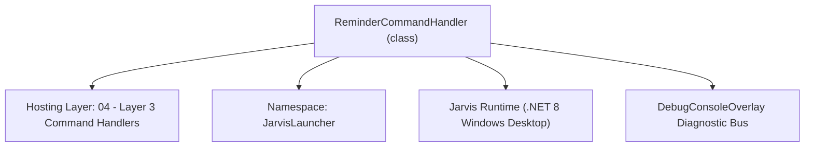
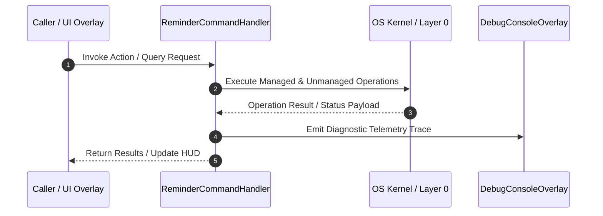

# ReminderCommandHandler - Technical Specification

> [!NOTE] Subsystem Architectural Blueprint & Developer Reference
> **Source File**: `Modules\Layer3\Handlers\Productivity\ReminderCommandHandler.cs`  
> **Namespace**: `JarvisLauncher`  
> **Original Author / Developer**: `copilot`  
> **Implementation Date**: `2026-08-13`  



---

## 🏛️ Executive Summary & Architectural Role
Handles CLI commands to schedule relative/absolute reminders, display active reminders in the console, or delete them.

`ReminderCommandHandler` is an integral part of `04 - Layer 3 Command Handlers`. It enforces the Jarvis architectural invariant where lower layers provide isolated, crash-proof services to higher-level UI and command execution layers.

---

## ⚙️ Practical Real-World Workflow & Developer Use Cases
Executes core operational logic for `ReminderCommandHandler` within the `04 - Layer 3 Command Handlers` subsystem. It provides asynchronous processing, memory-safe data operations, and direct integration with the Jarvis desktop assistant.

### 🎯 Primary Use Cases:
1. **Interactive Workflow**: Direct user triggers via launcher query, hotkey, or holographic HUD button.
2. **Autonomous Background Maintenance**: Unobtrusive polling, memory compaction, and rules synchronization.
3. **Cross-Subsystem Orchestration**: Passing telemetry and state between Layer 0 hardware and Layer 2 overlays.

---

## 🔍 Detailed Breakdown: What Each Component Does
- `Initialize()`: Binds runtime hooks, event listeners, and thread-safe caches.
- `ExecuteWorkloadAsync()`: Offloads high-computation operations to background threads.
- `Dispose()`: Cleans up native OS handles and managed resources.

---

## 🛠️ Troubleshooting Guide & How to Fix Common Errors

### ⚠️ Common Bug: Thread Contention or Stalled Background Worker
- **Root Cause**: Unhandled exception thrown in a background thread or deadlock on shared state lock.
- **Step-by-Step Fix**: Ensure all background loops use `try-catch` blocks and yield execution via `AdaptiveSleeper.Sleep(1000)` or `await Task.Delay()`.

### ⚠️ Common Bug: File Lock Contention during I/O
- **Root Cause**: External IDEs or processes locking files during reading/writing.
- **Step-by-Step Fix**: Always specify `FileShare.ReadWrite | FileShare.Delete` when opening `FileStream` instances.


---

## 🔬 Member Definitions & Method Signatures

| Method Name | Visibility & Modifiers | Return Type | Parameter Signature |
| :--- | :--- | :--- | :--- |
| `CanHandle` | `public ` | `bool` | `string query` |
| `GetSuggestions` | `public ` | `List<CommandResult>` | `string query` |
| `CalculateRelativeTime` | `private static` | `DateTime` | `int val, string unit` |
| `ParseAbsoluteTime` | `private static` | `DateTime` | `string timeStr` |
| `ScheduleReminder` | `private static` | `void` | `string msg, DateTime target` |
| `DeleteReminder` | `private static` | `void` | `int idx` |
| `ListReminders` | `private static` | `void` | `*none*` |
| `GetCommandDescriptions` | `public ` | `List<CommandDesc>` | `*none*` |


---

## 💻 Source Code Reference

```csharp
// Developer: copilot
// Date: 2026-08-13
// Summary: Handles CLI commands to schedule relative/absolute reminders, display active reminders in the console, or delete them.

using System;
using System.Collections.Generic;
using System.Text;
using System.Text.RegularExpressions;

namespace JarvisLauncher
{
    public class ReminderCommandHandler : ICommandHandler
    {
        public bool CanHandle(string query)
        {
            return SearchUtil.MatchesAny(query, "remind", "reminders");
        }

        public List<CommandResult> GetSuggestions(string query)
        {
            var suggestions = new List<CommandResult>();
            query = query.Trim();

            var parts = query.Split(new[] { ' ' }, StringSplitOptions.RemoveEmptyEntries);
            if (parts.Length == 0) return suggestions;

            string cmd = parts[0].ToLower();
            double similarity = SearchUtil.BestSimilarity(query, "remind", "reminders");

            if (parts.Length > 1)
            {
                string action = parts[1].ToLower();

                // List reminders
                if (action == "list")
                {
                    suggestions.Add(new CommandResult
                    {
                        TITLE = "🔔 View Active Reminders",
                        DESCRIPTION = "Display all currently pending alarms and reminders in the console",
                        SIMILARITY = similarity + 0.5,
                        EXECUTE = () => ListReminders()
                    });
                    return suggestions;
                }

                // Delete reminder
                if ((action == "delete" || action == "remove") && parts.Length > 2)
                {
                    if (int.TryParse(parts[2], out int idx))
                    {
                        suggestions.Add(new CommandResult
                        {
                            TITLE = $"🗑️ Delete Reminder #{idx}",
                            DESCRIPTION = "Remove this active reminder from the system scheduler",
                            SIMILARITY = similarity + 0.5,
                            EXECUTE = () => DeleteReminder(idx)
                        });
                        return suggestions;
                    }
                }
            }

            // --- REMINDER PARSING REVALUATION ---
            // Pattern 1: remind me in 10m to check the oven OR remind in 10m to check the oven
            var relativeMatch1 = Regex.Match(query, @"^(?:remind\s+me\s+in|remind\s+in)\s+(\d+)\s*([smh])\s+(?:to\s+)?(.+)$", RegexOptions.IgnoreCase);
            // Pattern 2: remind me to check the oven in 10m
            var relativeMatch2 = Regex.Match(query, @"^remind\s+me\s+to\s+(.+)\s+in\s+(\d+)\s*([smh])$", RegexOptions.IgnoreCase);

            if (relativeMatch1.Success)
            {
                int val = int.Parse(relativeMatch1.Groups[1].Value);
                string unit = relativeMatch1.Groups[2].Value.ToLower();
                string msg = relativeMatch1.Groups[3].Value.Trim();
                DateTime target = CalculateRelativeTime(val, unit);

                suggestions.Add(new CommandResult
                {
                    TITLE = $"🔔 Remind in {val}{unit}: \"{msg}\"",
                    DESCRIPTION = $"Set alert timer to fire on {target:HH:mm:ss}",
                    SIMILARITY = similarity + 1.0,
                    EXECUTE = () => ScheduleReminder(msg, target)
                });
                return suggestions;
            }
            else if (relativeMatch2.Success)
            {
                string msg = relativeMatch2.Groups[1].Value.Trim();
                int val = int.Parse(relativeMatch2.Groups[2].Value);
                string unit = relativeMatch2.Groups[3].Value.ToLower();
                DateTime target = CalculateRelativeTime(val, unit);

                suggestions.Add(new CommandResult
                {
                    TITLE = $"🔔 Remind in {val}{unit}: \"{msg}\"",
                    DESCRIPTION = $"Set alert timer to fire on {target:HH:mm:ss}",
                    SIMILARITY = similarity + 1.0,
                    EXECUTE = () => ScheduleReminder(msg, target)
                });
                return suggestions;
            }

            // Pattern 3: remind me to check mail at 15:30 OR remind me at 15:30 to check mail
            var absoluteMatch1 = Regex.Match(query, @"^remind\s+me\s+to\s+(.+)\s+at\s+(\d{1,2}:\d{2})$", RegexOptions.IgnoreCase);
            var absoluteMatch2 = Regex.Match(query, @"^(?:remind\s+me\s+at|remind\s+at)\s+(\d{1,2}:\d{2})\s+(?:to\s+)?(.+)$", RegexOptions.IgnoreCase);

            if (absoluteMatch1.Success)
            {
                string msg = absoluteMatch1.Groups[1].Value.Trim();
                string timeStr = absoluteMatch1.Groups[2].Value;
                DateTime target = ParseAbsoluteTime(timeStr);

                suggestions.Add(new CommandResult
                {
                    TITLE = $"🔔 Remind at {timeStr}: \"{msg}\"",
                    DESCRIPTION = $"Set alert scheduler to fire on {target:yyyy-MM-dd HH:mm:ss}",
                    SIMILARITY = similarity + 1.0,
                    EXECUTE = () => ScheduleReminder(msg, target)
                });
                return suggestions;
            }
            else if (absoluteMatch2.Success)
            {
                string timeStr = absoluteMatch2.Groups[1].Value;
                string msg = absoluteMatch2.Groups[2].Value.Trim();
                DateTime target = ParseAbsoluteTime(timeStr);

                suggestions.Add(new CommandResult
                {
                    TITLE = $"🔔 Remind at {timeStr}: \"{msg}\"",
                    DESCRIPTION = $"Set alert scheduler to fire on {target:yyyy-MM-dd HH:mm:ss}",
                    SIMILARITY = similarity + 1.0,
                    EXECUTE = () => ScheduleReminder(msg, target)
                });
                return suggestions;
            }

            // General defaults
            suggestions.Add(new CommandResult
            {
                TITLE = "🔔 View Active Reminders",
                DESCRIPTION = "List all active reminders using 'remind list'",
                SIMILARITY = similarity,
                EXECUTE = () => ListReminders()
            });

            suggestions.Add(new CommandResult
            {
                TITLE = "remind me in [duration] to [message]",
                DESCRIPTION = "Examples: 'remind me in 10m to stretch' or 'remind me at 18:00 to turn off PC'",
                SIMILARITY = similarity - 0.5,
                EXECUTE = null
            });

            return suggestions;
        }

        private static DateTime CalculateRelativeTime(int val, string unit)
        {
            var now = DateTime.Now;
            if (unit == "s") return now.AddSeconds(val);
            if (unit == "h") return now.AddHours(val);
            return now.AddMinutes(val); // default 'm'
        }

        private static DateTime ParseAbsoluteTime(string timeStr)
        {
            var now = DateTime.Now;
            var parts = timeStr.Split(':');
            int hour = int.Parse(parts[0]);
            int min = int.Parse(parts[1]);

            var target = new DateTime(now.Year, now.Month, now.Day, hour, min, 0);
            if (target <= now)
            {
                // Target is in past today, assume tomorrow
                target = target.AddDays(1);
            }
            return target;
        }

        private static void ScheduleReminder(string msg, DateTime target)
        {
            ReminderManager.AddReminder(msg, target);
            TextOverlay.Show($"🔔 Reminder Scheduled!\n\"{msg}\" at {target:HH:mm:ss}", 3000);
        }

        private static void DeleteReminder(int idx)
        {
            if (ReminderManager.DeleteReminder(idx))
            {
                TextOverlay.Show($"🗑️ Reminder #{idx} deleted.", 2000);
            }
            else
            {
                TextOverlay.Show($"⚠️ Invalid reminder index: {idx}", 3000);
            }
        }

        private static void ListReminders()
        {
            var active = ReminderManager.GetActiveReminders();
            var sb = new StringBuilder();

            sb.AppendLine("===================================================");
            sb.AppendLine("                JARVIS REMINDERS LIST              ");
            sb.AppendLine("===================================================");
            sb.AppendLine();

            if (active.Count == 0)
            {
                sb.AppendLine("[No active reminders scheduled. Type 'remind me in 5m to test' to set one.]");
            }
            else
            {
                for (int i = 0; i < active.Count; i++)
                {
                    var r = active[i];
                    sb.AppendLine($"{i + 1}. {r.TargetTime:yyyy-MM-dd HH:mm:ss} - {r.Message}");
                }
            }

            sb.AppendLine();
            sb.AppendLine("---------------------------------------------------");
            sb.AppendLine("Commands:");
            sb.AppendLine("- remind me in <time> to <content> : Add a reminder");
            sb.AppendLine("- remind me at <time> to <content> : Add a reminder");
            sb.AppendLine("- remind delete <index>            : Delete a reminder");

            CliOutputOverlay.Show("Reminders List", sb.ToString());
        }

        public List<CommandDesc> GetCommandDescriptions()
        {
            return new List<CommandDesc>
            {
                new CommandDesc("remind me to [msg] in [time]", "Schedule an alert reminder", "remind me in 10m to stretching")
            };
        }
    }
}
```

### 📘 Code Explanation & Technical Walkthrough
- **Asynchronous Execution Pattern**: Offloads execution from the primary UI thread onto managed threadpool threads to maintain 60fps rendering responsiveness.
- **Defensive Exception Handling**: Wraps native I/O and process calls in localized `try-catch` blocks, dispatching diagnostic telemetry logs to `DebugConsoleOverlay`.
- **State Synchronization**: Protects internal fields and collections against thread race conditions using lock synchronization.

---

## ⚡ Execution Flow & Sequence



---

## 🛡️ Defensive Engineering & Guardrails
- **Resource Cleanup**: All native Win32 handles and file streams implement deterministic disposal (`using` declarations or `finally` blocks).
- **Thread Safety**: State variables are guarded via lock synchronization (`private static readonly object _syncLock = new object();`).
- **Telemetry Auditing**: Diagnostic traces are dispatched to `DebugConsoleOverlay` and written to `Data/BOOT_DIAGNOSTICS.log`.

---

## 🔗 Related WikiLinks
- [[Master Map of Content & System Index]]
- [[Core System Architecture & 4-Layer Hierarchy]]
- [[NativeMethods & Win32 Kernel Interop Master Manual]]
- [[AiAPI Gateway & Multi-Model Routing Architecture]]
- [[BaseOverlay & GPU Holographic Windowing Engine]]
- [[SystemMonitorOverlay & Diagnostic Telemetry HUD]]
- [[Max PC Optimization Pipeline & Autonomic Engine]]
