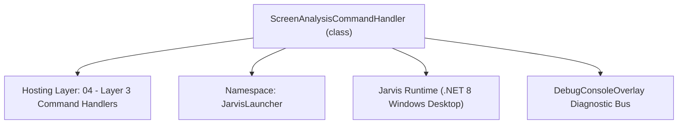
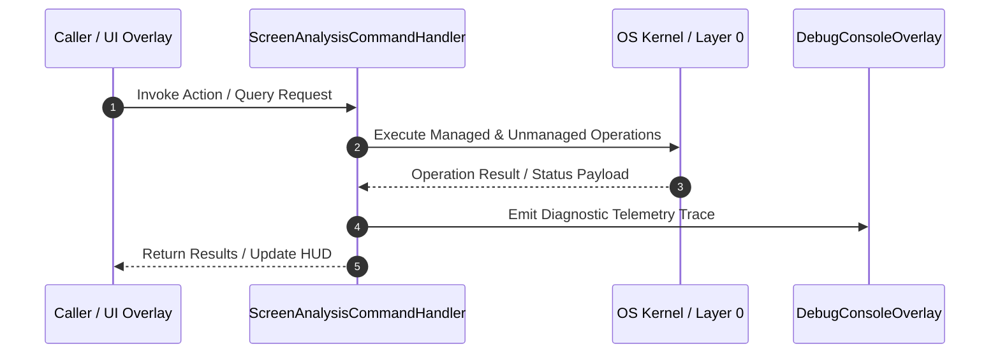

# ScreenAnalysisCommandHandler - Technical Specification

> [!NOTE] Subsystem Architectural Blueprint & Developer Reference
> **Source File**: `Modules\Layer3\Handlers\Media\ScreenAnalysisCommandHandler.cs`  
> **Namespace**: `JarvisLauncher`  
> **Original Author / Developer**: `copilot`  
> **Implementation Date**: `2026-08-13`  



---

## 🏛️ Executive Summary & Architectural Role
Handles CLI commands to open/toggle the visual screen analyzer overlay or trigger window grid auto-tiling instantly.

`ScreenAnalysisCommandHandler` is an integral part of `04 - Layer 3 Command Handlers`. It enforces the Jarvis architectural invariant where lower layers provide isolated, crash-proof services to higher-level UI and command execution layers.

---

## ⚙️ Practical Real-World Workflow & Developer Use Cases
Executes core operational logic for `ScreenAnalysisCommandHandler` within the `04 - Layer 3 Command Handlers` subsystem. It provides asynchronous processing, memory-safe data operations, and direct integration with the Jarvis desktop assistant.

### 🎯 Primary Use Cases:
1. **Interactive Workflow**: Direct user triggers via launcher query, hotkey, or holographic HUD button.
2. **Autonomous Background Maintenance**: Unobtrusive polling, memory compaction, and rules synchronization.
3. **Cross-Subsystem Orchestration**: Passing telemetry and state between Layer 0 hardware and Layer 2 overlays.

---

## 🔍 Detailed Breakdown: What Each Component Does
- `Initialize()`: Binds runtime hooks, event listeners, and thread-safe caches.
- `ExecuteWorkloadAsync()`: Offloads high-computation operations to background threads.
- `Dispose()`: Cleans up native OS handles and managed resources.

---

## 🛠️ Troubleshooting Guide & How to Fix Common Errors

### ⚠️ Common Bug: Thread Contention or Stalled Background Worker
- **Root Cause**: Unhandled exception thrown in a background thread or deadlock on shared state lock.
- **Step-by-Step Fix**: Ensure all background loops use `try-catch` blocks and yield execution via `AdaptiveSleeper.Sleep(1000)` or `await Task.Delay()`.

### ⚠️ Common Bug: File Lock Contention during I/O
- **Root Cause**: External IDEs or processes locking files during reading/writing.
- **Step-by-Step Fix**: Always specify `FileShare.ReadWrite | FileShare.Delete` when opening `FileStream` instances.


---

## 🔬 Member Definitions & Method Signatures

| Method Name | Visibility & Modifiers | Return Type | Parameter Signature |
| :--- | :--- | :--- | :--- |
| `CanHandle` | `public ` | `bool` | `string query` |
| `GetSuggestions` | `public ` | `List<CommandResult>` | `string query` |
| `GetCommandDescriptions` | `public ` | `List<CommandDesc>` | `*none*` |


---

## 💻 Source Code Reference

```csharp
// Developer: copilot
// Date: 2026-08-13
// Summary: Handles CLI commands to open/toggle the visual screen analyzer overlay or trigger window grid auto-tiling instantly.

using System;
using System.Collections.Generic;

namespace JarvisLauncher
{
    public class ScreenAnalysisCommandHandler : ICommandHandler
    {
        public bool CanHandle(string query)
        {
            return SearchUtil.MatchesAny(query, "analyze", "screen", "analyzer", "tile", "tiling", "screenvision", "screenmonitor", "analyze screen", "explain screen");
        }

        public List<CommandResult> GetSuggestions(string query)
        {
            var suggestions = new List<CommandResult>();
            string lower = query.Trim().ToLower();

            // Option 1: AI Screen Vision & Continuous Monitoring Studio
            suggestions.Add(new CommandResult
            {
                TITLE = "📹 Open AI Screen Vision & Continuous Monitoring Studio",
                DESCRIPTION = "Live screen preview, active window tracker, continuous screen watcher, & Gemini Vision AI analysis",
                SIMILARITY = (SearchUtil.BestSimilarity(query, "analyze", "screen", "analyzer", "tile", "tiling", "screenvision", "screenmonitor", "analyze screen", "explain screen") + 6.0 * 0.01),
                EXECUTE = () => ScreenVisionStudioOverlay.ShowOverlay()
            });

            // Option 2: Direct 1-Click AI Vision Screen Analysis
            if (lower.Contains("analyze") || lower.Contains("what is on my screen") || lower.Contains("explain"))
            {
                suggestions.Add(new CommandResult
                {
                    TITLE = "🧠 Analyze Current Screen with Gemini Vision AI",
                    DESCRIPTION = "Captures instant screen snapshot and explains visible code, windows, or applications",
                    SIMILARITY = (SearchUtil.BestSimilarity(query, "analyze", "screen", "analyzer", "tile", "tiling", "screenvision", "screenmonitor", "analyze screen", "explain screen") + 6.5 * 0.01),
                    EXECUTE = () => ScreenVisionStudioOverlay.ShowOverlay()
                });
            }

            // Option 3: Toggle Continuous Screen Monitor
            if (lower.Contains("start screen monitoring") || lower.Contains("stop screen monitoring"))
            {
                suggestions.Add(new CommandResult
                {
                    TITLE = ScreenMonitorEngine.IsMonitoring ? "🛑 Stop Continuous Screen Monitoring" : "📹 Start Continuous Screen Monitoring",
                    DESCRIPTION = "Toggle background automatic screen snapshot tracking (every 5 seconds)",
                    SIMILARITY = (SearchUtil.BestSimilarity(query, "analyze", "screen", "analyzer", "tile", "tiling", "screenvision", "screenmonitor", "analyze screen", "explain screen") + 6.5 * 0.01),
                    EXECUTE = () =>
                    {
                        ScreenMonitorEngine.Toggle();
                        TextOverlay.Show(ScreenMonitorEngine.IsMonitoring ? "📹 Screen Monitoring STARTED" : "🛑 Screen Monitoring STOPPED", 2500);
                    }
                });
            }

            // Option 4: Instantly tile windows
            suggestions.Add(new CommandResult
            {
                TITLE = "🧩 Auto-Tile Windows",
                DESCRIPTION = "Arrange all visible open desktop windows in a clean side-by-side grid layout",
                SIMILARITY = (SearchUtil.BestSimilarity(query, "analyze", "screen", "analyzer", "tile", "tiling", "screenvision", "screenmonitor", "analyze screen", "explain screen") + 4.5 * 0.01),
                EXECUTE = () => ScreenAnalyzer.TileActiveWindows()
            });

            return suggestions;
        }

        public List<CommandDesc> GetCommandDescriptions()
        {
            return new List<CommandDesc>
            {
                new CommandDesc("analyze / screen", "Open Workspace & Palette Analyzer dashboard", "analyze"),
                new CommandDesc("tile / tiling", "Instantly grid-tile all visible desktop windows", "tile")
            };
        }
    }
}
```

### 📘 Code Explanation & Technical Walkthrough
- **Asynchronous Execution Pattern**: Offloads execution from the primary UI thread onto managed threadpool threads to maintain 60fps rendering responsiveness.
- **Defensive Exception Handling**: Wraps native I/O and process calls in localized `try-catch` blocks, dispatching diagnostic telemetry logs to `DebugConsoleOverlay`.
- **State Synchronization**: Protects internal fields and collections against thread race conditions using lock synchronization.

---

## ⚡ Execution Flow & Sequence



---

## 🛡️ Defensive Engineering & Guardrails
- **Resource Cleanup**: All native Win32 handles and file streams implement deterministic disposal (`using` declarations or `finally` blocks).
- **Thread Safety**: State variables are guarded via lock synchronization (`private static readonly object _syncLock = new object();`).
- **Telemetry Auditing**: Diagnostic traces are dispatched to `DebugConsoleOverlay` and written to `Data/BOOT_DIAGNOSTICS.log`.

---

## 🔗 Related WikiLinks
- [[Master Map of Content & System Index]]
- [[Core System Architecture & 4-Layer Hierarchy]]
- [[NativeMethods & Win32 Kernel Interop Master Manual]]
- [[AiAPI Gateway & Multi-Model Routing Architecture]]
- [[BaseOverlay & GPU Holographic Windowing Engine]]
- [[SystemMonitorOverlay & Diagnostic Telemetry HUD]]
- [[Max PC Optimization Pipeline & Autonomic Engine]]
