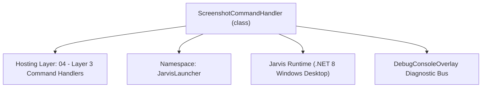
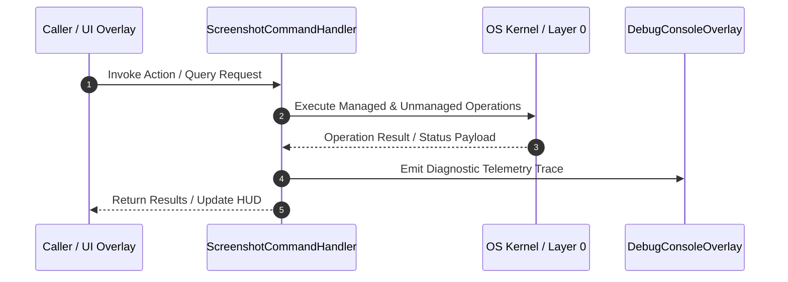

# ScreenshotCommandHandler - Technical Specification

> [!NOTE] Subsystem Architectural Blueprint & Developer Reference
> **Source File**: `Modules\Layer3\Handlers\Media\ScreenshotCommandHandler.cs`  
> **Namespace**: `JarvisLauncher`  
> **Original Author / Developer**: `heaplyn`  
> **Implementation Date**: `2026-08-09`  



---

## 🏛️ Executive Summary & Architectural Role
Handles CLI commands to capture a screenshot of the primary screen and save it to the system Pictures folder.

`ScreenshotCommandHandler` is an integral part of `04 - Layer 3 Command Handlers`. It enforces the Jarvis architectural invariant where lower layers provide isolated, crash-proof services to higher-level UI and command execution layers.

---

## ⚙️ Practical Real-World Workflow & Developer Use Cases
Executes core operational logic for `ScreenshotCommandHandler` within the `04 - Layer 3 Command Handlers` subsystem. It provides asynchronous processing, memory-safe data operations, and direct integration with the Jarvis desktop assistant.

### 🎯 Primary Use Cases:
1. **Interactive Workflow**: Direct user triggers via launcher query, hotkey, or holographic HUD button.
2. **Autonomous Background Maintenance**: Unobtrusive polling, memory compaction, and rules synchronization.
3. **Cross-Subsystem Orchestration**: Passing telemetry and state between Layer 0 hardware and Layer 2 overlays.

---

## 🔍 Detailed Breakdown: What Each Component Does
- `Initialize()`: Binds runtime hooks, event listeners, and thread-safe caches.
- `ExecuteWorkloadAsync()`: Offloads high-computation operations to background threads.
- `Dispose()`: Cleans up native OS handles and managed resources.

---

## 🛠️ Troubleshooting Guide & How to Fix Common Errors

### ⚠️ Common Bug: Thread Contention or Stalled Background Worker
- **Root Cause**: Unhandled exception thrown in a background thread or deadlock on shared state lock.
- **Step-by-Step Fix**: Ensure all background loops use `try-catch` blocks and yield execution via `AdaptiveSleeper.Sleep(1000)` or `await Task.Delay()`.

### ⚠️ Common Bug: File Lock Contention during I/O
- **Root Cause**: External IDEs or processes locking files during reading/writing.
- **Step-by-Step Fix**: Always specify `FileShare.ReadWrite | FileShare.Delete` when opening `FileStream` instances.


---

## 🔬 Member Definitions & Method Signatures

| Method Name | Visibility & Modifiers | Return Type | Parameter Signature |
| :--- | :--- | :--- | :--- |
| `CanHandle` | `public ` | `bool` | `string query` |
| `GetSuggestions` | `public ` | `List<CommandResult>` | `string query` |
| `OpenScreenshotsFolder` | `private static` | `void` | `*none*` |
| `TakeScreenshot` | `private static` | `void` | `*none*` |


---

## 💻 Source Code Reference

```csharp
// Developer: heaplyn
// Date: 2026-08-09
// Summary: Handles CLI commands to capture a screenshot of the primary screen and save it to the system Pictures folder.

using System;
using System.Collections.Generic;
using System.Drawing;
using System.Drawing.Imaging;
using System.IO;
using System.Windows.Forms;

namespace JarvisLauncher
{
    public class ScreenshotCommandHandler : ICommandHandler
    {
        public bool CanHandle(string query)
        {
            query = query.Trim().ToLower();
            return query == "screenshot" || query == "screen capture" || query == "capture" || query.Contains("screenshots");
        }

        public List<CommandResult> GetSuggestions(string query)
        {
            var suggestions = new List<CommandResult>();
            query = query.Trim().ToLower();

            double similarity = SearchUtil.GetSimilarity(query, "screenshot");

            suggestions.Add(new CommandResult
            {
                TITLE       = "Capture Screenshot",
                DESCRIPTION = "Save a PNG capture of your primary display to your Pictures folder",
                SIMILARITY  = similarity + 0.5,
                EXECUTE     = () => TakeScreenshot()
            });

            if (query.Contains("folder") || query.Contains("open") || query.Contains("view") || query.Contains("recent"))
            {
                suggestions.Add(new CommandResult
                {
                    TITLE = "Open Screenshots Folder",
                    DESCRIPTION = "Open the folder containing automatic memory captures",
                    SIMILARITY = 4.8,
                    EXECUTE = () => OpenScreenshotsFolder()
                });
            }

            return suggestions;
        }

        private static void OpenScreenshotsFolder()
        {
            try
            {
                string path = Path.Combine(PathHandler.GetDataDirectory(), "Screenshots");
                if (!Directory.Exists(path)) Directory.CreateDirectory(path);
                System.Diagnostics.Process.Start("explorer.exe", path);
            }
            catch { }
        }

        private static void TakeScreenshot()
        {
            try
            {
                var screen = Screen.PrimaryScreen ?? Screen.AllScreens[0];
                int width = screen.Bounds.Width;
                int height = screen.Bounds.Height;

                using (var bmp = new Bitmap(width, height))
                {
                    using (var g = Graphics.FromImage(bmp))
                    {
                        g.CopyFromScreen(0, 0, 0, 0, bmp.Size);
                    }

                    string screenshotsDir = Path.Combine(PathHandler.GetDataDirectory(), "Screenshots");
                    if (!Directory.Exists(screenshotsDir)) Directory.CreateDirectory(screenshotsDir);

                    string filename = $"Screenshot_{DateTime.Now:yyyyMMdd_HHmmss}.png";
                    string savePath = Path.Combine(screenshotsDir, filename);

                    bmp.Save(savePath, ImageFormat.Png);
                    TextOverlay.Show($"📸 Screenshot Saved to Data:\n{filename}", 3500);
                }
            }
            catch (Exception ex)
            {
                TextOverlay.Show($"⚠️ Screenshot failed: {ex.Message}", 3000);
            }
        }
    }
}
```

### 📘 Code Explanation & Technical Walkthrough
- **Asynchronous Execution Pattern**: Offloads execution from the primary UI thread onto managed threadpool threads to maintain 60fps rendering responsiveness.
- **Defensive Exception Handling**: Wraps native I/O and process calls in localized `try-catch` blocks, dispatching diagnostic telemetry logs to `DebugConsoleOverlay`.
- **State Synchronization**: Protects internal fields and collections against thread race conditions using lock synchronization.

---

## ⚡ Execution Flow & Sequence



---

## 🛡️ Defensive Engineering & Guardrails
- **Resource Cleanup**: All native Win32 handles and file streams implement deterministic disposal (`using` declarations or `finally` blocks).
- **Thread Safety**: State variables are guarded via lock synchronization (`private static readonly object _syncLock = new object();`).
- **Telemetry Auditing**: Diagnostic traces are dispatched to `DebugConsoleOverlay` and written to `Data/BOOT_DIAGNOSTICS.log`.

---

## 🔗 Related WikiLinks
- [[Master Map of Content & System Index]]
- [[Core System Architecture & 4-Layer Hierarchy]]
- [[NativeMethods & Win32 Kernel Interop Master Manual]]
- [[AiAPI Gateway & Multi-Model Routing Architecture]]
- [[BaseOverlay & GPU Holographic Windowing Engine]]
- [[SystemMonitorOverlay & Diagnostic Telemetry HUD]]
- [[Max PC Optimization Pipeline & Autonomic Engine]]
