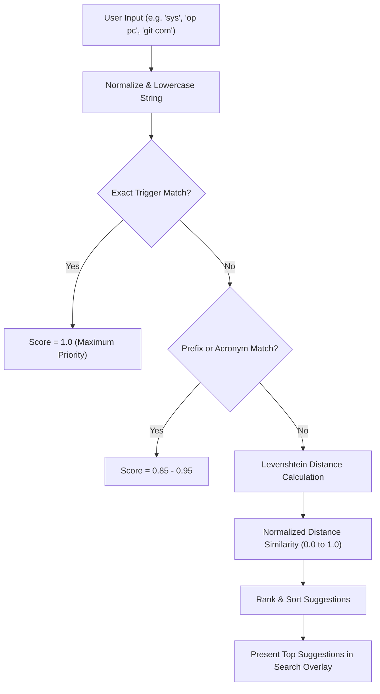

# 🔍 Search Engine, Fuzzy Matching & Command Dispatcher

## 🔍 High-Speed Fuzzy Search & Ranking Engine

`SearchUtil` (`Modules/Layer0/Common/SearchUtil.cs`) computes similarity scores between user search queries and command triggers in sub-millisecond execution time.

---

## 🧮 Levenshtein Distance & Word Boundary Algorithm
$$\text{Similarity}(S_1, S_2) = 1.0 - \frac{\text{LevenshteinDistance}(S_1, S_2)}{\max(\text{len}(S_1), \text{len}(S_2))}$$
Jarvis adds bonus weighting when search tokens match the beginnings of distinct words (e.g. `gco` matching `git checkout`).
