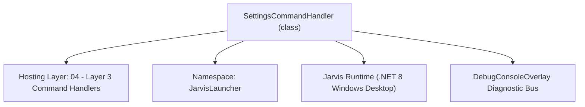
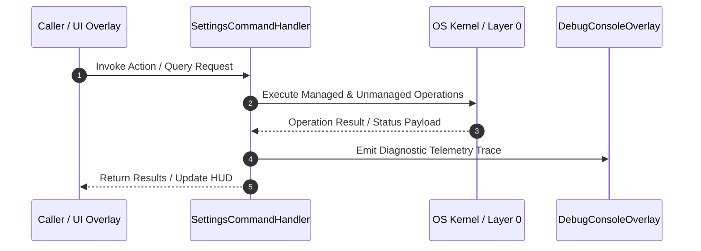

# SettingsCommandHandler - Technical Specification

> [!NOTE] Subsystem Architectural Blueprint & Developer Reference
> **Source File**: `Modules\Layer3\Handlers\System\SettingsCommandHandler.cs`  
> **Namespace**: `JarvisLauncher`  
> **Original Author / Developer**: `heaplyn`  
> **Implementation Date**: `2026-08-18`  



---

## 🏛️ Executive Summary & Architectural Role
Handles CLI commands to get or set system settings, API keys, and UI options.

`SettingsCommandHandler` is an integral part of `04 - Layer 3 Command Handlers`. It enforces the Jarvis architectural invariant where lower layers provide isolated, crash-proof services to higher-level UI and command execution layers.

---

## ⚙️ Practical Real-World Workflow & Developer Use Cases
Executes core operational logic for `SettingsCommandHandler` within the `04 - Layer 3 Command Handlers` subsystem. It provides asynchronous processing, memory-safe data operations, and direct integration with the Jarvis desktop assistant.

### 🎯 Primary Use Cases:
1. **Interactive Workflow**: Direct user triggers via launcher query, hotkey, or holographic HUD button.
2. **Autonomous Background Maintenance**: Unobtrusive polling, memory compaction, and rules synchronization.
3. **Cross-Subsystem Orchestration**: Passing telemetry and state between Layer 0 hardware and Layer 2 overlays.

---

## 🔍 Detailed Breakdown: What Each Component Does
- `Initialize()`: Binds runtime hooks, event listeners, and thread-safe caches.
- `ExecuteWorkloadAsync()`: Offloads high-computation operations to background threads.
- `Dispose()`: Cleans up native OS handles and managed resources.

---

## 🛠️ Troubleshooting Guide & How to Fix Common Errors

### ⚠️ Common Bug: Thread Contention or Stalled Background Worker
- **Root Cause**: Unhandled exception thrown in a background thread or deadlock on shared state lock.
- **Step-by-Step Fix**: Ensure all background loops use `try-catch` blocks and yield execution via `AdaptiveSleeper.Sleep(1000)` or `await Task.Delay()`.

### ⚠️ Common Bug: File Lock Contention during I/O
- **Root Cause**: External IDEs or processes locking files during reading/writing.
- **Step-by-Step Fix**: Always specify `FileShare.ReadWrite | FileShare.Delete` when opening `FileStream` instances.


---

## 🔬 Member Definitions & Method Signatures

| Method Name | Visibility & Modifiers | Return Type | Parameter Signature |
| :--- | :--- | :--- | :--- |
| `CanHandle` | `public ` | `bool` | `string query` |
| `GetSuggestions` | `public ` | `List<CommandResult>` | `string query` |
| `SetAlwaysOnTop` | `private static` | `void` | `bool value` |
| `GetCommandDescriptions` | `public ` | `List<CommandDesc>` | `*none*` |


---

## 💻 Source Code Reference

```csharp
// Developer: heaplyn
// Date: 2026-08-18
// Summary: Handles CLI commands to get or set system settings, API keys, and UI options.

using System;
using System.Collections.Generic;
using System.Linq;

namespace JarvisLauncher
{
    public class SettingsCommandHandler : ICommandHandler
    {
        public List<string> Aliases = new List<string> {
            "settings",
            "options",
            "config",
            "setup"
        };
        
        public bool CanHandle(string query)
        {
            string q = query.Trim().ToLower();
            foreach (string Member in Aliases)
            {
                if (q == Member || SearchUtil.IsClose(q, Member))
                Console.WriteLine(q);
                    return true;
            }
            return SearchUtil.IsClose(q,"settings") || Aliases.Any(a => q == a || SearchUtil.IsClose(q, a)) ||
                   q.StartsWith("ontop") || q.StartsWith("topmost") || q.StartsWith("alwaysontop") ||
                   q.StartsWith("opacity") || q.StartsWith("alpha") || q == "sleep" || q == "wake" ||
                   q.StartsWith("setkey") || q.StartsWith("apikey") || q.StartsWith("obsidian");
        }

        public List<CommandResult> GetSuggestions(string query)
        {
            var suggestions = new List<CommandResult>();
            string lowerQuery = query.Trim().ToLower();
            var parts = query.Split(' ', StringSplitOptions.RemoveEmptyEntries);
            if (parts.Length == 0) return suggestions;

            string cmd = parts[0].ToLower();

            if (lowerQuery == "settings" || lowerQuery == "options" || lowerQuery == "config")
            {
                suggestions.Add(new CommandResult {
                    TITLE = "⚙️ Open Master Settings Studio",
                    DESCRIPTION = "Configure AI, Themes, Voice ID, and HUD behavior",
                    SIMILARITY = 10.0,
                    EXECUTE = () => SettingsOverlay.ShowOverlay()
                });
                return suggestions;
            }

            if (cmd == "obsidian" && parts.Length > 2 && parts[1] == "path")
            {
                string path = query.Substring(query.IndexOf(parts[2])).Trim();
                suggestions.Add(new CommandResult {
                    TITLE = "Set Obsidian Vault Path",
                    DESCRIPTION = $"New path: {path}",
                    SIMILARITY = 9.0,
                    EXECUTE = () => { SettingsManager.Current.OBSIDIAN_VAULT_PATH = path; SettingsManager.Save(); TextOverlay.Show("✅ Obsidian path updated.", 2500); }
                });
            }

            if (cmd == "ontop")
            {
                bool current = SettingsManager.Current.ALWAYS_ON_TOP;
                suggestions.Add(new CommandResult {
                    TITLE = $"📌 Toggle Always On Top (Currently: {(current ? "On" : "Off")})",
                    DESCRIPTION = $"Switch Always On Top to {!current}",
                    SIMILARITY = 8.5,
                    EXECUTE = () => SetAlwaysOnTop(!current)
                });
            }

            return suggestions;
        }

        private static void SetAlwaysOnTop(bool value)
        {
            try {
                SettingsManager.Current.ALWAYS_ON_TOP = value;
                SettingsManager.Save();
                System.Windows.Application.Current.Dispatcher.Invoke(() => {
                    foreach (System.Windows.Window win in System.Windows.Application.Current.Windows) {
                        if (win is BaseOverlay bo) bo.Topmost = value;
                    }
                });
                TextOverlay.Show($"📌 Always On Top {(value ? "Enabled" : "Disabled")}", 2500);
            } catch { }
        }

        public List<CommandDesc> GetCommandDescriptions() => new List<CommandDesc> {
            new CommandDesc("options", "Open configuration studio", "options"),
            new CommandDesc("ontop", "Toggle window topmost", "ontop"),
            new CommandDesc("obsidian path <path>", "Set Obsidian vault", "obsidian path C:\\docs")
        };
    }
}
```

### 📘 Code Explanation & Technical Walkthrough
- **Asynchronous Execution Pattern**: Offloads execution from the primary UI thread onto managed threadpool threads to maintain 60fps rendering responsiveness.
- **Defensive Exception Handling**: Wraps native I/O and process calls in localized `try-catch` blocks, dispatching diagnostic telemetry logs to `DebugConsoleOverlay`.
- **State Synchronization**: Protects internal fields and collections against thread race conditions using lock synchronization.

---

## ⚡ Execution Flow & Sequence



---

## 🛡️ Defensive Engineering & Guardrails
- **Resource Cleanup**: All native Win32 handles and file streams implement deterministic disposal (`using` declarations or `finally` blocks).
- **Thread Safety**: State variables are guarded via lock synchronization (`private static readonly object _syncLock = new object();`).
- **Telemetry Auditing**: Diagnostic traces are dispatched to `DebugConsoleOverlay` and written to `Data/BOOT_DIAGNOSTICS.log`.

---

## 🔗 Related WikiLinks
- [[Master Map of Content & System Index]]
- [[Core System Architecture & 4-Layer Hierarchy]]
- [[NativeMethods & Win32 Kernel Interop Master Manual]]
- [[AiAPI Gateway & Multi-Model Routing Architecture]]
- [[BaseOverlay & GPU Holographic Windowing Engine]]
- [[SystemMonitorOverlay & Diagnostic Telemetry HUD]]
- [[Max PC Optimization Pipeline & Autonomic Engine]]
