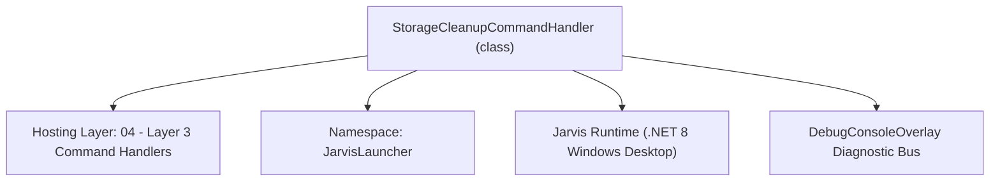
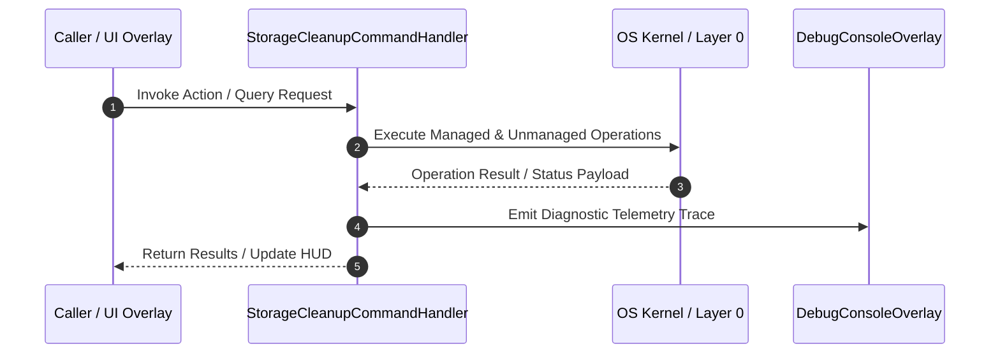

# StorageCleanupCommandHandler - Technical Specification

> [!NOTE] Subsystem Architectural Blueprint & Developer Reference
> **Source File**: `Modules\Layer3\Handlers\Productivity\StorageCleanupCommandHandler.cs`  
> **Namespace**: `JarvisLauncher`  
> **Original Author / Developer**: `heaplyn`  
> **Implementation Date**: `2026-08-17`  



---

## 🏛️ Executive Summary & Architectural Role
Handles CLI commands for storage analysis, cleaning temp files, and emptying the recycle bin.

`StorageCleanupCommandHandler` is an integral part of `04 - Layer 3 Command Handlers`. It enforces the Jarvis architectural invariant where lower layers provide isolated, crash-proof services to higher-level UI and command execution layers.

---

## ⚙️ Practical Real-World Workflow & Developer Use Cases
Executes core operational logic for `StorageCleanupCommandHandler` within the `04 - Layer 3 Command Handlers` subsystem. It provides asynchronous processing, memory-safe data operations, and direct integration with the Jarvis desktop assistant.

### 🎯 Primary Use Cases:
1. **Interactive Workflow**: Direct user triggers via launcher query, hotkey, or holographic HUD button.
2. **Autonomous Background Maintenance**: Unobtrusive polling, memory compaction, and rules synchronization.
3. **Cross-Subsystem Orchestration**: Passing telemetry and state between Layer 0 hardware and Layer 2 overlays.

---

## 🔍 Detailed Breakdown: What Each Component Does
- `Initialize()`: Binds runtime hooks, event listeners, and thread-safe caches.
- `ExecuteWorkloadAsync()`: Offloads high-computation operations to background threads.
- `Dispose()`: Cleans up native OS handles and managed resources.

---

## 🛠️ Troubleshooting Guide & How to Fix Common Errors

### ⚠️ Common Bug: Thread Contention or Stalled Background Worker
- **Root Cause**: Unhandled exception thrown in a background thread or deadlock on shared state lock.
- **Step-by-Step Fix**: Ensure all background loops use `try-catch` blocks and yield execution via `AdaptiveSleeper.Sleep(1000)` or `await Task.Delay()`.

### ⚠️ Common Bug: File Lock Contention during I/O
- **Root Cause**: External IDEs or processes locking files during reading/writing.
- **Step-by-Step Fix**: Always specify `FileShare.ReadWrite | FileShare.Delete` when opening `FileStream` instances.


---

## 🔬 Member Definitions & Method Signatures

| Method Name | Visibility & Modifiers | Return Type | Parameter Signature |
| :--- | :--- | :--- | :--- |
| `CanHandle` | `public ` | `bool` | `string query` |
| `GetSuggestions` | `public ` | `List<CommandResult>` | `string query` |
| `RunFullCleanup` | `private ` | `void` | `*none*` |
| `RunLargeFileAnalysis` | `private ` | `void` | `*none*` |
| `GetCommandDescriptions` | `public ` | `List<CommandDesc>` | `*none*` |


---

## 💻 Source Code Reference

```csharp
// Developer: heaplyn
// Date: 2026-08-17
// Summary: Handles CLI commands for storage analysis, cleaning temp files, and emptying the recycle bin.

using System;
using System.Collections.Generic;
using System.Linq;
using System.Text;
using System.Threading.Tasks;

namespace JarvisLauncher
{
    public class StorageCleanupCommandHandler : ICommandHandler
    {
        public bool CanHandle(string query)
        {
            return SearchUtil.MatchesAny(query, "heal", "selfheal", "self heal", "optimize", "cleanup", "clean", "storage", "disk", "purge", "empty recycle bin", "clear temp", "ram", "memory");
        }

        public List<CommandResult> GetSuggestions(string query)
        {
            var suggestions = new List<CommandResult>();
            string q = query.Trim().ToLower();

            suggestions.Add(new CommandResult
            {
                TITLE = "⚡ Self-Heal & Optimize System Memory",
                DESCRIPTION = "Trim RAM working set, compact heap, purge caches, and audit system integrity",
                SIMILARITY = (SearchUtil.BestSimilarity(query, "heal", "selfheal", "self heal", "optimize", "ram", "memory", "cleanup") + 9.5 * 0.01),
                EXECUTE = () => {
                    SelfHealingManager.AuditAndHealDirectories();
                    SelfHealingManager.AuditAndHealSettingsFile();
                    SelfHealingManager.AuditAndHealDataFiles();
                    SelfHealingManager.CompactAndHealMemory("User manual execution");
                    TextOverlay.Show("⚡ Jarvis Self-Healing: Memory compacted & integrity verified!", 3000);
                }
            });

            suggestions.Add(new CommandResult
            {
                TITLE = "🧹 Run Full System Cleanup",
                DESCRIPTION = "Purge temp files, empty recycle bin, and rotate old logs",
                SIMILARITY = (SearchUtil.BestSimilarity(query, "cleanup", "clean", "storage", "disk", "purge", "empty recycle bin", "clear temp") + 9.0 * 0.01),
                EXECUTE = () => RunFullCleanup()
            });

            suggestions.Add(new CommandResult
            {
                TITLE = "🗑️ Empty Recycle Bin",
                DESCRIPTION = "Permanently delete all items in the Windows Recycle Bin",
                SIMILARITY = (SearchUtil.BestSimilarity(query, "cleanup", "clean", "storage", "disk", "purge", "empty recycle bin", "clear temp") + 8.5 * 0.01),
                EXECUTE = () => Task.Run(async () => {
                    bool ok = await CoreRegistry.Data.StorageCleanup.EmptyRecycleBinAsync();
                    TextOverlay.Show(ok ? "🗑️ Recycle Bin Emptied!" : "⚠️ Bin is already empty.", 2500);
                })
            });

            suggestions.Add(new CommandResult
            {
                TITLE = "🧹 Clear Temporary Files",
                DESCRIPTION = "Purge the Windows %TEMP% directory to free up space",
                SIMILARITY = (SearchUtil.BestSimilarity(query, "cleanup", "clean", "storage", "disk", "purge", "empty recycle bin", "clear temp") + 8.0 * 0.01),
                EXECUTE = () => Task.Run(async () => {
                    int cleared = await CoreRegistry.Data.StorageCleanup.ClearTempFilesAsync();
                    TextOverlay.Show($"🧹 Cleared {cleared} temp files/folders!", 3000);
                })
            });

            suggestions.Add(new CommandResult
            {
                TITLE = "📊 Analyze Disk Space",
                DESCRIPTION = "Show free space on all connected drives",
                SIMILARITY = (SearchUtil.BestSimilarity(query, "cleanup", "clean", "storage", "disk", "purge", "empty recycle bin", "clear temp") + 7.5 * 0.01),
                EXECUTE = () => {
                    var info = CoreRegistry.Data.StorageCleanup.GetDiskSpaceInfo();
                    var sb = new StringBuilder("# Disk Space Report\n\n");
                    foreach (var kvp in info) sb.AppendLine($"- **{kvp.Key}**: {kvp.Value}");
                    ContentPreviewOverlay.Show("Storage Analysis", sb.ToString(), "markdown");
                }
            });

            suggestions.Add(new CommandResult
            {
                TITLE = "🔍 Find Large Files",
                DESCRIPTION = "Scan for files larger than 500MB in your user profile",
                SIMILARITY = (SearchUtil.BestSimilarity(query, "cleanup", "clean", "storage", "disk", "purge", "empty recycle bin", "clear temp") + 7.0 * 0.01),
                EXECUTE = () => RunLargeFileAnalysis()
            });

            return suggestions;
        }

        private void RunFullCleanup()
        {
            Task.Run(async () => {
                TextOverlay.Show("🧼 Jarvis is cleaning your system...", 4000);
                int temp = await CoreRegistry.Data.StorageCleanup.ClearTempFilesAsync();
                await CoreRegistry.Data.StorageCleanup.EmptyRecycleBinAsync();
                int logs = await CoreRegistry.Data.StorageCleanup.CleanOldLogsAsync(7);
                TextOverlay.Show($"✅ Cleanup Complete! Purged {temp + logs} items.", 4000);
            });
        }

        private void RunLargeFileAnalysis()
        {
            Task.Run(async () => {
                TextOverlay.Show("🔍 Scanning for large files...", 3000);
                string userPath = Environment.GetFolderPath(Environment.SpecialFolder.UserProfile);
                var files = await CoreRegistry.Data.StorageCleanup.FindLargeFilesAsync(userPath, 500 * 1024 * 1024, 15);

                var sb = new StringBuilder("# Large Files Discovery (>500MB)\n\n");
                if (files.Count == 0) sb.AppendLine("No files larger than 500MB found in user profile.");
                else {
                    foreach (var f in files) sb.AppendLine($"- **{f.Name}** ({f.ReadableSize})\n  `{f.Path}`\n");
                }
                ContentPreviewOverlay.Show("Storage Analysis", sb.ToString(), "markdown");
            });
        }

        public List<CommandDesc> GetCommandDescriptions()
        {
            return new List<CommandDesc>
            {
                new CommandDesc("cleanup", "Run full system storage cleanup", "cleanup"),
                new CommandDesc("disk", "Show disk space and large files", "disk"),
                new CommandDesc("empty recycle bin", "Purge the trash", "empty recycle bin")
            };
        }
    }
}
```

### 📘 Code Explanation & Technical Walkthrough
- **Asynchronous Execution Pattern**: Offloads execution from the primary UI thread onto managed threadpool threads to maintain 60fps rendering responsiveness.
- **Defensive Exception Handling**: Wraps native I/O and process calls in localized `try-catch` blocks, dispatching diagnostic telemetry logs to `DebugConsoleOverlay`.
- **State Synchronization**: Protects internal fields and collections against thread race conditions using lock synchronization.

---

## ⚡ Execution Flow & Sequence



---

## 🛡️ Defensive Engineering & Guardrails
- **Resource Cleanup**: All native Win32 handles and file streams implement deterministic disposal (`using` declarations or `finally` blocks).
- **Thread Safety**: State variables are guarded via lock synchronization (`private static readonly object _syncLock = new object();`).
- **Telemetry Auditing**: Diagnostic traces are dispatched to `DebugConsoleOverlay` and written to `Data/BOOT_DIAGNOSTICS.log`.

---

## 🔗 Related WikiLinks
- [[Master Map of Content & System Index]]
- [[Core System Architecture & 4-Layer Hierarchy]]
- [[NativeMethods & Win32 Kernel Interop Master Manual]]
- [[AiAPI Gateway & Multi-Model Routing Architecture]]
- [[BaseOverlay & GPU Holographic Windowing Engine]]
- [[SystemMonitorOverlay & Diagnostic Telemetry HUD]]
- [[Max PC Optimization Pipeline & Autonomic Engine]]
