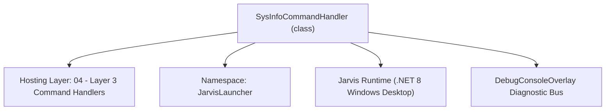
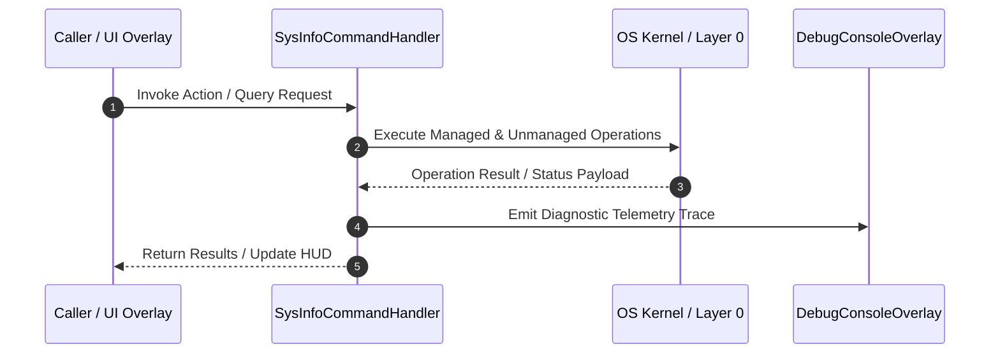

# SysInfoCommandHandler - Technical Specification

> [!NOTE] Subsystem Architectural Blueprint & Developer Reference
> **Source File**: `Modules\Layer3\Handlers\System\SysInfoCommandHandler.cs`  
> **Namespace**: `JarvisLauncher`  
> **Original Author / Developer**: `heaplyn`  
> **Implementation Date**: `2026-08-09`  



---

## 🏛️ Executive Summary & Architectural Role
Handles CLI commands to check system statistics, hardware specs (CPU, GPU, RAM, OS), and displays them inside the terminal overlay.

`SysInfoCommandHandler` is an integral part of `04 - Layer 3 Command Handlers`. It enforces the Jarvis architectural invariant where lower layers provide isolated, crash-proof services to higher-level UI and command execution layers.

---

## ⚙️ Practical Real-World Workflow & Developer Use Cases
Executes core operational logic for `SysInfoCommandHandler` within the `04 - Layer 3 Command Handlers` subsystem. It provides asynchronous processing, memory-safe data operations, and direct integration with the Jarvis desktop assistant.

### 🎯 Primary Use Cases:
1. **Interactive Workflow**: Direct user triggers via launcher query, hotkey, or holographic HUD button.
2. **Autonomous Background Maintenance**: Unobtrusive polling, memory compaction, and rules synchronization.
3. **Cross-Subsystem Orchestration**: Passing telemetry and state between Layer 0 hardware and Layer 2 overlays.

---

## 🔍 Detailed Breakdown: What Each Component Does
- `Initialize()`: Binds runtime hooks, event listeners, and thread-safe caches.
- `ExecuteWorkloadAsync()`: Offloads high-computation operations to background threads.
- `Dispose()`: Cleans up native OS handles and managed resources.

---

## 🛠️ Troubleshooting Guide & How to Fix Common Errors

### ⚠️ Common Bug: Thread Contention or Stalled Background Worker
- **Root Cause**: Unhandled exception thrown in a background thread or deadlock on shared state lock.
- **Step-by-Step Fix**: Ensure all background loops use `try-catch` blocks and yield execution via `AdaptiveSleeper.Sleep(1000)` or `await Task.Delay()`.

### ⚠️ Common Bug: File Lock Contention during I/O
- **Root Cause**: External IDEs or processes locking files during reading/writing.
- **Step-by-Step Fix**: Always specify `FileShare.ReadWrite | FileShare.Delete` when opening `FileStream` instances.


---

## 🔬 Member Definitions & Method Signatures

| Method Name | Visibility & Modifiers | Return Type | Parameter Signature |
| :--- | :--- | :--- | :--- |
| `CanHandle` | `public ` | `bool` | `string query` |
| `GetSuggestions` | `public ` | `List<CommandResult>` | `string query` |
| `ShowSpecs` | `private static` | `void` | `*none*` |
| `GetCpuName` | `private static` | `string` | `*none*` |
| `GetGpuName` | `private static` | `string` | `*none*` |
| `GetRamInfo` | `private static` | `string` | `*none*` |


---

## 💻 Source Code Reference

```csharp
// Developer: heaplyn
// Date: 2026-08-09
// Summary: Handles CLI commands to check system statistics, hardware specs (CPU, GPU, RAM, OS), and displays them inside the terminal overlay.

using System;
using System.Collections.Generic;
using System.IO;
using System.Runtime.InteropServices;
using System.Text;

namespace JarvisLauncher
{
    public class SysInfoCommandHandler : ICommandHandler
    {
        public bool CanHandle(string query)
        {
            query = query.Trim().ToLower();
            return query == "sysinfo" || query == "specs" || query == "systeminfo" || query == "system specs";
        }

        public List<CommandResult> GetSuggestions(string query)
        {
            var suggestions = new List<CommandResult>();
            query = query.Trim().ToLower();

            double similarity = Math.Max(
                SearchUtil.GetSimilarity(query, "specs"), 
                SearchUtil.GetSimilarity(query, "sysinfo")
            );

            suggestions.Add(new CommandResult
            {
                TITLE       = "System Specifications",
                DESCRIPTION = "Display detailed OS, CPU, GPU, and RAM specifications",
                SIMILARITY  = similarity + 0.5,
                EXECUTE     = () => ShowSpecs()
            });

            return suggestions;
        }

        private static void ShowSpecs()
        {
            var sb = new StringBuilder();
            sb.AppendLine("===================================================");
            sb.AppendLine("              SYSTEM SPECIFICATIONS REPORT         ");
            sb.AppendLine("===================================================");
            sb.AppendLine();

            sb.AppendLine($"OS Version:       {Environment.OSVersion}");
            sb.AppendLine($"Architecture:     {(Environment.Is64BitOperatingSystem ? "64-bit" : "32-bit")}");
            sb.AppendLine($"Machine Name:     {Environment.MachineName}");
            sb.AppendLine($"User Domain:      {Environment.UserDomainName}");
            sb.AppendLine($"System Directory: {Environment.SystemDirectory}");
            sb.AppendLine();

            sb.AppendLine("--- HARDWARE DETAILED ---");
            sb.AppendLine($"Processor count:  {Environment.ProcessorCount} Cores");
            sb.AppendLine($"CPU Model:        {GetCpuName()}");
            sb.AppendLine($"GPU Model:        {GetGpuName()}");
            sb.AppendLine($"Physical RAM:     {GetRamInfo()}");
            sb.AppendLine();

            CliOutputOverlay.Show("System Specifications", sb.ToString());
        }

        private static string GetCpuName()
        {
            try
            {
                object? val = Microsoft.Win32.Registry.GetValue(@"HKEY_LOCAL_MACHINE\HARDWARE\DESCRIPTION\System\CentralProcessor\0", "ProcessorNameString", "");
                return val?.ToString()?.Trim() ?? "Unknown CPU";
            }
            catch { return "Unknown CPU"; }
        }

        private static string GetGpuName()
        {
            try
            {
                for (int i = 0; i < 5; i++)
                {
                    string path = $@"HKEY_LOCAL_MACHINE\SYSTEM\CurrentControlSet\Control\Class\{{4d36e968-e325-11ce-bfc1-08002be10318}}\000{i}";
                    object? val = Microsoft.Win32.Registry.GetValue(path, "DriverDesc", null);
                    if (val != null)
                    {
                        return val.ToString() ?? "Unknown GPU";
                    }
                }
            }
            catch { }
            return "Unknown GPU";
        }

        private static string GetRamInfo()
        {
            var memStatus = new NativeMethods.MEMORYSTATUSEX();
            memStatus.dwLength = (uint)Marshal.SizeOf(typeof(NativeMethods.MEMORYSTATUSEX));
            if (NativeMethods.GlobalMemoryStatusEx(ref memStatus))
            {
                double totalGb = memStatus.ullTotalPhys / (1024.0 * 1024.0 * 1024.0);
                double availGb = memStatus.ullAvailPhys / (1024.0 * 1024.0 * 1024.0);
                return $"{totalGb:F1} GB Total ({availGb:F1} GB Available)";
            }
            return "Unknown RAM";
        }
    }
}
```

### 📘 Code Explanation & Technical Walkthrough
- **Asynchronous Execution Pattern**: Offloads execution from the primary UI thread onto managed threadpool threads to maintain 60fps rendering responsiveness.
- **Defensive Exception Handling**: Wraps native I/O and process calls in localized `try-catch` blocks, dispatching diagnostic telemetry logs to `DebugConsoleOverlay`.
- **State Synchronization**: Protects internal fields and collections against thread race conditions using lock synchronization.

---

## ⚡ Execution Flow & Sequence



---

## 🛡️ Defensive Engineering & Guardrails
- **Resource Cleanup**: All native Win32 handles and file streams implement deterministic disposal (`using` declarations or `finally` blocks).
- **Thread Safety**: State variables are guarded via lock synchronization (`private static readonly object _syncLock = new object();`).
- **Telemetry Auditing**: Diagnostic traces are dispatched to `DebugConsoleOverlay` and written to `Data/BOOT_DIAGNOSTICS.log`.

---

## 🔗 Related WikiLinks
- [[Master Map of Content & System Index]]
- [[Core System Architecture & 4-Layer Hierarchy]]
- [[NativeMethods & Win32 Kernel Interop Master Manual]]
- [[AiAPI Gateway & Multi-Model Routing Architecture]]
- [[BaseOverlay & GPU Holographic Windowing Engine]]
- [[SystemMonitorOverlay & Diagnostic Telemetry HUD]]
- [[Max PC Optimization Pipeline & Autonomic Engine]]
