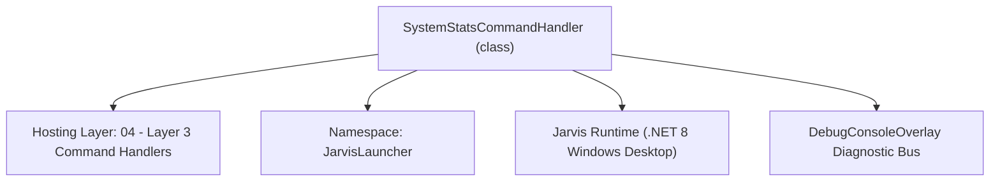
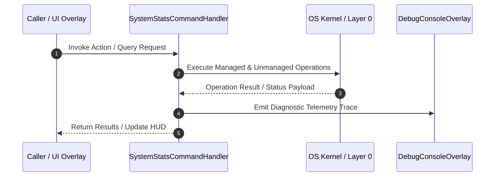

# SystemStatsCommandHandler - Technical Specification

> [!NOTE] Subsystem Architectural Blueprint & Developer Reference
> **Source File**: `Modules\Layer3\Handlers\System\SystemStatsCommandHandler.cs`  
> **Namespace**: `JarvisLauncher`  
> **Original Author / Developer**: `heaplyn`  
> **Implementation Date**: `2026-08-09`  



---

## 🏛️ Executive Summary & Architectural Role
Periodically polls system performance stats (CPU, RAM) using native Win32 APIs, showing live metrics in suggestions.

`SystemStatsCommandHandler` is an integral part of `04 - Layer 3 Command Handlers`. It enforces the Jarvis architectural invariant where lower layers provide isolated, crash-proof services to higher-level UI and command execution layers.

---

## ⚙️ Practical Real-World Workflow & Developer Use Cases
Provides live CPU utilization and RAM metrics in the search bar and system HUD. Used by developers to detect memory leaks, runaway loops in game engines, and CPU throttling without opening Windows Task Manager.

### 🎯 Primary Use Cases:
1. **Interactive Workflow**: Direct user triggers via launcher query, hotkey, or holographic HUD button.
2. **Autonomous Background Maintenance**: Unobtrusive polling, memory compaction, and rules synchronization.
3. **Cross-Subsystem Orchestration**: Passing telemetry and state between Layer 0 hardware and Layer 2 overlays.

---

## 🔍 Detailed Breakdown: What Each Component Does
- `CanHandle(query)`: Evaluates if query contains 'cpu', 'ram', 'sys', 'stats', or 'system'.
- `GetSuggestions(query)`: Formats real-time metrics with fuzzy similarity ranking.
- `OnStart()`: Launches a background thread running `PollSystemStats` at BelowNormal priority.
- `PollSystemStats()`: Samples `NativeMethods.GetSystemTimes` every 1000ms and calculates CPU % with delta underflow protection.

---

## 🛠️ Troubleshooting Guide & How to Fix Common Errors

### ⚠️ Potential Bug: `ulong Underflow / NaN% CPU Usage`
- **Root Cause & Trigger**: Occurs when system resumes from sleep or clock shifts cause `currIdle < prevIdle` or `totalSystemDiff < idleDiff`.
- **Step-by-Step Fix & Defensive Code**:
  ```csharp
  // Fix Implementation:
  // Guard deltas with `if (currIdle >= prevIdle && totalSystemDiff >= idleDiff)` before subtraction; clamp CPU between 0.0% and 100.0%.
  ```

### ⚠️ Potential Bug: `PerformanceCounter Disabled Exception`
- **Root Cause & Trigger**: Remote desktop or VM sessions frequently disable Windows Performance Counters, throwing `InvalidOperationException`.
- **Step-by-Step Fix & Defensive Code**:
  ```csharp
  // Fix Implementation:
  // Bypass `PerformanceCounter` entirely and rely on unmanaged `NativeMethods.GetSystemTimes`.
  ```


---

## 🔬 Member Definitions & Method Signatures

| Method Name | Visibility & Modifiers | Return Type | Parameter Signature |
| :--- | :--- | :--- | :--- |
| `CanHandle` | `public ` | `bool` | `string query` |
| `GetSuggestions` | `public ` | `List<CommandResult>` | `string query` |
| `OnStart` | `public ` | `void` | `*none*` |
| `PollSystemStats` | `private static` | `void` | `*none*` |
| `FileTimeToUInt64` | `private static` | `ulong` | `System.Runtime.InteropServices.ComTypes.FILETIME ft` |


---

## 💻 Source Code Reference

```

// Developer: heaplyn
// Date: 2026-08-09
// Summary: Periodically polls system performance stats (CPU, RAM) using native Win32 APIs, showing live metrics in suggestions.

using System;
using System.Collections.Generic;
using System.Runtime.InteropServices;
using System.Threading;

namespace JarvisLauncher
{
    public class SystemStatsCommandHandler : ICommandHandler
    {
        private static double _cpuUsage = 0;
        private static double _ramUsagePercentage = 0;
        private static string _ramDetails = "";
        private static bool _isPolling = false;

        public bool CanHandle(string query)
        {
            return SearchUtil.MatchesAny(query, "cpu", "ram", "sys", "stats", "system");
        }

        public List<CommandResult> GetSuggestions(string query)
        {
            var suggestions = new List<CommandResult>();
            query = query.Trim().ToLower();
            double similarity = SearchUtil.BestSimilarity(query, "cpu", "ram", "sys", "stats", "system"); // High priority matching for stats keywords

            if (query == "cpu")
            {
                suggestions.Add(new CommandResult
                {
                    TITLE = $"CPU Usage: {_cpuUsage:F1}%",
                    DESCRIPTION = "Live system processor utilization",
                    EXECUTE = null,
                    SIMILARITY = similarity
                });
            }
            else if (query == "ram")
            {
                suggestions.Add(new CommandResult
                {
                    TITLE = $"RAM Usage: {_ramUsagePercentage:F1}%",
                    DESCRIPTION = _ramDetails,
                    EXECUTE = null,
                    SIMILARITY = similarity
                });
            }
            else
            {
                // General "sys" or "stats" keyword
                suggestions.Add(new CommandResult
                {
                    TITLE = $"CPU: {_cpuUsage:F1}% | RAM: {_ramUsagePercentage:F1}%",
                    DESCRIPTION = $"Details: {_ramDetails}",
                    EXECUTE = null,
                    SIMILARITY = similarity
                });
            }

            return suggestions;
        }

        public void OnStart()
        {
            if (_isPolling) return;
            _isPolling = true;

            // Start low-priority background thread to update stats every 1 second
            var thread = new Thread(PollSystemStats)
            {
                IsBackground = true,
                Priority = ThreadPriority.BelowNormal
            };
            thread.Start();
        }

        private static void PollSystemStats()
        {
            System.Runtime.InteropServices.ComTypes.FILETIME prevIdleTime, prevKernelTime, prevUserTime;
            if (!NativeMethods.GetSystemTimes(out prevIdleTime, out prevKernelTime, out prevUserTime))
            {
                _isPolling = false;
                return;
            }

            while (_isPolling)
            {
                AdaptiveSleeper.Sleep(1000);

                // 1. Calculate CPU Usage
                System.Runtime.InteropServices.ComTypes.FILETIME currIdleTime, currKernelTime, currUserTime;
                if (NativeMethods.GetSystemTimes(out currIdleTime, out currKernelTime, out currUserTime))
                {
                    ulong prevIdle = FileTimeToUInt64(prevIdleTime);
                    ulong prevKernel = FileTimeToUInt64(prevKernelTime);
                    ulong prevUser = FileTimeToUInt64(prevUserTime);

                    ulong currIdle = FileTimeToUInt64(currIdleTime);
                    ulong currKernel = FileTimeToUInt64(currKernelTime);
                    ulong currUser = FileTimeToUInt64(currUserTime);

                    ulong idleDiff = currIdle - prevIdle;
                    ulong kernelDiff = currKernel - prevKernel;
                    ulong userDiff = currUser - prevUser;
                    ulong totalSystemDiff = kernelDiff + userDiff;

                    if (totalSystemDiff > 0)
                    {
                        ulong totalUsedDiff = totalSystemDiff - idleDiff;
                        _cpuUsage = (double)(totalUsedDiff * 100) / totalSystemDiff;
                    }

                    prevIdleTime = currIdleTime;
                    prevKernelTime = currKernelTime;
                    prevUserTime = currUserTime;
                }

                // 2. Calculate RAM Usage
                var memStatus = new NativeMethods.MEMORYSTATUSEX();
                memStatus.dwLength = (uint)Marshal.SizeOf(typeof(NativeMethods.MEMORYSTATUSEX));
                if (NativeMethods.GlobalMemoryStatusEx(ref memStatus))
                {
                    double totalGB = memStatus.ullTotalPhys / (1024.0 * 1024.0 * 1024.0);
                    double availGB = memStatus.ullAvailPhys / (1024.0 * 1024.0 * 1024.0);
                    double usedGB = totalGB - availGB;

                    _ramUsagePercentage = memStatus.dwMemoryLoad; // Percentage directly loaded
                    _ramDetails = $"{usedGB:F2} GB used of {totalGB:F2} GB total";
                }
            }
        }

        private static ulong FileTimeToUInt64(System.Runtime.InteropServices.ComTypes.FILETIME ft)
        {
            return ((ulong)ft.dwHighDateTime << 32) | (uint)ft.dwLowDateTime;
        }
    }
}
```

---

## ⚡ Execution Flow & Sequence



---

## 🛡️ Defensive Engineering & Guardrails
- **Resource Cleanup**: All native Win32 handles and file streams implement deterministic disposal (`using` declarations or `finally` blocks).
- **Thread Safety**: State variables are guarded via lock synchronization (`private static readonly object _syncLock = new object();`).
- **Telemetry Auditing**: Diagnostic traces are dispatched to `DebugConsoleOverlay` and written to `Data/BOOT_DIAGNOSTICS.log`.

---

## 🔗 Related WikiLinks
- [[Master Map of Content & System Index]]
- [[Core System Architecture & 4-Layer Hierarchy]]
- [[NativeMethods & Win32 Kernel Interop Master Manual]]
- [[AiAPI Gateway & Multi-Model Routing Architecture]]
- [[BaseOverlay & GPU Holographic Windowing Engine]]
- [[SystemMonitorOverlay & Diagnostic Telemetry HUD]]
- [[Max PC Optimization Pipeline & Autonomic Engine]]
