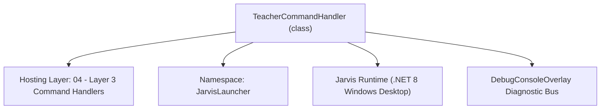
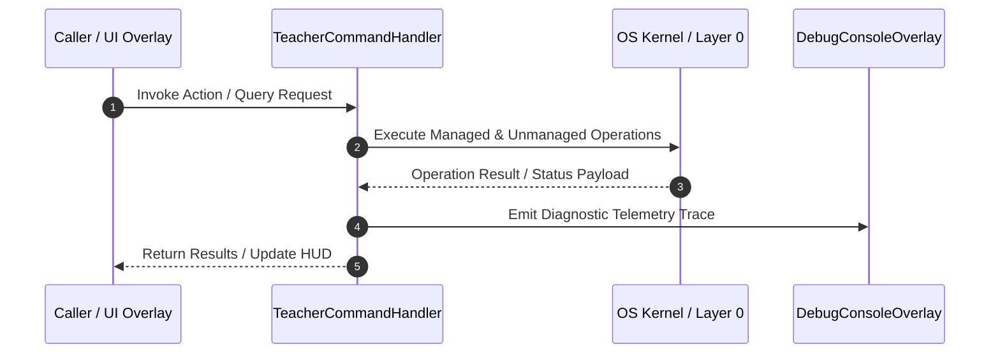

# TeacherCommandHandler - Technical Specification

> [!NOTE] Subsystem Architectural Blueprint & Developer Reference
> **Source File**: `Modules\Layer3\Handlers\AI\TeacherCommandHandler.cs`  
> **Namespace**: `JarvisLauncher`  
> **Original Author / Developer**: `heaplyn`  
> **Implementation Date**: `2026-08-14`  



---

## 🏛️ Executive Summary & Architectural Role
Handles commands to toggle teacher mode and run code scans using the Code Teacher Manager.

`TeacherCommandHandler` is an integral part of `04 - Layer 3 Command Handlers`. It enforces the Jarvis architectural invariant where lower layers provide isolated, crash-proof services to higher-level UI and command execution layers.

---

## ⚙️ Practical Real-World Workflow & Developer Use Cases
Executes core operational logic for `TeacherCommandHandler` within the `04 - Layer 3 Command Handlers` subsystem. It provides asynchronous processing, memory-safe data operations, and direct integration with the Jarvis desktop assistant.

### 🎯 Primary Use Cases:
1. **Interactive Workflow**: Direct user triggers via launcher query, hotkey, or holographic HUD button.
2. **Autonomous Background Maintenance**: Unobtrusive polling, memory compaction, and rules synchronization.
3. **Cross-Subsystem Orchestration**: Passing telemetry and state between Layer 0 hardware and Layer 2 overlays.

---

## 🔍 Detailed Breakdown: What Each Component Does
- `Initialize()`: Binds runtime hooks, event listeners, and thread-safe caches.
- `ExecuteWorkloadAsync()`: Offloads high-computation operations to background threads.
- `Dispose()`: Cleans up native OS handles and managed resources.

---

## 🛠️ Troubleshooting Guide & How to Fix Common Errors

### ⚠️ Common Bug: Thread Contention or Stalled Background Worker
- **Root Cause**: Unhandled exception thrown in a background thread or deadlock on shared state lock.
- **Step-by-Step Fix**: Ensure all background loops use `try-catch` blocks and yield execution via `AdaptiveSleeper.Sleep(1000)` or `await Task.Delay()`.

### ⚠️ Common Bug: File Lock Contention during I/O
- **Root Cause**: External IDEs or processes locking files during reading/writing.
- **Step-by-Step Fix**: Always specify `FileShare.ReadWrite | FileShare.Delete` when opening `FileStream` instances.


---

## 🔬 Member Definitions & Method Signatures

| Method Name | Visibility & Modifiers | Return Type | Parameter Signature |
| :--- | :--- | :--- | :--- |
| `CanHandle` | `public ` | `bool` | `string query` |
| `GetSuggestions` | `public ` | `List<CommandResult>` | `string query` |


---

## 💻 Source Code Reference

```csharp
// Developer: heaplyn
// Date: 2026-08-14
// Summary: Handles commands to toggle teacher mode and run code scans using the Code Teacher Manager.

using System;
using System.Collections.Generic;
using System.IO;
using System.Linq;
using System.Threading.Tasks;

namespace JarvisLauncher
{
    public class TeacherCommandHandler : ICommandHandler
    {
        public bool CanHandle(string query)
        {
            return SearchUtil.MatchesAny(query, "teacher");
        }

        public List<CommandResult> GetSuggestions(string query)
        {
            var suggestions = new List<CommandResult>();
            string q = query.Trim();
            string lower = q.ToLower();

            // 1. Toggle Teacher Mode
            if (lower == "teacher toggle" || lower == "teacher")
            {
                bool nextState = !SettingsManager.Current.IS_TEACHER_MODE_ENABLED;
                suggestions.Add(new CommandResult
                {
                    TITLE = $"🎓 Toggle Teacher Mode (Currently {(SettingsManager.Current.IS_TEACHER_MODE_ENABLED ? "Enabled" : "Disabled")})",
                    DESCRIPTION = $"Switch teaching assistance to {(nextState ? "Enabled" : "Disabled")}",
                    EXECUTE = () =>
                    {
                        SettingsManager.Current.IS_TEACHER_MODE_ENABLED = nextState;
                        SettingsManager.Save();
                        string msg = $"Teacher Mode is now {(nextState ? "Active" : "Inactive")}.";
                        TtsManager.Speak(msg);
                        TextOverlay.Show($"🎓 Teacher Mode: {(nextState ? "ON" : "OFF")}", 3000);
                    },
                    SIMILARITY = (SearchUtil.BestSimilarity(query, "teacher") + 8.5 * 0.01)
                });
            }

            // 1b. Open Teacher Studio (goal-aware live tutor)
            if (lower == "teacher" || lower.Contains("studio") || lower.Contains("goal") || lower.Contains("tutor"))
            {
                suggestions.Add(new CommandResult
                {
                    TITLE = "🎓 Open Teacher Studio",
                    DESCRIPTION = "Set a goal and let JARVIS generate its own triggers to tutor you live while you code",
                    EXECUTE = () => TeacherStudioOverlay.ShowOverlay(),
                    SIMILARITY = (SearchUtil.BestSimilarity(query, "teacher") + 9.0 * 0.01)
                });
            }

            // 2. Scan File/Project
            if (lower.StartsWith("teacher scan"))
            {
                string target = q.Substring(12).Trim();

                suggestions.Add(new CommandResult
                {
                    TITLE = string.IsNullOrEmpty(target) ? "🔍 Scan Recently Changed Project Files" : $"🔍 Scan File '{target}' for Anti-Patterns",
                    DESCRIPTION = "Analyze code files for deprecated classes, bugs, or performance issues",
                    EXECUTE = () =>
                    {
                        Task.Run(async () =>
                        {
                            if (!string.IsNullOrEmpty(target))
                            {
                                string result = await CodeTeacherManager.ScanFileAsync(target);
                                if (!result.Contains("looks clean!") && !result.Contains("No issues found"))
                                {
                                    ChatOverlay.ShowChat();
                                    await ChatOverlay.SubmitTextMessage("teacher scan report:\n" + result);
                                }
                            }
                            else
                            {
                                // Scan recently modified files (last 2 hours) in project directory
                                string checkDir = AppDomain.CurrentDomain.BaseDirectory;
                                string projectRoot = checkDir;
                                for (int i = 0; i < 5; i++)
                                {
                                    if (File.Exists(Path.Combine(checkDir, "JarvisLauncher.csproj")))
                                    {
                                        projectRoot = checkDir;
                                        break;
                                    }
                                    var parent = Directory.GetParent(checkDir);
                                    if (parent == null) break;
                                    checkDir = parent.FullName;
                                }

                                try
                                {
                                    var files = Directory.GetFiles(projectRoot, "*.cs", SearchOption.AllDirectories)
                                        .Where(f => !f.Contains("\\bin\\") && !f.Contains("\\obj\\"))
                                        .Select(f => new FileInfo(f))
                                        .Where(fInfo => (DateTime.Now - fInfo.LastWriteTime).TotalHours <= 2.0)
                                        .ToList();

                                    if (files.Count == 0)
                                    {
                                        TextOverlay.Show("🔍 Scan Complete: No modified files to scan.", 3000);
                                        return;
                                    }

                                    foreach (var fInfo in files)
                                    {
                                        string result = await CodeTeacherManager.ScanFileAsync(fInfo.FullName);
                                        if (!result.Contains("looks clean!") && !result.Contains("No issues found"))
                                        {
                                            ChatOverlay.ShowChat();
                                            await ChatOverlay.SubmitTextMessage($"teacher scan report for {fInfo.Name}:\n" + result);
                                        }
                                    }
                                }
                                catch (Exception ex)
                                {
                                    TextOverlay.Show($"❌ Error scanning directory: {ex.Message}", 3000);
                                }
                            }
                        });
                    },
                    SIMILARITY = (SearchUtil.BestSimilarity(query, "teacher") + 8.5 * 0.01)
                });
            }

            return suggestions;
        }
    }
}
```

### 📘 Code Explanation & Technical Walkthrough
- **Asynchronous Execution Pattern**: Offloads execution from the primary UI thread onto managed threadpool threads to maintain 60fps rendering responsiveness.
- **Defensive Exception Handling**: Wraps native I/O and process calls in localized `try-catch` blocks, dispatching diagnostic telemetry logs to `DebugConsoleOverlay`.
- **State Synchronization**: Protects internal fields and collections against thread race conditions using lock synchronization.

---

## ⚡ Execution Flow & Sequence



---

## 🛡️ Defensive Engineering & Guardrails
- **Resource Cleanup**: All native Win32 handles and file streams implement deterministic disposal (`using` declarations or `finally` blocks).
- **Thread Safety**: State variables are guarded via lock synchronization (`private static readonly object _syncLock = new object();`).
- **Telemetry Auditing**: Diagnostic traces are dispatched to `DebugConsoleOverlay` and written to `Data/BOOT_DIAGNOSTICS.log`.

---

## 🔗 Related WikiLinks
- [[Master Map of Content & System Index]]
- [[Core System Architecture & 4-Layer Hierarchy]]
- [[NativeMethods & Win32 Kernel Interop Master Manual]]
- [[AiAPI Gateway & Multi-Model Routing Architecture]]
- [[BaseOverlay & GPU Holographic Windowing Engine]]
- [[SystemMonitorOverlay & Diagnostic Telemetry HUD]]
- [[Max PC Optimization Pipeline & Autonomic Engine]]
