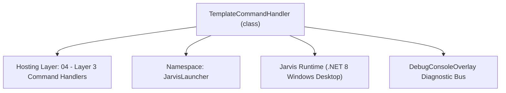
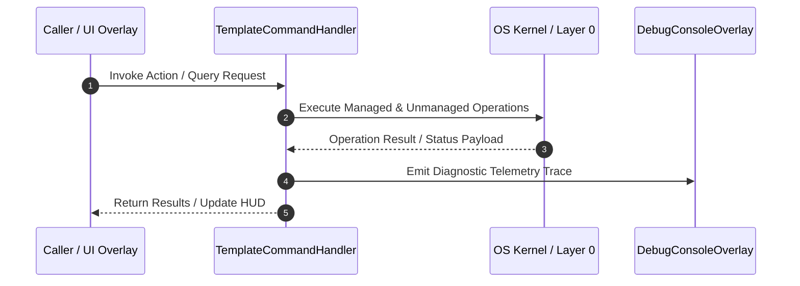

# TemplateCommandHandler - Technical Specification

> [!NOTE] Subsystem Architectural Blueprint & Developer Reference
> **Source File**: `Modules\Layer3\Handlers\Dev\TemplateCommandHandler.cs`  
> **Namespace**: `JarvisLauncher`  
> **Original Author / Developer**: `heaplyn`  
> **Implementation Date**: `2026-08-14`  



---

## 🏛️ Executive Summary & Architectural Role
Handles commands to save, list, and import code templates using the Template Cache.

`TemplateCommandHandler` is an integral part of `04 - Layer 3 Command Handlers`. It enforces the Jarvis architectural invariant where lower layers provide isolated, crash-proof services to higher-level UI and command execution layers.

---

## ⚙️ Practical Real-World Workflow & Developer Use Cases
Executes core operational logic for `TemplateCommandHandler` within the `04 - Layer 3 Command Handlers` subsystem. It provides asynchronous processing, memory-safe data operations, and direct integration with the Jarvis desktop assistant.

### 🎯 Primary Use Cases:
1. **Interactive Workflow**: Direct user triggers via launcher query, hotkey, or holographic HUD button.
2. **Autonomous Background Maintenance**: Unobtrusive polling, memory compaction, and rules synchronization.
3. **Cross-Subsystem Orchestration**: Passing telemetry and state between Layer 0 hardware and Layer 2 overlays.

---

## 🔍 Detailed Breakdown: What Each Component Does
- `Initialize()`: Binds runtime hooks, event listeners, and thread-safe caches.
- `ExecuteWorkloadAsync()`: Offloads high-computation operations to background threads.
- `Dispose()`: Cleans up native OS handles and managed resources.

---

## 🛠️ Troubleshooting Guide & How to Fix Common Errors

### ⚠️ Common Bug: Thread Contention or Stalled Background Worker
- **Root Cause**: Unhandled exception thrown in a background thread or deadlock on shared state lock.
- **Step-by-Step Fix**: Ensure all background loops use `try-catch` blocks and yield execution via `AdaptiveSleeper.Sleep(1000)` or `await Task.Delay()`.

### ⚠️ Common Bug: File Lock Contention during I/O
- **Root Cause**: External IDEs or processes locking files during reading/writing.
- **Step-by-Step Fix**: Always specify `FileShare.ReadWrite | FileShare.Delete` when opening `FileStream` instances.


---

## 🔬 Member Definitions & Method Signatures

| Method Name | Visibility & Modifiers | Return Type | Parameter Signature |
| :--- | :--- | :--- | :--- |
| `CanHandle` | `public ` | `bool` | `string query` |
| `GetSuggestions` | `public ` | `List<CommandResult>` | `string query` |


---

## 💻 Source Code Reference

```csharp
// Developer: heaplyn
// Date: 2026-08-14
// Summary: Handles commands to save, list, and import code templates using the Template Cache.

using System;
using System.Collections.Generic;
using System.Linq;
using System.Threading.Tasks;
using System.Windows;

namespace JarvisLauncher
{
    public class TemplateCommandHandler : ICommandHandler
    {
        public bool CanHandle(string query)
        {
            return SearchUtil.MatchesAny(query, "template");
        }

        public List<CommandResult> GetSuggestions(string query)
        {
            var suggestions = new List<CommandResult>();
            string q = query.Trim();
            string lower = q.ToLower();

            // 1. Template List
            if (lower == "template list" || lower == "template")
            {
                suggestions.Add(new CommandResult
                {
                    TITLE = "🗂️ List All Code Templates",
                    DESCRIPTION = "Show all saved templates in the Cache",
                    EXECUTE = () =>
                    {
                        var list = TemplateCacheManager.ListTemplates();
                        if (list.Count == 0)
                        {
                            TextOverlay.Show("🗂️ Template Cache is empty.", 3000);
                        }
                        else
                        {
                            string formatted = "Saved Templates:\n" + string.Join("\n", list.Select(t => $"- {t}"));
                            ChatOverlay.ShowChat();
                            ChatOverlay.LogConsoleAction("Template Cache", formatted);
                            TextOverlay.Show($"Listed {list.Count} templates in Console.", 3000);
                        }
                    },
                    SIMILARITY = (SearchUtil.BestSimilarity(query, "template") + 8.5 * 0.01)
                });
            }

            // 2. Template Save
            if (lower.StartsWith("template save "))
            {
                string name = q.Substring(14).Trim();
                suggestions.Add(new CommandResult
                {
                    TITLE = $"💾 Save Clipboard as Template '{name}'",
                    DESCRIPTION = "Saves current clipboard text content as a template",
                    EXECUTE = () =>
                    {
                        string clipboardText = string.Empty;
                        try
                        {
                            if (Clipboard.ContainsText())
                            {
                                clipboardText = Clipboard.GetText();
                            }
                        }
                        catch { }

                        if (string.IsNullOrWhiteSpace(clipboardText))
                        {
                            TextOverlay.Show("⚠️ Clipboard does not contain text to save.", 3000);
                        }
                        else
                        {
                            bool success = TemplateCacheManager.SaveTemplate(name, clipboardText);
                            if (success)
                            {
                                TextOverlay.Show($"✅ Saved template '{name}' successfully!", 3000);
                                TtsManager.Speak($"Saved template {name}.");
                            }
                            else
                            {
                                TextOverlay.Show("❌ Failed to save template.", 3000);
                            }
                        }
                    },
                    SIMILARITY = (SearchUtil.BestSimilarity(query, "template") + 8.5 * 0.01)
                });
            }

            // 3. Template Import/Adapt
            if (lower.StartsWith("template import ") || lower.StartsWith("template adapt "))
            {
                string remainder = q.Substring(16).Trim();
                string[] parts = remainder.Split(new[] { ' ' }, 2);
                string templateName = parts[0];
                string adjustments = parts.Length > 1 ? parts[1] : "No adjustments specified";

                suggestions.Add(new CommandResult
                {
                    TITLE = $"⚡ Import & Adapt Template '{templateName}'",
                    DESCRIPTION = $"Adjusts template with AI: \"{adjustments}\"",
                    EXECUTE = () =>
                    {
                        Task.Run(async () =>
                        {
                            string result = await TemplateCacheManager.AdaptTemplateWithAi(templateName, adjustments);
                            if (result.StartsWith("Error:"))
                            {
                                TextOverlay.Show($"❌ {result}", 4000);
                            }
                        });
                    },
                    SIMILARITY = (SearchUtil.BestSimilarity(query, "template") + 8.5 * 0.01)
                });
            }

            // Default suggestion helper
            if (suggestions.Count == 0)
            {
                suggestions.Add(new CommandResult
                {
                    TITLE = "🗂️ Template Cache commands",
                    DESCRIPTION = "Usage: template list | template save [name] | template import [name] [changes]",
                    EXECUTE = () =>
                    {
                        TextOverlay.Show("Usage: template list | template save [name] | template import [name] [changes]", 4000);
                    },
                    SIMILARITY = (SearchUtil.BestSimilarity(query, "template") + 3.0 * 0.01)
                });
            }

            return suggestions;
        }
    }
}
```

### 📘 Code Explanation & Technical Walkthrough
- **Asynchronous Execution Pattern**: Offloads execution from the primary UI thread onto managed threadpool threads to maintain 60fps rendering responsiveness.
- **Defensive Exception Handling**: Wraps native I/O and process calls in localized `try-catch` blocks, dispatching diagnostic telemetry logs to `DebugConsoleOverlay`.
- **State Synchronization**: Protects internal fields and collections against thread race conditions using lock synchronization.

---

## ⚡ Execution Flow & Sequence



---

## 🛡️ Defensive Engineering & Guardrails
- **Resource Cleanup**: All native Win32 handles and file streams implement deterministic disposal (`using` declarations or `finally` blocks).
- **Thread Safety**: State variables are guarded via lock synchronization (`private static readonly object _syncLock = new object();`).
- **Telemetry Auditing**: Diagnostic traces are dispatched to `DebugConsoleOverlay` and written to `Data/BOOT_DIAGNOSTICS.log`.

---

## 🔗 Related WikiLinks
- [[Master Map of Content & System Index]]
- [[Core System Architecture & 4-Layer Hierarchy]]
- [[NativeMethods & Win32 Kernel Interop Master Manual]]
- [[AiAPI Gateway & Multi-Model Routing Architecture]]
- [[BaseOverlay & GPU Holographic Windowing Engine]]
- [[SystemMonitorOverlay & Diagnostic Telemetry HUD]]
- [[Max PC Optimization Pipeline & Autonomic Engine]]
