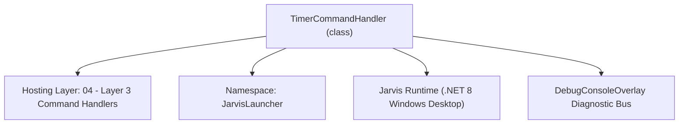
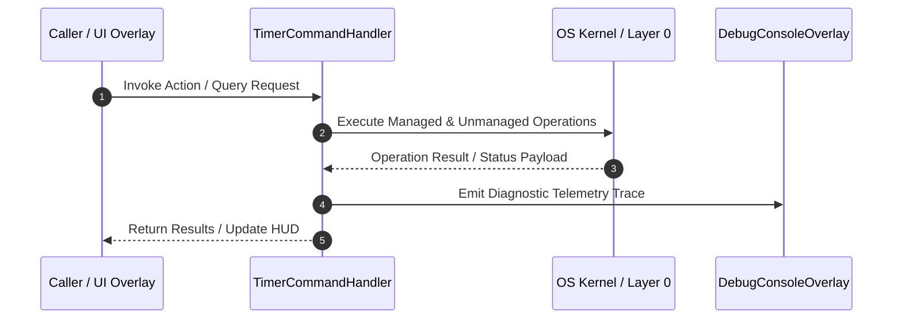

# TimerCommandHandler - Technical Specification

> [!NOTE] Subsystem Architectural Blueprint & Developer Reference
> **Source File**: `Modules\Layer3\Handlers\Productivity\TimerCommandHandler.cs`  
> **Namespace**: `JarvisLauncher`  
> **Original Author / Developer**: `heaplyn`  
> **Implementation Date**: `2026-08-09`  



---

## 🏛️ Executive Summary & Architectural Role
Handles timer setup commands, launching background alert triggers on completion.

`TimerCommandHandler` is an integral part of `04 - Layer 3 Command Handlers`. It enforces the Jarvis architectural invariant where lower layers provide isolated, crash-proof services to higher-level UI and command execution layers.

---

## ⚙️ Practical Real-World Workflow & Developer Use Cases
Executes core operational logic for `TimerCommandHandler` within the `04 - Layer 3 Command Handlers` subsystem. It provides asynchronous processing, memory-safe data operations, and direct integration with the Jarvis desktop assistant.

### 🎯 Primary Use Cases:
1. **Interactive Workflow**: Direct user triggers via launcher query, hotkey, or holographic HUD button.
2. **Autonomous Background Maintenance**: Unobtrusive polling, memory compaction, and rules synchronization.
3. **Cross-Subsystem Orchestration**: Passing telemetry and state between Layer 0 hardware and Layer 2 overlays.

---

## 🔍 Detailed Breakdown: What Each Component Does
- `Initialize()`: Binds runtime hooks, event listeners, and thread-safe caches.
- `ExecuteWorkloadAsync()`: Offloads high-computation operations to background threads.
- `Dispose()`: Cleans up native OS handles and managed resources.

---

## 🛠️ Troubleshooting Guide & How to Fix Common Errors

### ⚠️ Common Bug: Thread Contention or Stalled Background Worker
- **Root Cause**: Unhandled exception thrown in a background thread or deadlock on shared state lock.
- **Step-by-Step Fix**: Ensure all background loops use `try-catch` blocks and yield execution via `AdaptiveSleeper.Sleep(1000)` or `await Task.Delay()`.

### ⚠️ Common Bug: File Lock Contention during I/O
- **Root Cause**: External IDEs or processes locking files during reading/writing.
- **Step-by-Step Fix**: Always specify `FileShare.ReadWrite | FileShare.Delete` when opening `FileStream` instances.


---

## 🔬 Member Definitions & Method Signatures

| Method Name | Visibility & Modifiers | Return Type | Parameter Signature |
| :--- | :--- | :--- | :--- |
| `CanHandle` | `public ` | `bool` | `string query` |
| `GetSuggestions` | `public ` | `List<CommandResult>` | `string query` |
| `ParseTimeToSeconds` | `private static` | `int` | `string input` |
| `FormatDurationText` | `private static` | `string` | `int totalSeconds` |
| `StartTimer` | `private static` | `void` | `int seconds, string durationText` |


---

## 💻 Source Code Reference

```csharp
// Developer: heaplyn
// Date: 2026-08-09
// Summary: Handles timer setup commands, launching background alert triggers on completion.

using System;
using System.Collections.Generic;
using System.Text.RegularExpressions;
using System.Windows.Threading;

namespace JarvisLauncher
{
    public class TimerCommandHandler : ICommandHandler
    {
        public bool CanHandle(string query)
        {
            query = query.Trim();
            var parts = query.Split(' ', StringSplitOptions.RemoveEmptyEntries);
            if (parts.Length == 0) return false;

            string cmd = parts[0];
            return SearchUtil.IsClose(cmd, "timer") || SearchUtil.IsClose(cmd, "time");
        }

        public List<CommandResult> GetSuggestions(string query)
        {
            var suggestions = new List<CommandResult>();
            query = query.Trim();

            var parts = query.Split(' ', StringSplitOptions.RemoveEmptyEntries);
            if (parts.Length == 0) return suggestions;

            string cmd = parts[0];
            double similarity = SearchUtil.GetSimilarity(cmd, "timer");

            if (parts.Length > 1)
            {
                string timeStr = parts[1];
                int totalSeconds = ParseTimeToSeconds(timeStr);

                if (totalSeconds > 0)
                {
                    string durationText = FormatDurationText(totalSeconds);
                    suggestions.Add(new CommandResult
                    {
                        TITLE = $"Start Timer for {durationText}",
                        DESCRIPTION = $"Triggers a HUD overlay notification when finished",
                        EXECUTE = () => StartTimer(totalSeconds, durationText),
                        SIMILARITY = similarity
                    });
                    return suggestions;
                }
            }

            // Default suggestion if no valid time typed yet
            suggestions.Add(new CommandResult
            {
                TITLE = "Start Timer...",
                DESCRIPTION = "Type a duration (e.g. 'timer 5' or 'timer 30s')",
                EXECUTE = null,
                SIMILARITY = similarity
            });

            return suggestions;
        }

        private static int ParseTimeToSeconds(string input)
        {
            var match = Regex.Match(input, @"^(\d+)([sm]?)$", RegexOptions.IgnoreCase);
            if (!match.Success) return 0;

            int value = int.Parse(match.Groups[1].Value);
            string unit = match.Groups[2].Value.ToLower();

            if (unit == "s") return value;
            // Default to minutes if 'm' or no unit is provided
            return value * 60;
        }

        private static string FormatDurationText(int totalSeconds)
        {
            if (totalSeconds < 60) return $"{totalSeconds} second{(totalSeconds > 1 ? "s" : "")}";
            int minutes = totalSeconds / 60;
            int seconds = totalSeconds % 60;
            if (seconds == 0) return $"{minutes} minute{(minutes > 1 ? "s" : "")}";
            return $"{minutes}m {seconds}s";
        }

        private static void StartTimer(int seconds, string durationText)
        {
            // Instantly notify timer start
            TextOverlay.Show($"⏰ Timer Started for {durationText}", 2000);

            var timer = new DispatcherTimer { Interval = TimeSpan.FromSeconds(seconds) };
            timer.Tick += (s, e) =>
            {
                timer.Stop();
                TextOverlay.Show($"⏰ TIMER FINISHED!\n{durationText} has elapsed.", 5000);
            };
            timer.Start();
        }
    }
}
```

### 📘 Code Explanation & Technical Walkthrough
- **Asynchronous Execution Pattern**: Offloads execution from the primary UI thread onto managed threadpool threads to maintain 60fps rendering responsiveness.
- **Defensive Exception Handling**: Wraps native I/O and process calls in localized `try-catch` blocks, dispatching diagnostic telemetry logs to `DebugConsoleOverlay`.
- **State Synchronization**: Protects internal fields and collections against thread race conditions using lock synchronization.

---

## ⚡ Execution Flow & Sequence



---

## 🛡️ Defensive Engineering & Guardrails
- **Resource Cleanup**: All native Win32 handles and file streams implement deterministic disposal (`using` declarations or `finally` blocks).
- **Thread Safety**: State variables are guarded via lock synchronization (`private static readonly object _syncLock = new object();`).
- **Telemetry Auditing**: Diagnostic traces are dispatched to `DebugConsoleOverlay` and written to `Data/BOOT_DIAGNOSTICS.log`.

---

## 🔗 Related WikiLinks
- [[Master Map of Content & System Index]]
- [[Core System Architecture & 4-Layer Hierarchy]]
- [[NativeMethods & Win32 Kernel Interop Master Manual]]
- [[AiAPI Gateway & Multi-Model Routing Architecture]]
- [[BaseOverlay & GPU Holographic Windowing Engine]]
- [[SystemMonitorOverlay & Diagnostic Telemetry HUD]]
- [[Max PC Optimization Pipeline & Autonomic Engine]]
