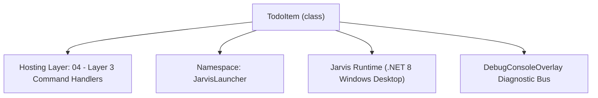
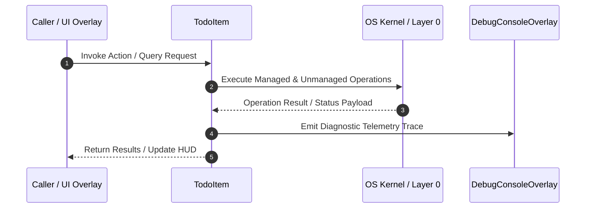

# TodoCommandHandler - Technical Specification

> [!NOTE] Subsystem Architectural Blueprint & Developer Reference
> **Source File**: `Modules\Layer3\Handlers\Productivity\TodoCommandHandler.cs`  
> **Namespace**: `JarvisLauncher`  
> **Original Author / Developer**: `heaplyn`  
> **Implementation Date**: `2026-08-09`  



---

## 🏛️ Executive Summary & Architectural Role
Handles CLI commands to manage a local tasks/todo list saved persistently in a JSON database file.

`TodoItem` is an integral part of `04 - Layer 3 Command Handlers`. It enforces the Jarvis architectural invariant where lower layers provide isolated, crash-proof services to higher-level UI and command execution layers.

---

## ⚙️ Practical Real-World Workflow & Developer Use Cases
Executes core operational logic for `TodoCommandHandler` within the `04 - Layer 3 Command Handlers` subsystem. It provides asynchronous processing, memory-safe data operations, and direct integration with the Jarvis desktop assistant.

### 🎯 Primary Use Cases:
1. **Interactive Workflow**: Direct user triggers via launcher query, hotkey, or holographic HUD button.
2. **Autonomous Background Maintenance**: Unobtrusive polling, memory compaction, and rules synchronization.
3. **Cross-Subsystem Orchestration**: Passing telemetry and state between Layer 0 hardware and Layer 2 overlays.

---

## 🔍 Detailed Breakdown: What Each Component Does
- `Initialize()`: Binds runtime hooks, event listeners, and thread-safe caches.
- `ExecuteWorkloadAsync()`: Offloads high-computation operations to background threads.
- `Dispose()`: Cleans up native OS handles and managed resources.

---

## 🛠️ Troubleshooting Guide & How to Fix Common Errors

### ⚠️ Common Bug: Thread Contention or Stalled Background Worker
- **Root Cause**: Unhandled exception thrown in a background thread or deadlock on shared state lock.
- **Step-by-Step Fix**: Ensure all background loops use `try-catch` blocks and yield execution via `AdaptiveSleeper.Sleep(1000)` or `await Task.Delay()`.

### ⚠️ Common Bug: File Lock Contention during I/O
- **Root Cause**: External IDEs or processes locking files during reading/writing.
- **Step-by-Step Fix**: Always specify `FileShare.ReadWrite | FileShare.Delete` when opening `FileStream` instances.


---

## 🔬 Member Definitions & Method Signatures

| Method Name | Visibility & Modifiers | Return Type | Parameter Signature |
| :--- | :--- | :--- | :--- |
| `CanHandle` | `public ` | `bool` | `string query` |
| `GetSuggestions` | `public ` | `List<CommandResult>` | `string query` |
| `GetTodoPath` | `private static` | `string` | `*none*` |
| `LoadTasks` | `private static` | `List<TodoItem>` | `*none*` |
| `SaveTasks` | `private static` | `void` | `List<TodoItem> tasks` |
| `AddTask` | `private static` | `void` | `string task` |
| `CompleteTask` | `private static` | `void` | `int userIndex` |
| `DeleteTask` | `private static` | `void` | `int userIndex` |
| `ClearCompletedTasks` | `private static` | `void` | `*none*` |
| `ListTasks` | `private static` | `void` | `*none*` |
| `GetCommandDescriptions` | `public ` | `List<CommandDesc>` | `*none*` |


---

## 💻 Source Code Reference

```csharp
// Developer: heaplyn
// Date: 2026-08-09
// Summary: Handles CLI commands to manage a local tasks/todo list saved persistently in a JSON database file.

using System;
using System.Collections.Generic;
using System.IO;
using System.Text;
using System.Text.Json;
using System.Windows;

namespace JarvisLauncher
{
    public class TodoItem
    {
        public string TASK { get; set; } = string.Empty;
        public bool IS_COMPLETED { get; set; } = false;
        public DateTime CREATED_AT { get; set; } = DateTime.Now;
    }

    public class TodoCommandHandler : ICommandHandler
    {
        public bool CanHandle(string query)
        {
            return SearchUtil.MatchesAny(query, "todo", "tasks");
        }

        public List<CommandResult> GetSuggestions(string query)
        {
            var suggestions = new List<CommandResult>();
            query = query.Trim();
            var parts = query.Split(' ', 3, StringSplitOptions.RemoveEmptyEntries);

            if (parts.Length == 0) return suggestions;

            string cmd = parts[0].ToLower();
            double similarity = SearchUtil.BestSimilarity(query, "todo", "tasks"); // High priority match

            if (parts.Length > 1)
            {
                string action = parts[1].ToLower();

                if (action == "add")
                {
                    if (parts.Length > 2)
                    {
                        string task = parts[2].Trim();
                        suggestions.Add(new CommandResult
                        {
                            TITLE       = $"Add Task: \"{task}\"",
                            DESCRIPTION = "Add a new active task to your Todo list database",
                            SIMILARITY  = similarity,
                            EXECUTE     = () => AddTask(task)
                        });
                    }
                    else
                    {
                        suggestions.Add(new CommandResult
                        {
                            TITLE       = "Add Task...",
                            DESCRIPTION = "Prompt for task content",
                            SIMILARITY  = similarity,
                            EXECUTE     = () => InputPromptOverlay.Show("Enter task content to add:", AddTask)
                        });
                    }
                }
                else if (action == "done")
                {
                    if (parts.Length > 2)
                    {
                        if (int.TryParse(parts[2].Trim(), out int idx))
                        {
                            suggestions.Add(new CommandResult
                            {
                                TITLE       = $"Complete Task #{idx}",
                                DESCRIPTION = "Mark the selected task as completed",
                                SIMILARITY  = similarity,
                                EXECUTE     = () => CompleteTask(idx)
                            });
                        }
                    }
                    else
                    {
                        suggestions.Add(new CommandResult
                        {
                            TITLE       = "Complete Task...",
                            DESCRIPTION = "Prompt for task index to complete",
                            SIMILARITY  = similarity,
                            EXECUTE     = () => InputPromptOverlay.Show("Enter task index to mark completed:", (val) =>
                            {
                                if (int.TryParse(val, out int idx)) CompleteTask(idx);
                                else TextOverlay.Show("⚠️ Invalid index number", 2500);
                            })
                        });
                    }
                }
                else if (action == "delete" || action == "remove")
                {
                    if (parts.Length > 2)
                    {
                        if (int.TryParse(parts[2].Trim(), out int idx))
                        {
                            suggestions.Add(new CommandResult
                            {
                                TITLE       = $"Delete Task #{idx}",
                                DESCRIPTION = "Remove the selected task from your list permanently",
                                SIMILARITY  = similarity,
                                EXECUTE     = () => DeleteTask(idx)
                            });
                        }
                    }
                    else
                    {
                        suggestions.Add(new CommandResult
                        {
                            TITLE       = "Delete Task...",
                            DESCRIPTION = "Prompt for task index to delete",
                            SIMILARITY  = similarity,
                            EXECUTE     = () => InputPromptOverlay.Show("Enter task index to delete:", (val) =>
                            {
                                if (int.TryParse(val, out int idx)) DeleteTask(idx);
                                else TextOverlay.Show("⚠️ Invalid index number", 2500);
                            })
                        });
                    }
                }
                else if (action == "clear")
                {
                    suggestions.Add(new CommandResult
                    {
                        TITLE       = "Clear Completed Tasks",
                        DESCRIPTION = "Purge all completed items from the list database",
                        SIMILARITY  = similarity,
                        EXECUTE     = () => ClearCompletedTasks()
                    });
                }
                else if (action == "list")
                {
                    suggestions.Add(new CommandResult
                    {
                        TITLE       = "Display Tasks List",
                        DESCRIPTION = "Print all active and completed tasks in the terminal",
                        SIMILARITY  = similarity,
                        EXECUTE     = () => ListTasks()
                    });
                }
            }
            else
            {
                // No action specified, default suggestions
                suggestions.Add(new CommandResult
                {
                    TITLE       = "List Todo Tasks",
                    DESCRIPTION = "Display all currently tracked tasks in the system terminal",
                    SIMILARITY  = similarity,
                    EXECUTE     = () => ListTasks()
                });

                suggestions.Add(new CommandResult
                {
                    TITLE       = "Add Task...",
                    DESCRIPTION = "Type task content (e.g. todo add buy groceries)",
                    SIMILARITY  = similarity - 0.5,
                    EXECUTE     = () => InputPromptOverlay.Show("Enter task content to add:", AddTask)
                });
            }

            return suggestions;
        }

        private static string GetTodoPath()
        {
            string dataDir = Path.Combine(AppDomain.CurrentDomain.BaseDirectory, "Data");
            if (!Directory.Exists(dataDir))
            {
                string devPath = Path.GetFullPath(Path.Combine(AppDomain.CurrentDomain.BaseDirectory, @"..\..\..\Data"));
                if (Directory.Exists(devPath))
                {
                    dataDir = devPath;
                }
                else
                {
                    Directory.CreateDirectory(dataDir);
                }
            }
            return Path.Combine(dataDir, "TodoList.json");
        }

        private static List<TodoItem> LoadTasks()
        {
            try
            {
                string path = GetTodoPath();
                if (File.Exists(path))
                {
                    string json = File.ReadAllText(path);
                    return JsonSerializer.Deserialize<List<TodoItem>>(json) ?? new List<TodoItem>();
                }
            }
            catch { }
            return new List<TodoItem>();
        }

        private static void SaveTasks(List<TodoItem> tasks)
        {
            try
            {
                string path = GetTodoPath();
                string json = JsonSerializer.Serialize(tasks, new JsonSerializerOptions { WriteIndented = true });
                File.WriteAllText(path, json);
            }
            catch (Exception ex)
            {
                TextOverlay.Show($"⚠️ Failed to save Todo DB: {ex.Message}", 3000);
            }
        }

        private static void AddTask(string task)
        {
            var tasks = LoadTasks();
            tasks.Add(new TodoItem { TASK = task });
            SaveTasks(tasks);
            TextOverlay.Show($"✅ Task Added:\n\"{task}\"", 2500);
        }

        private static void CompleteTask(int userIndex)
        {
            var tasks = LoadTasks();
            int idx = userIndex - 1;

            if (idx >= 0 && idx < tasks.Count)
            {
                tasks[idx].IS_COMPLETED = true;
                SaveTasks(tasks);
                TextOverlay.Show($"✓ Completed: \"{tasks[idx].TASK}\"", 2500);
            }
            else
            {
                TextOverlay.Show($"⚠️ Invalid task index: {userIndex}", 3000);
            }
        }

        private static void DeleteTask(int userIndex)
        {
            var tasks = LoadTasks();
            int idx = userIndex - 1;

            if (idx >= 0 && idx < tasks.Count)
            {
                string name = tasks[idx].TASK;
                tasks.RemoveAt(idx);
                SaveTasks(tasks);
                TextOverlay.Show($"🗑️ Deleted: \"{name}\"", 2500);
            }
            else
            {
                TextOverlay.Show($"⚠️ Invalid task index: {userIndex}", 3000);
            }
        }

        private static void ClearCompletedTasks()
        {
            var tasks = LoadTasks();
            int countBefore = tasks.Count;
            tasks.RemoveAll(t => t.IS_COMPLETED);
            int deleted = countBefore - tasks.Count;
            SaveTasks(tasks);
            TextOverlay.Show($"🧹 Purged {deleted} completed tasks!", 2500);
        }

        private static void ListTasks()
        {
            var tasks = LoadTasks();
            var sb = new StringBuilder();

            sb.AppendLine("===================================================");
            sb.AppendLine("                 JARVIS TODO SYSTEM                ");
            sb.AppendLine("===================================================");
            sb.AppendLine();

            if (tasks.Count == 0)
            {
                sb.AppendLine("[No tasks currently in your list. Type 'todo add <task>' to create one.]");
            }
            else
            {
                for (int i = 0; i < tasks.Count; i++)
                {
                    var item = tasks[i];
                    string status = item.IS_COMPLETED ? "[✓] DONE" : "[ ] TODO";
                    sb.AppendLine($"{i + 1}. {status,-8} - {item.TASK}  (added {item.CREATED_AT:yyyy-MM-dd HH:mm})");
                }
            }
            sb.AppendLine();
            sb.AppendLine("---------------------------------------------------");
            sb.AppendLine("Commands:");
            sb.AppendLine("- todo add <content>  : Add a task");
            sb.AppendLine("- todo done <index>   : Complete a task");
            sb.AppendLine("- todo delete <index> : Delete a task");
            sb.AppendLine("- todo clear          : Purge completed");

            CliOutputOverlay.Show("Tasks List", sb.ToString());
        }

        public List<CommandDesc> GetCommandDescriptions()
        {
            return new List<CommandDesc>
            {
                new CommandDesc("todo <add/done/list>", "Manage local Todo tasks list", "todo list")
            };
        }
    }
}
```

### 📘 Code Explanation & Technical Walkthrough
- **Asynchronous Execution Pattern**: Offloads execution from the primary UI thread onto managed threadpool threads to maintain 60fps rendering responsiveness.
- **Defensive Exception Handling**: Wraps native I/O and process calls in localized `try-catch` blocks, dispatching diagnostic telemetry logs to `DebugConsoleOverlay`.
- **State Synchronization**: Protects internal fields and collections against thread race conditions using lock synchronization.

---

## ⚡ Execution Flow & Sequence



---

## 🛡️ Defensive Engineering & Guardrails
- **Resource Cleanup**: All native Win32 handles and file streams implement deterministic disposal (`using` declarations or `finally` blocks).
- **Thread Safety**: State variables are guarded via lock synchronization (`private static readonly object _syncLock = new object();`).
- **Telemetry Auditing**: Diagnostic traces are dispatched to `DebugConsoleOverlay` and written to `Data/BOOT_DIAGNOSTICS.log`.

---

## 🔗 Related WikiLinks
- [[Master Map of Content & System Index]]
- [[Core System Architecture & 4-Layer Hierarchy]]
- [[NativeMethods & Win32 Kernel Interop Master Manual]]
- [[AiAPI Gateway & Multi-Model Routing Architecture]]
- [[BaseOverlay & GPU Holographic Windowing Engine]]
- [[SystemMonitorOverlay & Diagnostic Telemetry HUD]]
- [[Max PC Optimization Pipeline & Autonomic Engine]]
