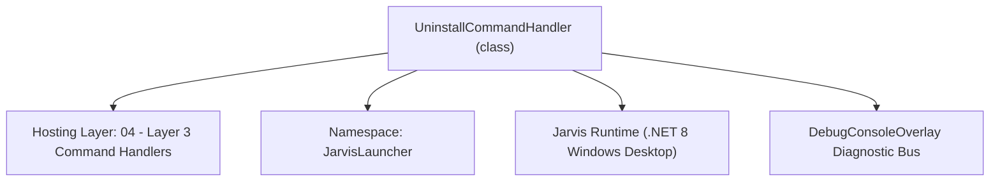
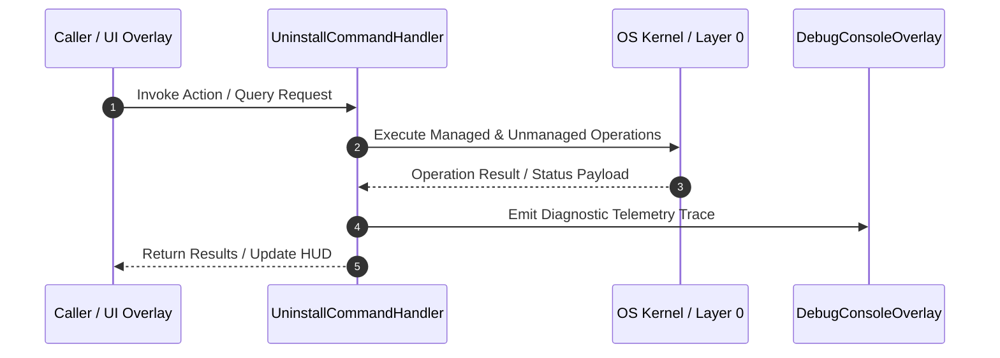

# UninstallCommandHandler - Technical Specification

> [!NOTE] Subsystem Architectural Blueprint & Developer Reference
> **Source File**: `Modules\Layer3\Handlers\Utilities\UninstallCommandHandler.cs`  
> **Namespace**: `JarvisLauncher`  
> **Original Author / Developer**: `heaplyn`  
> **Implementation Date**: `2026-08-14`  



---

## 🏛️ Executive Summary & Architectural Role
Handles packages uninstall commands (winget, npm, python/pip)
          and supports self-uninstallation of the Jarvis launcher.

`UninstallCommandHandler` is an integral part of `04 - Layer 3 Command Handlers`. It enforces the Jarvis architectural invariant where lower layers provide isolated, crash-proof services to higher-level UI and command execution layers.

---

## ⚙️ Practical Real-World Workflow & Developer Use Cases
Executes core operational logic for `UninstallCommandHandler` within the `04 - Layer 3 Command Handlers` subsystem. It provides asynchronous processing, memory-safe data operations, and direct integration with the Jarvis desktop assistant.

### 🎯 Primary Use Cases:
1. **Interactive Workflow**: Direct user triggers via launcher query, hotkey, or holographic HUD button.
2. **Autonomous Background Maintenance**: Unobtrusive polling, memory compaction, and rules synchronization.
3. **Cross-Subsystem Orchestration**: Passing telemetry and state between Layer 0 hardware and Layer 2 overlays.

---

## 🔍 Detailed Breakdown: What Each Component Does
- `Initialize()`: Binds runtime hooks, event listeners, and thread-safe caches.
- `ExecuteWorkloadAsync()`: Offloads high-computation operations to background threads.
- `Dispose()`: Cleans up native OS handles and managed resources.

---

## 🛠️ Troubleshooting Guide & How to Fix Common Errors

### ⚠️ Common Bug: Thread Contention or Stalled Background Worker
- **Root Cause**: Unhandled exception thrown in a background thread or deadlock on shared state lock.
- **Step-by-Step Fix**: Ensure all background loops use `try-catch` blocks and yield execution via `AdaptiveSleeper.Sleep(1000)` or `await Task.Delay()`.

### ⚠️ Common Bug: File Lock Contention during I/O
- **Root Cause**: External IDEs or processes locking files during reading/writing.
- **Step-by-Step Fix**: Always specify `FileShare.ReadWrite | FileShare.Delete` when opening `FileStream` instances.


---

## 🔬 Member Definitions & Method Signatures

| Method Name | Visibility & Modifiers | Return Type | Parameter Signature |
| :--- | :--- | :--- | :--- |
| `CanHandle` | `public ` | `bool` | `string query` |
| `GetSuggestions` | `public ` | `List<CommandResult>` | `string query` |
| `RunUninstallProcess` | `private ` | `void` | `string processName, string arguments` |
| `RunSelfUninstallerScript` | `private ` | `void` | `*none*` |


---

## 💻 Source Code Reference

```csharp
// Developer: heaplyn
// Date: 2026-08-14
// Summary: Handles packages uninstall commands (winget, npm, python/pip)
//          and supports self-uninstallation of the Jarvis launcher.

using System;
using System.Collections.Generic;
using System.Diagnostics;
using System.IO;
using System.Threading.Tasks;
using System.Windows;

namespace JarvisLauncher
{
    public class UninstallCommandHandler : ICommandHandler
    {
        public bool CanHandle(string query)
        {
            return SearchUtil.MatchesAny(query, "uninstall");
        }

        public List<CommandResult> GetSuggestions(string query)
        {
            var suggestions = new List<CommandResult>();
            string args = query.Length > 9 ? query.Substring(9).Trim() : "";

            if (string.IsNullOrEmpty(args))
            {
                suggestions.Add(new CommandResult
                {
                    TITLE = "🗑️ Uninstall Packages or Jarvis",
                    DESCRIPTION = "Syntax: uninstall [winget/npm/python/self] [package_name]",
                    SIMILARITY = (SearchUtil.BestSimilarity(query, "uninstall") + 5.0 * 0.01),
                    EXECUTE = () => TextOverlay.Show("Example: uninstall winget sideloadly", 4000)
                });
                return suggestions;
            }

            // Self-Uninstall Route
            if (args.ToLower() == "self" || args.ToLower() == "jarvis")
            {
                suggestions.Add(new CommandResult
                {
                    TITLE = "⚠️ Completely Uninstall Jarvis Launcher",
                    DESCRIPTION = "Purges all local configurations, templates, voice models, and files",
                    SIMILARITY = (SearchUtil.BestSimilarity(query, "uninstall") + 9.0 * 0.01),
                    EXECUTE = () =>
                    {
                        var confirm = MessageBox.Show(
                            "This action will completely remove Jarvis, delete all local configuration profiles, voiceprints, reminders, and close the application. Proceed with uninstallation?",
                            "Confirm Full Uninstallation",
                            MessageBoxButton.YesNo,
                            MessageBoxImage.Warning
                        );

                        if (confirm == MessageBoxResult.Yes)
                        {
                            TtsManager.Speak("Jarvis uninstallation initiated. Goodbye, owner.");
                            TextOverlay.Show("Goodbye...", 3000);
                            
                            // Write and trigger uninstaller cleanup script
                            Task.Run(async () =>
                            {
                                await Task.Delay(2000);
                                RunSelfUninstallerScript();
                            });
                        }
                    }
                });
                return suggestions;
            }

            // Split action parameters
            int spaceIdx = args.IndexOf(' ');
            string provider = spaceIdx != -1 ? args.Substring(0, spaceIdx).ToLower() : args.ToLower();
            string pkg = spaceIdx != -1 ? args.Substring(spaceIdx + 1).Trim() : "";

            // Winget uninstaller
            if (provider == "winget")
            {
                suggestions.Add(new CommandResult
                {
                    TITLE = $"🗑️ Uninstall Winget Package: {pkg}",
                    DESCRIPTION = $"Runs: winget uninstall {pkg} --silent",
                    SIMILARITY = (SearchUtil.BestSimilarity(query, "uninstall") + 6.8 * 0.01),
                    EXECUTE = () => RunUninstallProcess("winget", $"uninstall {pkg} --silent")
                });
            }
            // NPM uninstaller
            else if (provider == "npm")
            {
                suggestions.Add(new CommandResult
                {
                    TITLE = $"🗑️ Uninstall NPM Package: {pkg}",
                    DESCRIPTION = $"Runs: npm uninstall -g {pkg}",
                    SIMILARITY = (SearchUtil.BestSimilarity(query, "uninstall") + 6.8 * 0.01),
                    EXECUTE = () => RunUninstallProcess("cmd.exe", $"/c npm uninstall -g {pkg}")
                });
            }
            // Python/Pip uninstaller
            else if (provider == "python" || provider == "pip")
            {
                suggestions.Add(new CommandResult
                {
                    TITLE = $"🗑️ Uninstall Python pip Package: {pkg}",
                    DESCRIPTION = $"Runs: pip uninstall -y {pkg}",
                    SIMILARITY = (SearchUtil.BestSimilarity(query, "uninstall") + 6.8 * 0.01),
                    EXECUTE = () => RunUninstallProcess("cmd.exe", $"/c pip uninstall -y {pkg}")
                });
            }

            return suggestions;
        }

        private void RunUninstallProcess(string processName, string arguments)
        {
            try
            {
                TextOverlay.Show($"🗑️ Uninstalling package via {processName}...", 4000);
                Process.Start(new ProcessStartInfo
                {
                    FileName = processName,
                    Arguments = arguments,
                    UseShellExecute = true,
                    CreateNoWindow = false
                });
            }
            catch (Exception ex)
            {
                TextOverlay.Show($"❌ Uninstall failed: {ex.Message}", 4000);
            }
        }

        private void RunSelfUninstallerScript()
        {
            try
            {
                string projectDir = AppDomain.CurrentDomain.BaseDirectory;
                string appDataDir = Path.Combine(Environment.GetFolderPath(Environment.SpecialFolder.LocalApplicationData), "Roblox"); // Wait, no, appdata is App Data Directory: C:\Users\Kyle\.gemini\antigravity
                string geminiAppData = Path.Combine(Environment.GetFolderPath(Environment.SpecialFolder.UserProfile), ".gemini", "antigravity");

                string batchScript = $@"@echo off
timeout /t 2 /nobreak > NUL
echo Removing app binaries...
rmdir /s /q ""{projectDir}""
echo Removing user settings, models and cache...
rmdir /s /q ""{geminiAppData}""
echo Jarvis has been completely removed.
pause
del ""%~f0""
exit
";

                string tempBatch = Path.Combine(Path.GetTempPath(), "jarvis_uninstaller.bat");
                File.WriteAllText(tempBatch, batchScript);

                Process.Start(new ProcessStartInfo
                {
                    FileName = "cmd.exe",
                    Arguments = $"/c \"{tempBatch}\"",
                    UseShellExecute = true,
                    CreateNoWindow = false
                });

                // Exit process
                Application.Current.Dispatcher.Invoke(() =>
                {
                    Application.Current.Shutdown();
                });
            }
            catch (Exception ex)
            {
                MessageBox.Show($"Failed to execute self uninstaller: {ex.Message}");
            }
        }
    }
}
```

### 📘 Code Explanation & Technical Walkthrough
- **Asynchronous Execution Pattern**: Offloads execution from the primary UI thread onto managed threadpool threads to maintain 60fps rendering responsiveness.
- **Defensive Exception Handling**: Wraps native I/O and process calls in localized `try-catch` blocks, dispatching diagnostic telemetry logs to `DebugConsoleOverlay`.
- **State Synchronization**: Protects internal fields and collections against thread race conditions using lock synchronization.

---

## ⚡ Execution Flow & Sequence



---

## 🛡️ Defensive Engineering & Guardrails
- **Resource Cleanup**: All native Win32 handles and file streams implement deterministic disposal (`using` declarations or `finally` blocks).
- **Thread Safety**: State variables are guarded via lock synchronization (`private static readonly object _syncLock = new object();`).
- **Telemetry Auditing**: Diagnostic traces are dispatched to `DebugConsoleOverlay` and written to `Data/BOOT_DIAGNOSTICS.log`.

---

## 🔗 Related WikiLinks
- [[Master Map of Content & System Index]]
- [[Core System Architecture & 4-Layer Hierarchy]]
- [[NativeMethods & Win32 Kernel Interop Master Manual]]
- [[AiAPI Gateway & Multi-Model Routing Architecture]]
- [[BaseOverlay & GPU Holographic Windowing Engine]]
- [[SystemMonitorOverlay & Diagnostic Telemetry HUD]]
- [[Max PC Optimization Pipeline & Autonomic Engine]]
