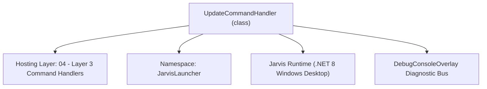
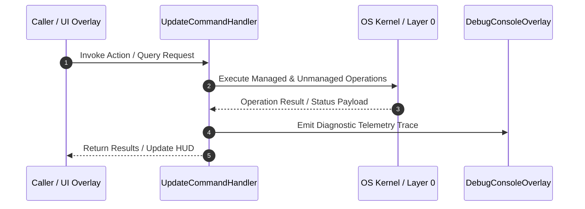

# UpdateCommandHandler - Technical Specification

> [!NOTE] Subsystem Architectural Blueprint & Developer Reference
> **Source File**: `Modules\Layer3\Handlers\System\UpdateCommandHandler.cs`  
> **Namespace**: `JarvisLauncher`  
> **Original Author / Developer**: `heaplyn`  
> **Implementation Date**: `2026-08-18`  



---

## 🏛️ Executive Summary & Architectural Role
Handles CLI commands to pull, fetch, and merge the latest codebase commits.
          Hardened with self-healing Git logic, remote re-mapping, and Fresh Sync support.

`UpdateCommandHandler` is an integral part of `04 - Layer 3 Command Handlers`. It enforces the Jarvis architectural invariant where lower layers provide isolated, crash-proof services to higher-level UI and command execution layers.

---

## ⚙️ Practical Real-World Workflow & Developer Use Cases
Executes core operational logic for `UpdateCommandHandler` within the `04 - Layer 3 Command Handlers` subsystem. It provides asynchronous processing, memory-safe data operations, and direct integration with the Jarvis desktop assistant.

### 🎯 Primary Use Cases:
1. **Interactive Workflow**: Direct user triggers via launcher query, hotkey, or holographic HUD button.
2. **Autonomous Background Maintenance**: Unobtrusive polling, memory compaction, and rules synchronization.
3. **Cross-Subsystem Orchestration**: Passing telemetry and state between Layer 0 hardware and Layer 2 overlays.

---

## 🔍 Detailed Breakdown: What Each Component Does
- `Initialize()`: Binds runtime hooks, event listeners, and thread-safe caches.
- `ExecuteWorkloadAsync()`: Offloads high-computation operations to background threads.
- `Dispose()`: Cleans up native OS handles and managed resources.

---

## 🛠️ Troubleshooting Guide & How to Fix Common Errors

### ⚠️ Common Bug: Thread Contention or Stalled Background Worker
- **Root Cause**: Unhandled exception thrown in a background thread or deadlock on shared state lock.
- **Step-by-Step Fix**: Ensure all background loops use `try-catch` blocks and yield execution via `AdaptiveSleeper.Sleep(1000)` or `await Task.Delay()`.

### ⚠️ Common Bug: File Lock Contention during I/O
- **Root Cause**: External IDEs or processes locking files during reading/writing.
- **Step-by-Step Fix**: Always specify `FileShare.ReadWrite | FileShare.Delete` when opening `FileStream` instances.


---

## 🔬 Member Definitions & Method Signatures

| Method Name | Visibility & Modifiers | Return Type | Parameter Signature |
| :--- | :--- | :--- | :--- |
| `CanHandle` | `public ` | `bool` | `string query` |
| `GetSuggestions` | `public ` | `List<CommandResult>` | `string query` |
| `GetProjectRoot` | `private static` | `string` | `*none*` |
| `GetCommandDescriptions` | `public ` | `List<CommandDesc>` | `*none*` |


---

## 💻 Source Code Reference

```csharp
// Developer: heaplyn
// Date: 2026-08-18
// Summary: Handles CLI commands to pull, fetch, and merge the latest codebase commits.
//          Hardened with self-healing Git logic, remote re-mapping, and Fresh Sync support.

using System;
using System.Collections.Generic;
using System.Diagnostics;
using System.IO;
using System.Text;
using System.Threading.Tasks;
using System.Windows;

namespace JarvisLauncher
{
    public class UpdateCommandHandler : ICommandHandler
    {
        public bool CanHandle(string query)
        {
            query = query.Trim().ToLower();
            return query == "update" || query == "gitupdate" || query == "git pull" ||
                   query == "pull" || query == "fresh sync" || query == "sync" || query == "freshsync";
        }

        public List<CommandResult> GetSuggestions(string query)
        {
            var suggestions = new List<CommandResult>();
            query = query.Trim().ToLower();

            double similarity = Math.Max(
                SearchUtil.GetSimilarity(query, "update"), 
                SearchUtil.GetSimilarity(query, "sync")
            );

            suggestions.Add(new CommandResult
            {
                TITLE       = "🔄 Fresh Sync (Force GitHub Pull)",
                DESCRIPTION = "⚠️ Wipes all local modifications and forces sync with GitHub remote main",
                SIMILARITY  = query.Contains("fresh") ? 10.0 : similarity + 0.8,
                EXECUTE     = () => Task.Run(async () => await PullUpdatesAsync(force: true))
            });

            suggestions.Add(new CommandResult
            {
                TITLE       = "📥 Update Code from GitHub",
                DESCRIPTION = "Run 'git pull' safely (stashing any local changes)",
                SIMILARITY  = similarity + 0.5,
                EXECUTE     = () => Task.Run(async () => await PullUpdatesAsync(force: false))
            });

            return suggestions;
        }

        private static async Task PullUpdatesAsync(bool force)
        {
            Application.Current.Dispatcher.Invoke(() =>
            {
                TextOverlay.Show(force ? "⚠️ Executing Fresh Sync..." : "📥 Checking for GitHub updates...", 4000);
            });

            string projectRoot = GetProjectRoot();
            var log = new StringBuilder();

            log.AppendLine("===================================================");
            log.AppendLine(force ? "           JARVIS FRESH SYNC ENGINE              " : "            JARVIS CODEBASE UPDATE ENGINE          ");
            log.AppendLine("===================================================");
            log.AppendLine();
            log.AppendLine($"Working directory: {projectRoot}");

            // 1. Git Availability Check
            string gitCheck = await RunCommandAsync("git", "--version", projectRoot);
            if (gitCheck.Contains("Error") || string.IsNullOrWhiteSpace(gitCheck))
            {
                log.AppendLine("❌ ERROR: Git not found in PATH.");
                CliOutputOverlay.Show("Update Failed", log.ToString());
                return;
            }

            // 2. Self-Healing Initialization
            if (!Directory.Exists(Path.Combine(projectRoot, ".git")))
            {
                log.AppendLine("⚠️ Repo not initialized. Running self-healing...");
                await RunCommandAsync("git", "init", projectRoot);
                await RunCommandAsync("git", "remote add origin https://github.com/Heaplyn/Jarvis.git", projectRoot);
                await RunCommandAsync("git", "fetch", projectRoot);
                await RunCommandAsync("git", "checkout -f -B main origin/main", projectRoot);
            }

            // 3. Remote Remapping
            string remoteUrl = (await RunCommandAsync("git", "remote get-url origin", projectRoot)).Trim();
            if (!remoteUrl.Contains("Heaplyn/Jarvis"))
            {
                log.AppendLine("🔗 Relinking remote to official repository...");
                await RunCommandAsync("git", "remote set-url origin https://github.com/Heaplyn/Jarvis.git", projectRoot);
            }

            string branchName = (await RunCommandAsync("git", "rev-parse --abbrev-ref HEAD", projectRoot)).Trim();
            if (string.IsNullOrEmpty(branchName) || branchName.Contains("fatal")) branchName = "main";

            log.AppendLine($"Branch: {branchName}");

            // 4. Execution
            if (force)
            {
                log.AppendLine("--- FORCING OVERWRITE FROM GITHUB ---");
                log.AppendLine("🛡️ Data Preservation: Protecting 'Data/' and 'Downloads/'...");

                await RunCommandAsync("git", "fetch --all", projectRoot);
                await RunCommandAsync("git", $"reset --hard origin/{branchName}", projectRoot);

                // -e excludes a pattern from being deleted. This ensures local-only Data stays.
                await RunCommandAsync("git", "clean -fd -e Data/ -e Downloads/", projectRoot);

                log.AppendLine("🎉 FRESH SYNC COMPLETED! (Local settings preserved)");
            }
            else
            {
                log.AppendLine("--- PULLING UPDATES SAFELY ---");
                // Stash local changes to project files so pull doesn't fail, but keep untracked data
                await RunCommandAsync("git", "stash", projectRoot);
                string res = await RunCommandAsync("git", $"pull origin {branchName} --allow-unrelated-histories --no-rebase", projectRoot);
                await RunCommandAsync("git", "stash pop", projectRoot);
                log.AppendLine(res);
            }

            CliOutputOverlay.Show("Codebase Update", log.ToString());

            if (log.ToString().Contains("SUCCESS") || log.ToString().Contains("COMPLETED") || log.ToString().Contains("Updating") || log.ToString().Contains("Already up to date"))
            {
                await Task.Delay(2000);
                NativeMethods.Restart(freshBoot: true);
            }
        }

        private static string GetProjectRoot() => PathHandler.GetProjectRoot();

        private static async Task<string> RunCommandAsync(string fileName, string arguments, string workingDirectory)
        {
            var output = new StringBuilder();
            var tcs = new TaskCompletionSource<string>();
            var process = new Process {
                StartInfo = new ProcessStartInfo { FileName = fileName, Arguments = arguments, WorkingDirectory = workingDirectory, UseShellExecute = false, RedirectStandardOutput = true, RedirectStandardError = true, CreateNoWindow = true },
                EnableRaisingEvents = true
            };
            process.OutputDataReceived += (s, e) => { if (e.Data != null) output.AppendLine(e.Data); };
            process.ErrorDataReceived += (s, e) => { if (e.Data != null) output.AppendLine(e.Data); };
            process.Exited += (s, e) => { tcs.SetResult(output.ToString()); process.Dispose(); };
            try { process.Start(); process.BeginOutputReadLine(); process.BeginErrorReadLine(); } catch (Exception ex) { return ex.Message; }
            return await tcs.Task;
        }

        public List<CommandDesc> GetCommandDescriptions() => new List<CommandDesc> {
            new CommandDesc("update", "Safely pull GitHub updates", "update"),
            new CommandDesc("fresh sync", "Force overwrite local with remote", "fresh sync")
        };
    }
}
```

### 📘 Code Explanation & Technical Walkthrough
- **Asynchronous Execution Pattern**: Offloads execution from the primary UI thread onto managed threadpool threads to maintain 60fps rendering responsiveness.
- **Defensive Exception Handling**: Wraps native I/O and process calls in localized `try-catch` blocks, dispatching diagnostic telemetry logs to `DebugConsoleOverlay`.
- **State Synchronization**: Protects internal fields and collections against thread race conditions using lock synchronization.

---

## ⚡ Execution Flow & Sequence



---

## 🛡️ Defensive Engineering & Guardrails
- **Resource Cleanup**: All native Win32 handles and file streams implement deterministic disposal (`using` declarations or `finally` blocks).
- **Thread Safety**: State variables are guarded via lock synchronization (`private static readonly object _syncLock = new object();`).
- **Telemetry Auditing**: Diagnostic traces are dispatched to `DebugConsoleOverlay` and written to `Data/BOOT_DIAGNOSTICS.log`.

---

## 🔗 Related WikiLinks
- [[Master Map of Content & System Index]]
- [[Core System Architecture & 4-Layer Hierarchy]]
- [[NativeMethods & Win32 Kernel Interop Master Manual]]
- [[AiAPI Gateway & Multi-Model Routing Architecture]]
- [[BaseOverlay & GPU Holographic Windowing Engine]]
- [[SystemMonitorOverlay & Diagnostic Telemetry HUD]]
- [[Max PC Optimization Pipeline & Autonomic Engine]]
