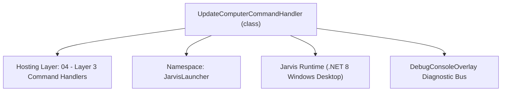
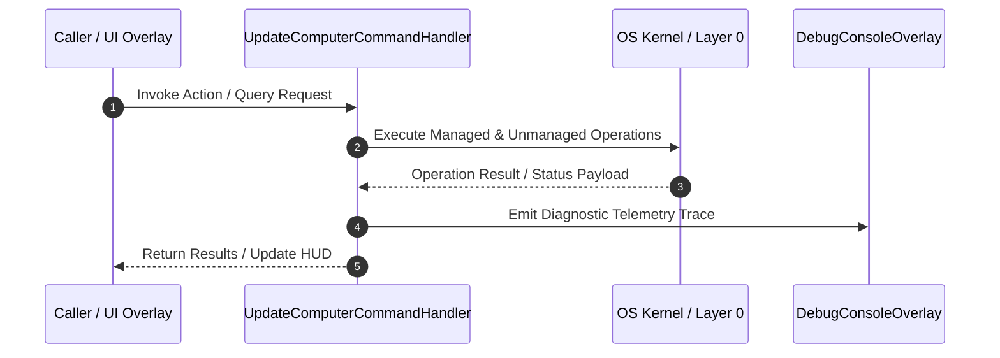

# UpdateComputerCommandHandler - Technical Specification

> [!NOTE] Subsystem Architectural Blueprint & Developer Reference
> **Source File**: `Modules\Layer3\Handlers\System\UpdateComputerCommandHandler.cs`  
> **Namespace**: `JarvisLauncher`  
> **Original Author / Developer**: `heaplyn`  
> **Implementation Date**: `2026-08-15`  



---

## 🏛️ Executive Summary & Architectural Role
Handles CLI commands to check for Windows OS updates or query winget for outdated programs.

`UpdateComputerCommandHandler` is an integral part of `04 - Layer 3 Command Handlers`. It enforces the Jarvis architectural invariant where lower layers provide isolated, crash-proof services to higher-level UI and command execution layers.

---

## ⚙️ Practical Real-World Workflow & Developer Use Cases
Executes core operational logic for `UpdateComputerCommandHandler` within the `04 - Layer 3 Command Handlers` subsystem. It provides asynchronous processing, memory-safe data operations, and direct integration with the Jarvis desktop assistant.

### 🎯 Primary Use Cases:
1. **Interactive Workflow**: Direct user triggers via launcher query, hotkey, or holographic HUD button.
2. **Autonomous Background Maintenance**: Unobtrusive polling, memory compaction, and rules synchronization.
3. **Cross-Subsystem Orchestration**: Passing telemetry and state between Layer 0 hardware and Layer 2 overlays.

---

## 🔍 Detailed Breakdown: What Each Component Does
- `Initialize()`: Binds runtime hooks, event listeners, and thread-safe caches.
- `ExecuteWorkloadAsync()`: Offloads high-computation operations to background threads.
- `Dispose()`: Cleans up native OS handles and managed resources.

---

## 🛠️ Troubleshooting Guide & How to Fix Common Errors

### ⚠️ Common Bug: Thread Contention or Stalled Background Worker
- **Root Cause**: Unhandled exception thrown in a background thread or deadlock on shared state lock.
- **Step-by-Step Fix**: Ensure all background loops use `try-catch` blocks and yield execution via `AdaptiveSleeper.Sleep(1000)` or `await Task.Delay()`.

### ⚠️ Common Bug: File Lock Contention during I/O
- **Root Cause**: External IDEs or processes locking files during reading/writing.
- **Step-by-Step Fix**: Always specify `FileShare.ReadWrite | FileShare.Delete` when opening `FileStream` instances.


---

## 🔬 Member Definitions & Method Signatures

| Method Name | Visibility & Modifiers | Return Type | Parameter Signature |
| :--- | :--- | :--- | :--- |
| `CanHandle` | `public ` | `bool` | `string query` |
| `GetSuggestions` | `public ` | `List<CommandResult>` | `string query` |
| `OpenWindowsUpdateSettings` | `private static` | `void` | `*none*` |


---

## 💻 Source Code Reference

```csharp
// Developer: heaplyn
// Summary: Handles CLI commands to check for Windows OS updates or query winget for outdated programs.

using System;
using System.Collections.Generic;
using System.Diagnostics;
using System.Text;
using System.Threading.Tasks;

namespace JarvisLauncher
{
    public class UpdateComputerCommandHandler : ICommandHandler
    {
        public bool CanHandle(string query)
        {
            query = query.Trim().ToLower();
            return query == "pcupdate" || query == "sysupdate" || query == "update pc" || 
                   query == "update computer" || query == "update system" || 
                   query == "winget check" || query.StartsWith("update") || query.StartsWith("upgrade");
        }

        public List<CommandResult> GetSuggestions(string query)
        {
            var suggestions = new List<CommandResult>();
            query = query.Trim().ToLower();

            double similarity = Math.Max(
                SearchUtil.GetSimilarity(query, "update pc"),
                SearchUtil.GetSimilarity(query, "update computer")
            );

            // Suggestion 1: Check winget program updates
            suggestions.Add(new CommandResult
            {
                TITLE       = "Check Software Updates",
                DESCRIPTION = "Run 'winget upgrade' to scan for outdated desktop programs",
                SIMILARITY  = similarity + 0.1, // Slight priority boost
                EXECUTE     = () => Task.Run(async () => await CheckWingetUpdatesAsync())
            });

            // Suggestion 2: Open Windows settings OS check
            suggestions.Add(new CommandResult
            {
                TITLE       = "Check Windows OS Updates",
                DESCRIPTION = "Launch Windows Update Settings panel to scan for system patches",
                SIMILARITY  = similarity,
                EXECUTE     = () => OpenWindowsUpdateSettings()
            });

            return suggestions;
        }

        private static async Task CheckWingetUpdatesAsync()
        {
            // Display quick loading notification
            TextOverlay.Show("🔍 Scanning for program updates...", 3000);

            var log = new StringBuilder();
            log.AppendLine("===================================================");
            log.AppendLine("            WINDOWS PROGRAM UPDATE CHECK           ");
            log.AppendLine("===================================================");
            log.AppendLine();

            try
            {
                var psi = new ProcessStartInfo
                {
                    FileName               = "winget.exe",
                    Arguments              = "upgrade",
                    RedirectStandardOutput = true,
                    RedirectStandardError  = true,
                    UseShellExecute        = false,
                    CreateNoWindow         = true,
                    StandardOutputEncoding = Encoding.UTF8
                };

                using (var process = Process.Start(psi))
                {
                    if (process != null)
                    {
                        string output = await process.StandardOutput.ReadToEndAsync();
                        string error = await process.StandardError.ReadToEndAsync();
                        process.WaitForExit();

                        if (string.IsNullOrWhiteSpace(output) || output.Contains("No applicable upgrade found"))
                        {
                            log.AppendLine("✅ All desktop applications are up to date!");
                        }
                        else
                        {
                            log.AppendLine(output);
                        }

                        if (!string.IsNullOrEmpty(error))
                        {
                            log.AppendLine("\n--- ERRORS ---\n" + error);
                        }
                    }
                }
            }
            catch (Exception ex)
            {
                log.AppendLine($"❌ Error checking winget updates: {ex.Message}");
            }

            // Display results in the persistent retro terminal
            CliOutputOverlay.Show("Software Updates Scan", log.ToString());
        }

        private static void OpenWindowsUpdateSettings()
        {
            try
            {
                TextOverlay.Show("⚙️ Opening Windows Update Settings...", 2500);
                Process.Start(new ProcessStartInfo
                {
                    FileName        = "explorer.exe",
                    Arguments       = "ms-settings:windowsupdate",
                    UseShellExecute = true
                });
            }
            catch (Exception ex)
            {
                TextOverlay.Show($"⚠️ Failed to open Settings: {ex.Message}", 3000);
            }
        }
    }
}
```

### 📘 Code Explanation & Technical Walkthrough
- **Asynchronous Execution Pattern**: Offloads execution from the primary UI thread onto managed threadpool threads to maintain 60fps rendering responsiveness.
- **Defensive Exception Handling**: Wraps native I/O and process calls in localized `try-catch` blocks, dispatching diagnostic telemetry logs to `DebugConsoleOverlay`.
- **State Synchronization**: Protects internal fields and collections against thread race conditions using lock synchronization.

---

## ⚡ Execution Flow & Sequence



---

## 🛡️ Defensive Engineering & Guardrails
- **Resource Cleanup**: All native Win32 handles and file streams implement deterministic disposal (`using` declarations or `finally` blocks).
- **Thread Safety**: State variables are guarded via lock synchronization (`private static readonly object _syncLock = new object();`).
- **Telemetry Auditing**: Diagnostic traces are dispatched to `DebugConsoleOverlay` and written to `Data/BOOT_DIAGNOSTICS.log`.

---

## 🔗 Related WikiLinks
- [[Master Map of Content & System Index]]
- [[Core System Architecture & 4-Layer Hierarchy]]
- [[NativeMethods & Win32 Kernel Interop Master Manual]]
- [[AiAPI Gateway & Multi-Model Routing Architecture]]
- [[BaseOverlay & GPU Holographic Windowing Engine]]
- [[SystemMonitorOverlay & Diagnostic Telemetry HUD]]
- [[Max PC Optimization Pipeline & Autonomic Engine]]
