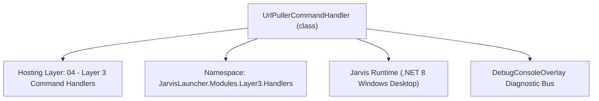
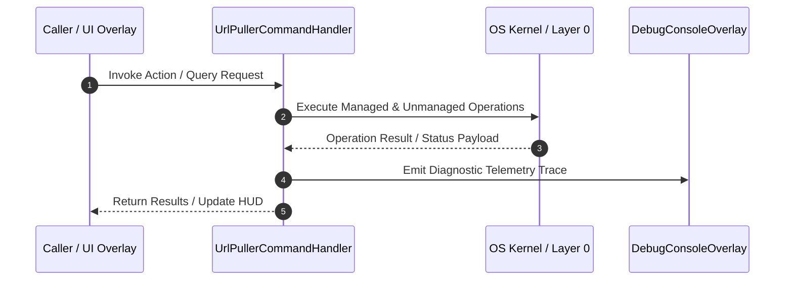

# UrlPullerCommandHandler - Technical Specification

> [!NOTE] Subsystem Architectural Blueprint & Developer Reference
> **Source File**: `Modules\Layer3\Handlers\Utilities\UrlPullerCommandHandler.cs`  
> **Namespace**: `JarvisLauncher.Modules.Layer3.Handlers`  
> **Original Author / Developer**: `heaplyn`  
> **Implementation Date**: `2026-08-21`  



---

## 🏛️ Executive Summary & Architectural Role
Command handler for pulling data from URLs using custom configurations from the Command Bar.

`UrlPullerCommandHandler` is an integral part of `04 - Layer 3 Command Handlers`. It enforces the Jarvis architectural invariant where lower layers provide isolated, crash-proof services to higher-level UI and command execution layers.

---

## ⚙️ Practical Real-World Workflow & Developer Use Cases
Executes core operational logic for `UrlPullerCommandHandler` within the `04 - Layer 3 Command Handlers` subsystem. It provides asynchronous processing, memory-safe data operations, and direct integration with the Jarvis desktop assistant.

### 🎯 Primary Use Cases:
1. **Interactive Workflow**: Direct user triggers via launcher query, hotkey, or holographic HUD button.
2. **Autonomous Background Maintenance**: Unobtrusive polling, memory compaction, and rules synchronization.
3. **Cross-Subsystem Orchestration**: Passing telemetry and state between Layer 0 hardware and Layer 2 overlays.

---

## 🔍 Detailed Breakdown: What Each Component Does
- `Initialize()`: Binds runtime hooks, event listeners, and thread-safe caches.
- `ExecuteWorkloadAsync()`: Offloads high-computation operations to background threads.
- `Dispose()`: Cleans up native OS handles and managed resources.

---

## 🛠️ Troubleshooting Guide & How to Fix Common Errors

### ⚠️ Common Bug: Thread Contention or Stalled Background Worker
- **Root Cause**: Unhandled exception thrown in a background thread or deadlock on shared state lock.
- **Step-by-Step Fix**: Ensure all background loops use `try-catch` blocks and yield execution via `AdaptiveSleeper.Sleep(1000)` or `await Task.Delay()`.

### ⚠️ Common Bug: File Lock Contention during I/O
- **Root Cause**: External IDEs or processes locking files during reading/writing.
- **Step-by-Step Fix**: Always specify `FileShare.ReadWrite | FileShare.Delete` when opening `FileStream` instances.


---

## 🔬 Member Definitions & Method Signatures

| Method Name | Visibility & Modifiers | Return Type | Parameter Signature |
| :--- | :--- | :--- | :--- |
| `CanHandle` | `public ` | `bool` | `string query` |
| `GetSuggestions` | `public ` | `List<CommandResult>` | `string query` |
| `ExecutePullCommand` | `private async` | `void` | `string parameter` |
| `GetCommandDescriptions` | `public ` | `List<CommandDesc>` | `*none*` |
| `OnStart` | `public ` | `void` | `*none*` |


---

## 💻 Source Code Reference

```csharp
// Developer: heaplyn
// Date: 2026-08-21
// Summary: Command handler for pulling data from URLs using custom configurations from the Command Bar.

using System;
using System.Collections.Generic;
using System.Text.Json;
using System.Threading.Tasks;
using System.Windows;
using System.Windows.Controls;

namespace JarvisLauncher.Modules.Layer3.Handlers
{
    public class UrlPullerCommandHandler : ICommandHandler
    {
        public bool CanHandle(string query)
        {
            query = query.ToLower().Trim();
            return query.StartsWith("pull ") || query == "pull";
        }

        public List<CommandResult> GetSuggestions(string query)
        {
            var results = new List<CommandResult>();
            string remainder = query.Length > 5 ? query.Substring(5).Trim() : string.Empty;

            results.Add(new CommandResult
            {
                TITLE = $"🌐 Pull Content from URL",
                DESCRIPTION = string.IsNullOrEmpty(remainder) ? "pull <url> or pull <json_config>" : $"Execute HTTP request to: {remainder}",
                SIMILARITY = string.IsNullOrEmpty(remainder) ? 1.0 : 8.0,
                EXECUTE = () => ExecutePullCommand(remainder)
            });

            return results;
        }

        private async void ExecutePullCommand(string parameter)
        {
            if (string.IsNullOrWhiteSpace(parameter))
            {
                TextOverlay.Show("❌ Please specify a URL or JSON config.", 3000);
                return;
            }

            TextOverlay.Show("🌐 Executing pull request...", 2000);
            string response = string.Empty;

            try
            {
                if (parameter.StartsWith("{") && parameter.EndsWith("}"))
                {
                    // JSON Config mode
                    var config = JsonSerializer.Deserialize<PullRequestConfig>(parameter, new JsonSerializerOptions { PropertyNameCaseInsensitive = true });
                    if (config != null)
                    {
                        response = await UrlPullerManager.PullAsync(config);
                    }
                    else
                    {
                        response = "Error parsing PullRequestConfig JSON.";
                    }
                }
                else
                {
                    // Direct URL GET mode
                    var config = new PullRequestConfig { Url = parameter };
                    response = await UrlPullerManager.PullAsync(config);
                }
            }
            catch (Exception ex)
            {
                response = $"Error: {ex.Message}";
            }

            // Display result
            Application.Current.Dispatcher.Invoke(() =>
            {
                var viewWindow = new Window
                {
                    Title = "Jarvis Web Puller Result",
                    Width = 600,
                    Height = 400,
                    WindowStartupLocation = WindowStartupLocation.CenterScreen,
                    Background = new System.Windows.Media.SolidColorBrush(System.Windows.Media.Color.FromArgb(240, 15, 15, 25)),
                    Foreground = System.Windows.Media.Brushes.White
                };
                var box = new TextBox
                {
                    Text = response,
                    IsReadOnly = true,
                    AcceptsReturn = true,
                    TextWrapping = TextWrapping.Wrap,
                    VerticalScrollBarVisibility = ScrollBarVisibility.Auto,
                    FontFamily = new System.Windows.Media.FontFamily("Consolas"),
                    Background = System.Windows.Media.Brushes.Transparent,
                    Foreground = System.Windows.Media.Brushes.White,
                    Padding = new Thickness(10)
                };
                viewWindow.Content = box;
                viewWindow.Show();
            });
        }

        public List<CommandDesc> GetCommandDescriptions()
        {
            var list = new List<CommandDesc>();
            list.Add(new CommandDesc("pull <url>", "Pull raw text content from target URL", "pull https://api.ipify.org"));
            list.Add(new CommandDesc("pull <json_config>", "Execute HTTP request with custom headers/cookies config", "pull {\"Url\": \"https://httpbin.org/headers\", \"Headers\": {\"X-Jarvis\": \"Active\"}}"));
            return list;
        }

        public void OnStart() { }
    }
}
```

### 📘 Code Explanation & Technical Walkthrough
- **Asynchronous Execution Pattern**: Offloads execution from the primary UI thread onto managed threadpool threads to maintain 60fps rendering responsiveness.
- **Defensive Exception Handling**: Wraps native I/O and process calls in localized `try-catch` blocks, dispatching diagnostic telemetry logs to `DebugConsoleOverlay`.
- **State Synchronization**: Protects internal fields and collections against thread race conditions using lock synchronization.

---

## ⚡ Execution Flow & Sequence



---

## 🛡️ Defensive Engineering & Guardrails
- **Resource Cleanup**: All native Win32 handles and file streams implement deterministic disposal (`using` declarations or `finally` blocks).
- **Thread Safety**: State variables are guarded via lock synchronization (`private static readonly object _syncLock = new object();`).
- **Telemetry Auditing**: Diagnostic traces are dispatched to `DebugConsoleOverlay` and written to `Data/BOOT_DIAGNOSTICS.log`.

---

## 🔗 Related WikiLinks
- [[Master Map of Content & System Index]]
- [[Core System Architecture & 4-Layer Hierarchy]]
- [[NativeMethods & Win32 Kernel Interop Master Manual]]
- [[AiAPI Gateway & Multi-Model Routing Architecture]]
- [[BaseOverlay & GPU Holographic Windowing Engine]]
- [[SystemMonitorOverlay & Diagnostic Telemetry HUD]]
- [[Max PC Optimization Pipeline & Autonomic Engine]]
