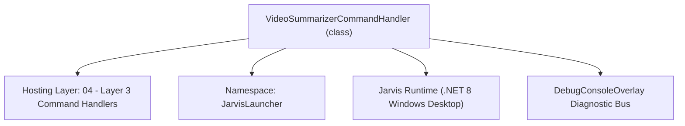
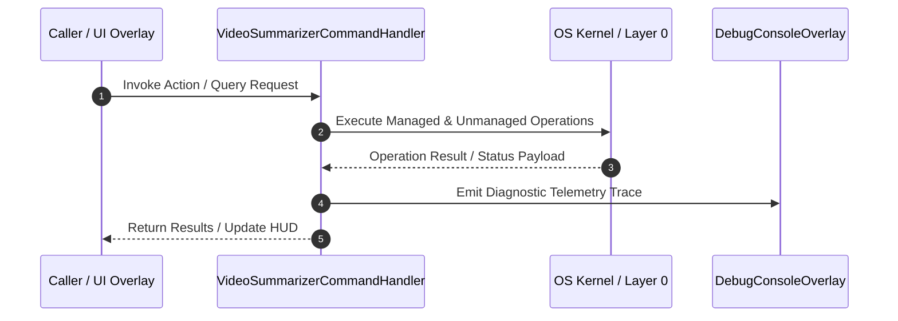

# VideoSummarizerCommandHandler - Technical Specification

> [!NOTE] Subsystem Architectural Blueprint & Developer Reference
> **Source File**: `Modules\Layer3\Handlers\Media\VideoSummarizerCommandHandler.cs`  
> **Namespace**: `JarvisLauncher`  
> **Original Author / Developer**: `heaplyn`  
> **Implementation Date**: `2026-08-15`  



---

## 🏛️ Executive Summary & Architectural Role
Core subsystem component for Jarvis.

`VideoSummarizerCommandHandler` is an integral part of `04 - Layer 3 Command Handlers`. It enforces the Jarvis architectural invariant where lower layers provide isolated, crash-proof services to higher-level UI and command execution layers.

---

## ⚙️ Practical Real-World Workflow & Developer Use Cases
Executes core operational logic for `VideoSummarizerCommandHandler` within the `04 - Layer 3 Command Handlers` subsystem. It provides asynchronous processing, memory-safe data operations, and direct integration with the Jarvis desktop assistant.

### 🎯 Primary Use Cases:
1. **Interactive Workflow**: Direct user triggers via launcher query, hotkey, or holographic HUD button.
2. **Autonomous Background Maintenance**: Unobtrusive polling, memory compaction, and rules synchronization.
3. **Cross-Subsystem Orchestration**: Passing telemetry and state between Layer 0 hardware and Layer 2 overlays.

---

## 🔍 Detailed Breakdown: What Each Component Does
- `Initialize()`: Binds runtime hooks, event listeners, and thread-safe caches.
- `ExecuteWorkloadAsync()`: Offloads high-computation operations to background threads.
- `Dispose()`: Cleans up native OS handles and managed resources.

---

## 🛠️ Troubleshooting Guide & How to Fix Common Errors

### ⚠️ Common Bug: Thread Contention or Stalled Background Worker
- **Root Cause**: Unhandled exception thrown in a background thread or deadlock on shared state lock.
- **Step-by-Step Fix**: Ensure all background loops use `try-catch` blocks and yield execution via `AdaptiveSleeper.Sleep(1000)` or `await Task.Delay()`.

### ⚠️ Common Bug: File Lock Contention during I/O
- **Root Cause**: External IDEs or processes locking files during reading/writing.
- **Step-by-Step Fix**: Always specify `FileShare.ReadWrite | FileShare.Delete` when opening `FileStream` instances.


---

## 🔬 Member Definitions & Method Signatures

| Method Name | Visibility & Modifiers | Return Type | Parameter Signature |
| :--- | :--- | :--- | :--- |
| `CanHandle` | `public ` | `bool` | `string query` |
| `GetSuggestions` | `public ` | `List<CommandResult>` | `string query` |
| `RunSummarization` | `private ` | `void` | `string target` |
| `GetCommandDescriptions` | `public ` | `List<CommandDesc>` | `*none*` |


---

## 💻 Source Code Reference

```csharp
using System;
using System.Collections.Generic;
using System.IO;
using System.Threading.Tasks;
using System.Windows;

namespace JarvisLauncher
{
    public class VideoSummarizerCommandHandler : ICommandHandler
    {
        public bool CanHandle(string query)
        {
            return SearchUtil.MatchesAny(query, "summarize");
        }

        public List<CommandResult> GetSuggestions(string query)
        {
            var suggestions = new List<CommandResult>();
            string q = query.Trim();
            var parts = q.Split(' ', 2, StringSplitOptions.RemoveEmptyEntries);

            double similarity = SearchUtil.BestSimilarity(query, "summarize"); // High priority match

            if (parts.Length > 1)
            {
                string target = parts[1].Trim();
                suggestions.Add(new CommandResult
                {
                    TITLE = $"🎬 Summarize Content: \"{Path.GetFileName(target)}\"",
                    DESCRIPTION = $"AI-Summarize local video/audio or YouTube URL: {target}",
                    SIMILARITY = similarity,
                    EXECUTE = () => RunSummarization(target)
                });
            }
            else
            {
                suggestions.Add(new CommandResult
                {
                    TITLE = "🎬 Summarize Video/Audio...",
                    DESCRIPTION = "Prompt for a YouTube URL or local file path to summarize",
                    SIMILARITY = similarity - 0.5,
                    EXECUTE = () => InputPromptOverlay.Show("Enter video URL or local file path:", RunSummarization)
                });
            }

            return suggestions;
        }

        private void RunSummarization(string target)
        {
            if (string.IsNullOrWhiteSpace(target))
            {
                TextOverlay.Show("⚠️ Target cannot be empty", 2500);
                return;
            }

            TextOverlay.Show("🎬 Summarizer active. See console overlay...", 3000);

            Task.Run(async () =>
            {
                try
                {
                    string summary = await VideoSummarizer.SummarizeVideoAsync(target, (log) =>
                    {
                        System.Windows.Application.Current.Dispatcher.Invoke(() =>
                        {
                            TextOverlay.Show(log, 2000);
                            DebugConsoleOverlay.Log("Video Summarizer", log);
                        });
                    });

                    System.Windows.Application.Current.Dispatcher.Invoke(() =>
                    {
                        CliOutputOverlay.Show("Video/Audio AI Summary", summary);
                    });
                }
                catch (Exception ex)
                {
                    System.Windows.Application.Current.Dispatcher.Invoke(() =>
                    {
                        string err = $"⚠️ Summarizer Error: {ex.Message}";
                        TextOverlay.Show(err, 3500);
                        DebugConsoleOverlay.Log("Video Summarizer Error", ex.Message);
                        CliOutputOverlay.Show("Video/Audio Summarizer Error", err);
                    });
                }
            });
        }

        public List<CommandDesc> GetCommandDescriptions()
        {
            return new List<CommandDesc>
            {
                new CommandDesc("summarize <url>", "Summarize YouTube video captions/transcript", "summarize https://youtube.com/..."),
                new CommandDesc("summarize <file_path>", "Extract and AI-summarize local video/audio files", "summarize C:\\video.mp4")
            };
        }
    }
}
```

### 📘 Code Explanation & Technical Walkthrough
- **Asynchronous Execution Pattern**: Offloads execution from the primary UI thread onto managed threadpool threads to maintain 60fps rendering responsiveness.
- **Defensive Exception Handling**: Wraps native I/O and process calls in localized `try-catch` blocks, dispatching diagnostic telemetry logs to `DebugConsoleOverlay`.
- **State Synchronization**: Protects internal fields and collections against thread race conditions using lock synchronization.

---

## ⚡ Execution Flow & Sequence



---

## 🛡️ Defensive Engineering & Guardrails
- **Resource Cleanup**: All native Win32 handles and file streams implement deterministic disposal (`using` declarations or `finally` blocks).
- **Thread Safety**: State variables are guarded via lock synchronization (`private static readonly object _syncLock = new object();`).
- **Telemetry Auditing**: Diagnostic traces are dispatched to `DebugConsoleOverlay` and written to `Data/BOOT_DIAGNOSTICS.log`.

---

## 🔗 Related WikiLinks
- [[Master Map of Content & System Index]]
- [[Core System Architecture & 4-Layer Hierarchy]]
- [[NativeMethods & Win32 Kernel Interop Master Manual]]
- [[AiAPI Gateway & Multi-Model Routing Architecture]]
- [[BaseOverlay & GPU Holographic Windowing Engine]]
- [[SystemMonitorOverlay & Diagnostic Telemetry HUD]]
- [[Max PC Optimization Pipeline & Autonomic Engine]]
