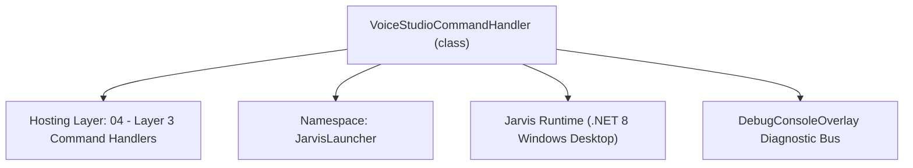
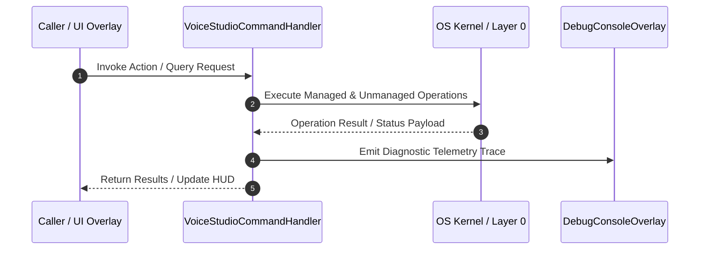

# VoiceStudioCommandHandler - Technical Specification

> [!NOTE] Subsystem Architectural Blueprint & Developer Reference
> **Source File**: `Modules\Layer3\Handlers\Media\VoiceStudioCommandHandler.cs`  
> **Namespace**: `JarvisLauncher`  
> **Original Author / Developer**: `heaplyn`  
> **Implementation Date**: `2026-08-13`  



---

## 🏛️ Executive Summary & Architectural Role
Command handler for Voice AI Studio, Offline Pre-Caching Studio, GitHub Custom TTS Voice Library, & Vosk model downloader.

`VoiceStudioCommandHandler` is an integral part of `04 - Layer 3 Command Handlers`. It enforces the Jarvis architectural invariant where lower layers provide isolated, crash-proof services to higher-level UI and command execution layers.

---

## ⚙️ Practical Real-World Workflow & Developer Use Cases
Executes core operational logic for `VoiceStudioCommandHandler` within the `04 - Layer 3 Command Handlers` subsystem. It provides asynchronous processing, memory-safe data operations, and direct integration with the Jarvis desktop assistant.

### 🎯 Primary Use Cases:
1. **Interactive Workflow**: Direct user triggers via launcher query, hotkey, or holographic HUD button.
2. **Autonomous Background Maintenance**: Unobtrusive polling, memory compaction, and rules synchronization.
3. **Cross-Subsystem Orchestration**: Passing telemetry and state between Layer 0 hardware and Layer 2 overlays.

---

## 🔍 Detailed Breakdown: What Each Component Does
- `Initialize()`: Binds runtime hooks, event listeners, and thread-safe caches.
- `ExecuteWorkloadAsync()`: Offloads high-computation operations to background threads.
- `Dispose()`: Cleans up native OS handles and managed resources.

---

## 🛠️ Troubleshooting Guide & How to Fix Common Errors

### ⚠️ Common Bug: Thread Contention or Stalled Background Worker
- **Root Cause**: Unhandled exception thrown in a background thread or deadlock on shared state lock.
- **Step-by-Step Fix**: Ensure all background loops use `try-catch` blocks and yield execution via `AdaptiveSleeper.Sleep(1000)` or `await Task.Delay()`.

### ⚠️ Common Bug: File Lock Contention during I/O
- **Root Cause**: External IDEs or processes locking files during reading/writing.
- **Step-by-Step Fix**: Always specify `FileShare.ReadWrite | FileShare.Delete` when opening `FileStream` instances.


---

## 🔬 Member Definitions & Method Signatures

| Method Name | Visibility & Modifiers | Return Type | Parameter Signature |
| :--- | :--- | :--- | :--- |
| `CanHandle` | `public ` | `bool` | `string query` |
| `GetSuggestions` | `public ` | `List<CommandResult>` | `string query` |


---

## 💻 Source Code Reference

```csharp
// Developer: heaplyn
// Date: 2026-08-13
// Summary: Command handler for Voice AI Studio, Offline Pre-Caching Studio, GitHub Custom TTS Voice Library, & Vosk model downloader.

using System;
using System.Collections.Generic;
using System.Diagnostics;
using System.IO;
using System.Threading.Tasks;

namespace JarvisLauncher
{
    public class VoiceStudioCommandHandler : ICommandHandler
    {
        public bool CanHandle(string query)
        {
            query = query.ToLower().Trim();
            return query == "voice" || query == "voicestudio" || query == "voicetrainer" ||
                   query == "record" || query == "audiorecorder" || query == "voicememo" ||
                   query == "speechcalibrate" || query == "voicetrain" || query == "speechtraining" ||
                   query == "downloadvosk" || query == "downloadmodel" || query == "voskmodel" ||
                   query == "ttsvoices" || query == "customvoice" || query == "ttssamples" || query == "ttsvoice" ||
                   query == "offline" || query == "offlinemode" || query == "precache" || query == "cacheoffline" ||
                   query == "disable voice" || query == "enable voice" || query == "voicemode off" || query == "voicemode on" || query == "toggle voice" ||
                   query == "voice dataset" || query == "voice classification" || query == "classify voice" || query == "teleprompter" ||
                   query.StartsWith("voice ") || query.StartsWith("record ");
        }

        public List<CommandResult> GetSuggestions(string query)
        {
            var results = new List<CommandResult>();
            string lower = query.ToLower().Trim();

            // Voice Mode Toggle Commands
            if (lower == "disable voice" || lower == "voicemode off" || lower == "stop voice" || lower == "turn off voice mode")
            {
                results.Add(new CommandResult
                {
                    TITLE = "🔇 Disable Voice Interaction Mode",
                    DESCRIPTION = "Stops Jarvis from responding to conversations, but keeps wake-word listening active for reactivation.",
                    SIMILARITY = 6.0,
                    EXECUTE = () =>
                    {
                        SettingsManager.Current.IS_VOICE_MODE_ACTIVE = false;
                        SettingsManager.Save();
                        TtsManager.Speak("Voice mode disabled.");
                        TextOverlay.Show("🔇 Voice Mode: OFF", 3000);
                    }
                });
                return results;
            }

            if (lower == "enable voice" || lower == "voicemode on" || lower == "start voice" || lower == "turn on voice mode")
            {
                results.Add(new CommandResult
                {
                    TITLE = "🎙️ Enable Voice Interaction Mode",
                    DESCRIPTION = "Resumes full voice conversation and system command execution.",
                    SIMILARITY = 6.0,
                    EXECUTE = () =>
                    {
                        SettingsManager.Current.IS_VOICE_MODE_ACTIVE = true;
                        SettingsManager.Save();
                        LocalWakeWordDetector.Initialize(); // Ensure initialized
                        TtsManager.Speak("Voice mode enabled.");
                        TextOverlay.Show("🎙️ Voice Mode: ON", 3000);
                    }
                });
                return results;
            }

            if (lower.Contains("dataset") || lower.Contains("classification") || lower.Contains("classify"))
            {
                results.Add(new CommandResult
                {
                    TITLE = "🏷️ Open Voice Dataset & Classification Studio",
                    DESCRIPTION = "View, play, tag (Command, AI Chat, Wake Word, Noise), & train acoustic voice dataset",
                    SIMILARITY = 6.0,
                    EXECUTE = () => VoiceStudioOverlay.ShowOverlay()
                });
                return results;
            }

            if (lower == "offline" || lower == "offlinemode" || lower == "precache" || lower == "cacheoffline")
            {
                results.Add(new CommandResult
                {
                    TITLE = "📶 Open Offline Mode & Wi-Fi Pre-Caching Studio",
                    DESCRIPTION = "Pre-download speech models, TTS voices, & local LLM models for 100% offline functionality",
                    SIMILARITY = 6.0,
                    EXECUTE = () => OfflineStudioOverlay.ShowOverlay()
                });
                return results;
            }

            if (lower == "ttsvoices" || lower == "customvoice" || lower == "ttssamples" || lower == "ttsvoice")
            {
                results.Add(new CommandResult
                {
                    TITLE = "🌐 Open GitHub Custom TTS Voice Library (yaph/tts-samples)",
                    DESCRIPTION = "Browse, preview, & set custom TTS voice MP3 samples directly from GitHub",
                    SIMILARITY = 6.0,
                    EXECUTE = () => TtsVoiceLibraryOverlay.ShowOverlay()
                });
                return results;
            }

            if (lower == "downloadvosk" || lower == "downloadmodel" || lower == "voskmodel")
            {
                results.Add(new CommandResult
                {
                    TITLE = "📥 Download Official Vosk Neural Speech Model (~40MB)",
                    DESCRIPTION = "Auto-downloads and installs full offline neural speech recognition model for 99%+ accuracy",
                    SIMILARITY = 6.0,
                    EXECUTE = () => Task.Run(async () => await VoskEngine.EnsureModelDownloadedAsync(showToast: true))
                });
                return results;
            }

            results.Add(new CommandResult
            {
                TITLE = "📶 Open Offline Mode & Pre-Caching Studio",
                DESCRIPTION = "Pre-cache speech, TTS, & local LLM features for 100% offline usage",
                SIMILARITY = 5.6,
                EXECUTE = () => OfflineStudioOverlay.ShowOverlay()
            });

            results.Add(new CommandResult
            {
                TITLE = "🎙️ Open Voice AI Studio & Audio Recorder",
                DESCRIPTION = "Train AI voice profiles, record audio memos, calibrate speech sensitivity, & map voice shortcuts",
                SIMILARITY = 5.5,
                EXECUTE = () => VoiceStudioOverlay.ShowOverlay()
            });

            return results;
        }
    }
}
```

### 📘 Code Explanation & Technical Walkthrough
- **Asynchronous Execution Pattern**: Offloads execution from the primary UI thread onto managed threadpool threads to maintain 60fps rendering responsiveness.
- **Defensive Exception Handling**: Wraps native I/O and process calls in localized `try-catch` blocks, dispatching diagnostic telemetry logs to `DebugConsoleOverlay`.
- **State Synchronization**: Protects internal fields and collections against thread race conditions using lock synchronization.

---

## ⚡ Execution Flow & Sequence



---

## 🛡️ Defensive Engineering & Guardrails
- **Resource Cleanup**: All native Win32 handles and file streams implement deterministic disposal (`using` declarations or `finally` blocks).
- **Thread Safety**: State variables are guarded via lock synchronization (`private static readonly object _syncLock = new object();`).
- **Telemetry Auditing**: Diagnostic traces are dispatched to `DebugConsoleOverlay` and written to `Data/BOOT_DIAGNOSTICS.log`.

---

## 🔗 Related WikiLinks
- [[Master Map of Content & System Index]]
- [[Core System Architecture & 4-Layer Hierarchy]]
- [[NativeMethods & Win32 Kernel Interop Master Manual]]
- [[AiAPI Gateway & Multi-Model Routing Architecture]]
- [[BaseOverlay & GPU Holographic Windowing Engine]]
- [[SystemMonitorOverlay & Diagnostic Telemetry HUD]]
- [[Max PC Optimization Pipeline & Autonomic Engine]]
