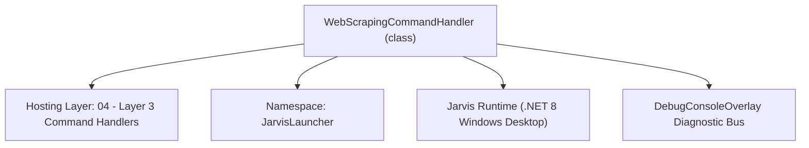
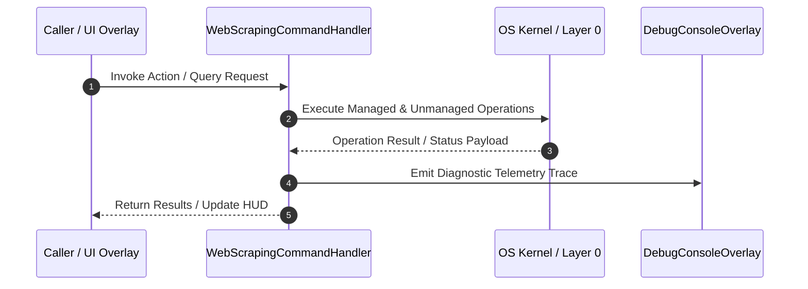

# WebScrapingCommandHandler - Technical Specification

> [!NOTE] Subsystem Architectural Blueprint & Developer Reference
> **Source File**: `Modules\Layer3\Handlers\Utilities\WebScrapingCommandHandler.cs`  
> **Namespace**: `JarvisLauncher`  
> **Original Author / Developer**: `copilot`  
> **Implementation Date**: `2026-08-12`  



---

## 🏛️ Executive Summary & Architectural Role
Handles 'scrape' (generic webpage scraper) and 'discord' (official Bot API server reader) commands.

`WebScrapingCommandHandler` is an integral part of `04 - Layer 3 Command Handlers`. It enforces the Jarvis architectural invariant where lower layers provide isolated, crash-proof services to higher-level UI and command execution layers.

---

## ⚙️ Practical Real-World Workflow & Developer Use Cases
Executes core operational logic for `WebScrapingCommandHandler` within the `04 - Layer 3 Command Handlers` subsystem. It provides asynchronous processing, memory-safe data operations, and direct integration with the Jarvis desktop assistant.

### 🎯 Primary Use Cases:
1. **Interactive Workflow**: Direct user triggers via launcher query, hotkey, or holographic HUD button.
2. **Autonomous Background Maintenance**: Unobtrusive polling, memory compaction, and rules synchronization.
3. **Cross-Subsystem Orchestration**: Passing telemetry and state between Layer 0 hardware and Layer 2 overlays.

---

## 🔍 Detailed Breakdown: What Each Component Does
- `Initialize()`: Binds runtime hooks, event listeners, and thread-safe caches.
- `ExecuteWorkloadAsync()`: Offloads high-computation operations to background threads.
- `Dispose()`: Cleans up native OS handles and managed resources.

---

## 🛠️ Troubleshooting Guide & How to Fix Common Errors

### ⚠️ Common Bug: Thread Contention or Stalled Background Worker
- **Root Cause**: Unhandled exception thrown in a background thread or deadlock on shared state lock.
- **Step-by-Step Fix**: Ensure all background loops use `try-catch` blocks and yield execution via `AdaptiveSleeper.Sleep(1000)` or `await Task.Delay()`.

### ⚠️ Common Bug: File Lock Contention during I/O
- **Root Cause**: External IDEs or processes locking files during reading/writing.
- **Step-by-Step Fix**: Always specify `FileShare.ReadWrite | FileShare.Delete` when opening `FileStream` instances.


---

## 🔬 Member Definitions & Method Signatures

| Method Name | Visibility & Modifiers | Return Type | Parameter Signature |
| :--- | :--- | :--- | :--- |
| `IsMatch` | `private static` | `bool` | `string input, string target` |
| `CanHandle` | `public ` | `bool` | `string query` |
| `GetSuggestions` | `public ` | `List<CommandResult>` | `string query` |
| `RunScrape` | `private static` | `void` | `string url` |
| `RunListGuilds` | `private static` | `void` | `*none*` |
| `RunListChannels` | `private static` | `void` | `string guildId` |
| `RunReadChannel` | `private static` | `void` | `string channelId, int limit, bool summarize` |
| `GetCommandDescriptions` | `public ` | `List<CommandDesc>` | `*none*` |


---

## 💻 Source Code Reference

```csharp
// Developer: copilot
// Date: 2026-08-12
// Summary: Handles 'scrape' (generic webpage scraper) and 'discord' (official Bot API server reader) commands.

using System;
using System.Collections.Generic;
using System.Linq;
using System.Text;
using System.Threading.Tasks;
using System.Windows;

namespace JarvisLauncher
{
    public class WebScrapingCommandHandler : ICommandHandler
    {
        private static bool IsMatch(string input, string target)
        {
            if (string.IsNullOrEmpty(input)) return false;
            if (target.StartsWith(input) || input.StartsWith(target)) return true;
            // Typo tolerance for 3+ char tokens ("scrpe" -> "scrape") via the shared fuzzy gate.
            return input.Length >= 3 && SearchUtil.IsClose(input, target);
        }

        public bool CanHandle(string query)
        {
            string firstWord = query.Trim().ToLower().Split(' ')[0];
            return IsMatch(firstWord, "scrape") || IsMatch(firstWord, "discord");
        }

        public List<CommandResult> GetSuggestions(string query)
        {
            var suggestions = new List<CommandResult>();
            var parts = query.Trim().Split(' ', 3, StringSplitOptions.RemoveEmptyEntries);
            string cmd = parts.Length > 0 ? parts[0].ToLower() : "";

            if (IsMatch(cmd, "scrape"))
            {
                if (parts.Length > 1)
                {
                    string url = parts[1].Trim();
                    suggestions.Add(new CommandResult
                    {
                        TITLE = $"🕸️ Scrape Page: {url}",
                        DESCRIPTION = "Extract title, meta description, headings, and links from the page",
                        SIMILARITY = 4.0,
                        EXECUTE = () => RunScrape(url)
                    });
                }
                else
                {
                    suggestions.Add(new CommandResult
                    {
                        TITLE = "🕸️ Scrape Webpage...",
                        DESCRIPTION = "Prompt for a URL and extract structured page data",
                        SIMILARITY = 3.0,
                        EXECUTE = () => InputPromptOverlay.Show("Enter URL to scrape:", RunScrape)
                    });
                }
                return suggestions;
            }

            if (IsMatch(cmd, "discord"))
            {
                string sub = parts.Length > 1 ? parts[1].Trim().ToLower() : "";
                string arg = parts.Length > 2 ? parts[2].Trim() : "";

                if (sub == "token")
                {
                    if (!string.IsNullOrWhiteSpace(arg))
                    {
                        suggestions.Add(new CommandResult
                        {
                            TITLE = "🔑 Save Discord Bot Token",
                            DESCRIPTION = "Store your bot token (from discord.com/developers) for server reading",
                            SIMILARITY = 4.5,
                            EXECUTE = () => { DiscordScraperManager.SaveBotToken(arg); TextOverlay.Show("🔑 Discord bot token saved.", 2500); }
                        });
                    }
                    else
                    {
                        suggestions.Add(new CommandResult
                        {
                            TITLE = "🔑 Set Discord Bot Token...",
                            DESCRIPTION = "Prompt for your official Discord Bot token",
                            SIMILARITY = 3.5,
                            EXECUTE = () => InputPromptOverlay.Show("Enter your Discord Bot token:", (t) =>
                            {
                                DiscordScraperManager.SaveBotToken(t);
                                TextOverlay.Show("🔑 Discord bot token saved.", 2500);
                            })
                        });
                    }
                    return suggestions;
                }

                if (sub == "servers" || sub == "guilds")
                {
                    suggestions.Add(new CommandResult
                    {
                        TITLE = "📡 List Discord Servers (Bot API)",
                        DESCRIPTION = "List servers your configured bot has joined",
                        SIMILARITY = 4.0,
                        EXECUTE = () => RunListGuilds()
                    });
                    return suggestions;
                }

                if (sub == "channels")
                {
                    suggestions.Add(new CommandResult
                    {
                        TITLE = $"📃 List Channels in Server {arg}",
                        DESCRIPTION = "List readable text channels for the given server ID",
                        SIMILARITY = 4.0,
                        EXECUTE = () => RunListChannels(arg)
                    });
                    return suggestions;
                }

                if (sub == "read" || sub == "scrape")
                {
                    var idAndLimit = arg.Split(' ', StringSplitOptions.RemoveEmptyEntries);
                    string channelId = idAndLimit.Length > 0 ? idAndLimit[0] : "";
                    int limit = idAndLimit.Length > 1 && int.TryParse(idAndLimit[1], out int l) ? l : 25;
                    bool summarize = sub == "scrape";

                    suggestions.Add(new CommandResult
                    {
                        TITLE = summarize ? $"🧠 Scrape & Summarize Channel: {channelId}" : $"💬 Read Channel Messages: {channelId}",
                        DESCRIPTION = summarize ? "Fetch recent messages and summarize discussion with AI" : $"Fetch last {limit} messages via Bot API",
                        SIMILARITY = 4.0,
                        EXECUTE = () => RunReadChannel(channelId, limit, summarize)
                    });
                    return suggestions;
                }

                suggestions.Add(new CommandResult
                {
                    TITLE = "📖 Discord Bot API Help",
                    DESCRIPTION = "discord token <t> | discord servers | discord channels <id> | discord read <id> [n] | discord scrape <id> [n]",
                    SIMILARITY = 2.5,
                    EXECUTE = () => CliOutputOverlay.Show("Discord Commands",
                        "discord token <token>       Save your official Bot token\n" +
                        "discord servers              List servers your bot has joined\n" +
                        "discord channels <guildId>   List text channels in a server\n" +
                        "discord read <channelId> [n] Show last n messages (default 25)\n" +
                        "discord scrape <channelId> [n] Show messages + AI summary\n\n" +
                        "Requires a bot registered at discord.com/developers, invited to your\n" +
                        "own server with 'Read Message History' permission. Self-bots (automating\n" +
                        "a personal user account) violate Discord ToS and are not supported.")
                });
                return suggestions;
            }

            return suggestions;
        }

        private static void RunScrape(string url)
        {
            TextOverlay.Show("🕸️ Scraping page...", 2000);
            Task.Run(async () =>
            {
                try
                {
                    var result = await WebScraperManager.ScrapePageAsync(url);
                    string report = WebScraperManager.FormatReport(result);
                    Application.Current.Dispatcher.Invoke(() => CliOutputOverlay.Show($"Scrape Report: {url}", report));
                }
                catch (Exception ex)
                {
                    Application.Current.Dispatcher.Invoke(() => TextOverlay.Show($"⚠️ Scrape failed: {ex.Message}", 3500));
                }
            });
        }

        private static void RunListGuilds()
        {
            TextOverlay.Show("📡 Fetching Discord servers...", 2000);
            Task.Run(async () =>
            {
                try
                {
                    var guilds = await DiscordScraperManager.GetGuildsAsync();
                    var sb = new StringBuilder();
                    sb.AppendLine($"Bot is a member of {guilds.Count} server(s):\n");
                    foreach (var g in guilds) sb.AppendLine($"  {g.Name,-40} ID: {g.Id}");
                    Application.Current.Dispatcher.Invoke(() => CliOutputOverlay.Show("Discord Servers", sb.ToString()));
                }
                catch (Exception ex)
                {
                    Application.Current.Dispatcher.Invoke(() => TextOverlay.Show($"⚠️ Discord error: {ex.Message}", 3500));
                }
            });
        }

        private static void RunListChannels(string guildId)
        {
            if (string.IsNullOrWhiteSpace(guildId))
            {
                TextOverlay.Show("⚠️ Usage: discord channels <serverId>", 3000);
                return;
            }

            TextOverlay.Show("📃 Fetching channels...", 2000);
            Task.Run(async () =>
            {
                try
                {
                    var channels = await DiscordScraperManager.GetChannelsAsync(guildId);
                    var sb = new StringBuilder();
                    sb.AppendLine($"Found {channels.Count} readable text channel(s):\n");
                    foreach (var c in channels) sb.AppendLine($"  #{c.Name,-30} ID: {c.Id}");
                    Application.Current.Dispatcher.Invoke(() => CliOutputOverlay.Show($"Discord Channels: {guildId}", sb.ToString()));
                }
                catch (Exception ex)
                {
                    Application.Current.Dispatcher.Invoke(() => TextOverlay.Show($"⚠️ Discord error: {ex.Message}", 3500));
                }
            });
        }

        private static void RunReadChannel(string channelId, int limit, bool summarize)
        {
            if (string.IsNullOrWhiteSpace(channelId))
            {
                TextOverlay.Show("⚠️ Usage: discord read <channelId> [limit]", 3000);
                return;
            }

            TextOverlay.Show("💬 Fetching messages...", 2000);
            Task.Run(async () =>
            {
                try
                {
                    var messages = await DiscordScraperManager.GetRecentMessagesAsync(channelId, limit);
                    var sb = new StringBuilder();
                    foreach (var m in messages)
                    {
                        if (string.IsNullOrWhiteSpace(m.Content)) continue;
                        sb.AppendLine($"[{m.Timestamp}] {m.Author}: {m.Content}");
                    }
                    string transcript = sb.ToString();

                    if (summarize)
                    {
                        string prompt = $"Summarize the key topics and highlights from this Discord channel conversation:\n\n{transcript}";
                        string summary = await LlmRouter.AskAsync(prompt);
                        Application.Current.Dispatcher.Invoke(() => CliOutputOverlay.Show($"Discord Summary: #{channelId}", summary + "\n\n--- Raw Transcript ---\n" + transcript));
                    }
                    else
                    {
                        Application.Current.Dispatcher.Invoke(() => CliOutputOverlay.Show($"Discord Messages: #{channelId}", transcript));
                    }
                }
                catch (Exception ex)
                {
                    Application.Current.Dispatcher.Invoke(() => TextOverlay.Show($"⚠️ Discord error: {ex.Message}", 3500));
                }
            });
        }

        public List<CommandDesc> GetCommandDescriptions()
        {
            return new List<CommandDesc>
            {
                new CommandDesc("scrape <url>", "Extract title, headings, links & text from a webpage", "scrape example.com"),
                new CommandDesc("discord token <token>", "Save your official Discord Bot token", "discord token MTIz..."),
                new CommandDesc("discord servers", "List servers your Discord bot has joined", "discord servers"),
                new CommandDesc("discord channels <guildId>", "List text channels in a Discord server", "discord channels 123456"),
                new CommandDesc("discord read <channelId> [n]", "Show the last n messages in a channel", "discord read 123456 25"),
                new CommandDesc("discord scrape <channelId> [n]", "Fetch channel messages and AI-summarize them", "discord scrape 123456 50")
            };
        }
    }
}
```

### 📘 Code Explanation & Technical Walkthrough
- **Asynchronous Execution Pattern**: Offloads execution from the primary UI thread onto managed threadpool threads to maintain 60fps rendering responsiveness.
- **Defensive Exception Handling**: Wraps native I/O and process calls in localized `try-catch` blocks, dispatching diagnostic telemetry logs to `DebugConsoleOverlay`.
- **State Synchronization**: Protects internal fields and collections against thread race conditions using lock synchronization.

---

## ⚡ Execution Flow & Sequence



---

## 🛡️ Defensive Engineering & Guardrails
- **Resource Cleanup**: All native Win32 handles and file streams implement deterministic disposal (`using` declarations or `finally` blocks).
- **Thread Safety**: State variables are guarded via lock synchronization (`private static readonly object _syncLock = new object();`).
- **Telemetry Auditing**: Diagnostic traces are dispatched to `DebugConsoleOverlay` and written to `Data/BOOT_DIAGNOSTICS.log`.

---

## 🔗 Related WikiLinks
- [[Master Map of Content & System Index]]
- [[Core System Architecture & 4-Layer Hierarchy]]
- [[NativeMethods & Win32 Kernel Interop Master Manual]]
- [[AiAPI Gateway & Multi-Model Routing Architecture]]
- [[BaseOverlay & GPU Holographic Windowing Engine]]
- [[SystemMonitorOverlay & Diagnostic Telemetry HUD]]
- [[Max PC Optimization Pipeline & Autonomic Engine]]
