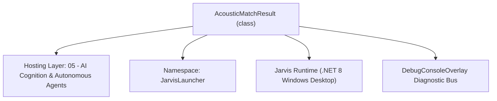
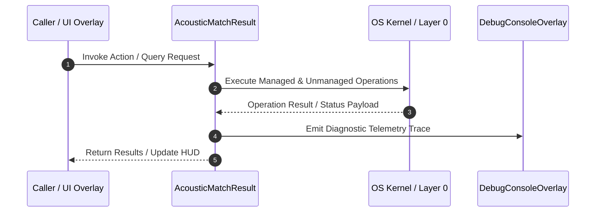

# AcousticMlClassifier - Technical Specification

> [!NOTE] Subsystem Architectural Blueprint & Developer Reference
> **Source File**: `Modules\Layer0\AI_ML\AcousticMlClassifier.cs`  
> **Namespace**: `JarvisLauncher`  
> **Original Author / Developer**: `heaplyn`  
> **Implementation Date**: `2026-08-13`  



---

## 🏛️ Executive Summary & Architectural Role
Machine Learning Acoustic Sound Classifier matching live mic audio against trained Voice Profile MFCC vectors.

`AcousticMatchResult` is an integral part of `05 - AI Cognition & Autonomous Agents`. It enforces the Jarvis architectural invariant where lower layers provide isolated, crash-proof services to higher-level UI and command execution layers.

---

## ⚙️ Practical Real-World Workflow & Developer Use Cases
Executes core operational logic for `AcousticMlClassifier` within the `05 - AI Cognition & Autonomous Agents` subsystem. It provides asynchronous processing, memory-safe data operations, and direct integration with the Jarvis desktop assistant.

### 🎯 Primary Use Cases:
1. **Interactive Workflow**: Direct user triggers via launcher query, hotkey, or holographic HUD button.
2. **Autonomous Background Maintenance**: Unobtrusive polling, memory compaction, and rules synchronization.
3. **Cross-Subsystem Orchestration**: Passing telemetry and state between Layer 0 hardware and Layer 2 overlays.

---

## 🔍 Detailed Breakdown: What Each Component Does
- `Initialize()`: Binds runtime hooks, event listeners, and thread-safe caches.
- `ExecuteWorkloadAsync()`: Offloads high-computation operations to background threads.
- `Dispose()`: Cleans up native OS handles and managed resources.

---

## 🛠️ Troubleshooting Guide & How to Fix Common Errors

### ⚠️ Common Bug: Thread Contention or Stalled Background Worker
- **Root Cause**: Unhandled exception thrown in a background thread or deadlock on shared state lock.
- **Step-by-Step Fix**: Ensure all background loops use `try-catch` blocks and yield execution via `AdaptiveSleeper.Sleep(1000)` or `await Task.Delay()`.

### ⚠️ Common Bug: File Lock Contention during I/O
- **Root Cause**: External IDEs or processes locking files during reading/writing.
- **Step-by-Step Fix**: Always specify `FileShare.ReadWrite | FileShare.Delete` when opening `FileStream` instances.


---

## 🔬 Member Definitions & Method Signatures

| Method Name | Visibility & Modifiers | Return Type | Parameter Signature |
| :--- | :--- | :--- | :--- |
| `RebuildAcousticIndex` | `public static` | `void` | `*none*` |
| `MatchWavFile` | `public static` | `AcousticMatchResult` | `string WavFilePath, double Threshold = 0.70` |


---

## 💻 Source Code Reference

```csharp
// Developer: heaplyn
// Date: 2026-08-13
// Summary: Machine Learning Acoustic Sound Classifier matching live mic audio against trained Voice Profile MFCC vectors.

using System;
using System.Collections.Generic;
using System.IO;

namespace JarvisLauncher
{
    public class AcousticMatchResult
    {
        public bool IS_MATCHED { get; set; } = false;
        public string MATCHED_PHRASE { get; set; } = string.Empty;
        public double CONFIDENCE { get; set; } = 0.0; // 0.0 to 1.0 (0% to 100%)
        public VoiceSample? BEST_SAMPLE { get; set; }
    }

    public static class AcousticMlClassifier
    {
        private static readonly Dictionary<string, double[]> CachedProfileMfccs = new(StringComparer.OrdinalIgnoreCase);

        /// <summary>
        /// Re-builds in-memory MFCC acoustic feature vectors from all recorded samples in Voice Profile.
        /// </summary>
        public static void RebuildAcousticIndex()
        {
            CachedProfileMfccs.Clear();

            // 1. Load official samples from VoiceTrainerManager (Golden Set)
            var ProfileSamples = VoiceTrainerManager.Profile.SAMPLES;
            foreach (var Sample in ProfileSamples)
            {
                if (File.Exists(Sample.AUDIO_FILE_PATH))
                {
                    var Features = AudioFeatureExtractor.ExtractFromFile(Sample.AUDIO_FILE_PATH);
                    if (Features != null && Features.MFCC_COEFFICIENTS != null)
                    {
                        string Key = $"TRAINER:{Sample.ID}:{Sample.PHRASE}";
                        CachedProfileMfccs[Key] = Features.MFCC_COEFFICIENTS;
                    }
                }
            }

            // 2. Load historical logs from VoiceDatasetManager (Self-Learning Set)
            var DatasetRecords = VoiceDatasetManager.DatasetRecords;
            foreach (var Rec in DatasetRecords)
            {
                // ONLY index very short snippets (1-2 words) that are likely to be wake words
                if (File.Exists(Rec.FilePath) && !string.IsNullOrWhiteSpace(Rec.Transcript) &&
                    Rec.Transcript != "..." && Rec.Transcript.Split(' ').Length <= 2)
                {
                    // Use filename hash as a pseudo-id for uniqueness in the index
                    var Features = AudioFeatureExtractor.ExtractFromFile(Rec.FilePath);
                    if (Features != null && Features.MFCC_COEFFICIENTS != null)
                    {
                        string PseudoId = Rec.FileName.GetHashCode().ToString("X");
                        string Key = $"DATASET:{PseudoId}:{Rec.Transcript}";
                        CachedProfileMfccs[Key] = Features.MFCC_COEFFICIENTS;
                    }
                }
            }

            System.Diagnostics.Debug.WriteLine($"🧠 Rebuilt Acoustic ML Index with {CachedProfileMfccs.Count} feature vectors (Golden + Historical).");
        }

        /// <summary>
        /// Classifies an incoming WAV audio file against the trained acoustic voice profile using MFCC Cosine Distance.
        /// </summary>
        public static AcousticMatchResult MatchWavFile(string WavFilePath, double Threshold = 0.70)
        {
            var Result = new AcousticMatchResult();
            if (!File.Exists(WavFilePath)) return Result;

            if (CachedProfileMfccs.Count == 0)
            {
                RebuildAcousticIndex();
            }

            if (CachedProfileMfccs.Count == 0) return Result;

            var InputFeatures = AudioFeatureExtractor.ExtractFromFile(WavFilePath);
            if (InputFeatures == null || InputFeatures.MFCC_COEFFICIENTS == null) return Result;

            double MaxSimilarity = 0.0;
            string BestPhrase = string.Empty;
            VoiceSample? BestSample = null;

            foreach (var Kvp in CachedProfileMfccs)
            {
                double Similarity = AudioFeatureExtractor.CosineSimilarity(InputFeatures.MFCC_COEFFICIENTS, Kvp.Value);
                if (Similarity > MaxSimilarity)
                {
                    MaxSimilarity = Similarity;
                    string[] Parts = Kvp.Key.Split(':');
                    // Key format: SOURCE:ID:PHRASE
                    BestPhrase = Parts.Length > 2 ? Parts[2] : (Parts.Length > 1 ? Parts[1] : string.Empty);

                    if (Parts[0] == "TRAINER")
                    {
                        string SampleId = Parts[1];
                        BestSample = VoiceTrainerManager.Profile.SAMPLES.Find(s => s.ID == SampleId);
                    }
                }
            }

            Result.CONFIDENCE = Math.Round(MaxSimilarity, 3);
            Result.MATCHED_PHRASE = BestPhrase;
            Result.BEST_SAMPLE = BestSample;

            // STRICT GATE: Only consider it a match if it's actually Jarvis
            bool isWakeWordMatch = BestPhrase.ToLowerInvariant().Contains("jarvis");
            Result.IS_MATCHED = MaxSimilarity >= Threshold && isWakeWordMatch;

            if (Result.IS_MATCHED)
                DebugConsoleOverlay.Log("Acoustic ML Match", $"Verified Wake Word: \"{BestPhrase}\" ({Result.CONFIDENCE * 100:F1}%)");

            return Result;
        }
    }
}
```

### 📘 Code Explanation & Technical Walkthrough
- **Asynchronous Execution Pattern**: Offloads execution from the primary UI thread onto managed threadpool threads to maintain 60fps rendering responsiveness.
- **Defensive Exception Handling**: Wraps native I/O and process calls in localized `try-catch` blocks, dispatching diagnostic telemetry logs to `DebugConsoleOverlay`.
- **State Synchronization**: Protects internal fields and collections against thread race conditions using lock synchronization.

---

## ⚡ Execution Flow & Sequence



---

## 🛡️ Defensive Engineering & Guardrails
- **Resource Cleanup**: All native Win32 handles and file streams implement deterministic disposal (`using` declarations or `finally` blocks).
- **Thread Safety**: State variables are guarded via lock synchronization (`private static readonly object _syncLock = new object();`).
- **Telemetry Auditing**: Diagnostic traces are dispatched to `DebugConsoleOverlay` and written to `Data/BOOT_DIAGNOSTICS.log`.

---

## 🔗 Related WikiLinks
- [[Master Map of Content & System Index]]
- [[Core System Architecture & 4-Layer Hierarchy]]
- [[NativeMethods & Win32 Kernel Interop Master Manual]]
- [[AiAPI Gateway & Multi-Model Routing Architecture]]
- [[BaseOverlay & GPU Holographic Windowing Engine]]
- [[SystemMonitorOverlay & Diagnostic Telemetry HUD]]
- [[Max PC Optimization Pipeline & Autonomic Engine]]
