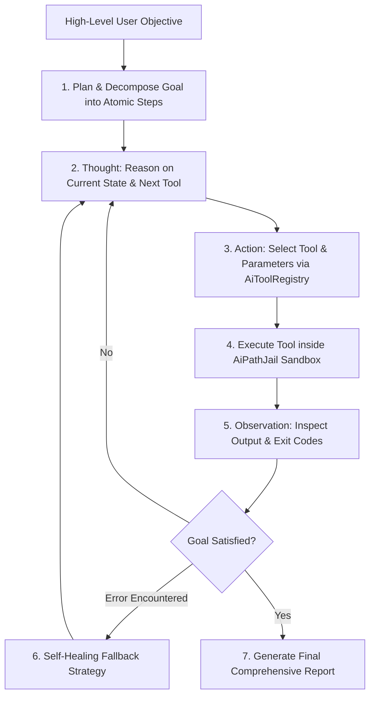

# 🤖 Autonomous Agent Engine & ReAct Planning Loop

## 🤖 Autonomous ReAct Planning & Execution Architecture

`AutonomousAgentEngine` (`Modules/Layer0/AI_ML/AutonomousAgentEngine.cs`) enables Jarvis to act as an autonomous software engineer and system administrator.

---

## 🛡️ Built-in Guardrails
1. **Max Iteration Limits**: Hard-capped recursion depth prevents infinite tool execution loops.
2. **Path Jail Verification**: Validates all file writes against `AiPathJail` to prevent modifications to system partitions.
3. **Audit Journaling**: Logs all actions immutably to `Data/Context/Action_Journal.log`.
